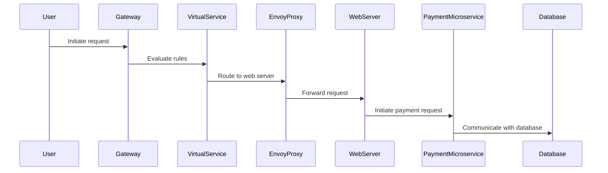

## Istio Ingress Gateway

### What is the Istio Ingress Gateway?

The Istio Ingress Gateway is a specialized component that acts as a load balancer for incoming traffic to the Kubernetes cluster. It is similar to an Nginx Ingress Controller but is specifically designed to integrate with Istio's service mesh capabilities.

### How Does the Ingress Gateway Work?

The Ingress Gateway runs as a pod in the Kubernetes cluster and accepts incoming traffic. It then routes the traffic to the appropriate microservices based on the rules defined in Virtual Services.

#### Example Configuration

Here is an example of configuring an Istio Ingress Gateway using a Gateway CRD (Custom Resource Definition):

```yaml
apiVersion: networking.istio.io/v1alpha3
kind: Gateway
metadata:
  name: my-gateway
spec:
  selector:
    istio: ingressgateway # use istio default ingress gateway
  servers:
  - port:
      number: 80
      name: http
      protocol: HTTP
    hosts:
    - "*"
```

This configuration sets up an HTTP gateway that listens on port 80 and routes traffic to all hosts.

### Traffic Flow Through the Ingress Gateway

Let's break down the traffic flow step-by-step:

1. **User Request**: A user initiates a request to a web server microservice in the Kubernetes cluster.
2. **Hit the Gateway**: The request first hits the Ingress Gateway, which is the entry point of the cluster.
3. **Evaluate Virtual Service Rules**: The Gateway evaluates the Virtual Service rules to determine how to route the traffic.
4. **Route to Microservice**: The Gateway routes the request to the appropriate microservice.
5. **Proxy Evaluation**: The request reaches the Envoy proxy inside the web server microservice. The Envoy proxy evaluates the request and forwards it to the actual web server container within the same pod using localhost.

#### Mermaid Diagram



### Secure Communication Using Mutual TLS

Mutual TLS ensures that both the client and server authenticate each other. This is crucial for securing service-to-service communication within the cluster.

#### Example Configuration

Here is an example of configuring mutual TLS in Istio:

```yaml
apiVersion: networking.istio.io/v1alpha3
kind: DestinationRule
metadata:
  name: payment-mtls
spec:
  host: payment-service
  trafficPolicy:
    tls:
      mode: ISTIO_MUTUAL
```

This configuration enables mutual TLS for the `payment-service`.

### How to Prevent / Defend

#### Detection

To detect potential issues, you can use Istio's built-in observability tools such as Prometheus and Grafana. These tools provide metrics and visualizations that help identify anomalies in traffic patterns.

#### Prevention

1. **Secure Configuration**: Ensure that all service-to-service communication uses mutual TLS.
2. **Policy Enforcement**: Use Istio's policy enforcement features to enforce strict access controls.
3. **Regular Audits**: Regularly audit the configuration and traffic patterns to ensure compliance with security policies.

#### Secure Code Fix

Here is an example of a vulnerable configuration and its secure counterpart:

**Vulnerable Configuration**

```yaml
apiVersion: networking.istio.io/v1alpha3
kind: DestinationRule
metadata:
  name: insecure-payment
spec:
  host: payment-service
  trafficPolicy:
    tls:
      mode: DISABLE
```

**Secure Configuration**

```yaml
apiVersion: networking.istio.io/v1alpha3
kind: DestinationRule
metadata:
  name: secure-payment
spec:
  host: payment-service
  trafficPolicy:
    tls:
      mode: ISTIO_MUTUAL
```

### Real-World Examples

#### Recent CVEs and Breaches

One notable example is the CVE-2021-25283, which affected Kubernetes clusters using Istio. This vulnerability allowed attackers to bypass authentication mechanisms and gain unauthorized access to services. Ensuring that mutual TLS is enabled and regularly auditing configurations can help mitigate such risks.

### Conclusion

Understanding and implementing a service mesh with Istio provides significant benefits in terms of observability, security, and resilience. By following best practices and ensuring proper configuration, you can effectively manage and secure your microservices architecture.

### Practice Labs

For hands-on experience with Istio, consider the following labs:

- **PortSwigger Web Security Academy**: Offers practical exercises on web security, including service mesh concepts.
- **OWASP Juice Shop**: Provides a vulnerable web application to practice security testing and mitigation techniques.
- **Kubernetes Goat**: Focuses on Kubernetes security and includes scenarios involving Istio.

By engaging with these labs, you can deepen your understanding and apply the concepts learned in this chapter.

---
<!-- nav -->
[[08-Introduction to Service Mesh and Istio|Introduction to Service Mesh and Istio]] | [[DevSecOps/DevSecOps Bootcamp/06-Container & Kubernetes Security/04-Service Mesh with Istio/Service Mesh and Istio What Why and How/00-Overview|Overview]] | [[10-Service Mesh and Istio Monitoring and Tracing|Service Mesh and Istio Monitoring and Tracing]]
