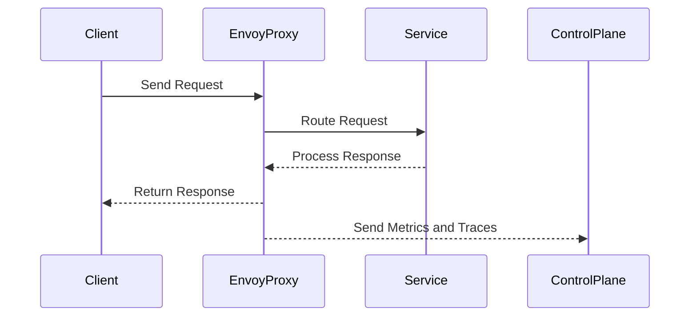
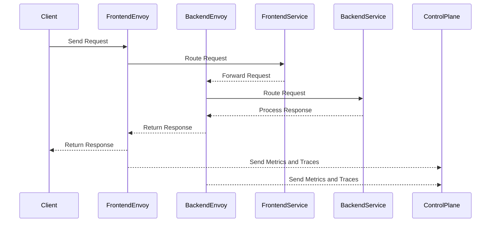

## Service Mesh and Istio: Monitoring and Tracing

### Overview of Service Mesh and Istio

A service mesh is a dedicated infrastructure layer for handling service-to-service communication. It abstracts away the complexity of managing microservices interactions, providing features like load balancing, service discovery, and traffic management. One of the most popular service meshes is **Istio**, which adds advanced networking capabilities to your microservices architecture.

### Request Flow in a Service Mesh

In a typical microservices architecture using Istio, the request flow can be broken down as follows:

1. **Client Request**: A client (such as a web browser or mobile app) sends a request to an entry point in the service mesh.
2. **Proxy Handling**: The request is intercepted by an Envoy proxy, which is part of the Istio service mesh. This proxy handles the request and routes it to the appropriate service.
3. **Service Processing**: The target service processes the request and generates a response.
4. **Response Routing**: The response is routed back through the Envoy proxy.
5. **Proxy Metrics Collection**: During this entire process, the Envoy proxy collects detailed metrics and tracing information about the request.
6. **Control Plane Communication**: The collected data is sent back to the Istio control plane, which aggregates and analyzes this information for monitoring purposes.

### Detailed Request Flow Diagram



### Metrics and Tracing in Istio

#### Metrics Collection

Metrics collection is crucial for monitoring the health and performance of your services. In Istio, Envoy proxies collect various types of metrics, including:

- **Request Count**: Number of requests received.
- **Latency**: Time taken to process a request.
- **Error Rate**: Percentage of failed requests.
- **Throughput**: Number of requests processed per unit time.

These metrics are aggregated and sent to the Istio control plane, which then makes them available for monitoring and analysis.

#### Tracing Information

Tracing provides a detailed view of the path a request takes through the system. This includes:

- **Span Data**: Each segment of the request processing is recorded as a span, containing details such as start time, end time, and any errors encountered.
- **Trace Context**: Metadata associated with the request, such as user ID, session ID, etc.

This information is essential for debugging and optimizing the performance of your services.

### Example of Metrics and Tracing

Consider a simple microservices architecture where a client sends a request to a frontend service, which then forwards the request to a backend service. Here’s how the request flow and metric collection might look:



### Raw HTTP Request and Response

Here’s an example of a raw HTTP request and response:

**HTTP Request:**

```http
POST /api/v1/user HTTP/1.1
Host: frontend.example.com
Content-Type: application/json
User-Agent: curl/7.64.1
Accept: */*
Content-Length: 32

{
  "username": "john_doe",
  "action": "login"
}
```

**HTTP Response:**

```http
HTTP/1.1 200 OK
Date: Mon, 20 Mar 2023 12:00:00 GMT
Content-Type: application/json
Content-Length: 38

{
  "status": "success",
  "message": "Login successful"
}
```

### Metrics and Traces Sent to Control Plane

The Envoy proxies would collect metrics and traces and send them to the control plane. Here’s an example of the data sent:

**Metrics:**

```json
{
  "request_count": 1,
  "latency_ms": 50,
  "error_rate": 0,
  "throughput_per_second": 0.02
}
```

**Traces:**

```json
{
  "spans": [
    {
      "span_id": "123456",
      "parent_span_id": "0",
      "operation_name": "frontend.request",
      "start_time": "2023-03-20T12:00:00Z",
      "end_time": "2023-03-20T12:00:50Z",
      "tags": {
        "http.method": "POST",
        "http.status_code": 200,
        "http.url": "/api/v1/user"
      }
    },
    {
      "span_id": "789012",
      "parent_span_id": "123456",
      "operation_name": "backend.request",
      "start_time": "2023-03-20T12:00:10Z",
      "end_time": "2023-03-20T12:00:40Z",
      "tags": {
        "http.method": "POST",
        "http.status_code": 200,
        "http.url": "/api/v1/user"
      }
    }
  ]
}
```

### Benefits of Monitoring and Tracing

Monitoring and tracing provide several benefits:

- **Health Check**: Real-time visibility into the health of your services.
- **Performance Optimization**: Identify bottlenecks and optimize performance.
- **Debugging**: Quickly diagnose issues by tracing the path of a request.
- **Security Audits**: Monitor for unusual patterns that could indicate security breaches.

### Recent Real-World Examples

One notable example is the **Capital One breach** in 2019, where a misconfigured web application firewall allowed unauthorized access to sensitive data. Proper monitoring and tracing could have helped detect and mitigate such vulnerabilities earlier.

### Common Pitfalls and How to Avoid Them

#### Pitfall: Overloading Metrics

Collecting too many metrics can lead to performance degradation and increased storage costs.

**How to Prevent:**
- **Filter Metrics**: Collect only the most critical metrics.
- **Sampling**: Use sampling techniques to reduce the volume of data.

#### Pitfall: Incomplete Tracing

Incomplete tracing can make it difficult to diagnose issues.

**How to Prevent:**
- **Ensure Full Coverage**: Ensure all services are properly instrumented for tracing.
- **Use Distributed Tracing**: Utilize tools like Jaeger or Zipkin for distributed tracing.

### Secure Coding Practices

#### Vulnerable Code Example

```yaml
# istio-config.yaml
apiVersion: networking.istio.io/v1alpha3
kind: DestinationRule
metadata:
  name: my-service
spec:
  host: my-service
  trafficPolicy:
    tls:
      mode: DISABLE
```

#### Secure Code Example

```yaml
# istio-config.yaml
apiVersion: networking.istio.io/v1alpha3
kind: DestinationRule
metadata:
  name: my-service
spec:
  host: my-service
  trafficPolicy:
    tls:
      mode: ISTIO_MUTUAL
```

### Detection and Prevention

#### Detection

- **Monitor Metrics**: Regularly monitor key metrics for anomalies.
- **Log Analysis**: Analyze logs for suspicious activity.

#### Prevention

- **Secure Configurations**: Ensure secure configurations for Istio components.
- **Regular Audits**: Conduct regular security audits and penetration testing.

### Hands-On Labs

For hands-on practice with Istio and service mesh, consider the following labs:

- **PortSwigger Web Security Academy**: Offers exercises on securing web applications.
- **OWASP Juice Shop**: Provides a vulnerable web application for learning security concepts.
- **CloudGoat**: Focuses on cloud security practices and vulnerabilities.

By thoroughly understanding and implementing these concepts, you can ensure robust monitoring and tracing in your microservices architecture, leading to improved performance and security.

---
<!-- nav -->
[[09-Istio Ingress Gateway|Istio Ingress Gateway]] | [[DevSecOps/DevSecOps Bootcamp/06-Container & Kubernetes Security/04-Service Mesh with Istio/Service Mesh and Istio What Why and How/00-Overview|Overview]] | [[11-Traffic Splitting and Canary Deployments|Traffic Splitting and Canary Deployments]]
