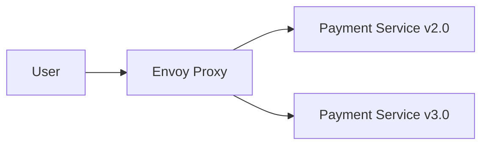

## Traffic Splitting and Canary Deployments

### Introduction to Traffic Splitting

Traffic splitting is a technique used in microservices architectures to gradually introduce a new version of a service into a production environment. This approach allows teams to mitigate risks associated with deploying untested or potentially buggy versions of services. By directing a small percentage of traffic to the new version, teams can monitor its behavior and ensure it functions correctly before fully rolling it out.

#### Example Scenario: Payment Microservice

Consider a scenario where a payment microservice is being updated. A new version (version 3.0) is built, tested, and deployed alongside the existing version (version 2.0). Instead of immediately routing all traffic to the new version, a small percentage of traffic (say 1% or 10%) is directed to version 3.0. This allows the team to observe the behavior of the new version under real-world conditions without affecting the majority of users.

### Why Use Traffic Splitting?

Traffic splitting is crucial because it helps in identifying and mitigating issues that might not have been caught during testing. Testing environments often cannot replicate the complexity and variability of real-world usage patterns. By gradually introducing the new version, teams can:

- **Monitor Performance:** Ensure that the new version performs as expected under actual load.
- **Detect Bugs:** Identify any bugs or issues that arise in a controlled manner.
- **Gather Feedback:** Collect feedback from a subset of users before a full rollout.

### How Traffic Splitting Works

Traffic splitting is typically managed through a service mesh, which acts as a layer of infrastructure that controls and monitors communication between microservices. In the context of Istio, a popular service mesh implementation, traffic splitting is achieved using Envoy proxies and the Istio control plane.

#### Envoy Proxies

Envoy is an open-source proxy that sits between microservices and handles all incoming and outgoing traffic. It provides features such as load balancing, health checking, and traffic management. In an Istio deployment, Envoy proxies are injected into each microservice pod, allowing fine-grained control over traffic routing.



In this diagram, the Envoy proxy routes traffic to either version 2.0 or version 3.0 of the payment service based on predefined rules.

#### Istio Control Plane

The Istio control plane consists of several components that manage the Envoy proxies and enforce traffic policies. Key components include:

- **Pilot:** Manages service discovery and load balancing.
- **Mixer:** Enforces access control and collects telemetry data.
- **Citadel:** Manages authentication and authorization.

These components work together to define and enforce traffic splitting policies.

### Configuring Traffic Splitting in Istio

To configure traffic splitting in Istio, you need to define a `VirtualService` and a `DestinationRule`. These resources specify how traffic should be routed and the characteristics of the services involved.

#### VirtualService Configuration

A `VirtualService` defines the routing rules for incoming traffic. Here’s an example configuration that routes 90% of traffic to version 2.0 and 10% to version 3.0 of the payment service:

```yaml
apiVersion: networking.istio.io/v1alpha3
kind: VirtualService
metadata:
  name: payment-service
spec:
  hosts:
    - payment-service
  http:
  - route:
    - destination:
        host: payment-service
        subset: v2
      weight: 90
    - destination:
        host: payment-service
        subset: v3
      weight: 10
```

#### DestinationRule Configuration

A `DestinationRule` specifies the characteristics of the services involved in the routing. Here’s an example configuration that defines subsets for versions 2.0 and 3.0:

```yaml
apiVersion: networking.istio.io/v1alpha3
kind: DestinationRule
metadata:
  name: payment-service
spec:
  host: payment-service
  subsets:
  - name: v2
    labels:
      version: v2
  - name: v3
    labels:
      version: v3
```

### Real-World Examples and Recent Breaches

#### Example: Uber's Service Mesh Migration

Uber migrated to a service mesh architecture using Istio to manage traffic between its microservices. By implementing traffic splitting, Uber was able to gradually roll out new versions of its services, ensuring stability and minimizing downtime.

#### Example: Capital One Data Breach

In 2019, Capital One suffered a significant data breach due to a misconfigured web application firewall. While this breach was not directly related to traffic splitting, it highlights the importance of carefully managing and monitoring traffic to microservices. Proper use of traffic splitting could have helped identify and mitigate potential vulnerabilities before a full rollout.

### Common Pitfalls and Best Practices

#### Common Pitfalls

1. **Incomplete Testing:** Relying solely on automated tests can lead to undetected bugs. Always perform thorough manual testing.
2. **Insufficient Monitoring:** Failing to monitor the new version of a service can result in unnoticed issues. Ensure comprehensive logging and monitoring.
3. **Incorrect Traffic Distribution:** Misconfiguring traffic distribution can lead to unexpected behavior. Double-check configurations to ensure correct routing.

#### Best Practices

1. **Gradual Rollout:** Start with a small percentage of traffic and gradually increase it as confidence grows.
2. **Comprehensive Testing:** Perform both automated and manual testing to catch potential issues.
3. **Monitoring and Logging:** Implement robust monitoring and logging to quickly identify and address problems.

### How to Prevent / Defend

#### Detection

- **Logging and Monitoring:** Use tools like Prometheus and Grafana to monitor service performance and detect anomalies.
- **Alerting:** Set up alerts for critical metrics such as error rates and latency.

#### Prevention

- **Secure Configuration Management:** Use tools like GitOps to manage and audit configurations.
- **Automated Testing:** Implement continuous integration and continuous deployment (CI/CD) pipelines with automated testing.

#### Secure Coding Fixes

Here’s an example of a vulnerable configuration and its secure counterpart:

**Vulnerable Configuration:**

```yaml
apiVersion: networking.istio.io/v1alpha3
kind: VirtualService
metadata:
  name: payment-service
spec:
  hosts:
    - payment-service
  http:
  - route:
    - destination:
        host: payment-service
        subset: v2
      weight: 100
```

**Secure Configuration:**

```yaml
apiVersion: networking.istio.io/v1alpha3
kind: VirtualService
metadata:
  name: payment-service
spec:
  hosts:
    - payment-service
  http:
  - route:
    - destination:
        host: payment-service
        subset: v2
      weight: 90
    - destination:
        host: payment-service
        subset: v3
      weight: 10
```

### Hands-On Labs

For practical experience with service mesh and Istio, consider the following labs:

- **PortSwigger Web Security Academy:** Offers hands-on labs to understand and implement service mesh concepts.
- **Istio Official Documentation:** Provides detailed tutorials and examples for setting up and configuring Istio.
- **Kubernetes Goat:** A platform for learning Kubernetes security, including service mesh configurations.

By thoroughly understanding and implementing traffic splitting, teams can significantly reduce the risks associated with deploying new versions of microservices.

---
<!-- nav -->
[[10-Service Mesh and Istio Monitoring and Tracing|Service Mesh and Istio Monitoring and Tracing]] | [[DevSecOps/DevSecOps Bootcamp/06-Container & Kubernetes Security/04-Service Mesh with Istio/Service Mesh and Istio What Why and How/00-Overview|Overview]] | [[DevSecOps/DevSecOps Bootcamp/06-Container & Kubernetes Security/04-Service Mesh with Istio/Service Mesh and Istio What Why and How/12-Practice Questions & Answers|Practice Questions & Answers]]
