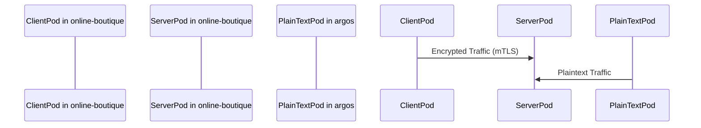

## Introduction to Service Mesh with Istio

Service mesh is a dedicated infrastructure layer for handling service-to-service communication within a microservices architecture. One of the most popular service mesh implementations is Istio, which provides advanced features such as traffic management, observability, and security. In this chapter, we will focus on mutual TLS (mTLS) in Istio, which is a critical component for securing communication between services.

### What is Mutual TLS (mTLS)?

Mutual TLS (mTLS) is an extension of the standard TLS protocol that requires both parties in a communication to present valid certificates. This ensures that both the client and server authenticate each other, providing a higher level of security compared to traditional TLS where only the server is authenticated.

#### Why Use mTLS?

- **Authentication**: Ensures that both the client and server are who they claim to be.
- **Encryption**: Encrypts data in transit, preventing eavesdropping and man-in-the-middle attacks.
- **Integrity**: Ensures that the data has not been tampered with during transmission.

#### How Does mTLS Work?

In mTLS, both the client and server must have their own certificates issued by a trusted Certificate Authority (CA). During the TLS handshake, both parties exchange their certificates and verify them against the trusted CA. If the certificates are valid, the connection is established securely.

### Istio and mTLS

Istio provides built-in support for mTLS, making it easier to secure service-to-service communication in a microservices environment. Let's dive deeper into how Istio implements mTLS and the different modes it supports.

#### Default Mode: Permissive

By default, Istio mTLS runs in permissive mode. In this mode, workloads will accept both plaintext and encrypted (mTLS) traffic. This allows for a gradual adoption of mTLS without disrupting existing services that may not yet be configured for mTLS.

##### Example Configuration

To illustrate, let's consider a scenario where we have two namespaces: `online-boutique` and `argos`. The `online-boutique` namespace is configured to inject Istio proxies, while the `argos` namespace is not.

```yaml
# online-boutique namespace configuration
apiVersion: v1
kind: Namespace
metadata:
  name: online-boutique
  labels:
    istio-injection: enabled
```

```yaml
# argos namespace configuration
apiVersion: v1
kind: Namespace
metadata:
  name: argos
  labels:
    istio-injection: disabled
```

In the `online-boutique` namespace, all pods will have Istio proxies injected, enabling mTLS communication. However, in the `argos` namespace, no proxies are injected, and pods will communicate in plaintext.

#### Communication Flow in Permissive Mode

Let's visualize the communication flow using a mermaid diagram:



In this diagram, `ClientPod` and `ServerPod` are in the `online-boutique` namespace and communicate using mTLS. `PlainTextPod` is in the `argos` namespace and communicates in plaintext.

### Pitfalls and Common Mistakes

One common mistake is assuming that all communication within a service mesh is automatically secured by mTLS. As we saw earlier, namespaces without Istio proxies will continue to communicate in plaintext. This can lead to vulnerabilities if sensitive data is transmitted between these namespaces.

#### Real-World Example: CVE-2021-25281

CVE-2021-25281 is a vulnerability in the Kubernetes API server that allows an attacker to bypass authentication and authorization checks. While this specific vulnerability is not directly related to mTLS, it highlights the importance of securing all aspects of your service mesh, including communication between namespaces.

### How to Prevent / Defend

#### Detection

To detect misconfigurations and vulnerabilities, you can use tools like `istioctl` to inspect the current state of your service mesh. For example, you can check the status of mTLS in each namespace:

```sh
istioctl experimental authz status --namespace online-boutique
istioctl experimental authz status --namespace argos
```

#### Prevention

To ensure that all communication within your service mesh is secured by mTLS, you should enable strict mode in Istio. In strict mode, all workloads must use mTLS, and plaintext communication is not allowed.

##### Enabling Strict Mode

To enable strict mode, you need to update the `MeshPolicy` resource:

```yaml
apiVersion: security.istio.io/v1beta1
kind: MeshPolicy
metadata:
  name: default
spec:
  peers:
  - mtls: {}
```

This configuration enforces mTLS across all namespaces.

#### Secure Code Fix

Here’s an example of how to correct a vulnerable configuration:

**Vulnerable Configuration:**

```yaml
apiVersion: v1
kind: Namespace
metadata:
  name: argos
  labels:
    istio-injection: disabled
```

**Secure Configuration:**

```yaml
apiVersion: v1
kind: Namespace
metadata:
  name: argos
  labels:
    istio-injection: enabled
```

By enabling Istio injection in the `argos` namespace, you ensure that all pods in this namespace will have Istio proxies and will communicate using mTLS.

### Complete Example

Let’s walk through a complete example of setting up mTLS in Istio, including the necessary configurations and verification steps.

#### Step 1: Install Istio

First, install Istio in your Kubernetes cluster:

```sh
curl -L https://istio.io/downloadIstio | sh -
cd istio-*
bin/istioctl install --set profile=demo -y
```

#### Step 2: Create Namespaces

Create the `online-boutique` and `argos` namespaces:

```sh
kubectl create namespace online-boutique
kubectl label namespace online-boutique istio-injection=enabled
kubectl create namespace argos
kubectl label namespace argos istio-injection=disabled
```

#### Step 3: Deploy Applications

Deploy applications in both namespaces. For simplicity, let’s deploy a simple HTTP server in each namespace.

**online-boutique/http-server.yaml:**

```yaml
apiVersion: apps/v1
kind: Deployment
metadata:
  name: http-server
  namespace: online-boutique
spec:
  replicas: 1
  selector:
    matchLabels:
      app: http-server
  template:
    metadata:
      labels:
        app: http-server
    spec:
      containers:
      - name: http-server
        image: k8s.gcr.io/echoserver:1.4
        ports:
        - containerPort: 8080
---
apiVersion: v1
kind: Service
metadata:
  name: http-server
  namespace: online-boutique
spec:
  ports:
  - port: 8080
    targetPort: 8080
  selector:
    app: http-server
```

**argos/http-server.yaml:**

```yaml
apiVersion: apps/v1
kind: Deployment
metadata:
  name: http-server
  namespace: argos
spec:
  replicas: 1
  selector:
    matchLabels:
      app: http-server
  template:
    metadata:
      labels:
        app: http-server
    spec:
      containers:
      - name: http-server
        image: k8s.gcr.io/echoserver:1.4
        ports:
        - containerPort: 8080
---
apiVersion: v1
kind: Service
metadata:
  name: http-server
  namespace: argos
spec:
  ports:
  - port: 8080
    targetPort: 8080
  selector:
    app: http-server
```

Deploy the applications:

```sh
kubectl apply -f online-boutique/http-server.yaml
kubectl apply -f argos/http-server.yaml
```

#### Step 4: Verify Communication

Verify that communication between pods in the `online-boutique` namespace is encrypted, while communication between pods in the `argos` namespace is in plaintext.

**Online Boutique Namespace:**

```sh
kubectl exec -n online-boutique $(kubectl get pod -n online-boutique -l app=http-server -o jsonpath='{.items[0].metadata.name}') -- curl -v http://http-server:8080
```

**Argos Namespace:**

```sh
kubectl exec -n argos $(kubectl get pod -n argos -l app=http-server -o jsonpath='{.items[0].metadata.name}') -- curl -v http://http-server:8080
```

#### Step 5: Enable Strict Mode

Finally, enable strict mode to enforce mTLS across all namespaces:

```sh
kubectl apply -f - <<EOF
apiVersion: security.istio.io/v1beta1
kind: MeshPolicy
metadata:
  name: default
spec:
  peers:
  - mtls: {}
EOF
```

### Conclusion

In this chapter, we explored the concept of mutual TLS (mTLS) in Istio and how it can be used to secure service-to-service communication in a microservices architecture. We covered the default permissive mode, common pitfalls, and how to prevent and detect vulnerabilities. By following the steps outlined in this chapter, you can ensure that your service mesh is secure and resilient.

### Practice Labs

For hands-on practice with Istio and mTLS, consider the following labs:

- **PortSwigger Web Security Academy**: Offers interactive labs on various security topics, including service mesh and mTLS.
- **Istio Official Documentation**: Provides detailed guides and examples for setting up and configuring Istio.
- **Kubernetes Goat**: A hands-on lab for learning Kubernetes security, including service mesh and mTLS.

These resources will help you gain practical experience and deepen your understanding of Istio and mTLS.

---
<!-- nav -->
[[DevSecOps/DevSecOps Bootcamp/06-Container & Kubernetes Security/04-Service Mesh with Istio/mTLS Deep Dive/00-Overview|Overview]] | [[DevSecOps/DevSecOps Bootcamp/06-Container & Kubernetes Security/04-Service Mesh with Istio/mTLS Deep Dive/02-Introduction to Service Mesh with Istio Part 2|Introduction to Service Mesh with Istio Part 2]]
