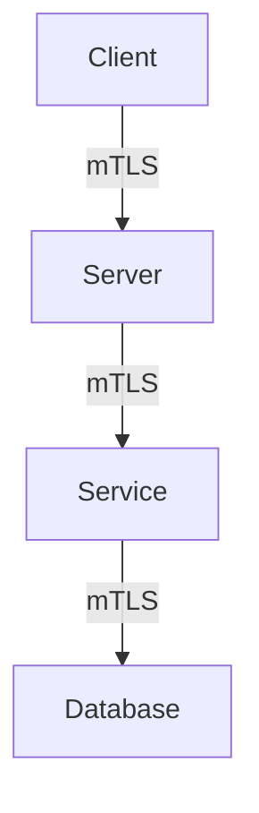

## Introduction to Service Mesh with Istio

### What is a Service Mesh?

A service mesh is a dedicated infrastructure layer for handling service-to-service communication. It abstracts away the complexity of inter-service communication, enabling developers to focus on business logic rather than the intricacies of network communication. Service meshes provide features such as load balancing, service discovery, retries, circuit breaking, and most importantly, security through mutual TLS (mTLS).

### What is Istio?

Istio is an open-source service mesh that provides a uniform way to secure, connect, and monitor microservices. It is designed to work with any platform, including Kubernetes, and supports a wide range of programming languages and frameworks. Istio includes features like traffic management, policy enforcement, and observability, making it a powerful tool for managing complex microservice environments.

### Why Use Istio?

Istio offers several advantages:

- **Security**: Provides robust security features, including mTLS, which ensures encrypted communication between services.
- **Observability**: Offers detailed monitoring and logging capabilities.
- **Traffic Management**: Allows fine-grained control over traffic routing and load balancing.
- **Policy Enforcement**: Enables consistent enforcement of policies across services.

### Peer Authentication CRD

Peer authentication is a custom resource definition (CRD) in Istio that allows you to configure mTLS settings for your services. This CRD is part of the `security` package in Istio and is used to define the security requirements for service-to-service communication.

### Configuration Levels

Peer authentication can be configured at different levels:

- **Namespace Level**: Apply mTLS settings to all services within a namespace.
- **Workload Level**: Apply mTLS settings to specific pods or services.
- **Cluster Level**: Apply mTLS settings to the entire service mesh.

### Enforcing mTLS

To enforce mTLS, you can set the `mode` field in the peer authentication configuration to `STRICT`. This ensures that all communication within the specified scope uses mTLS.

### Example Configuration

Here is an example of a peer authentication configuration for a namespace:

```yaml
apiVersion: security.istio.io/v1beta1
kind: PeerAuthentication
metadata:
  name: default
  namespace: online-boutique
spec:
  mtls:
    mode: STRICT
```

This configuration enforces mTLS for all services within the `online-boutique` namespace.

### Detailed Explanation of mTLS

Mutual TLS (mTLS) is a form of TLS where both the client and server authenticate each other using digital certificates. This ensures that both parties are who they claim to be, providing a higher level of security compared to traditional TLS where only the server is authenticated.

#### How mTLS Works

1. **Certificate Exchange**: Both the client and server exchange their digital certificates.
2. **Verification**: Each party verifies the certificate of the other party.
3. **Encryption**: Once verified, the communication is encrypted using TLS.

#### Benefits of mTLS

- **Strong Authentication**: Ensures that both parties are who they claim to be.
- **Encryption**: Ensures that the communication is encrypted, preventing eavesdropping.
- **Integrity**: Ensures that the data has not been tampered with during transmission.

### Real-World Examples

#### Recent Breaches Involving mTLS

One notable breach involving mTLS was the Capital One breach in 2019. Although mTLS was not directly involved, the lack of proper security measures, including mTLS, contributed to the breach. This highlights the importance of implementing strong security practices, including mTLS, in microservice environments.

### Detailed Configuration Steps

#### Step-by-Step Configuration

1. **Install Istio**: Ensure Istio is installed in your Kubernetes cluster.
2. **Create Peer Authentication CRD**: Define the peer authentication configuration.
3. **Apply Configuration**: Apply the configuration to the desired namespace or workload.

#### Full Example

Here is a complete example of configuring mTLS for a namespace:

```yaml
apiVersion: security.istio.io/v1beta1
kind: PeerAuthentication
metadata:
  name: default
  namespace: online-boutique
spec:
  mtls:
    mode: STRICT
```

To apply this configuration, run the following command:

```sh
kubectl apply -f peer-authentication.yaml
```

### Mermaid Diagrams

#### Network Topology



This diagram shows a typical service mesh topology with mTLS enabled.

### Common Pitfalls

#### Misconfiguration

One common pitfall is misconfiguring the peer authentication settings. For example, setting the mode to `PERMISSIVE` instead of `STRICT` can leave your services vulnerable to unencrypted communication.

#### Certificate Management

Managing certificates can be challenging. Ensure that your certificate authority (CA) is properly configured and that certificates are regularly renewed.

### How to Prevent / Defend

#### Detection

Use Istio's built-in observability features to monitor mTLS communication. You can use tools like `istioctl` to inspect the status of mTLS connections.

#### Prevention

1. **Strict Mode**: Always use `STRICT` mode for mTLS to ensure encrypted communication.
2. **Certificate Management**: Use a robust CA and ensure certificates are regularly renewed.
3. **Monitoring**: Regularly monitor mTLS communication to detect any anomalies.

#### Secure Coding Fixes

Here is an example of a vulnerable configuration and its secure counterpart:

**Vulnerable Configuration**

```yaml
apiVersion: security.istio.io/v1beta1
kind: PeerAuthentication
metadata:
  name: default
  namespace: online-boutique
spec:
  mtls:
    mode: PERMISSIVE
```

**Secure Configuration**

```yaml
apiVersion: security.istio.io/v1beta1
kind: PeerAuthentication
metadata:
  name: default
  namespace: online-boutique
spec:
  mtls:
    mode: STRICT
```

### Hands-On Labs

For hands-on practice with Istio and mTLS, consider the following labs:

- **PortSwigger Web Security Academy**: Offers a comprehensive course on web security, including service mesh and mTLS.
- **OWASP Juice Shop**: A deliberately insecure web application for practicing web security techniques.
- **Kubernetes Goat**: A Kubernetes-based security training platform that includes service mesh and mTLS exercises.

These labs will help you gain practical experience with Istio and mTLS configurations.

### Conclusion

In conclusion, Istio's peer authentication CRD provides a powerful mechanism for enforcing mTLS in your service mesh. By understanding the concepts, configuration steps, and potential pitfalls, you can effectively secure your microservice environment. Regular monitoring and secure coding practices are essential for maintaining a robust and secure service mesh.

---
<!-- nav -->
[[DevSecOps/DevSecOps Bootcamp/06-Container & Kubernetes Security/04-Service Mesh with Istio/mTLS Deep Dive/02-Introduction to Service Mesh with Istio Part 2|Introduction to Service Mesh with Istio Part 2]] | [[DevSecOps/DevSecOps Bootcamp/06-Container & Kubernetes Security/04-Service Mesh with Istio/mTLS Deep Dive/00-Overview|Overview]] | [[DevSecOps/DevSecOps Bootcamp/06-Container & Kubernetes Security/04-Service Mesh with Istio/mTLS Deep Dive/04-Introduction to Service Mesh with Istio Part 4|Introduction to Service Mesh with Istio Part 4]]
