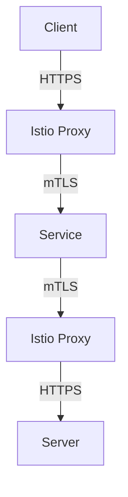
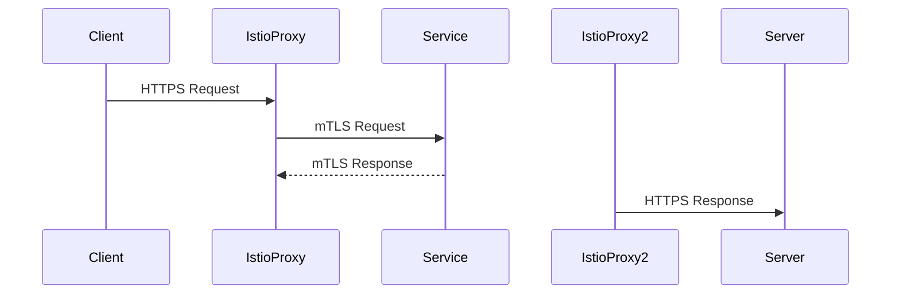

## Introduction to Service Mesh with Istio

In the realm of modern microservices architecture, a service mesh plays a crucial role in managing communication between services. Istio is one of the leading service meshes that provides advanced traffic management, observability, and security features. This chapter delves deep into mutual TLS (mTLS) within Istio, explaining its importance, configuration, and practical implementation.

### What is a Service Mesh?

A service mesh is a dedicated infrastructure layer for handling service-to-service communication. It abstracts away the complexities of inter-service communication, providing features such as load balancing, service discovery, retries, circuit breaking, and encryption. A service mesh typically consists of a control plane and a data plane:

- **Control Plane**: Manages the configuration and policies for the service mesh.
- **Data Plane**: Implements the policies defined by the control plane.

### What is Istio?

Istio is an open-source service mesh that provides a uniform way to secure, connect, and monitor microservices. It supports various platforms, including Kubernetes, and integrates seamlessly with existing systems. Key features of Istio include:

- Traffic Management: Routing, load balancing, retries, timeouts, and fault injection.
- Observability: Distributed tracing, metrics, and logs.
- Security: Mutual TLS, authentication, and authorization.

### Why Use mTLS in Istio?

Mutual TLS (mTLS) is a cryptographic protocol that ensures both the client and server authenticate each other using digital certificates. In the context of Istio, mTLS provides end-to-end encryption and strong identity verification for service-to-service communication. This is critical for securing microservices in a distributed environment.

#### Benefits of mTLS in Istio

1. **Encryption**: Ensures that data transmitted between services is encrypted, preventing eavesdropping.
2. **Authentication**: Verifies the identity of both the client and server, ensuring that only authorized services can communicate.
3. **Integrity**: Ensures that messages have not been tampered with during transmission.
4. **Non-repudiation**: Provides proof of the origin and integrity of messages, making it difficult for parties to deny their actions.

### Configuring mTLS in Istio

To configure mTLS in Istio, we need to understand the following key concepts:

- **Custom Resource Definitions (CRDs)**: These are Kubernetes manifest files that define custom resources for additional services installed in the cluster.
- **GitOps Pipeline**: A method of deploying applications through Git repositories, ensuring that the desired state of the system is version-controlled.
- **Peer Authentication**: A configuration resource in Istio that defines mTLS settings for services.

#### Custom Resource Definitions (CRDs)

CRDs are Kubernetes manifest files that extend the Kubernetes API to support custom resources. In the context of Istio, CRDs are used to define custom resources such as `VirtualService`, `DestinationRule`, and `PeerAuthentication`.

```yaml
apiVersion: apiextensions.k8s.io/v1
kind: CustomResourceDefinition
metadata:
  name: peerauthentications.security.istio.io
spec:
  group: security.istio.io
  versions:
    - name: v1alpha1
      served: true
      storage: true
  scope: Namespaced
  names:
    plural: peerauthentications
    singular: peerauthentication
    kind: PeerAuthentication
```

#### GitOps Pipeline

GitOps is a methodology that uses Git as a single source of truth for infrastructure and application deployments. In our project, we use a GitOps pipeline to manage the deployment of CRDs and other Kubernetes resources.

```yaml
# Example of a GitOps pipeline configuration
pipeline:
  stages:
    - name: Deploy CRDs
      steps:
        - run: kubectl apply -f ./crds/
```

#### Peer Authentication Configuration

The `PeerAuthentication` resource in Istio is used to configure mTLS settings for services. Here’s an example of how to configure mTLS for the `online-boutique` namespace:

```yaml
apiVersion: security.istio.io/v1beta1
kind: PeerAuthentication
metadata:
  name: default
  namespace: online-boutique
spec:
  mtls:
    mode: STRICT
```

This configuration sets the mTLS mode to `STRICT`, meaning that all communication within the `online-boutique` namespace must use mTLS.

### Detailed Configuration Steps

Let's walk through the detailed steps to configure mTLS in Istio:

1. **Create the CRD in GitLab Editor**:
   - Open the GitLab editor and create a new file named `peer-authentication.yaml`.
   - Add the following configuration:

```yaml
apiVersion: security.istio.io/v1beta1
kind: PeerAuthentication
metadata:
  name: default
  namespace: online-boutique
spec:
  mtls:
    mode: STRICT
```

2. **Apply the Configuration**:
   - Commit the changes to the Git repository.
   - Trigger the GitOps pipeline to apply the configuration to the Kubernetes cluster.

```bash
git add peer-authentication.yaml
git commit -m "Add mTLS configuration for online-boutique namespace"
git push
```

3. **Verify the Configuration**:
   - Check the status of the `PeerAuthentication` resource in the `online-boutique` namespace.

```bash
kubectl get peerauthentications.security.istio.io -n online-boutique
```

### Detailed Explanation of mTLS Mechanism

Mutual TLS (mTLS) operates by establishing a secure connection between two parties using digital certificates. Here’s a step-by-step breakdown of how mTLS works:

1. **Certificate Exchange**:
   - Both the client and server exchange their digital certificates.
   - Each certificate contains a public key and is signed by a trusted Certificate Authority (CA).

2. **Verification**:
   - The client verifies the server’s certificate using the CA’s public key.
   - The server verifies the client’s certificate using the CA’s public key.

3. **Key Exchange**:
   - Once both parties have verified each other’s certificates, they establish a shared secret key using a key exchange algorithm (e.g., Diffie-Hellman).

4. **Encryption**:
   - All subsequent communication is encrypted using the shared secret key.

### Real-World Examples and Recent Breaches

Recent breaches and vulnerabilities have highlighted the importance of mTLS in securing microservices. For example:

- **CVE-2021-21277**: A vulnerability in the Envoy proxy used by Istio allowed attackers to bypass mTLS enforcement, leading to unauthorized access to services.
- **SolarWinds Supply Chain Attack**: This attack demonstrated the importance of verifying the authenticity of services and the need for robust mTLS configurations.

### Common Pitfalls and How to Avoid Them

When implementing mTLS in Istio, several common pitfalls can arise:

1. **Incorrect Configuration**:
   - Ensure that the `mtls` mode is correctly set to `STRICT` for the desired namespaces.
   - Verify that all services within the namespace are properly configured to use mTLS.

2. **Certificate Management**:
   - Manage certificates carefully to avoid expiration issues.
   - Use automated tools for certificate renewal and distribution.

3. **Performance Impact**:
   - mTLS can introduce some performance overhead due to the additional cryptographic operations.
   - Monitor the performance impact and optimize as necessary.

### How to Prevent / Defend Against mTLS Vulnerabilities

To defend against mTLS vulnerabilities, follow these best practices:

1. **Regular Audits**:
   - Regularly audit the mTLS configuration to ensure compliance with security policies.
   - Use tools like `istioctl` to validate the configuration.

2. **Automated Testing**:
   - Implement automated testing to verify that mTLS is enforced correctly.
   - Use tools like `Kube-bench` to check for compliance with security best practices.

3. **Secure Code Practices**:
   - Follow secure coding practices to prevent common vulnerabilities.
   - Use static analysis tools to identify potential security issues.

### Complete Example: Full HTTP Request and Response

Here’s a complete example of a full HTTP request and response using mTLS in Istio:

#### HTTP Request

```http
POST /api/orders HTTP/1.1
Host: orders.online-boutique.svc.cluster.local
Content-Type: application/json
Authorization: Bearer <JWT-Token>
User-Agent: curl/7.64.1
Accept: */*
Connection: close

{
  "order_id": "12345",
  "customer_id": "67890",
  "items": [
    { "product_id": "1001", "quantity": 2 },
    { "product_id": "1002", "quantity": 1 }
  ]
}
```

#### HTTP Response

```http
HTTP/1.1 201 Created
Date: Tue, 01 Mar 2022 12:00:00 GMT
Content-Type: application/json
Content-Length: 123
Connection: close

{
  "order_id": "12345",
  "status": "CREATED",
  "created_at": "2022-03-01T12:00:00Z"
}
```

### Mermaid Diagrams

#### Network Topology



#### Sequence Diagram



### Practice Labs

For hands-on practice with Istio and mTLS, consider the following labs:

- **PortSwigger Web Security Academy**: Offers interactive labs on web security, including mTLS configurations.
- **OWASP Juice Shop**: A deliberately insecure web application for practicing security skills.
- **WebGoat**: An interactive training application for learning about web application security.

By following these detailed steps and best practices, you can effectively implement and manage mTLS in Istio, ensuring robust security for your microservices architecture.

---
<!-- nav -->
[[DevSecOps/DevSecOps Bootcamp/06-Container & Kubernetes Security/04-Service Mesh with Istio/mTLS Deep Dive/03-Introduction to Service Mesh with Istio Part 3|Introduction to Service Mesh with Istio Part 3]] | [[DevSecOps/DevSecOps Bootcamp/06-Container & Kubernetes Security/04-Service Mesh with Istio/mTLS Deep Dive/00-Overview|Overview]] | [[DevSecOps/DevSecOps Bootcamp/06-Container & Kubernetes Security/04-Service Mesh with Istio/mTLS Deep Dive/05-Introduction to Service Mesh with Istio Part 5|Introduction to Service Mesh with Istio Part 5]]
