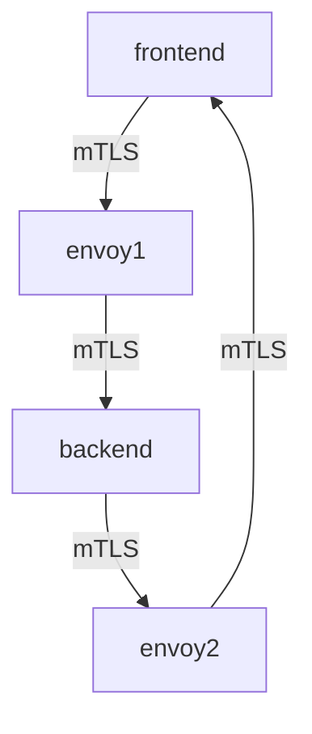
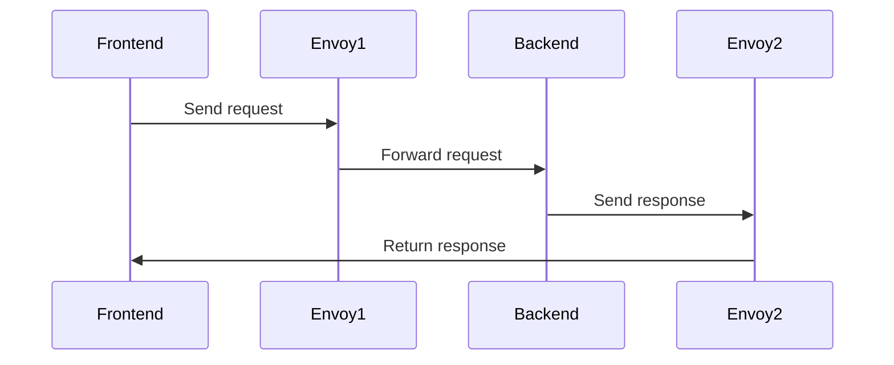

## Introduction to Service Mesh with Istio

Service mesh is a dedicated infrastructure layer for handling service-to-service communications within a microservices architecture. One of the most popular service mesh implementations is Istio, which provides advanced features such as traffic management, observability, and security. In this chapter, we will delve deep into mutual TLS (mTLS) in Istio, focusing on how to enforce strict encryption for all workloads within a specific namespace.

### What is Mutual TLS (mTLS)?

Mutual TLS, or mTLS, is an extension of the standard TLS protocol that requires both the client and server to present certificates for authentication. This ensures that both parties in a communication are authenticated, providing a higher level of security compared to traditional TLS where only the server is authenticated.

#### Why Use mTLS?

- **Enhanced Security**: Ensures that both the client and server are authenticated, reducing the risk of man-in-the-middle attacks.
- **Encryption**: All data transmitted between services is encrypted, protecting sensitive information.
- **Policy Enforcement**: Allows for fine-grained control over which services can communicate with each other based on their identities.

#### How Does mTLS Work Under the Hood?

In a typical mTLS setup:
1. **Certificate Exchange**: Both the client and server exchange certificates.
2. **Authentication**: Each party verifies the certificate of the other using a trusted Certificate Authority (CA).
3. **Encryption**: Once both parties are authenticated, the communication is encrypted using symmetric keys derived from the TLS handshake.

### Background Theory: Service Mesh and Istio

A service mesh abstracts away the complexity of managing service-to-service communication by providing a dedicated infrastructure layer. Istio, built on Envoy proxy, offers several key features:

- **Traffic Management**: Routing, load balancing, retries, and circuit breaking.
- **Observability**: Distributed tracing, metrics, and logging.
- **Security**: Authentication, authorization, and encryption.

#### Key Components of Istio

- **Envoy Proxy**: A high-performance proxy that sits between services, handling all network traffic.
- **Pilot**: Manages service discovery and routing.
- **Mixer**: Enforces policies and collects telemetry data.
- **Citadel**: Manages identity and credentials for services.

### Configuring Strict mTLS in Istio

To enforce strict mTLS in a specific namespace, we need to configure Istio's `PeerAuthentication` resource. This resource specifies the mTLS mode for workloads within a namespace.

#### Current Configuration: Permissive Mode

Currently, the pods in the `online-boutique` namespace are configured to use permissive mTLS mode. This means that both encrypted and plain text requests are allowed.

```yaml
apiVersion: security.istio.io/v1beta1
kind: PeerAuthentication
metadata:
  name: default
  namespace: online-boutique
spec:
  mtls:
    mode: PERMISSIVE
```

#### Transition to Strict Mode

To transition to strict mTLS mode, we need to update the `PeerAuthentication` configuration to enforce encryption for all workloads in the `online-boutique` namespace.

```yaml
apiVersion: security.istio.io/v1beta1
kind: PeerAuthentication
metadata:
  name: default
  namespace: online-boutique
spec:
  mtls:
    mode: STRICT
```

### Applying the Configuration

The updated configuration needs to be applied to the cluster. We will use Argo CD, a declarative GitOps continuous delivery tool, to manage the deployment.

#### Step-by-Step Application Process

1. **Update the Customization File**:
   Add the updated `PeerAuthentication` configuration to the customization file.

   ```yaml
   apiVersion: argoproj.io/v1alpha1
   kind: Application
   metadata:
     name: online-boutique
     namespace: argocd
   spec:
     project: default
     source:
       repoURL: https://github.com/example/online-boutique.git
       targetRevision: HEAD
       path: istio-config
     destination:
       server: https://kubernetes.default.svc
       namespace: online-boutique
     syncPolicy:
       automated:
         prune: true
         selfHeal: true
       syncOptions:
         - CreateNamespace=true
   ```

2. **Commit and Push Changes**:
   Commit the changes to the Git repository and push them.

   ```bash
   git add .
   git commit -m "Enable strict mTLS for online-boutique namespace"
   git push origin main
   ```

3. **Argo CD Sync**:
   Argo CD will automatically pull the new configuration and apply it to the cluster.

   ```bash
   argocd app sync online-boutique
   ```

4. **Verify the Configuration**:
   Check the `PeerAuthentication` resource to ensure it has been updated correctly.

   ```bash
   kubectl get peerauthentication -n online-boutique
   ```

### Verifying the Effectiveness of Strict mTLS

To verify that strict mTLS is enforced, we can use `istioctl` to inspect the current configuration.

```bash
istioctl authz check --from=frontend --to=backend --namespace=online-boutique
```

This command checks the authentication status between the `frontend` and `backend` services in the `online-boutique` namespace. The output should indicate that strict mTLS is enabled.

### Real-World Example: Recent Breaches and CVEs

Recent breaches and CVEs highlight the importance of enforcing strict mTLS in service meshes. For example, the Log4Shell vulnerability (CVE-2021-44228) demonstrated how unencrypted communication could lead to severe security issues. By enforcing strict mTLS, organizations can mitigate such risks.

### Common Pitfalls and Best Practices

#### Common Pitfalls

- **Incorrect Configuration**: Ensure that the `PeerAuthentication` resource is correctly configured to avoid unintended behavior.
- **Certificate Management**: Properly manage certificates to avoid expiration or revocation issues.
- **Performance Impact**: Encrypting all traffic can introduce latency; monitor performance closely.

#### Best Practices

- **Regular Audits**: Regularly audit the configuration to ensure compliance.
- **Automated Testing**: Use automated testing tools to validate the configuration.
- **Monitoring**: Implement monitoring to detect any deviations from the expected behavior.

### How to Prevent / Defend

#### Detection

- **Audit Logs**: Enable and monitor audit logs to detect unauthorized access attempts.
- **Network Monitoring**: Use network monitoring tools to detect any plain text traffic.

#### Prevention

- **Strict Configuration**: Ensure that the `PeerAuthentication` resource is set to `STRICT` mode.
- **Certificate Management**: Use a robust certificate management system to handle certificate issuance and revocation.

#### Secure Coding Fixes

##### Vulnerable Code

```yaml
apiVersion: security.istio.io/v1beta1
kind: PeerAuthentication
metadata:
  name: default
  namespace: online-boutique
spec:
  mtls:
    mode: PERMISSIVE
```

##### Fixed Code

```yaml
apiVersion: security.istio.io/v1beta1
kind: PeerAuthentication
metadata:
  name: default
  namespace: online-boutique
spec:
  mtls:
    mode: STRICT
```

### Complete Example: Full HTTP Request and Response

#### Full HTTP Request

```http
POST /api/orders HTTP/1.1
Host: backend.online-boutique.svc.cluster.local
Content-Type: application/json
Authorization: Bearer <token>
X-Forwarded-Client-Cert: <client-cert>
```

#### Full HTTP Response

```http
HTTP/1.1 200 OK
Date: Tue, 01 Mar 2022 12:00:00 GMT
Content-Type: application/json
Content-Length: 123
X-Envoy-Upstream-Service-Time: 10

{
  "order_id": "12345",
  "status": "created"
}
```

### Mermaid Diagrams

#### Network Topology



#### Request/Response Flow



### Hands-On Labs

For practical experience with configuring and verifying strict mTLS in Istio, consider the following labs:

- **PortSwigger Web Security Academy**: Offers hands-on labs for various security configurations, including Istio.
- **Istio Documentation**: Provides detailed guides and examples for setting up and managing Istio configurations.
- **Kubernetes Goat**: Focuses on Kubernetes security and includes scenarios related to Istio and service mesh configurations.

By following these steps and best practices, you can ensure that your service mesh is configured securely with strict mTLS, protecting your applications from potential security threats.

---
<!-- nav -->
[[DevSecOps/DevSecOps Bootcamp/06-Container & Kubernetes Security/04-Service Mesh with Istio/mTLS Deep Dive/04-Introduction to Service Mesh with Istio Part 4|Introduction to Service Mesh with Istio Part 4]] | [[DevSecOps/DevSecOps Bootcamp/06-Container & Kubernetes Security/04-Service Mesh with Istio/mTLS Deep Dive/00-Overview|Overview]] | [[06-Introduction to Service Mesh with Istio|Introduction to Service Mesh with Istio]]
