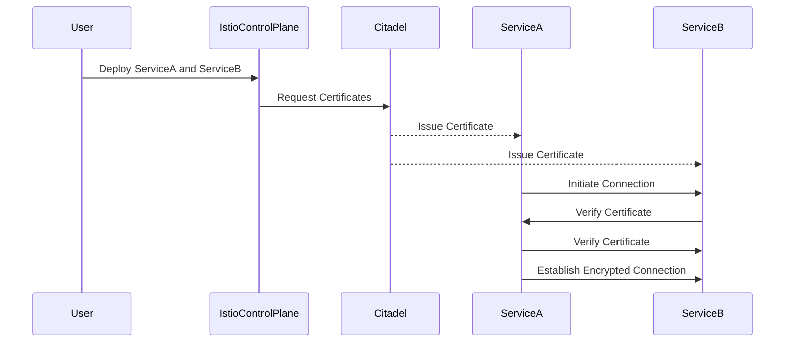

## Introduction to Service Mesh with Istio

In the realm of modern distributed systems, ensuring secure communication between microservices is paramount. One of the key technologies that enable this is a service mesh, specifically with Istio. This chapter delves deep into the concept of mutual Transport Layer Security (mTLS) within Istio, explaining how it secures inter-service communication in a Kubernetes cluster.

### What is a Service Mesh?

A service mesh is a dedicated infrastructure layer for handling service-to-service communication. It provides a way to manage and secure interactions between services, including load balancing, service discovery, and encryption. Istio is one of the leading implementations of a service mesh, designed to work seamlessly with Kubernetes.

### Why Use Istio for mTLS?

Istio simplifies the implementation of mTLS by automating much of the setup process. This automation ensures that services can communicate securely without requiring extensive manual configuration. By leveraging Istio, developers can focus on building applications rather than managing complex security configurations.

### Background Theory of Mutual TLS

Mutual TLS (mTLS) is a cryptographic protocol that ensures both parties in a communication exchange authenticate each other. Unlike traditional TLS, which only authenticates the server to the client, mTLS requires both the client and the server to present valid certificates. This bidirectional authentication significantly enhances security by preventing man-in-the-middle attacks and ensuring that only authorized entities can communicate.

#### How mTLS Works

1. **Certificate Issuance**: Each service in the mesh receives a unique certificate from the Certificate Authority (CA). In the context of Istio, this CA is typically managed by the Istio control plane.
2. **Authentication**: When a service initiates a connection to another service, both parties present their certificates. The receiving service verifies the certificate of the initiating service, and vice versa.
3. **Encryption**: Once both parties are authenticated, the communication is encrypted using the established TLS session.

### Setting Up Istio for mTLS

To set up Istio for mTLS, several components need to be installed and configured correctly. These include the Istio control plane, the Istio data plane, and the Ingress Gateway.

#### Installing Istio Control Plane

The Istio control plane includes components such as Pilot, Citadel, and Galley. These components manage the service mesh and handle tasks such as service discovery, certificate management, and configuration distribution.

```bash
# Install Istio control plane
helm install istio-control-plane istio/charts/base --namespace istio-system
```

#### Installing Istio Data Plane

The data plane consists of the Envoy proxies that are injected into each pod. These proxies handle the actual traffic and enforce security policies.

```bash
# Enable automatic injection of Envoy proxies
kubectl label namespace default istio-injection=enabled
```

#### Installing Ingress Gateway

The Ingress Gateway is responsible for routing external traffic into the service mesh.

```bash
# Install Ingress Gateway
helm install istio-ingress istio/charts/gateways --namespace istio-system
```

### Understanding mTLS Configuration in Istio

Once Istio is installed, configuring mTLS is relatively straightforward due to Istio's out-of-the-box capabilities. However, understanding the underlying mechanisms is crucial for troubleshooting and customization.

#### Automatic Certificate Management

Istio uses Citadel, its built-in certificate authority, to automatically issue and manage certificates for all services in the mesh. This process happens transparently to the user, ensuring that each service has a valid certificate.



### Detailed Example of mTLS in Action

Let's walk through a detailed example of how mTLS works in practice within an Istio service mesh.

#### Step-by-Step Process

1. **Deploy Services**:
   - Deploy two services, `service-a` and `service-b`, in a Kubernetes cluster with Istio enabled.

2. **Automatic Certificate Issuance**:
   - Citadel automatically issues certificates to both services upon deployment.

3. **Initiate Connection**:
   - `service-a` initiates a connection to `service-b`.

4. **Bidirectional Authentication**:
   - Both services present their certificates to each other.
   - Each service verifies the certificate of the other service.

5. **Establish Encrypted Connection**:
   - Once both services are authenticated, the communication is encrypted using TLS.

#### Full HTTP Request and Response Example

Here is a complete example of an HTTP request and response between two services with mTLS enabled:

```http
# HTTP Request from Service A to Service B
POST /api/data HTTP/1.1
Host: service-b.default.svc.cluster.local
Content-Type: application/json
Authorization: Bearer <token>
User-Agent: curl/7.64.1
Accept: */*
Connection: close

{
  "data": "example"
}

# HTTP Response from Service B to Service A
HTTP/1.1 200 OK
Date: Mon, 01 Jan 2024 00:00:00 GMT
Content-Type: application/json
Content-Length: 22
Connection: close

{
  "status": "success"
}
```

### Common Pitfalls and Troubleshooting

While Istio simplifies the setup of mTLS, there are several common pitfalls to watch out for:

1. **Certificate Expiration**:
   - Ensure that certificates are renewed before expiration to avoid service disruptions.
   
2. **Incorrect Configuration**:
   - Misconfigured Istio settings can lead to failed mTLS handshakes. Always verify the configuration using tools like `istioctl`.
   
3. **Network Issues**:
   - Network connectivity problems can prevent services from establishing secure connections. Use tools like `kubectl exec` to troubleshoot network issues.

### Real-World Examples and Breaches

Recent breaches have highlighted the importance of robust security measures like mTLS. For instance, the Capital One breach in 2019 exposed sensitive customer data due to misconfigured access controls. Implementing mTLS could have helped mitigate such risks by ensuring secure communication between services.

### How to Prevent / Defend Against mTLS Vulnerabilities

#### Detection

- **Monitoring Tools**: Use monitoring tools like Prometheus and Grafana to track mTLS-related metrics.
- **Logging**: Enable detailed logging for mTLS events to detect anomalies.

#### Prevention

- **Regular Audits**: Conduct regular audits of Istio configurations to ensure compliance with security policies.
- **Secure Configurations**: Follow best practices for securing Istio configurations, such as enabling strict mTLS enforcement.

#### Secure Coding Fixes

Here is an example of a vulnerable configuration and its secure counterpart:

```yaml
# Vulnerable Configuration
apiVersion: networking.istio.io/v1alpha3
kind: DestinationRule
metadata:
  name: service-b
spec:
  host: service-b
  trafficPolicy:
    tls:
      mode: DISABLE

# Secure Configuration
apiVersion: networking.istio.io/v1alpha3
kind: DestinationRule
metadata:
  name: service-b
spec:
  host: service-b
  trafficPolicy:
    tls:
      mode: ISTIO_MUTUAL
```

### Conclusion

Understanding and implementing mTLS with Istio is essential for securing modern distributed systems. By leveraging Istio's automated certificate management and out-of-the-box mTLS support, developers can ensure secure communication between services without extensive manual configuration. However, it is crucial to understand the underlying mechanisms and potential pitfalls to effectively troubleshoot and secure the service mesh.

### Hands-On Labs

For practical experience with Istio and mTLS, consider the following labs:

- **PortSwigger Web Security Academy**: Offers interactive labs on web security, including some aspects of service mesh security.
- **OWASP Juice Shop**: A deliberately insecure web application for practicing web security skills.
- **Kubernetes Goat**: A Kubernetes-based security training platform that includes exercises on securing service meshes.

By combining theoretical knowledge with practical experience, you can master the art of securing distributed systems with Istio and mTLS.

---
<!-- nav -->
[[DevSecOps/DevSecOps Bootcamp/06-Container & Kubernetes Security/04-Service Mesh with Istio/mTLS Deep Dive/05-Introduction to Service Mesh with Istio Part 5|Introduction to Service Mesh with Istio Part 5]] | [[DevSecOps/DevSecOps Bootcamp/06-Container & Kubernetes Security/04-Service Mesh with Istio/mTLS Deep Dive/00-Overview|Overview]] | [[07-Service Mesh with Istio mTLS Deep Dive Part 1|Service Mesh with Istio mTLS Deep Dive Part 1]]
