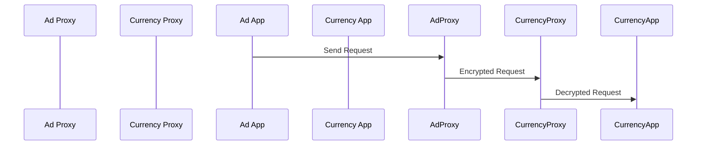

## Service Mesh with Istio: mTLS Deep Dive

### Introduction to Service Mesh and Istio

A **service mesh** is a dedicated infrastructure layer for handling service-to-service communication. It provides a way to manage and secure communication between microservices in a distributed system. One of the most popular service meshes is **Istio**, which offers advanced traffic management, policy enforcement, and observability features.

### Understanding mTLS

**Mutual Transport Layer Security (mTLS)** is a cryptographic protocol that ensures secure communication between two parties by verifying the identity of both the client and the server. In the context of a service mesh, mTLS is used to secure communication between microservices within the same cluster.

#### Why Use mTLS?

- **Security**: Ensures that only authenticated services can communicate with each other.
- **Encryption**: Encrypts data in transit, preventing eavesdropping and tampering.
- **Identity Verification**: Verifies the identity of both the client and the server, ensuring that only trusted services can interact.

### How mTLS Works in Istio

In Istio, mTLS is implemented using **Envoy proxies**. Each pod in the cluster runs an Envoy proxy that intercepts and manages all inbound and outbound traffic. Here’s a detailed breakdown of how mTLS works:

1. **Traffic Interception**: When a pod sends a request, the Envoy proxy intercepts the traffic.
2. **Certificate Management**: The Envoy proxy uses pre-configured certificates to encrypt the request.
3. **Request Encryption**: The request is encrypted before being sent to the destination service.
4. **Decryption at Destination**: The receiving Envoy proxy decrypts the request and forwards it to the destination service.

#### Example Scenario

Consider a scenario where an `ad service` sends a request to a `currency service`. Both services are part of the `online boutique namespace`.



### Detailed Workflow

1. **Unencrypted Traffic from Non-Istio Pods**
   - Pods from namespaces like `Open Policy Agent` or `Argo` send unencrypted traffic because they lack the necessary proxies and certificates.
   
2. **Encrypted Traffic from Istio Pods**
   - Pods in the `online boutique namespace` use Istio proxies to encrypt their traffic.
   - The Envoy proxy intercepts the traffic and checks if the destination service also has an Istio proxy.
   - If the destination service has an Istio proxy, the request is encrypted before being sent.

#### Full HTTP Example

Here’s a full HTTP request and response example:

**HTTP Request**

```http
POST /currency/convert HTTP/1.1
Host: currency-service.online-boutique.svc.cluster.local
Content-Type: application/json
Authorization: Bearer <token>
X-Forwarded-For: 10.0.0.1
X-Request-ID: 1234567890abcdef

{
  "from": "USD",
  "to": "EUR",
  "amount": 100
}
```

**HTTP Response**

```http
HTTP/1.1 200 OK
Content-Type: application/json
Date: Mon, 01 Jan 2024 00:00:00 GMT
Content-Length: 34

{
  "convertedAmount": 85.0
}
```

### Certificate Management

Certificates are managed by Istio’s **Certificate Authority (CA)**. Each service receives a unique certificate signed by the CA. This ensures that only services with valid certificates can communicate.

#### Certificate Structure

A typical certificate includes:

- **Subject**: Identifies the service.
- **Issuer**: Identifies the CA.
- **Validity Period**: Specifies the start and end dates of the certificate.
- **Public Key**: Used for encryption.

### Pitfalls and Common Mistakes

- **Incorrect Configuration**: Misconfigured proxies can lead to unencrypted traffic.
- **Expired Certificates**: Services with expired certificates cannot communicate securely.
- **Missing Certificates**: Services without certificates cannot participate in mTLS.

### How to Prevent / Defend

#### Detection

- **Monitoring**: Use tools like Prometheus and Grafana to monitor traffic patterns and detect anomalies.
- **Logging**: Enable detailed logging to track requests and responses.

#### Prevention

- **Configuration Validation**: Ensure all services are correctly configured with Istio proxies.
- **Automated Renewal**: Set up automated certificate renewal to avoid expiration issues.

#### Secure Coding Fixes

**Vulnerable Code**

```yaml
apiVersion: networking.istio.io/v1alpha3
kind: DestinationRule
metadata:
  name: currency-service
spec:
  host: currency-service
  trafficPolicy:
    tls:
      mode: DISABLE
```

**Fixed Code**

```yaml
apiVersion: networking.istio.io/v1alpha3
kind: DestinationRule
metadata:
  name: currency-service
spec:
  host: currency-service
  trafficPolicy:
    tls:
      mode: ISTIO_MUTUAL
```

### Real-World Examples

#### Recent Breaches

- **CVE-2021-25285**: A vulnerability in Istio’s mTLS implementation allowed unauthorized access to services.
- **CVE-2022-3797**: An issue in certificate validation led to potential man-in-the-middle attacks.

### Hands-On Labs

To practice and understand mTLS in Istio, you can use the following labs:

- **PortSwigger Web Security Academy**: Offers hands-on labs to understand and configure mTLS in Istio.
- **OWASP Juice Shop**: Provides a vulnerable web application to test and secure with Istio’s mTLS.

### Conclusion

Understanding and implementing mTLS in Istio is crucial for securing service-to-service communication in a microservices architecture. By leveraging Istio’s Envoy proxies and certificate management, you can ensure that all traffic is encrypted and authenticated, providing robust security for your applications.

---
<!-- nav -->
[[08-Service Mesh with Istio mTLS Deep Dive Part 2|Service Mesh with Istio mTLS Deep Dive Part 2]] | [[DevSecOps/DevSecOps Bootcamp/06-Container & Kubernetes Security/04-Service Mesh with Istio/mTLS Deep Dive/00-Overview|Overview]] | [[DevSecOps/DevSecOps Bootcamp/06-Container & Kubernetes Security/04-Service Mesh with Istio/mTLS Deep Dive/10-Practice Questions & Answers|Practice Questions & Answers]]
