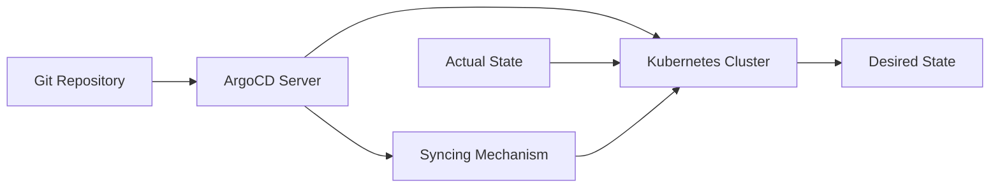

## Introduction to GitOps and ArgoCD

### Background Theory

GitOps is a modern approach to managing infrastructure and applications using Git as the single source of truth. This methodology leverages the power of Git to manage the desired state of your infrastructure and applications, ensuring consistency, traceability, and collaboration among teams. GitOps principles are based on the following key concepts:

- **Version Control**: All infrastructure and application configurations are stored in a Git repository.
- **Pull Requests**: Changes to the infrastructure are proposed via pull requests, enabling peer reviews and approvals.
- **Automated Deployment**: A continuous integration and continuous deployment (CI/CD) pipeline automatically deploys changes from the Git repository to the live environment.
- **Self-Healing**: The system continuously monitors the actual state against the desired state defined in Git and applies any necessary changes to ensure alignment.

### Why GitOps?

GitOps provides several benefits over traditional approaches to infrastructure management:

- **Traceability**: Every change is tracked in Git, making it easy to understand the history of changes and who made them.
- **Collaboration**: Multiple team members can work on the same infrastructure configuration simultaneously, with Git's branching and merging capabilities facilitating smooth collaboration.
- **Consistency**: By defining the desired state in Git, GitOps ensures that the actual state of the infrastructure matches the desired state, reducing drift and inconsistencies.
- **Security**: Pull requests and code reviews provide an additional layer of security, as changes must be reviewed and approved before being deployed.

### Real-World Examples

Recent breaches and vulnerabilities have highlighted the importance of adopting GitOps principles. For instance, the SolarWinds supply chain attack (CVE-2020-1014) demonstrated the risks associated with uncontrolled and untracked changes to infrastructure. By implementing GitOps, organizations can better control and monitor changes, reducing the likelihood of such attacks.

### ArgoCD Overview

ArgoCD is a popular open-source tool that implements GitOps principles for Kubernetes environments. It automates the deployment and synchronization of applications from Git repositories to Kubernetes clusters. ArgoCD provides a declarative way to define and manage the desired state of your applications, ensuring that the actual state of the cluster aligns with the desired state defined in Git.

### Key Features of ArgoCD

- **Application Management**: ArgoCD allows you to manage multiple applications within a single cluster, each with its own set of resources and configurations.
- **Syncing Mechanism**: ArgoCD continuously syncs the actual state of the cluster with the desired state defined in Git, applying any necessary changes.
- **Rollback and Rollout**: ArgoCD supports rolling back to previous versions and rolling out new versions of applications, providing flexibility and reliability.
- **Multi-Cluster Support**: ArgoCD can manage multiple Kubernetes clusters, ensuring consistent deployment across different environments.
- **Web UI and CLI**: ArgoCD provides both a web-based user interface and a command-line interface (CLI) for managing applications.

### How ArgoCD Works

ArgoCD operates by continuously comparing the actual state of the Kubernetes cluster with the desired state defined in Git. If there are discrepancies, ArgoCD applies the necessary changes to bring the actual state in line with the desired state. This process is automated and can be triggered by changes in the Git repository or by manual intervention.



### Comparison with Other CD Tools

While other CD tools like Jenkins, Spinnaker, and Tekton are powerful and flexible, they often require more manual configuration and management. ArgoCD simplifies the process by leveraging GitOps principles, providing a declarative and automated way to manage applications. This makes ArgoCD particularly suitable for organizations looking to adopt GitOps practices and streamline their CI/CD pipelines.

### Setting Up ArgoCD

To get started with ArgoCD, you first need to install it in your Kubernetes cluster. This can be done using the `kubectl` command-line tool or by using a Helm chart.

#### Installation Using `kubectl`

```bash
kubectl create namespace argocd
kubectl apply -n argocd -f https://raw.githubusercontent.com/argoproj/argo-cd/stable/manifests/install.yaml
```

#### Installation Using Helm

```bash
helm repo add argo https://argoproj.github.io/argo-helm
helm repo update
helm install argocd argo/argo-cd --namespace argocd --create-namespace
```

### Configuring ArgoCD

Once ArgoCD is installed, you need to configure it to connect to your Git repository and set up the desired state for your applications.

#### Connecting to Git Repository

To connect ArgoCD to your Git repository, you need to create a `Repository` resource in ArgoCD. This resource specifies the URL of the Git repository and the credentials required to access it.

```yaml
apiVersion: argoproj.io/v1alpha1
kind: Repository
metadata:
  name: my-repo
spec:
  url: https://github.com/myorg/myrepo.git
  type: git
  sshPrivateKeySecretRef:
    name: my-ssh-key-secret
    key: ssh-privatekey
```

#### Creating Applications

Next, you need to create `Application` resources in ArigoCD to define the desired state of your applications. Each `Application` resource specifies the source of the application (the Git repository), the target cluster, and the namespace where the application should be deployed.

```yaml
apiVersion: argoproj.io/v1alpha1
kind: Application
metadata:
  name: myapp
spec:
  project: default
  source:
    repoURL: https://github.com/myorg/myrepo.git
    targetRevision: HEAD
    path: k8s
  destination:
    server: https://kubernetes.default.svc
    namespace: myapp
```

### Creating a CI Pipeline

To automate the deployment of your applications, you need to create a CI pipeline that triggers the GitOps pipeline whenever changes are pushed to the Git repository.

#### Example CI Pipeline Configuration

```yaml
name: CI Pipeline

on:
  push:
    branches:
      - main

jobs:
  build-and-deploy:
    runs-on: ubuntu-latest
    steps:
      - name: Checkout Code
        uses: actions/checkout@v2
      - name: Build Docker Image
        run: docker build -t myapp .
      - name: Push Docker Image
        run: docker push myapp
      - name: Trigger GitOps Pipeline
        run: |
          git clone https://github.com/myorg/myrepo.git
          cd myrepo
          git checkout main
          kustomize build k8s | kubectl apply -f -
```

### Customizing ArgoCD

ArgoCD provides several customization options to tailor it to your specific needs. You can customize the behavior of ArgoCD by configuring various settings, such as the sync policy, the retry strategy, and the notification settings.

#### Sync Policy

The sync policy determines how ArgoCD handles discrepancies between the actual state and the desired state. You can configure the sync policy to either automatically sync the discrepancies or to require manual approval.

```yaml
apiVersion: argoproj.io/v1alpha1
kind: Application
metadata:
  name: myapp
spec:
  project: default
  source:
    repoURL: https://github.com/myorg/myrepo.git
    targetRevision: HEAD
    path: k8s
  destination:
    server: https://kubernetes.default.svc
    namespace: myapp
  syncPolicy:
    automated:
      prune: true
      selfHeal: true
```

#### Retry Strategy

The retry strategy determines how ArgoCD handles failures during the syncing process. You can configure the retry strategy to retry a certain number of times or to wait for a certain amount of time before retrying.

```yaml
apiVersion: argoproj.io/v1alpha1
kind: Application
metadata:
  name: myapp
spec:
  project: default
  source:
    repoURL: https://github.com/myorg/myrepo.git
    targetRevision: HEAD
    path: k8
  destination:
    server: https://kubernetes.default.svc
    namespace: myapp
  syncPolicy:
    retryStrategy:
      limit: 3
      backoff:
        duration: 1m
```

### Monitoring and Troubleshooting

To ensure the smooth operation of ArgoCD, you need to monitor its status and troubleshoot any issues that arise. ArgoCD provides several monitoring and troubleshooting tools, including the web UI, the CLI, and the metrics API.

#### Monitoring with the Web UI

The ArgoCD web UI provides a visual representation of the status of your applications and the discrepancies between the actual state and the desired state. You can use the web UI to monitor the progress of deployments and to troubleshoot any issues that arise.

#### Monitoring with the CLI

The ArgoCD CLI provides a set of commands for monitoring the status of your applications and for troubleshooting any issues that arise. You can use the CLI to view the status of your applications, to sync the discrepancies, and to roll back to previous versions.

```bash
argocd app list
argocd app sync myapp
argocd app rollback myapp
```

#### Monitoring with Metrics API

ArgoCD exposes a metrics API that provides detailed information about the status of your applications and the discrepancies between the actual state and the desired state. You can use the metrics API to integrate ArgoCD with your monitoring and alerting systems.

### Security Considerations

When using ArgoCD, it is important to consider the security implications of storing sensitive information in Git repositories and of granting access to the ArgoCD server. You should follow best practices for securing your Git repositories and for managing access to the ArgoCD server.

#### Securing Git Repositories

To secure your Git repositories, you should use strong authentication mechanisms, such as SSH keys or OAuth tokens, and you should restrict access to the repositories to only those users who need it. You should also encrypt sensitive information, such as passwords and API keys, using tools like `git-crypt`.

#### Managing Access to ArgoCD

To manage access to the ArgoCD server, you should use role-based access control (RBAC) to grant permissions to users and groups based on their roles. You should also use multi-factor authentication (MFA) to provide an additional layer of security.

### How to Prevent / Defend

To prevent and defend against potential security threats when using ArgoCD, you should follow these best practices:

#### Secure Git Repositories

- Use strong authentication mechanisms, such as SSH keys or OAuth tokens.
- Restrict access to the repositories to only those users who need it.
- Encrypt sensitive information using tools like `git-crypt`.

#### Manage Access to ArgoCD

- Use RBAC to grant permissions to users and groups based on their roles.
- Use MFA to provide an additional layer of security.

#### Monitor and Audit

- Regularly monitor the status of your applications and the discrepancies between the actual state and the desired state.
- Regularly audit the logs and metrics to detect any suspicious activity.

### Real-World Example: SolarWinds Supply Chain Attack

The SolarWinds supply chain attack (CVE-2020-1014) demonstrated the risks associated with uncontrolled and untracked changes to infrastructure. By implementing GitOps principles and using ArgoCD, organizations can better control and monitor changes, reducing the likelihood of such attacks.

### Conclusion

By the end of this chapter, you will have a completely automated end-to-end CI/CD pipeline with GitOps principles and best practices. You will have learned how to use ArgoCD to manage your applications and how to implement GitOps principles in your organization. You will also have learned how to secure your Git repositories and how to manage access to the ArgoCD server.

### Practice Labs

For hands-on experience with ArgoCD, you can use the following labs:

- **PortSwigger Web Security Academy**: Provides a series of labs on web application security, including GitOps and ArgoCD.
- **OWASP Juice Shop**: Provides a vulnerable web application for practicing web application security, including GitOps and ArgoCD.
- **DVWA**: Provides a vulnerable web application for practicing web application security, including GitOps and ArgoCD.
- **WebGoat**: Provides a vulnerable web application for practicing web application security, including GitOps and ArgoCD.

These labs will help you gain practical experience with ArgoCD and GitOps principles, and will prepare you for real-world scenarios.

---
<!-- nav -->
[[DevSecOps/DevSecOps Bootcamp/07-CI CD Security Pipeline/01-App Release Pipeline with ArgoCD/01-Chapter Overview/01-Introduction to App Release Pipeline with ArgoCD|Introduction to App Release Pipeline with ArgoCD]] | [[DevSecOps/DevSecOps Bootcamp/07-CI CD Security Pipeline/01-App Release Pipeline with ArgoCD/01-Chapter Overview/00-Overview|Overview]] | [[DevSecOps/DevSecOps Bootcamp/07-CI CD Security Pipeline/01-App Release Pipeline with ArgoCD/01-Chapter Overview/03-Practice Questions & Answers|Practice Questions & Answers]]
