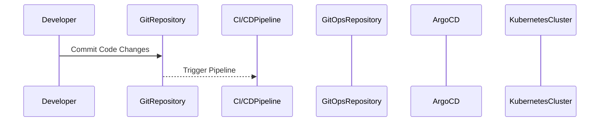
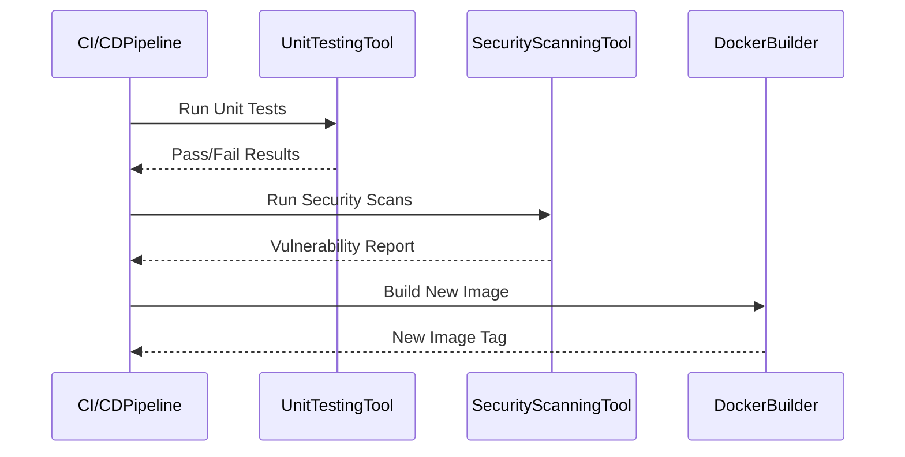
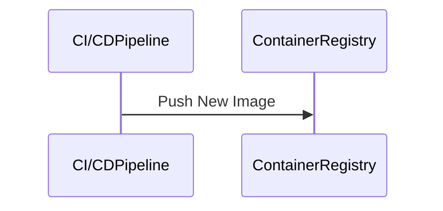
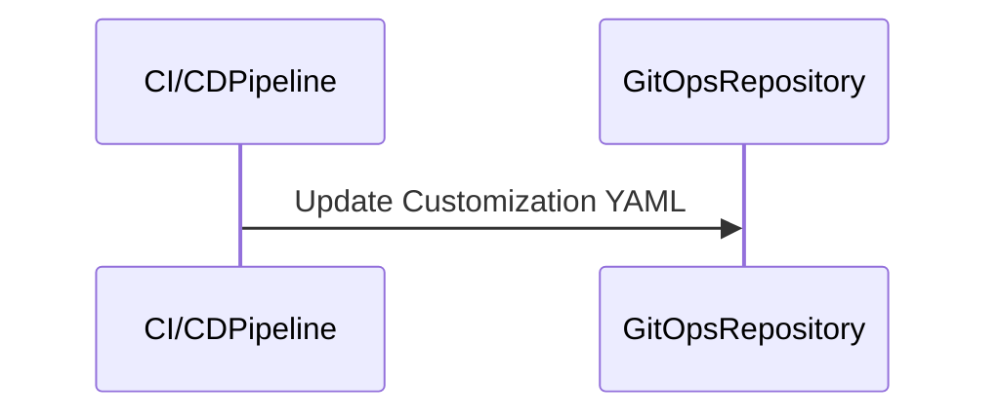
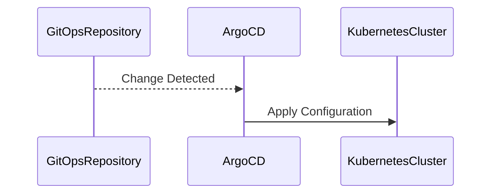
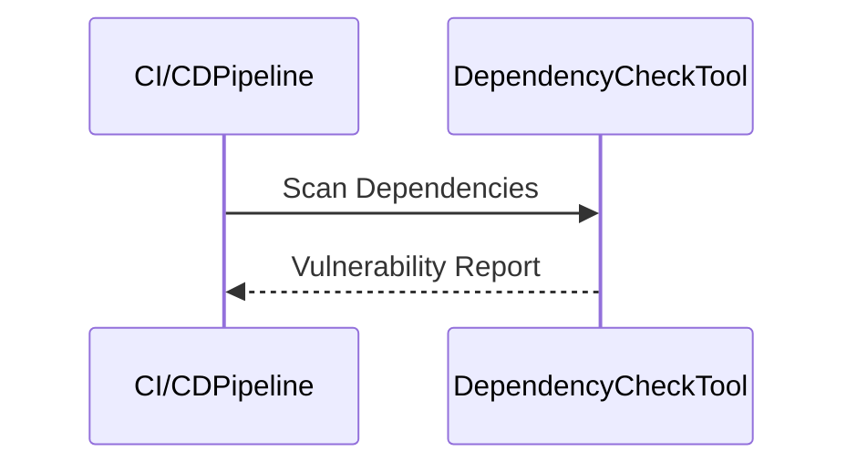
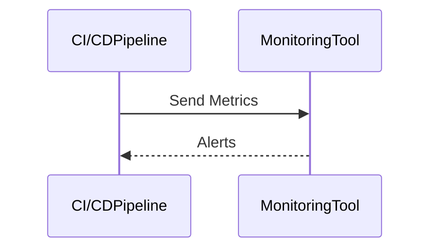

## Introduction to App Release Pipeline with ArgoCD

In the realm of DevSecOps, an automated release pipeline is crucial for ensuring that applications are deployed securely and efficiently. This chapter delves into the intricacies of setting up and managing such a pipeline using ArgoCD, a popular open-source tool for GitOps-based deployment. We will explore the entire workflow, from triggering a pipeline with a commit to the final deployment in the Kubernetes cluster, ensuring that each step is thoroughly understood and implemented correctly.

### Background Theory

Before diving into the specifics of ArgoCD and the pipeline setup, it is essential to understand the underlying principles of continuous integration (CI) and continuous delivery (CD).

#### Continuous Integration (CI)

Continuous Integration is the practice of merging all developers' working copies to a shared mainline several times a day. Each merge results in a build, which is tested automatically. The goal is to detect integration errors as quickly as possible. This process ensures that the codebase remains stable and that issues are identified early.

#### Continuous Delivery (CD)

Continuous Delivery extends CI by ensuring that the software can be released to production at any time. This means that the software is always in a deployable state, and the deployment process is automated. CD aims to reduce the time and effort required to release new features or bug fixes.

#### GitOps

GitOps is a set of practices that uses Git as a single source of truth for infrastructure and application deployments. By treating infrastructure as code and using Git for version control, teams can manage their infrastructure and applications more reliably and securely. GitOps emphasizes the importance of declarative specifications and automated reconciliation processes.

### Setting Up the Pipeline

To illustrate the entire workflow, we will use a hypothetical application called "Online Boutique." The pipeline will be triggered by a commit to the Online Boutique repository, which will then execute a series of steps to test, build, and deploy the application.

#### Step 1: Triggering the Pipeline

The first step in the pipeline is triggered by a commit to the Online Boutique repository. This commit will initiate a series of actions that will ultimately result in the deployment of the application.



#### Step 2: Running CI Steps

Once the pipeline is triggered, it will run a series of CI steps to ensure that the application changes are valid and secure. These steps typically include:

- **Unit Testing**: Running automated tests to verify that the code changes do not break existing functionality.
- **Security Scans**: Using tools like SonarQube or OWASP Dependency-Check to identify potential security vulnerabilities in the code.
- **Build New Image**: Building a new Docker image with the updated code and tagging it appropriately.



#### Step 3: Pushing the New Image

After the CI steps are completed, the new Docker image is pushed to a container registry, such as Docker Hub or Google Container Registry (GCR).



#### Step 4: Triggering the GitOps Pipeline

The next step is to trigger the GitOps pipeline, which will update the customization YAML file in the GitOps repository. This file contains the necessary configurations for deploying the application in the Kubernetes cluster.



#### Step 5: Applying Changes with ArgoCD

ArgoCD is configured to listen for changes in the `dev` folder of the GitOps repository. When a change is detected, ArgoCD automatically pulls the new configuration and applies it to the Kubernetes cluster.



### Detailed Example

Let's walk through a detailed example of the entire workflow using the Online Boutique application.

#### Initial Setup

First, we need to set up the repositories and the necessary configurations.

1. **Online Boutique Repository**: This repository contains the source code for the Online Boutique application.
2. **GitOps Repository**: This repository contains the Kubernetes manifests and the customization YAML files.

```yaml
# Example of a customization YAML file in the GitOps repository
apiVersion: argoproj.io/v1alpha1
kind: Application
metadata:
  name: online-boutique-dev
spec:
  project: default
  source:
    repoURL: https://github.com/example/online-boutique.git
    targetRevision: HEAD
    path: k8s/dev
  destination:
    server: https://kubernetes.default.svc
    namespace: online-boutique-dev
```

#### Triggering the Pipeline

When a developer makes a commit to the Online Boutique repository, the CI/CD pipeline is triggered.

```bash
# Example of a webhook trigger in the CI/CD system
curl -X POST https://ci-cd-system.example.com/webhook -H "Content-Type: application/json" -d '{"event": "push", "repository": "https://github.com/example/online-boutique.git"}'
```

#### Running CI Steps

The pipeline runs the following steps:

1. **Unit Testing**:
    ```bash
    # Example of running unit tests
    ./run-tests.sh
    ```

2. **Security Scans**:
    ```bash
    # Example of running security scans
    sonar-scanner
    ```

3. **Building the New Image**:
    ```bash
    # Example of building a new Docker image
    docker build -t gcr.io/my-project/online-boutique:$COMMIT_SHA .
    docker push gcr.io/my-project/online-boutique:$COMMIT_SHA
    ```

#### Updating the GitOps Repository

The pipeline updates the customization YAML file in the GitOps repository.

```bash
# Example of updating the customization YAML file
git clone https://github.com/example/gitops-repo.git
sed -i 's/image: .*/image: gcr.io\/my-project\/online-boutique:'$COMMIT_SHA'/g' k8s/dev/application.yaml
git add k8s/dev/application.yaml
git commit -m "Update Online Boutique to $COMMIT_SHA"
git push origin master
```

#### Applying Changes with ArgoCD

ArgoCD detects the change in the `dev` folder and applies the new configuration to the Kubernetes cluster.

```bash
# Example of ArgoCD applying the new configuration
argocd app sync online-boutique-dev
```

### Common Pitfalls and How to Prevent Them

#### Pitfall 1: Inconsistent State Between Repositories

One common issue is that the state of the Online Boutique repository and the GitOps repository may become inconsistent. This can happen if the pipeline fails to update the GitOps repository correctly.

**How to Prevent**:
- Ensure that the pipeline includes robust error handling and retries.
- Use version control hooks to validate changes before they are committed.

#### Pitfall 2: Manual Intervention Required

Another pitfall is that manual intervention may be required to resolve issues during the deployment process.

**How to Prevent**:
- Implement automated rollback mechanisms in case of deployment failures.
- Use monitoring tools to detect and alert on issues in real-time.

### Real-World Examples

#### Recent Breaches and CVEs

Recent breaches and CVEs have highlighted the importance of securing the CI/CD pipeline. For example, the Log4j vulnerability (CVE-2021-44228) affected many applications, including those managed through CI/CD pipelines. Ensuring that security scans are integrated into the pipeline can help mitigate such risks.

#### Secure Coding Practices

Secure coding practices are essential to prevent vulnerabilities. For instance, using dependency-check tools can help identify and mitigate known vulnerabilities in third-party libraries.



### How to Prevent / Defend

#### Detection

To detect issues in the pipeline, use monitoring and logging tools. For example, Prometheus and Grafana can be used to monitor the health of the pipeline and the deployed applications.



#### Prevention

To prevent issues, implement the following measures:

- **Automated Testing**: Ensure that unit tests and security scans are run automatically.
- **Immutable Infrastructure**: Use immutable infrastructure to ensure that the environment remains consistent.
- **Least Privilege**: Ensure that the pipeline and the deployed applications have the least privilege necessary.

#### Secure-Coding Fixes

Here is an example of a vulnerable code snippet and its secure version:

**Vulnerable Code**:
```python
import os
import subprocess

def run_command(command):
    subprocess.run(command, shell=True)
```

**Secure Code**:
```python
import subprocess

def run_command(command):
    subprocess.run(command.split(), check=True)
```

### Complete Example

Here is a complete example of the entire pipeline setup, including the full HTTP request and response, the full policy/config file, and the expected result/output.

#### Full HTTP Request and Response

```http
POST /webhook HTTP/1.1
Host: ci-cd-system.example.com
Content-Type: application/json

{
  "event": "push",
  "repository": "https://github.com/example/online-boutique.git"
}

HTTP/1.1 200 OK
Content-Type: application/json

{
  "status": "success",
  "message": "Pipeline triggered"
}
```

#### Full Policy/Config File

```yaml
# Example of a GitOps repository configuration
apiVersion: argoproj.io/v1alpha1
kind: Application
metadata:
  name: online-boutique-dev
spec:
  project: default
  source:
    repoURL: https://github.com/example/online-boutique.git
    targetRevision: HEAD
    path: k8s/dev
  destination:
    server: https://kubernetes.default.svc
    namespace: online-boutique-dev
```

#### Expected Result/Output

```bash
# Example of the output after the pipeline completes
Pipeline completed successfully
Application deployed to Kubernetes cluster
```

### Practice Labs

For hands-on experience with setting up and managing an app release pipeline with ArgoCD, consider the following labs:

- **PortSwigger Web Security Academy**: Focuses on web application security but can provide valuable insights into securing the pipeline.
- **OWASP Juice Shop**: A deliberately insecure web application for security training.
- **DVWA (Damn Vulnerable Web Application)**: Another web application for security training.
- **WebGoat**: An interactive web application security training tool.

These labs provide practical experience in setting up and managing a secure CI/CD pipeline.

### Conclusion

In conclusion, setting up an automated release pipeline with ArgoCD is a critical component of DevSecOps. By understanding the underlying principles and implementing best practices, you can ensure that your applications are deployed securely and efficiently. This chapter has provided a comprehensive guide to the entire workflow, including detailed examples and practical advice for preventing common pitfalls.

---
<!-- nav -->
[[DevSecOps/DevSecOps Bootcamp/07-CI CD Security Pipeline/01-App Release Pipeline with ArgoCD/11-See Whole Automated Workflow in Action/00-Overview|Overview]] | [[DevSecOps/DevSecOps Bootcamp/07-CI CD Security Pipeline/01-App Release Pipeline with ArgoCD/11-See Whole Automated Workflow in Action/02-Practice Questions & Answers|Practice Questions & Answers]]
