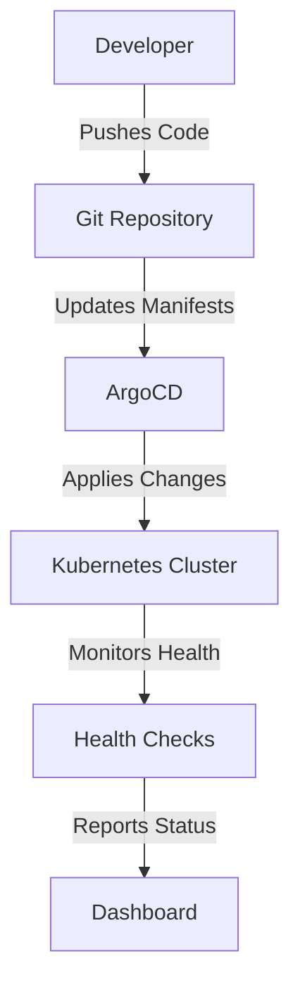
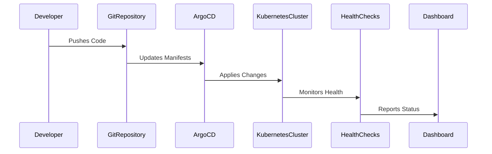

## Introduction to Application Release Pipelines with ArgoCD

In the realm of DevSecOps, one of the critical components is the application release pipeline. This pipeline ensures that applications are built, tested, and deployed efficiently and securely. One popular tool used in this process is ArgoCD, which simplifies the management and deployment of applications in Kubernetes environments. Let's delve into the details of how ArgoCD fits into the application release pipeline and why it is a valuable tool.

### Background Theory

Before diving into the specifics of ArgoCD, it's essential to understand the traditional approach to deploying applications in a Kubernetes environment. Typically, after an image is pushed to a repository, a tool like Jenkins is used to update the deployment YAML file for the application. Then, tools such as `kubectl` or `Helm` are used to apply these updates to the Kubernetes cluster.

#### Challenges with Traditional Approaches

While this method works, it comes with several challenges:

1. **Tool Installation and Configuration**: Tools like `kubectl`, `Helm`, and others need to be installed and configured on the build automation server (e.g., Jenkins). This adds complexity and requires maintenance.
   
2. **Kubernetes Cluster Access**: These tools require credentials to access the Kubernetes cluster. Managing these credentials securely is crucial, especially in large organizations with multiple projects and clusters.

3. **Security Risks**: Providing cluster credentials to external services and tools poses significant security risks. If credentials are compromised, attackers could gain unauthorized access to the cluster.

4. **Scalability Issues**: In environments with numerous projects and clusters, managing credentials for each becomes cumbersome and error-prone.

### Enter ArgoCD

ArgoCD addresses these challenges by providing a declarative, GitOps-based approach to application deployment and management. It allows you to define your desired state in Git repositories and automatically syncs this state with your Kubernetes clusters.

#### Key Features of ArgoCD

- **Declarative Deployment**: Define your application's desired state in Git repositories.
- **GitOps Workflow**: Use Git as the single source of truth for your application's configuration.
- **Automated Syncing**: Automatically sync the desired state with the actual state of your Kubernetes clusters.
- **Multi-Cluster Management**: Manage multiple clusters from a single dashboard.
- **Role-Based Access Control (RBAC)**: Securely manage access to different parts of the cluster.

### How ArgoCD Works

Let's break down the workflow of ArgoCD:

1. **Define Desired State**: Create and maintain your application's desired state in a Git repository. This includes Kubernetes manifests, Helm charts, and other configuration files.
   
2. **Sync with Clusters**: ArgoCD continuously monitors the Git repository and applies any changes to the Kubernetes clusters. This ensures that the actual state of the clusters matches the desired state defined in Git.

3. **Role-Based Access Control**: Use RBAC to control who can make changes to the Git repository and who can access the Kubernetes clusters.

4. **Health Checks and Rollbacks**: ArgoCD provides health checks to ensure that the application is running correctly. If issues arise, you can easily roll back to a previous state.

### Example Setup

To illustrate how ArgoCD works, let's walk through a simple example setup.

#### Step 1: Install ArgoCD

First, you need to install ArgoCD in your Kubernetes cluster. You can do this using `kubectl`:

```bash
kubectl create namespace argocd
kubectl apply -n argocd -f https://raw.githubusercontent.com/argoproj/argo-cd/stable/manifests/install.yaml
```

#### Step 2: Configure ArgoCD

Once installed, you need to configure ArgoCD to connect to your Git repository. This involves setting up the necessary credentials and defining the repositories.

```yaml
apiVersion: v1
kind: Secret
metadata:
  name: argocd-repo-credentials
  namespace: argocd
type: Opaque
data:
  myrepo.com: <base64-encoded-credentials>
```

#### Step 3: Define Application Manifests

Create a Git repository to store your application manifests. For example, you might have a `kustomization.yaml` file:

```yaml
resources:
- deployment.yaml
- service.yaml
```

And a `deployment.yaml` file:

```yaml
apiVersion: apps/v1
kind: Deployment
metadata:
  name: myapp
spec:
  replicas: 3
  selector:
    matchLabels:
      app: myapp
  template:
    metadata:
      labels:
        app: myapp
    spec:
      containers:
      - name: myapp
        image: myregistry/myapp:latest
```

#### Step 4: Apply Changes with ArgoCD

Use ArgoCD to apply these changes to your Kubernetes cluster. You can do this via the ArgoCD CLI or the web UI.

```bash
argocd app create myapp --repo https://github.com/myorg/myrepo.git --path kustomize --dest-server https://mycluster.k8s.local --dest-namespace default
```

### Real-World Examples and Recent Breaches

Recent breaches and vulnerabilities highlight the importance of secure deployment practices. For instance, the SolarWinds breach (CVE-2020-1014) demonstrated how supply chain attacks can compromise entire ecosystems. By using tools like ArgoCD, you can ensure that your deployments are consistent and secure, reducing the risk of such attacks.

### Pitfalls and Common Mistakes

While ArgoCD offers significant benefits, there are common pitfalls to avoid:

1. **Credential Management**: Ensure that credentials are managed securely. Use tools like HashiCorp Vault to store and manage secrets.
   
2. **RBAC Misconfigurations**: Incorrect RBAC settings can lead to unauthorized access. Regularly audit and review RBAC policies.

3. **Manual Overrides**: Avoid manual overrides of the desired state. This can lead to drift and inconsistencies between the Git repository and the actual state of the cluster.

### How to Prevent / Defend

#### Detection

Regularly monitor your Git repositories and Kubernetes clusters for unauthorized changes. Use tools like ArgoCD's built-in health checks and logging capabilities.

#### Prevention

1. **Secure Credential Management**: Use tools like HashiCorp Vault to securely store and manage credentials.
   
2. **RBAC Policies**: Implement strict RBAC policies to control access to your Git repositories and Kubernetes clusters.

3. **Automated Health Checks**: Use ArgoCD's health checks to ensure that your applications are running correctly and to detect any issues early.

#### Secure Code Fixes

Compare the vulnerable and secure versions of your application manifests:

**Vulnerable Version**:

```yaml
apiVersion: apps/v1
kind: Deployment
metadata:
  name: myapp
spec:
  replicas: 3
  selector:
    matchLabels:
      app: myapp
  template:
    metadata:
      labels:
        app: myapp
    spec:
      containers:
      - name: myapp
        image: myregistry/myapp:latest
```

**Secure Version**:

```yaml
apiVersion: apps/v1
kind: Deployment
metadata:
  name: myapp
spec:
  replicas: 3
  selector:
    matchLabels:
      app: myapp
  template:
    metadata:
      labels:
        app: myapp
    spec:
      containers:
      - name: myapp
        image: myregistry/myapp:latest
        securityContext:
          runAsUser: 1000
          runAsGroup: 3000
```

### Complete Example

Here is a complete example of a full HTTP request and response, along with the expected result:

**HTTP Request**:

```http
POST /api/deployments HTTP/1.1
Host: mycluster.k8s.local
Authorization: Bearer <token>
Content-Type: application/json

{
  "name": "myapp",
  "repo": "https://github.com/myorg/myrepo.git",
  "path": "kustomize",
  "server": "https://mycluster.k8s.local",
  "namespace": "default"
}
```

**HTTP Response**:

```http
HTTP/1.1 200 OK
Content-Type: application/json

{
  "status": "success",
  "message": "Deployment created successfully"
}
```

**Expected Result**:

The deployment is created and synced with the Kubernetes cluster.

### Mermaid Diagrams

#### Architecture Diagram



#### Sequence Diagram



### Practice Labs

For hands-on experience with ArgoCD, consider the following labs:

- **PortSwigger Web Security Academy**: Focuses on web application security but can be adapted for learning about secure deployment practices.
- **OWASP Juice Shop**: Another web application security lab that can be used to understand secure deployment workflows.
- **CloudGoat**: Provides scenarios for learning about cloud security, including Kubernetes and ArgoCD.
- **Pacu**: Offers a variety of cloud security labs, including those focused on Kubernetes and ArgoCD.

By following these steps and best practices, you can effectively use ArgoCD to manage and deploy your applications in a secure and efficient manner.

---
<!-- nav -->
[[DevSecOps/DevSecOps Bootcamp/07-CI CD Security Pipeline/01-App Release Pipeline with ArgoCD/ArgoCD explained Part 1 What Why and How/00-Overview|Overview]] | [[DevSecOps/DevSecOps Bootcamp/07-CI CD Security Pipeline/01-App Release Pipeline with ArgoCD/ArgoCD explained Part 1 What Why and How/02-Introduction to Argo CD|Introduction to Argo CD]]
