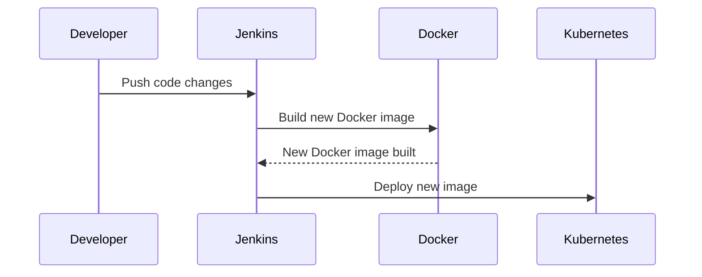

## Introduction to Argo CD

Argo CD is a popular GitOps tool that has gained significant traction in the DevOps community. GitOps is an operational framework that uses Git as a single source of truth for declarative infrastructure and application configurations. This approach ensures that all changes to the system are version-controlled, auditable, and reproducible. Argo CD specifically focuses on continuous delivery (CD) for Kubernetes environments, making it an essential tool for modern DevOps practices.

### What is Continuous Delivery?

Continuous Delivery (CD) is a practice where teams ensure that their software can be released to production at any time. This means that the software is always in a deployable state, and the process of deploying it is automated. The goal is to reduce the time and effort required to release new features or bug fixes, thereby improving the speed and reliability of the development process.

#### Traditional CD Tools: Jenkins and GitLab CI/CD

Before diving into Argo CD, it's important to understand how traditional CD tools like Jenkins and GitLab CI/CD work. These tools automate the build, test, and deployment processes, ensuring that changes to the application code are tested and deployed reliably.

##### Jenkins

Jenkins is an open-source automation server that supports building, testing, and deploying software. It is highly customizable and can be extended with numerous plugins to support various workflows. Here’s a typical workflow using Jenkins:

1. **Source Code Change**: A developer pushes changes to the source code repository.
2. **Trigger Build**: Jenkins detects the change and triggers a build job.
3. **Build and Test**: Jenkins runs the build process and executes tests.
4. **Deploy**: If the build and tests pass, Jenkins deploys the new version to the target environment.



##### GitLab CI/CD

GitLab CI/CD is integrated within the GitLab platform and provides a seamless way to manage the entire CI/CD pipeline. It leverages `.gitlab-ci.yml` files to define the pipeline stages and tasks.

Here’s an example `.gitlab-ci.yml` file:

```yaml
stages:
  - build
  - test
  - deploy

build_job:
  stage: build
  script:
    - docker build -t myapp .

test_job:
  stage: test
  script:
    - docker run myapp ./run-tests

deploy_job:
  stage: deploy
  script:
    - kubectl apply -f deployment.yaml
```

This configuration defines three stages: `build`, `test`, and `deploy`. Each stage has a corresponding job that performs specific tasks.

### What is Argo CD?

Argo CD is a declarative, extensible, and easy-to-use continuous delivery tool for Kubernetes. Unlike traditional CD tools that focus on automating the build and test phases, Argo CD emphasizes the deployment phase by leveraging GitOps principles. It ensures that the desired state of the Kubernetes cluster is always in sync with the Git repository.

#### Key Features of Argo CD

- **Declarative Deployment**: Argo CD uses declarative manifests to describe the desired state of the Kubernetes resources.
- **Automated Sync**: It continuously monitors the Git repository and automatically applies changes to the Kubernetes cluster.
- **Rollback Mechanism**: Argo CD provides a robust rollback mechanism to revert to previous states if something goes wrong.
- **Multi-Cluster Support**: It supports managing multiple Kubernetes clusters from a single control plane.

### How Does Argo CD Work?

To understand how Argo CD works, let's break down the process step-by-step:

1. **Application Definition**: Define the application in a Git repository using Kubernetes manifests.
2. **Sync Process**: Argo CD continuously syncs the desired state from the Git repository to the actual state in the Kubernetes cluster.
3. **Health Checks**: Argo CD performs health checks to ensure that the application is running correctly.
4. **Rollbacks**: If a deployment fails, Argo CD can roll back to a previous state.

#### Example Workflow

Consider a microservices application running in a Kubernetes cluster. When a new feature or bug fix is added to the application code, the following steps occur:

1. **Push Code Changes**: A developer pushes the changes to the Git repository.
2. **Update Deployment Manifest**: The deployment manifest (YAML file) is updated with the new image tag.
3. **Sync with Argo CD**: Argo CD detects the changes in the Git repository and applies them to the Kubernetes cluster.

Here’s a sample deployment manifest:

```yaml
apiVersion: apps/v1
kind: Deployment
metadata:
  name: myapp
spec:
  replicas: 3
  selector:
    matchLabels:
      app: myapp
  template:
    metadata:
      labels:
        app: myapp
    spec:
      containers:
      - name: myapp
        image: myregistry/myapp:v1.2.3
        ports:
        - containerPort: 8080
```

When the image tag is updated, Argo CD will automatically apply the new manifest to the Kubernetes cluster.

### Comparison with Traditional CD Tools

While Jenkins and GitLab CI/CD are powerful tools for automating the build and test phases, they often require additional steps to manage deployments. Argo CD simplifies this process by focusing on the deployment phase and ensuring that the desired state is always in sync with the Git repository.

#### Is Argo CD Just Another CD Tool?

No, Argo CD is more than just another CD tool. It brings GitOps principles to the deployment process, providing a declarative and automated way to manage Kubernetes clusters. While it doesn’t replace tools like Jenkins or GitLab CI/CD, it complements them by handling the deployment phase more effectively.

### Real-World Examples

To illustrate the benefits of Argo CD, consider a recent breach where a misconfiguration in the deployment process led to unauthorized access to sensitive data. By using Argo CD, the deployment process would have been more controlled and auditable, reducing the risk of such incidents.

#### CVE Example

CVE-2021-21277 is a critical vulnerability in Kubernetes that allowed attackers to escalate privileges and gain full control of the cluster. Using Argo CD, organizations can ensure that their Kubernetes configurations are always up-to-date and secure, reducing the risk of such vulnerabilities being exploited.

### Pitfalls and Best Practices

While Argo CD offers many benefits, there are also potential pitfalls to be aware of:

- **Complexity**: Managing multiple clusters and applications can become complex.
- **Security**: Ensure that the Git repository and Argo CD itself are properly secured.

#### How to Prevent / Defend

- **Secure Git Repository**: Use strong authentication mechanisms and limit access to the Git repository.
- **Audit Logs**: Enable audit logs in Argo CD to track all changes and deployments.
- **Regular Updates**: Keep Argo CD and Kubernetes components up-to-date to mitigate known vulnerabilities.

### Conclusion

Argo CD is a powerful tool for managing continuous delivery in Kubernetes environments. By leveraging GitOps principles, it ensures that the desired state of the cluster is always in sync with the Git repository. While it doesn’t replace traditional CD tools, it complements them by providing a declarative and automated way to manage deployments.

### Practice Labs

For hands-on experience with Argo CD, consider the following labs:

- **PortSwigger Web Security Academy**: Focuses on web application security but includes modules on CI/CD pipelines.
- **CloudGoat**: Provides a series of labs focused on cloud security, including Kubernetes and GitOps practices.

By following these labs, you can gain practical experience with Argo CD and improve your skills in managing continuous delivery for Kubernetes environments.

---
<!-- nav -->
[[DevSecOps/DevSecOps Bootcamp/07-CI CD Security Pipeline/01-App Release Pipeline with ArgoCD/ArgoCD explained Part 1 What Why and How/01-Introduction to Application Release Pipelines with ArgoCD|Introduction to Application Release Pipelines with ArgoCD]] | [[DevSecOps/DevSecOps Bootcamp/07-CI CD Security Pipeline/01-App Release Pipeline with ArgoCD/ArgoCD explained Part 1 What Why and How/00-Overview|Overview]] | [[DevSecOps/DevSecOps Bootcamp/07-CI CD Security Pipeline/01-App Release Pipeline with ArgoCD/ArgoCD explained Part 1 What Why and How/03-Introduction to ArgoCD and Application Release Pipelines|Introduction to ArgoCD and Application Release Pipelines]]
