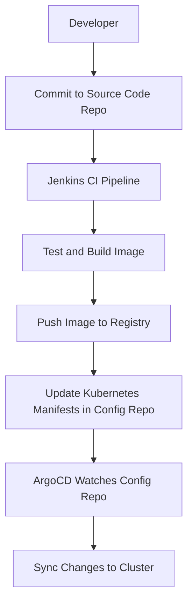

## Introduction to ArgoCD and Application Release Pipelines

### What is ArgoCD?

ArgoCD is a declarative, GitOps continuous delivery tool for Kubernetes. It allows you to manage your Kubernetes applications using Git repositories, ensuring that your cluster state is always aligned with your desired state defined in Git. This approach is known as GitOps, which emphasizes the use of Git as a single source of truth for infrastructure and application configurations.

### Why Use ArgoCD?

Using ArgoCD provides several benefits:

1. **Declarative Configuration**: You define the desired state of your applications in Git, making it easy to track changes and collaborate.
2. **Automated Deployment**: ArgoCD can automatically sync changes from Git to your Kubernetes cluster, reducing manual intervention.
3. **Version Control**: Since your configurations are stored in Git, you can easily roll back to previous versions if something goes wrong.
4. **Consistency**: Ensures that your cluster state matches the desired state, reducing drift and inconsistencies.

### How Does ArgoCD Work?

ArgoCD operates by continuously comparing the desired state of your applications (defined in Git) with the actual state of your Kubernetes cluster. If there are discrepancies, ArgoCD automatically applies the necessary changes to bring the cluster into alignment with the desired state.

#### Step-by-Step Process

1. **Deploy ArgoCD**: First, you need to install ArgoCD in your Kubernetes cluster. This can be done using `kubectl` commands or Helm charts.
2. **Configure ArgoCD**: Once installed, you configure ArgoCD to watch specific Git repositories for changes.
3. **Sync Changes**: Whenever changes are committed to the Git repository, ArgoCD detects these changes and applies them to the Kubernetes cluster.

### Example Setup

Let's walk through a complete example setup using ArgoCD.

#### Install ArgoCD

```bash
kubectl create namespace argocd
kubectl apply -n argocd -f https://raw.githubusercontent.com/argoproj/argo-cd/stable/manifests/install.yaml
```

This command creates a namespace called `argocd` and deploys the ArgoCD components into it.

#### Configure ArgoCD

Next, you need to configure ArgoCD to watch a specific Git repository. This can be done via the ArgoCD CLI or the web UI.

```bash
argocd repo add <git-repo-url> --name my-repo
```

This command adds a Git repository to ArgoCD.

#### Sync Changes

Whenever changes are pushed to the Git repository, ArgoCD will automatically detect these changes and apply them to the Kubernetes cluster.

### Separate Repositories for Source Code and Configuration

It is a best practice to maintain separate repositories for application source code and application configuration code. This separation ensures that changes to configuration files do not trigger unnecessary builds and tests of the application source code.

#### Example Repositories

- **Source Code Repository**: Contains the application source code.
- **Configuration Repository**: Contains Kubernetes manifests, such as `Deployment`, `ConfigMap`, `Secret`, `Service`, `Ingress`, etc.

### Mermaid Diagrams

Let's visualize the architecture using a Mermaid diagram.



### Real-World Examples

#### Recent Breaches and CVEs

One notable breach related to misconfigured Kubernetes clusters is the exposure of sensitive data due to improperly configured `ConfigMap` and `Secret` objects. For example, in 2021, a misconfigured Kubernetes cluster led to the exposure of sensitive data, including API keys and credentials.

### Complete Code Examples

#### Source Code Repository

Here is an example of a simple application source code repository:

```yaml
# Dockerfile
FROM node:14
WORKDIR /app
COPY package*.json ./
RUN npm install
COPY . .
CMD ["npm", "start"]
```

#### Configuration Repository

Here is an example of a Kubernetes manifest file in the configuration repository:

```yaml
# deployment.yaml
apiVersion: apps/v1
kind: Deployment
metadata:
  name: my-app
spec:
  replicas: 3
  selector:
    matchLabels:
      app: my-app
  template:
    metadata:
      labels:
        app: my-app
    spec:
      containers:
      - name: my-app
        image: my-docker-repo/my-app:latest
        ports:
        - containerPort: 8080
```

### Full HTTP Request and Response

When pushing changes to the Git repository, the following HTTP request might be sent:

```http
POST /repos/my-user/my-repo/contents/deployment.yaml HTTP/1.1
Host: api.github.com
Authorization: token <your-token>
Content-Type: application/json

{
  "message": "Update deployment.yaml",
  "content": "YXBpVHlwZTogYXBwcy92MQpraWQ6IERlcGx5ZW1vdW50Cm1ldGFkYXRhOgogIG5hbWU6IG15LWFwcApzcGVjOgogIHJlcGFyaXM6IDMKICBzZWxlY3RvcjpCIAogICAgbWF0Y2hMb2NhbHM6CiAgICAgIGFwcDogbXktYXBwCiAgdGVtcG9yZToKICAgIG1ldGFkYXRhOgogICAgICBsYWJlbHM6CiAgICAgICAgYXBwOiBteS1hcHAKICAgIHNwZWN0OgogICAgICBjb250YWlucy1wb3J0czogCiAgICAgICAgY29udGFpbmVyUG9ydDogODA4MAogICAgICAgIGltYWdlOiBteS1kb2NrZXItcmVwby9teS1hcHA6bGlrZXQ=
}
```

The corresponding HTTP response might look like this:

```http
HTTP/1.1 201 Created
Date: Tue, 01 Mar 2022 12:00:00 GMT
Content-Type: application/json; charset=utf-8

{
  "content": {
    "type": "file",
    "encoding": "base64",
    "size": 123,
    "name": "deployment.yaml",
    "path": "deployment.yaml",
    "sha": "abc123def456ghi789jk",
    "url": "https://api.github.com/repos/my-user/my-repo/contents/deployment.yaml?ref=master",
    "html_url": "https://github.com/my-user/my-repo/blob/master/deployment.yaml",
    "git_url": "https://api.github.com/repos/my-user/my-repo/git/blobs/abc1123def456ghi789jk",
    "download_url": "https://raw.githubusercontent.com/my-user/my-repo/master/deployment.yaml",
    "type": "file"
  },
  "commit": {
    "id": "abc123def456ghi789jk",
    "tree_id": "def456ghi789jkabc123",
    "distinct": true,
    "message": "Update deployment.yaml",
    "timestamp": "2022-03-01T12:00:00Z",
    "author": {
      "name": "John Doe",
      "email": "john.doe@example.com"
    },
    "committer": {
      "name": "John Doe",
      "email": "john.doe@example.com"
    }
  }
}
```

### Common Pitfalls and How to Prevent Them

#### Misconfigured Secrets

One common pitfall is accidentally committing sensitive information, such as API keys or passwords, to the Git repository. This can lead to unauthorized access to your systems.

**How to Prevent:**

1. **Use Environment Variables**: Store sensitive information in environment variables rather than hardcoding them in your application.
2. **Kubernetes Secrets**: Use Kubernetes `Secret` objects to store sensitive data securely.
3. **Git Ignore**: Add sensitive files to `.gitignore` to prevent them from being committed to the repository.

#### Example Vulnerable Code

```yaml
# deployment.yaml (vulnerable)
apiVersion: apps/v1
kind: Deployment
metadata:
  name: my-app
spec:
  replicas: 3
  selector:
    matchLabels:
      app: my-app
  template:
    metadata:
      labels:
        app: my-app
    spec:
      containers:
      - name: my-app
        image: my-docker-repo/my-app:latest
        env:
          - name: DATABASE_PASSWORD
            value: "my-secret-password"
```

#### Example Secure Code

```yaml
# deployment.yaml (secure)
apiVersion: apps/v1
kind: Deployment
metadata:
  name: my-app
spec:
  replicas: 3
  selector:
    matchLabels:
      app: my-app
  template:
    metadata:
      labels:
        app: my-app
    spec:
      containers:
      - name: my-app
        image: my-docker-repo/my-app:latest
        envFrom:
          - secretRef:
              name: my-app-secrets
```

### Detection and Prevention

#### Detection

1. **Static Analysis Tools**: Use tools like `trivy` or `kube-hunter` to scan your Git repositories and Kubernetes clusters for misconfigurations.
2. **Continuous Monitoring**: Implement continuous monitoring of your Git repositories and Kubernetes clusters to detect unauthorized changes.

#### Prevention

1. **Role-Based Access Control (RBAC)**: Implement RBAC to restrict access to sensitive resources.
2. **Least Privilege Principle**: Ensure that users and services have the minimum permissions required to perform their tasks.
3. **Regular Audits**: Conduct regular audits of your Git repositories and Kubernetes clusters to identify and remediate security issues.

### Hands-On Labs

For hands-on practice with ArgoCD and application release pipelines, consider the following labs:

- **PortSwigger Web Security Academy**: Offers interactive labs on web security, including GitOps practices.
- **OWASP Juice Shop**: Provides a vulnerable web application for practicing security testing and GitOps.
- **Kubernetes Goat**: Focuses on Kubernetes security and GitOps practices.

These labs provide practical experience in setting up and managing ArgoCD and application release pipelines.

### Conclusion

ArgoCD is a powerful tool for managing Kubernetes applications using GitOps principles. By separating source code and configuration repositories, you can ensure that changes to configuration files do not trigger unnecessary builds and tests of the application source code. Following best practices and using static analysis tools can help prevent common pitfalls and ensure the security of your applications.

---
<!-- nav -->
[[DevSecOps/DevSecOps Bootcamp/07-CI CD Security Pipeline/01-App Release Pipeline with ArgoCD/ArgoCD explained Part 1 What Why and How/02-Introduction to Argo CD|Introduction to Argo CD]] | [[DevSecOps/DevSecOps Bootcamp/07-CI CD Security Pipeline/01-App Release Pipeline with ArgoCD/ArgoCD explained Part 1 What Why and How/00-Overview|Overview]] | [[DevSecOps/DevSecOps Bootcamp/07-CI CD Security Pipeline/01-App Release Pipeline with ArgoCD/ArgoCD explained Part 1 What Why and How/04-Introduction to ArgoCD in DevSecOps|Introduction to ArgoCD in DevSecOps]]
