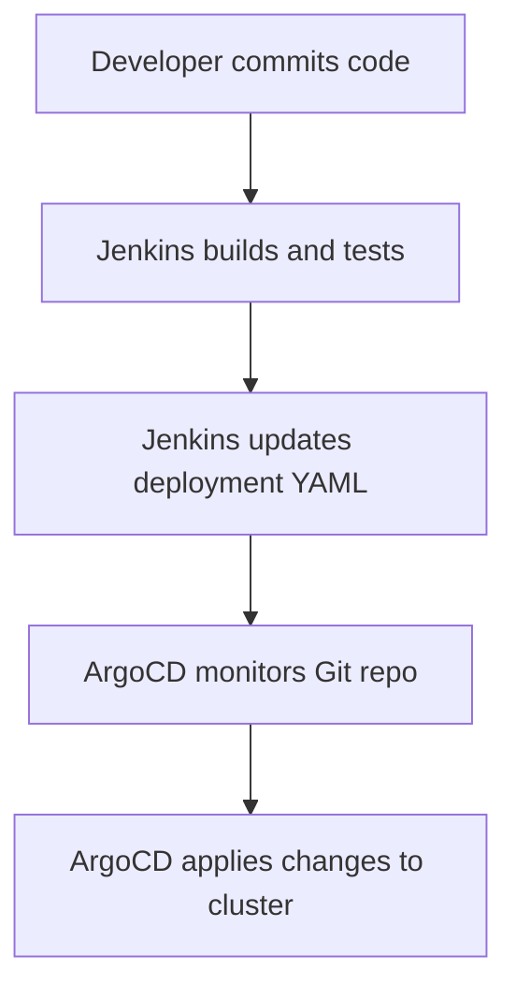
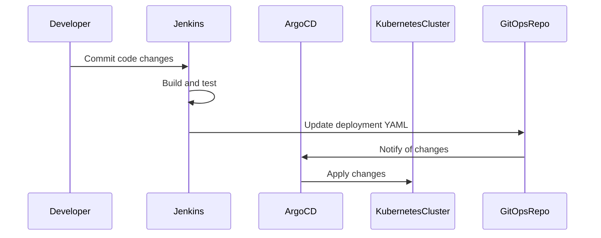

## Introduction to ArgoCD in DevSecOps

ArgoCD is a declarative, extensible, and open-source continuous delivery tool for Kubernetes applications. It allows you to manage and deploy your applications using GitOps principles, ensuring that your infrastructure and applications are version-controlled and reproducible. This chapter will delve deep into the concepts, mechanics, and practical implementation of ArgoCD in a DevSecOps context.

### What is ArgoCD?

ArgoCD is a tool that helps you manage the lifecycle of your Kubernetes applications. It operates based on the GitOps methodology, which means that your application's desired state is stored in a Git repository. ArgoCD continuously monitors this repository for changes and applies them to your Kubernetes cluster. This ensures that your cluster's actual state matches the desired state defined in Git.

#### Why Use ArgoCD?

1. **Declarative Configuration**: By storing your application's desired state in Git, you can easily track changes, revert to previous states, and collaborate with your team.
2. **Automated Deployment**: ArgoCD automates the process of deploying and updating your applications, reducing the risk of human error.
3. **Consistency and Reproducibility**: Since the desired state is version-controlled, you can ensure that your deployments are consistent across different environments.
4. **Security and Compliance**: With GitOps, you can enforce strict access controls and audit trails, making it easier to comply with security policies and regulations.

### How Does ArgoCD Work?

ArgoCD operates by continuously comparing the desired state of your applications (defined in Git) with the actual state of your Kubernetes cluster. If there are discrepancies, ArgoCD automatically applies the necessary changes to bring the cluster into alignment with the desired state.

#### Key Components of ArgoCD

1. **Application Controller**: Monitors the Git repository for changes and applies them to the Kubernetes cluster.
2. **Sync Operation**: Ensures that the cluster's actual state matches the desired state defined in Git.
3. **Sync Policy**: Defines how and when ArgoCD should sync the cluster with the Git repository.
4. **Health Checks**: Verifies that the deployed applications are functioning correctly.

### Integration with Build Pipelines

In a typical DevSecOps workflow, the build pipeline (e.g., Jenkins) is responsible for building and testing the application, while the deployment pipeline (e.g., ArgoCD) is responsible for deploying the application to the Kubernetes cluster.

#### Example Workflow

1. **Build Pipeline**:
    - Developers commit code changes to the main repository.
    - Jenkins triggers a build job to compile and test the application.
    - If the tests pass, Jenkins updates the deployment YAML file in a separate Git repository containing Kubernetes manifests.

2. **Deployment Pipeline**:
    - ArgoCD monitors the Git repository for changes.
    - As soon as the deployment YAML file is updated, ArgoCD pulls the changes and applies them to the Kubernetes cluster.



### Supported Manifest Formats

ArgoCD supports various formats for defining Kubernetes manifests:

1. **Plain YAML Files**: Simple and straightforward, suitable for small to medium-sized applications.
2. **Helm Charts**: A package manager for Kubernetes that allows you to define, install, and upgrade even the most complex Kubernetes applications.
3. **Customized Files**: You can use custom scripts or templates to generate Kubernetes YAML files dynamically.

#### Example: Using Plain YAML Files

Consider a simple deployment YAML file:

```yaml
apiVersion: apps/v1
kind: Deployment
metadata:
  name: my-app
spec:
  replicas: 3
  selector:
    matchLabels:
      app: my-app
  template:
    metadata:
      labels:
        app: my-app
    spec:
      containers:
      - name: my-app
        image: myregistry/myapp:v1.0.0
```

This file defines a deployment with three replicas of the `my-app` container. When this file is committed to the Git repository, ArgoCD will automatically apply it to the Kubernetes cluster.

#### Example: Using Helm Charts

Helm charts provide a more structured way to define and manage Kubernetes applications. Here’s an example of a simple Helm chart structure:

```
my-chart/
├── Chart.yaml
├── values.yaml
└── templates/
    └── deployment.yaml
```

The `Chart.yaml` file contains metadata about the chart, `values.yaml` contains default values, and `templates/deployment.yaml` defines the Kubernetes resources.

```yaml
# templates/deployment.yaml
apiVersion: apps/v1
kind: Deployment
metadata:
  name: {{ .Release.Name }}-deployment
spec:
  replicas: {{ .Values.replicaCount }}
  template:
    metadata:
      labels:
        app: {{ .Release.Name }}
    spec:
      containers:
      - name: {{ .Release.Name }}
        image: "{{ .Values.image.repository }}:{{ .Values.image.tag }}"
```

When this chart is committed to the Git repository, ArgoCD will automatically deploy it to the Kubernetes cluster.

### GitOps Repository

The GitOps repository is a special Git repository that stores the desired state of your Kubernetes applications. This repository is monitored by ArgoCD, which ensures that the actual state of the cluster matches the desired state.

#### Example: GitOps Repository Structure

```
gitops-repo/
├── kustomize/
│   ├── base/
│   │   └── deployment.yaml
│   └── overlays/
│       └── production/
│           └── kustomization.yaml
└── helm/
    └── my-chart/
```

In this example, the `kustomize` directory contains Kubernetes manifests managed using Kustomize, while the `helm` directory contains Helm charts.

### Continuous Delivery with ArgoCD

Continuous Delivery (CD) is the practice of releasing software in small, manageable increments. In a DevSecOps context, CD is often separated from Continuous Integration (CI), with CI being owned by developers and CD being owned by operations or DevOps teams.

#### Example: CI and CD Pipelines

1. **CI Pipeline**:
    - Managed by Jenkins.
    - Builds and tests the application.
    - Updates the deployment YAML file in the GitOps repository.

2. **CD Pipeline**:
    - Managed by ArgoCD.
    - Monitors the GitOps repository for changes.
    - Applies the changes to the Kubernetes cluster.



### Security Considerations

While ArgoCD provides many benefits, it also introduces some security risks. It is crucial to implement proper security measures to protect your GitOps repository and Kubernetes cluster.

#### Vulnerabilities and Risks

1. **Unauthorized Access**: If an attacker gains access to the GitOps repository, they could modify the desired state and compromise the entire cluster.
2. **Configuration Drift**: If the actual state of the cluster diverges from the desired state, it could lead to unexpected behavior and security vulnerabilities.
3. **Supply Chain Attacks**: If the images used in the deployment YAML files are compromised, it could lead to a supply chain attack.

#### How to Prevent / Defend

1. **Access Controls**:
    - Ensure that only authorized users have access to the GitOps repository.
    - Use SSH keys or OAuth tokens to authenticate with the GitOps repository.
    - Implement least privilege access control to limit the permissions of users and services.

2. **Audit Trails**:
    - Enable audit logs in both the GitOps repository and the Kubernetes cluster.
    - Regularly review the audit logs to detect any unauthorized changes.

3. **Immutable Infrastructure**:
    - Use immutable infrastructure to ensure that the actual state of the cluster cannot be modified outside of the GitOps process.
    - Use read-only volumes and containers to prevent accidental modifications.

4. **Image Scanning**:
    - Use tools like Trivy or Clair to scan Docker images for vulnerabilities before deploying them.
    - Integrate image scanning into the CI/CD pipeline to ensure that only secure images are deployed.

#### Example: Secure Image Scanning

Here’s an example of integrating Trivy into the CI/CD pipeline:

```yaml
# Jenkinsfile
pipeline {
    agent any
    stages {
        stage('Build') {
            steps {
                sh 'docker build -t myregistry/myapp:v1.0.0 .'
            }
        }
        stage('Test') {
            steps {
                sh 'docker run myregistry/myapp:v1.0.0 /bin/sh -c "make test"'
            }
        }
        stage('Scan') {
            steps {
                sh 'trivy image myregistry/myapp:v1.0.0'
            }
        }
        stage('Deploy') {
            steps {
                sh 'kubectl apply -f deployment.yaml'
            }
        }
    }
}
```

In this example, Trivy is used to scan the Docker image before it is deployed to the Kubernetes cluster.

### Real-World Examples

#### Recent Breaches and CVEs

1. **CVE-2021-25741**: A vulnerability in the Kubernetes API server allowed attackers to bypass authentication and gain unauthorized access to the cluster.
2. **CVE-2021-25742**: A vulnerability in the Kubernetes API server allowed attackers to execute arbitrary code on the cluster.

#### How ArgoCD Helps

By using ArgoCD, you can ensure that your cluster's actual state matches the desired state defined in Git. This reduces the risk of configuration drift and ensures that your cluster is always in a known good state.

### Practical Labs

To gain hands-on experience with ArgoCD, you can use the following labs:

1. **PortSwigger Web Security Academy**: Offers a series of labs that cover various aspects of web security, including CI/CD pipelines.
2. **OWASP Juice Shop**: A deliberately insecure web application that you can use to practice securing CI/CD pipelines.
3. **CloudGoat**: A set of labs that cover various aspects of cloud security, including CI/CD pipelines.

### Conclusion

ArgoCD is a powerful tool for managing and deploying Kubernetes applications using GitOps principles. By understanding the concepts, mechanics, and practical implementation of ArgoCD, you can ensure that your applications are consistently and securely deployed across different environments.

---
<!-- nav -->
[[DevSecOps/DevSecOps Bootcamp/07-CI CD Security Pipeline/01-App Release Pipeline with ArgoCD/ArgoCD explained Part 1 What Why and How/03-Introduction to ArgoCD and Application Release Pipelines|Introduction to ArgoCD and Application Release Pipelines]] | [[DevSecOps/DevSecOps Bootcamp/07-CI CD Security Pipeline/01-App Release Pipeline with ArgoCD/ArgoCD explained Part 1 What Why and How/00-Overview|Overview]] | [[DevSecOps/DevSecOps Bootcamp/07-CI CD Security Pipeline/01-App Release Pipeline with ArgoCD/ArgoCD explained Part 1 What Why and How/05-Introduction to Continuous Delivery Challenges in Kubernetes Environments|Introduction to Continuous Delivery Challenges in Kubernetes Environments]]
