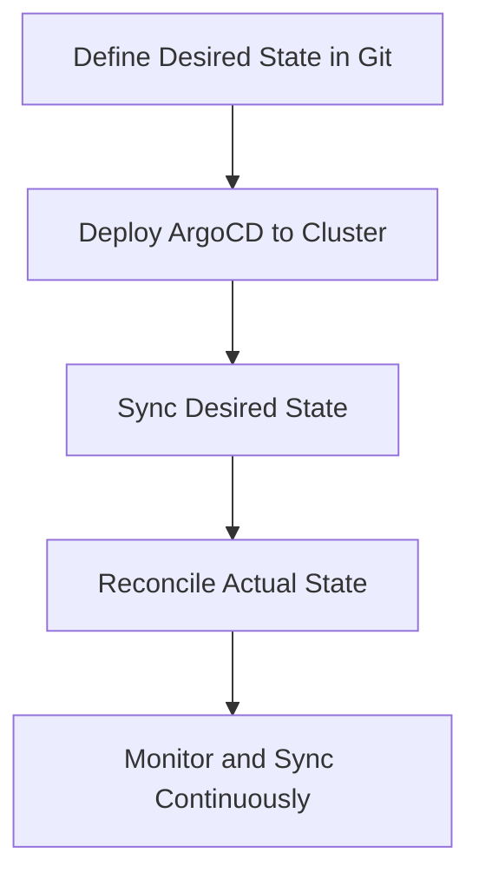

## Introduction to Continuous Delivery Challenges in Kubernetes Environments

Continuous Integration and Continuous Delivery (CI/CD) pipelines are essential components of modern software development practices. They automate the integration and delivery processes, ensuring that code changes are tested and deployed efficiently. However, when deploying applications to Kubernetes clusters, several challenges arise, particularly around visibility and control post-deployment.

### Visibility Issues Post-Deployment

One of the primary challenges in deploying applications to Kubernetes using traditional CI/CD tools like Jenkins is the lack of visibility into the deployment status after the initial deployment. Once Jenkins executes a `kubectl apply` command, it has no further insight into whether the application was successfully created, if it is running healthily, or if it encountered issues during startup. This lack of visibility can lead to undetected failures and delays in identifying and resolving issues.

#### Example Scenario

Consider a scenario where Jenkins deploys an application to a Kubernetes cluster. After executing the `kubectl apply` command, Jenkins assumes the deployment was successful. However, due to a misconfiguration or resource constraints, the application fails to start. Without proper monitoring and feedback mechanisms, this failure might go unnoticed until users report issues, leading to downtime and potential data loss.

### Traditional CI/CD Workflow Limitations

Traditional CI/CD workflows typically involve external tools like Jenkins accessing the Kubernetes cluster to deploy applications. This push-based approach has several limitations:

1. **External Access**: The CI/CD tool must have direct access to the Kubernetes cluster, which can introduce security risks and complicate network configurations.
2. **Manual Verification**: Post-deployment verification often requires additional manual steps or custom scripts to check the status of the deployed application.
3. **Inefficient Resource Utilization**: The push-based approach can lead to inefficient resource utilization within the cluster, as the CI/CD tool must manage and coordinate deployments.

### Enter ArgoCD

ArgoCD is a declarative, GitOps continuous delivery tool for Kubernetes. It addresses the challenges of traditional CI/CD workflows by reversing the flow and making the deployment process more efficient and secure.

#### Key Features of ArgoCD

1. **GitOps Principles**: ArgoCD follows GitOps principles, where the desired state of the cluster is stored in a Git repository. This allows for version control, auditability, and collaboration.
2. **Pull-Based Deployment**: Instead of pushing changes to the cluster, ArgoCD uses a pull-based approach where an agent within the cluster pulls the desired state from the Git repository and applies it.
3. **Real-Time Syncing**: ArgoCD continuously syncs the actual state of the cluster with the desired state in the Git repository, ensuring that the cluster remains in the intended state.
4. **Self-Healing Capabilities**: If the actual state deviates from the desired state, ArgoCD automatically reconciles the differences, ensuring the cluster remains stable and consistent.

### How ArgoCD Works

To understand how ArgoCD works, let's break down the workflow step-by-step:

1. **Define Desired State in Git**: The desired state of the cluster is defined in a Git repository. This includes Kubernetes manifests, Helm charts, and other configuration files.
2. **Deploy ArgoCD to Cluster**: ArgoCD is deployed as a set of Kubernetes resources within the cluster. This includes the ArgoCD server, application controller, and other components.
3. **Sync Desired State**: The ArgoCD application controller continuously monitors the Git repository for changes. When changes are detected, it pulls the updated desired state and applies it to the cluster.
4. **Reconcile Actual State**: ArgoCD compares the actual state of the cluster with the desired state and performs any necessary actions to bring the cluster into alignment with the desired state.

#### Mermaid Diagram: ArgoCD Workflow



### Real-World Examples and Recent Breaches

Recent breaches and vulnerabilities highlight the importance of robust CI/CD pipelines and the benefits of using tools like ArgoCD. For instance, the SolarWinds breach in 2020 demonstrated the risks of supply chain attacks, where malicious code was injected into software updates. In such scenarios, a tool like ArgoCD can help ensure that the desired state of the cluster is maintained and any unauthorized changes are detected and reverted.

#### Example: SolarWinds Supply Chain Attack

The SolarWinds supply chain attack involved the insertion of malicious code into software updates, which were then distributed to customers. If the affected organizations had been using ArgoCD, they could have ensured that their Kubernetes clusters remained in the intended state, reducing the risk of unauthorized changes and potential breaches.

### Implementation Steps

To implement ArgoCD in your CI/CD pipeline, follow these steps:

1. **Install ArgoCD**: Deploy ArgoCD to your Kubernetes cluster using the official Helm chart.
2. **Configure Git Repository**: Set up a Git repository to store the desired state of your cluster. This should include Kubernetes manifests and any other configuration files.
3. **Create ArgoCD Application**: Define an ArgoCD application that references the Git repository and specifies the target namespace in the cluster.
4. **Sync and Monitor**: Use ArgoCD to sync the desired state with the actual state of the cluster and monitor for any discrepancies.

#### Example Code: Deploying ArgoCD

```yaml
# Install ArgoCD using Helm
helm repo add argo https://argoproj.github.io/argo-helm
helm repo update
helm install argocd argo/argo-cd --namespace argocd --create-namespace
```

#### Example Code: Creating an ArgoCD Application

```yaml
apiVersion: argoproj.io/v1alpha1
kind: Application
metadata:
  name: my-app
spec:
  project: default
  source:
    repoURL: https://github.com/myorg/myrepo.git
    targetRevision: HEAD
    path: kubernetes
  destination:
    server: https://kubernetes.default.svc
    namespace: my-namespace
```

### Common Pitfalls and Best Practices

While ArgoCD offers significant benefits, there are several common pitfalls to avoid:

1. **Security Risks**: Ensure that the Git repository containing the desired state is properly secured and access-controlled.
2. **Configuration Drift**: Regularly review and reconcile the actual state of the cluster with the desired state to prevent configuration drift.
3. **Resource Constraints**: Monitor resource usage within the cluster to ensure that ArgoCD and other components have sufficient resources to operate effectively.

#### How to Prevent / Defend

1. **Secure Git Repository**: Use strong authentication and authorization mechanisms for the Git repository, such as SSH keys and two-factor authentication.
2. **Regular Audits**: Perform regular audits of the cluster to identify and resolve any discrepancies between the actual and desired states.
3. **Monitoring and Alerts**: Implement monitoring and alerting mechanisms to detect and respond to any issues in real-time.

#### Example: Secure Git Repository Configuration

```yaml
# Example .gitconfig for securing the Git repository
[user]
    name = Your Name
    email = your.email@example.com
[core]
    sshCommand = ssh -i ~/.ssh/id_rsa
```

### Hands-On Labs

To gain practical experience with ArgoCD, consider the following hands-on labs:

1. **PortSwigger Web Security Academy**: Offers a series of labs focused on web application security, including CI/CD pipeline security.
2. **OWASP Juice Shop**: A deliberately insecure web application for practicing web security skills, including CI/CD pipeline security.
3. **Kubernetes Goat**: A Kubernetes-focused security training platform that includes labs on deploying and managing applications using ArgoCD.

By following these steps and best practices, you can effectively integrate ArgoCD into your CI/CD pipeline, ensuring robust and secure deployment processes for your Kubernetes applications.

---
<!-- nav -->
[[DevSecOps/DevSecOps Bootcamp/07-CI CD Security Pipeline/01-App Release Pipeline with ArgoCD/ArgoCD explained Part 1 What Why and How/04-Introduction to ArgoCD in DevSecOps|Introduction to ArgoCD in DevSecOps]] | [[DevSecOps/DevSecOps Bootcamp/07-CI CD Security Pipeline/01-App Release Pipeline with ArgoCD/ArgoCD explained Part 1 What Why and How/00-Overview|Overview]] | [[DevSecOps/DevSecOps Bootcamp/07-CI CD Security Pipeline/01-App Release Pipeline with ArgoCD/ArgoCD explained Part 1 What Why and How/06-Automated CICD Pipeline with Separation of Concerns Using ArgoCD|Automated CICD Pipeline with Separation of Concerns Using ArgoCD]]
