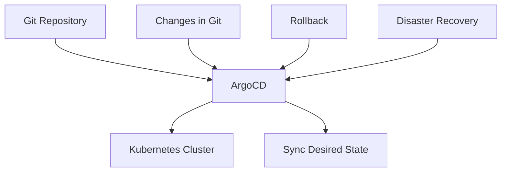

## Introduction to ArgoCD and GitOps Principles

### What is ArgoCD?

ArgoCD is a popular open-source tool that implements the GitOps workflow for continuous deployment and management of applications in Kubernetes clusters. GitOps is a set of practices that uses Git as a single source of truth for infrastructure and application configurations. By treating your infrastructure and application configurations as code, you can leverage the power of version control systems like Git to manage and deploy your applications reliably and efficiently.

### Why Use ArgoCD?

ArgoCD provides several key benefits:

1. **Automated Deployment**: Automatically syncs the desired state of your applications with the actual state in the Kubernetes cluster.
2. **Rollback Mechanism**: Easily roll back to a previous working state if something breaks during deployment.
3. **Efficient Management**: Manages thousands of clusters efficiently by using a single Git repository.
4. **Disaster Recovery**: Simplifies disaster recovery by recreating the exact state of a cluster from a Git repository.

### How Does ArgoCD Work?

ArgoCD operates based on the principle of declarative configuration management. You define the desired state of your applications and infrastructure in Git repositories. ArgoCD continuously monitors these repositories and ensures that the actual state of the Kubernetes cluster matches the desired state. If there are discrepancies, ArgoCD automatically applies the necessary changes to bring the cluster into alignment with the desired state.

### GitOps Principles

GitOps is a set of practices that extends the principles of Infrastructure as Code (IaC) to include the operational aspects of managing Kubernetes clusters. The core principles of GitOps include:

1. **Declarative Configuration**: Define the desired state of your applications and infrastructure in declarative manifests stored in Git.
2. **Version Control**: Use Git as the single source of truth for all configurations.
3. **Continuous Delivery**: Automate the process of deploying and updating applications based on changes in the Git repository.
4. **Rollback Mechanism**: Use Git history to easily roll back to a previous working state if something goes wrong.

### Example Scenario

Consider a scenario where you have a microservices-based application deployed across multiple Kubernetes clusters. Each service is defined in a Git repository, and ArgoCD is used to manage the deployment and updates of these services. If a new version of a service fails to start, you can quickly roll back to the previous working version by reverting the Git commit and letting ArgoCD apply the changes.

### Real-World Example: Recent Breaches and CVEs

One recent example of a breach that could have been mitigated with proper GitOps practices is the SolarWinds supply chain attack (CVE-2020-1014). In this case, attackers compromised the build environment of SolarWinds, injecting malicious code into their software updates. If SolarWinds had implemented GitOps principles, they would have had a more transparent and auditable process for managing their software updates, making it easier to detect and mitigate such attacks.

### Complete Example: ArgoCD Configuration

To illustrate how ArgoCD works, let's walk through a complete example of setting up and using ArgoCD.

#### Step 1: Install ArgoCD

First, you need to install ArgoCD in your Kubernetes cluster. You can do this using the following command:

```sh
kubectl create namespace argocd
kubectl apply -n argocd -f https://raw.githubusercontent.com/argoproj/argo-cd/stable/manifests/install.yaml
```

This command creates a `argocd` namespace and installs the ArgoCD components into it.

#### Step 2: Configure ArgoCD

Next, you need to configure ArgoCD to point to your Git repository. This involves creating an `Application` resource in ArgoCD that specifies the Git repository and the path to the application manifests.

Here is an example `Application` manifest:

```yaml
apiVersion: argoproj.io/v1alpha1
kind: Application
metadata:
  name: my-app
spec:
  project: default
  source:
    repoURL: https://github.com/myorg/myapp.git
    targetRevision: HEAD
    path: k8s
  destination:
    server: https://kubernetes.default.svc
    namespace: my-app
```

This manifest tells ArgoCD to watch the `myapp` repository and sync the contents of the `k8s` directory to the `my-app` namespace in the Kubernetes cluster.

#### Step 3: Apply Changes

Once the `Application` resource is created, ArgoCD will automatically sync the desired state with the actual state in the cluster. If you make changes to the application manifests in the Git repository, ArgoCD will detect these changes and apply them to the cluster.

### Rollback Mechanism

If something breaks during deployment, you can easily roll back to a previous working state by reverting the Git commit and letting ArgoCD apply the changes. Here is an example of how to perform a rollback:

1. Identify the commit hash of the previous working state.
2. Revert the Git commit to the previous state.
3. Let ArgoCD sync the changes.

Here is an example of how to revert a Git commit:

```sh
git checkout <commit-hash>
git push origin HEAD
```

### Disaster Recovery

In the event of a disaster, such as a complete failure of a Kubernetes cluster, you can easily recreate the cluster by pointing it to the Git repository where the complete cluster configuration is defined. Here is an example of how to recreate a cluster:

1. Create a new Kubernetes cluster.
2. Install ArgoCD in the new cluster.
3. Point ArgoCD to the Git repository containing the cluster configuration.
4. Let ArgoCD sync the desired state with the actual state in the new cluster.

### Mermaid Diagrams

Let's visualize the process using a mermaid diagram:



### How to Prevent / Defend

#### Detection

To detect issues in your ArgoCD setup, you can use monitoring tools like Prometheus and Grafana to monitor the health of your ArgoCD instances and the Kubernetes clusters they manage. Additionally, you can use logging tools like ELK Stack to log and analyze events related to ArgoCD operations.

#### Prevention

To prevent issues, you should follow best practices for GitOps:

1. **Use Strong Authentication**: Ensure that access to your Git repositories is properly authenticated and authorized.
2. **Regular Audits**: Regularly audit your Git repositories and ArgoCD configurations to ensure they are up-to-date and secure.
3. **Automated Testing**: Implement automated testing and validation of your application manifests before they are applied to the cluster.

#### Secure Coding Fixes

Here is an example of a vulnerable configuration and its secure counterpart:

**Vulnerable Configuration:**

```yaml
apiVersion: apps/v1
kind: Deployment
metadata:
  name: my-app
spec:
  replicas: 3
  template:
    spec:
      containers:
      - name: my-app
        image: myregistry/myapp:latest
```

**Secure Configuration:**

```yaml
apiVersion: apps/v1
kind: Deployment
metadata:
  name: my-app
spec:
  replicas: 3
  template:
    metadata:
      labels:
        app: my-app
    spec:
      containers:
      - name: my-app
        image: myregistry/myapp:v1.0.0
        securityContext:
          runAsUser: 1000
          runAsGroup: 3000
```

In the secure configuration, we specify a specific image tag (`v1.0.0`) instead of using `latest`, and we add a `securityContext` to ensure the container runs with the correct user and group permissions.

### Conclusion

By implementing GitOps principles using ArgoCD, you can achieve a more reliable and efficient deployment and management of your applications in Kubernetes clusters. The rollback mechanism and disaster recovery capabilities provided by ArgoCD make it an invaluable tool for modern DevSecOps teams.

### Practice Labs

For hands-on practice with ArgoCD and GitOps principles, consider the following labs:

- **PortSwigger Web Security Academy**: Focuses on web application security but includes modules on GitOps and CI/CD pipelines.
- **OWASP Juice Shop**: A deliberately insecure web application for practicing web security skills, including GitOps principles.
- **Kubernetes Goat**: A Kubernetes-based security training platform that includes exercises on GitOps and ArgoCD.

These labs provide practical experience in implementing and securing GitOps workflows using ArgoCD.

---
<!-- nav -->
[[DevSecOps/DevSecOps Bootcamp/07-CI CD Security Pipeline/01-App Release Pipeline with ArgoCD/ArgoCD explained Part 2 Benefits and Configuration/00-Overview|Overview]] | [[02-Introduction to ArgoCD and Its Benefits Part 1|Introduction to ArgoCD and Its Benefits Part 1]]
