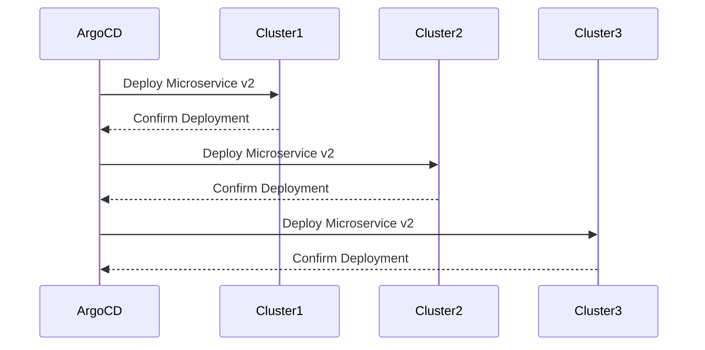

## Introduction to ArgoCD and Its Benefits

ArgoCD is an open-source declarative continuous delivery tool for Kubernetes applications. It enables automated deployment and management of applications across multiple Kubernetes clusters. The primary benefits of using ArgoCD include:

- **Centralized Management**: Administrators can manage multiple clusters from a single instance of ArgoCD.
- **Consistent Deployment**: Ensures that the same application configuration is deployed consistently across all clusters.
- **Automated Syncing**: Automatically syncs the desired state of the application with the actual state of the clusters.

### Centralized Management

In a typical multi-cluster environment, managing configurations across multiple clusters can be complex and error-prone. With ArgoCD, administrators only need to configure and manage one instance of ArgoCD, which can then be used to configure a fleet of clusters. This centralized approach simplifies management and reduces the likelihood of configuration drift.

#### Example Scenario

Consider a scenario where you have three clusters in different regions (North America, Europe, and Asia). Instead of managing each cluster individually, you can use a single ArgoCD instance to manage all three clusters. This ensures that any changes made to the application configuration are automatically propagated to all three clusters.

```mermaid
graph TD
    A[ArgoCD Instance] --> B[Cluster 1 (North America)]
    A --> C[Cluster 2 (Europe)]
    A --> D[Cluster 3 (Asia)]
```

### Consistent Deployment

ArgoCD ensures that the same application configuration is deployed consistently across all clusters. This consistency is crucial for maintaining a uniform environment across different regions or environments (development, staging, production).

#### Example Scenario

Suppose you have a microservices-based application that needs to be deployed across multiple clusters. By using ArgoCD, you can ensure that the same set of microservices is deployed consistently across all clusters, reducing the risk of inconsistencies.

```mer
graph TD
    A[ArgoCD Instance] --> B[Microservice 1]
    A --> C[Microservice 2]
    A --> D[Microservice 3]
    B --> E[Cluster 1]
    B --> F[Cluster 2]
    B --> G[Cluster 3]
    C --> H[Cluster 1]
    C --> I[Cluster 2]
    C --> J[Cluster 3]
    D --> K[Cluster 1]
    D --> L[Cluster 2]
    D --> M[Cluster 3]
```

### Automated Syncing

ArgoCD continuously monitors the desired state of the application and ensures that it matches the actual state of the clusters. If there is a discrepancy, ArgoCD automatically applies the necessary changes to bring the clusters back to the desired state.

#### Example Scenario

Consider a scenario where a new version of a microservice is deployed to the development cluster. ArgoCD will monitor the state of the microservice and ensure that it is also deployed to the staging and production clusters as needed.



---
<!-- nav -->
[[DevSecOps/DevSecOps Bootcamp/07-CI CD Security Pipeline/01-App Release Pipeline with ArgoCD/ArgoCD explained Part 2 Benefits and Configuration/01-Introduction to ArgoCD and GitOps Principles|Introduction to ArgoCD and GitOps Principles]] | [[DevSecOps/DevSecOps Bootcamp/07-CI CD Security Pipeline/01-App Release Pipeline with ArgoCD/ArgoCD explained Part 2 Benefits and Configuration/00-Overview|Overview]] | [[03-Introduction to ArgoCD and Its Benefits|Introduction to ArgoCD and Its Benefits]]
