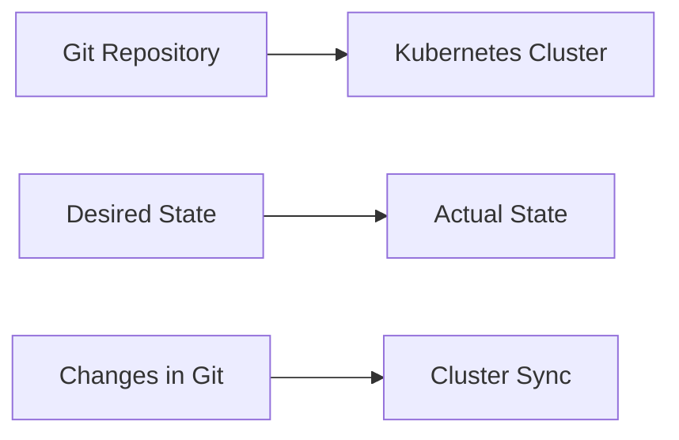
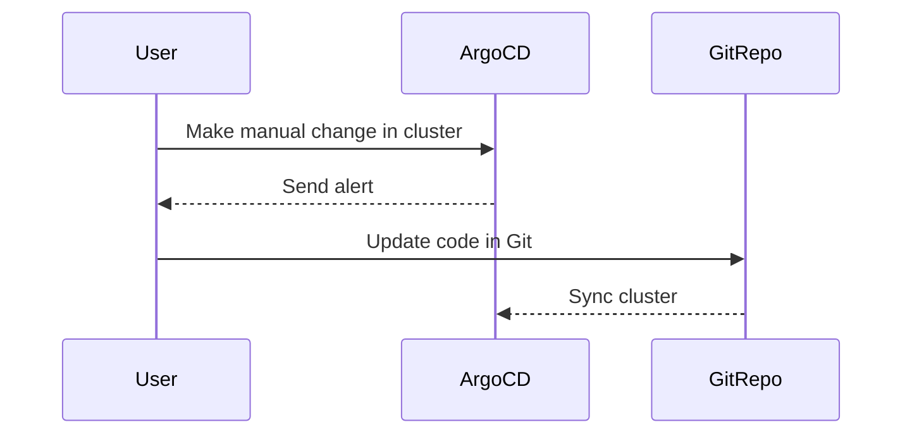
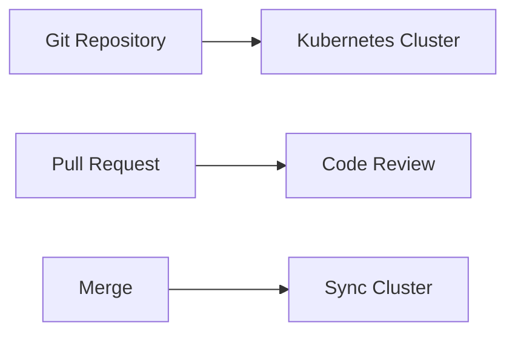
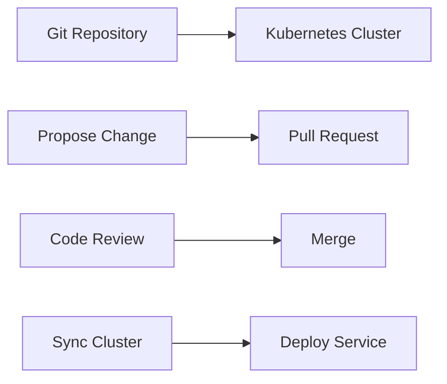
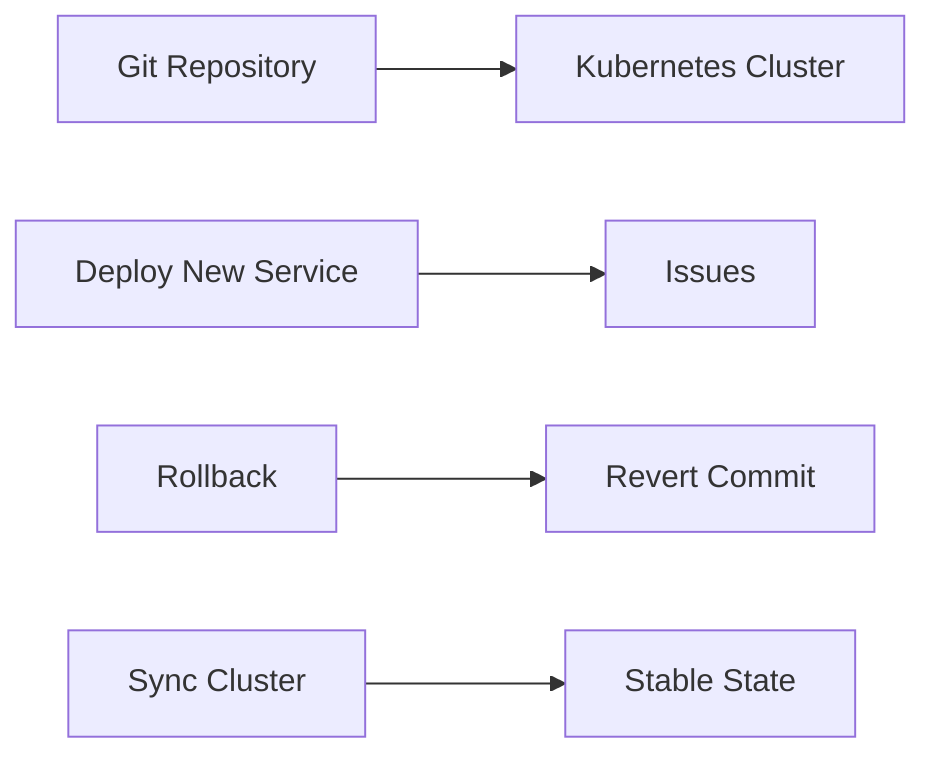
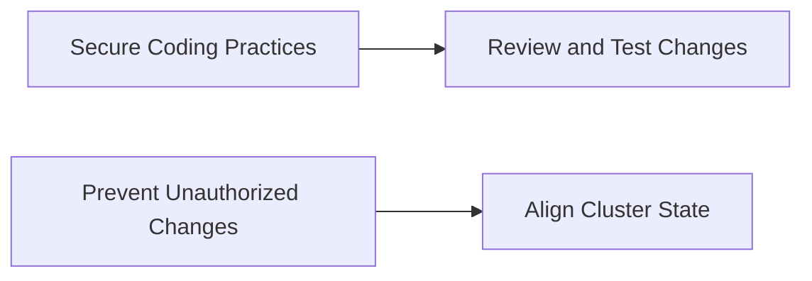
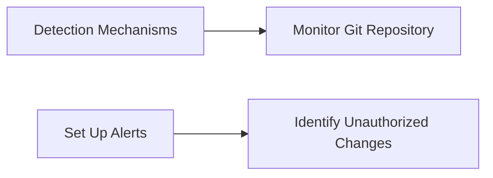
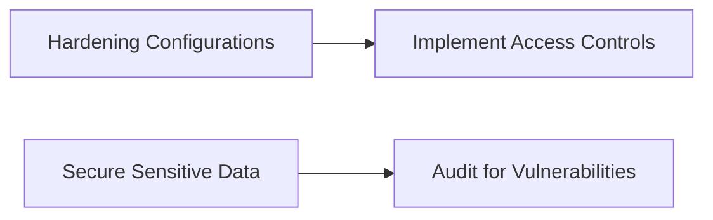
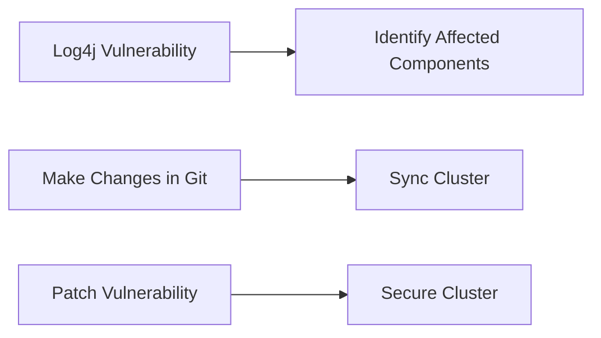

## Introduction to ArgoCD and Its Benefits

ArgoCD is a declarative, GitOps continuous delivery tool for Kubernetes. It enables you to manage your Kubernetes applications using Git repositories as the single source of truth. This approach ensures that your cluster state is always aligned with the desired state defined in your Git repository. In this section, we will delve into the benefits of using ArgoCD and how to configure it effectively.

### Single Source of Truth

One of the primary benefits of using ArgoCD is that it guarantees that your Git repository remains the single source of truth for your cluster state. This means that any changes made to the cluster must be reflected in the Git repository. This approach provides several advantages:

1. **Consistency**: Ensures that the cluster state is consistent with the desired state defined in the Git repository.
2. **Traceability**: Every change to the cluster is tracked and documented in the Git repository, providing a clear audit trail.
3. **Collaboration**: Teams can collaborate on changes to the cluster through pull requests and code reviews.

#### Example: Single Source of Truth

Consider a scenario where you have a Kubernetes cluster managing a microservices architecture. The desired state of the cluster is defined in a Git repository. Any changes to the cluster, such as deploying new services or updating configurations, must be made through the Git repository. This ensures that the cluster state is always aligned with the desired state.



### Full Transparency of the Cluster

Another significant benefit of using ArgoCD is the full transparency it provides into the cluster. Since the cluster state is defined in the Git repository, you can easily see what is deployed and how it is configured. This transparency helps in maintaining a clear understanding of the cluster state and makes it easier to troubleshoot issues.

#### Example: Full Transparency

Suppose you have a Git repository containing the Kubernetes manifests for your cluster. You can easily inspect the manifests to understand the current state of the cluster. This transparency is crucial for maintaining a healthy and stable cluster.

```yaml
# Example Kubernetes manifest in Git repository
apiVersion: apps/v1
kind: Deployment
metadata:
  name: my-app
spec:
  replicas: 3
  selector:
    matchLabels:
      app: my-app
  template:
    metadata:
      labels:
        app: my-app
    spec:
      containers:
      - name: my-app
        image: my-app:v1
```

### Adjusting to New Workflows

While the benefits of using ArgoCD are clear, it may take some time for teams to adjust to the new workflows. Some team members or engineers might need a quick way to update things in the cluster before changing them in the code. ArgoCD provides flexibility to handle such scenarios.

#### Configuring ArgoCD to Handle Manual Changes

You can configure ArgoCD to not automatically override and undo manual cluster changes. Instead, ArgoCD can send out an alert that something has changed in the cluster manually and that it needs to be updated in the code as well. This allows teams to make quick changes while ensuring that the changes are eventually reflected in the Git repository.



### Documented and Version-Controlled Changes

Using Git as a single interface for making changes in the cluster ensures that each change is documented and version-controlled. This provides a history of changes and an audit trail of who changed what in the cluster.

#### Example: Documented and Version-Controlled Changes

Consider a scenario where you have a Git repository containing the Kubernetes manifests for your cluster. Each change to the cluster is made through pull requests and code reviews. This ensures that every change is documented and version-controlled.



### Collaboration on Changes

Using Git for config files also provides a way for teams to collaborate on any changes in the cluster. Teams can propose changes in Kubernetes, discuss and work on them, and when done, merge those changes into the main branch.

#### Example: Collaboration on Changes

Suppose you have a Git repository containing the Kubernetes manifests for your cluster. A team member proposes a change to deploy a new service. The change is made through a pull request, reviewed by other team members, and merged into the main branch. This ensures that the change is properly reviewed and tested before being applied to the cluster.



### Easy Rollback

Another benefit of using Git for config files is the ease of rollback. If a change causes issues, you can easily roll back to a previous version of the config files.

#### Example: Easy Rollback

Suppose you have a Git repository containing the Kubernetes manifests for your cluster. A change is made to deploy a new service, but it causes issues. You can easily roll back to a previous version of the config files by reverting the commit in the Git repository.



### How to Prevent / Defend

To ensure the security and integrity of your cluster, it is essential to implement proper defenses and detection mechanisms.

#### Secure Coding Practices

Ensure that all changes to the cluster are made through the Git repository and that every change is properly reviewed and tested. This helps prevent unauthorized changes and ensures that the cluster state is always aligned with the desired state.



#### Detection Mechanisms

Implement detection mechanisms to identify any unauthorized changes to the cluster. This can be done by monitoring the Git repository for any unauthorized commits and by setting up alerts for any changes made outside of the Git repository.



#### Hardening Configurations

Harden the configurations of your cluster to ensure that it is secure and resilient. This includes implementing proper access controls, securing sensitive data, and regularly auditing the cluster for vulnerabilities.



### Real-World Examples

#### Recent CVEs and Breaches

Recent CVEs and breaches have highlighted the importance of using Git as a single source of truth for managing cluster state. For example, the Log4j vulnerability (CVE-2021-44228) affected many organizations that did not have proper controls in place to manage their cluster state. By using ArgoCD, organizations can ensure that their cluster state is always aligned with the desired state defined in the Git repository, reducing the risk of such vulnerabilities.

#### Real-World Example: Log4j Vulnerability

In December 2021, the Log4j vulnerability (CVE-2021-44228) was discovered, affecting many organizations worldwide. Organizations that used ArgoCD to manage their cluster state were better equipped to respond to the vulnerability. They could quickly identify and patch affected components by making changes in the Git repository and syncing the cluster.



### Practice Labs

For hands-on experience with ArgoCD, consider the following practice labs:

- **PortSwigger Web Security Academy**: Provides hands-on labs for learning web application security.
- **OWASP Juice Shop**: An intentionally insecure web application for practicing web security skills.
- **DVWA (Damn Vulnerable Web Application)**: A PHP/MySQL web application that is riddled with vulnerabilities for educational purposes.
- **WebGoat**: An interactive, gamified training application for learning about web application security.

These labs provide a practical environment for learning and applying the concepts covered in this chapter.

### Conclusion

In conclusion, ArgoCD provides several benefits for managing your Kubernetes applications, including ensuring that your Git repository remains the single source of truth for your cluster state, providing full transparency of the cluster, allowing teams to collaborate on changes, and enabling easy rollback. By implementing proper defenses and detection mechanisms, you can ensure the security and integrity of your cluster.

---
<!-- nav -->
[[02-Introduction to ArgoCD and Its Benefits Part 1|Introduction to ArgoCD and Its Benefits Part 1]] | [[DevSecOps/DevSecOps Bootcamp/07-CI CD Security Pipeline/01-App Release Pipeline with ArgoCD/ArgoCD explained Part 2 Benefits and Configuration/00-Overview|Overview]] | [[04-Introduction to ArgoCD and Its Role in DevSecOps Part 1|Introduction to ArgoCD and Its Role in DevSecOps Part 1]]
