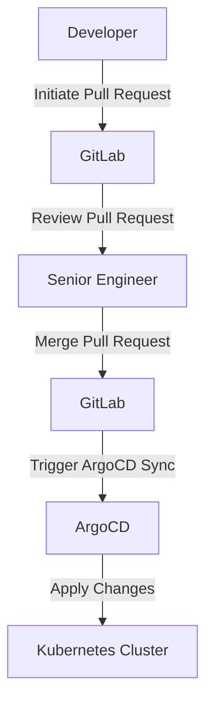
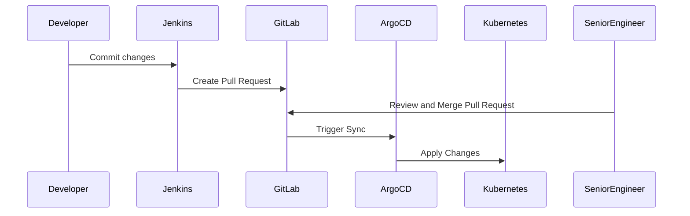

## Introduction to ArgoCD and Its Role in DevSecOps

ArgoCD is an open-source declarative continuous delivery tool for Kubernetes applications. It enables automated application lifecycle management by synchronizing the desired state of applications with the actual state in the Kubernetes cluster. This synchronization is achieved through a GitOps workflow, where the desired state of the cluster is stored in a Git repository. Any changes to the cluster are made by updating the Git repository, which triggers ArgoCD to apply these changes.

### Why Use ArgoCD?

Using ArgoCD offers several benefits:

1. **Declarative Application Management**: By storing the desired state of the cluster in a Git repository, you ensure that the cluster is always in the desired state. This approach simplifies troubleshooting and reduces the risk of drift between the desired and actual states.
   
2. **Automated Deployment**: Changes to the Git repository automatically trigger deployments, ensuring that the cluster is always up-to-date with the latest changes.
   
3. **Access Control**: You can control who can make changes to the cluster by configuring access rules to the Git repository. This ensures that only authorized personnel can make changes, reducing the risk of unauthorized modifications.

4. **Non-Human User Access Management**: With ArgoCD running inside the cluster, external tools like Jenkins do not need direct access to the cluster. This simplifies security management and reduces the attack surface.

### GitOps Workflow

GitOps is a set of practices that uses Git as a single source of truth for infrastructure and application deployment. In a GitOps workflow, the desired state of the system is defined in Git, and any changes to the system are made by modifying the Git repository. This approach ensures that the system is always in the desired state and provides a clear audit trail of changes.

#### Key Components of GitOps

1. **Git Repository**: The Git repository stores the desired state of the system. This includes Kubernetes manifests, configuration files, and other resources.
   
2. **Continuous Integration/Continuous Deployment (CI/CD)**: A CI/CD pipeline is used to build and test changes to the system. Once the changes pass the tests, they are committed to the Git repository.
   
3. **Deployment Tool**: A deployment tool like ArgoCD is used to synchronize the actual state of the system with the desired state in the Git repository.

### Access Control in GitOps

Access control is crucial in a GitOps workflow to ensure that only authorized personnel can make changes to the system. This is typically achieved by configuring access rules to the Git repository.

#### Configuring Access Rules in GitLab

GitLab is a popular Git repository platform that supports fine-grained access control. You can configure access rules to the repository to control who can make changes.



In this setup:

- **Developers** can initiate pull requests to propose changes to the cluster.
- **Senior Engineers** review and merge these pull requests.
- **ArgoCD** syncs the changes from the Git repository to the Kubernetes cluster.

#### Example Configuration in GitLab

To configure access rules in GitLab, you can use the `protected branches` feature. This feature allows you to protect specific branches from being modified by unauthorized users.

```yaml
# .gitlab-ci.yml
stages:
  - build
  - test
  - deploy

build_job:
  stage: build
  script:
    - echo "Building the application"

test_job:
  stage: test
  script:
    - echo "Running tests"

deploy_job:
  stage: deploy
  script:
    - echo "Deploying to Kubernetes"
  only:
    - master
```

In this example, the `deploy_job` is only triggered when changes are pushed to the `master` branch. To protect the `master` branch, you can configure it as a protected branch in GitLab.

### Non-Human User Access Management

In addition to human user access, ArgoCD also simplifies access management for non-human users like CI/CD tools. These tools do not need direct access to the cluster because ArgoCD runs inside the cluster and applies changes on behalf of these tools.

#### Example: Jenkins Integration

Jenkins is a popular CI/CD tool that can be integrated with ArgoCD. Instead of giving Jenkins direct access to the cluster, you can configure Jenkins to trigger ArgoCD to apply changes.



In this setup:

- **Developer** commits changes to the Git repository.
- **Jenkins** creates a pull request in GitLab.
- **Senior Engineer** reviews and merges the pull request.
- **GitLab** triggers ArgoCD to sync the changes.
- **ArgoCD** applies the changes to the Kubernetes cluster.

### Real-World Examples and Recent Breaches

Recent breaches have highlighted the importance of proper access control and non-human user access management. For example, the SolarWinds breach in 2020 involved attackers gaining access to the SolarWinds network and deploying malicious software. Proper access control and non-human user access management could have prevented this breach.

#### SolarWinds Breach

The SolarWinds breach involved attackers gaining access to the SolarWinds network and deploying malicious software. This breach could have been prevented by implementing proper access control and non-human user access management.

### How to Prevent / Defend

#### Detection

To detect unauthorized changes to the cluster, you can use monitoring tools like Prometheus and Grafana. These tools can alert you to any unexpected changes to the cluster.

#### Prevention

To prevent unauthorized changes to the cluster, you can implement the following measures:

1. **Fine-Grained Access Control**: Configure fine-grained access control to the Git repository to ensure that only authorized personnel can make changes.
   
2. **Non-Human User Access Management**: Ensure that non-human users like CI/CD tools do not have direct access to the cluster. Instead, use a deployment tool like ArgoCD to apply changes on behalf of these tools.

#### Secure Coding Fixes

To demonstrate secure coding practices, let's compare a vulnerable configuration with a secure configuration.

##### Vulnerable Configuration

```yaml
# Vulnerable .gitlab-ci.yml
stages:
  - build
  - test
  - deploy

build_job:
  stage: build
  script:
    - echo "Building the application"

test_job:
  stage: test
  script:
    - echo "Running tests"

deploy_job:
  stage: deploy
  script:
    - echo "Deploying to Kubernetes"
  only:
    - master
```

In this configuration, the `deploy_job` is only triggered when changes are pushed to the `master` branch. However, the `master` branch is not protected, allowing unauthorized users to make changes.

##### Secure Configuration

```yaml
# Secure .gitlab-ci.yml
stages:
  - build
  - test
  - deploy

build_job:
  stage: build
  script:
    - echo "Building the application"

test_job:
  stage: test
  script:
    - echo "Running tests"

deploy_job:
  stage: deploy
  script:
    - echo "Deploying to Kubernetes"
  only:
    - master
```

In this configuration, the `master` branch is protected, ensuring that only authorized users can make changes.

### Conclusion

ArgoCD is a powerful tool for automating application lifecycle management in a Kubernetes cluster. By using a GitOps workflow, you can ensure that the cluster is always in the desired state and simplify access management. Proper access control and non-human user access management are crucial to preventing unauthorized changes to the cluster.

### Practice Labs

For hands-on experience with ArgoCD, consider the following practice labs:

- **PortSwigger Web Security Academy**: Offers a variety of labs focused on web application security, including GitOps workflows.
- **OWASP Juice Shop**: A deliberately insecure web application for practicing web security skills.
- **DVWA (Damn Vulnerable Web Application)**: A PHP/MySQL web application that is riddled with vulnerabilities for educational purposes.
- **WebGoat**: An interactive, gamified training application for learning about web application security.

These labs provide a practical way to learn and apply the concepts covered in this chapter.

---
<!-- nav -->
[[03-Introduction to ArgoCD and Its Benefits|Introduction to ArgoCD and Its Benefits]] | [[DevSecOps/DevSecOps Bootcamp/07-CI CD Security Pipeline/01-App Release Pipeline with ArgoCD/ArgoCD explained Part 2 Benefits and Configuration/00-Overview|Overview]] | [[05-Introduction to ArgoCD and Its Role in DevSecOps Part 2|Introduction to ArgoCD and Its Role in DevSecOps Part 2]]
