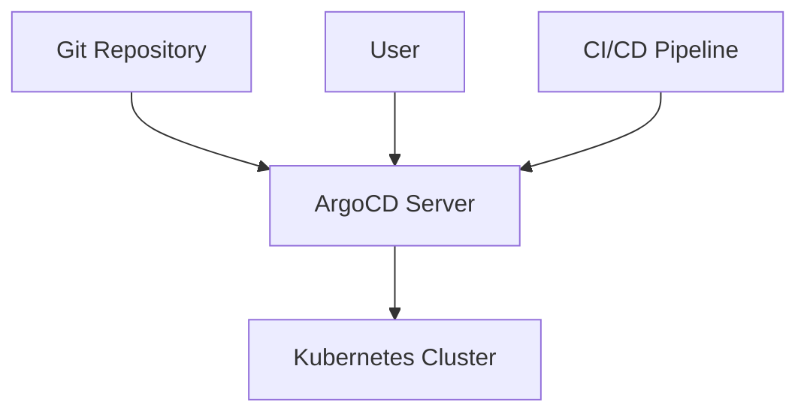

## Introduction to ArgoCD and Its Role in DevSecOps

ArgoCD is an open-source declarative continuous delivery tool for Kubernetes. It enables you to manage your applications in a GitOps way, ensuring that your application's desired state is always reflected in your Kubernetes cluster. This chapter will delve deep into the benefits and configuration of ArgoCD, focusing on how it can help maintain consistency between your Git repository and your Kubernetes cluster.

### What is ArgoCD?

ArgoCD is a tool that allows you to manage your Kubernetes applications using Git as the single source of truth. It provides a way to declaratively define your application's desired state and automatically synchronize it with the actual state in your Kubernetes cluster. This ensures that your applications are always in the correct state, reducing the risk of human error and maintaining consistency across environments.

#### Why Use ArgoCD?

ArgoCD offers several key benefits:

1. **Declarative Application Management**: You can define your application's desired state in a declarative manner using YAML files stored in a Git repository. This makes it easier to manage and understand the state of your applications.
   
2. **Automated Synchronization**: ArgoCD continuously monitors both the Git repository and the Kubernetes cluster. If it detects any divergence between the two, it automatically synchronizes the cluster to match the desired state defined in the Git repository.

3. **Consistency Across Environments**: By using Git as the single source of truth, ArgoCD ensures that your applications are consistent across different environments (development, staging, production).

4. **Security and Compliance**: ArgoCD integrates well with other tools and practices in the DevSecOps pipeline, such as CI/CD pipelines and security scanning tools. This helps ensure that your applications meet security and compliance requirements.

### How Does ArgoCD Work?

ArgoCD operates based on the principle of GitOps, which involves using Git as the single source of truth for your infrastructure and applications. Here’s a step-by-step breakdown of how ArgoCD works:

1. **Define Desired State in Git**: You define the desired state of your applications in YAML files stored in a Git repository. These YAML files describe the resources (deployments, services, etc.) that should exist in your Kubernetes cluster.

2. **Sync with Kubernetes Cluster**: ArgoCD continuously monitors both the Git repository and the Kubernetes cluster. If it detects any changes in the Git repository or the cluster, it compares the two states.

3. **Detect Divergence**: If ArgoCD detects that the desired state defined in the Git repository does not match the actual state in the Kubernetes cluster, it identifies the divergence.

4. **Sync Changes**: ArgoCD automatically synchronizes the cluster to match the desired state defined in the Git repository. This ensures that the cluster always reflects the latest changes made in the Git repository.

### Real-World Example: CVE-2021-20225

A real-world example of the importance of maintaining consistency between the Git repository and the Kubernetes cluster is the CVE-2021-20225, which affected the Kubernetes API server. This vulnerability allowed attackers to bypass authentication and authorization mechanisms, leading to unauthorized access to the cluster.

In this scenario, if an attacker managed to make unauthorized changes to the cluster, ArgoCD would detect these changes and automatically revert them to the desired state defined in the Git repository. This helps mitigate the risk of unauthorized changes and ensures that the cluster remains in a secure state.

### Detailed Configuration of ArgoCD

To configure ArgoCD, you need to set up a Git repository and install ArgoCD in your Kubernetes cluster. Here’s a detailed step-by-step guide:

1. **Set Up Git Repository**:
    - Create a new Git repository to store your application's desired state.
    - Define your application's resources in YAML files within this repository.

2. **Install ArgoCD**:
    - Install ArgoCD in your Kubernetes cluster using the following commands:
      ```sh
      kubectl create namespace argocd
      kubectl apply -n argocd -f https://raw.githubusercontent.com/argoproj/argo-cd/stable/manifests/install.yaml
      ```

3. **Configure ArgoCD**:
    - Configure ArgoCD to watch your Git repository and synchronize changes with the Kubernetes cluster.
    - Set up the necessary RBAC (Role-Based Access Control) rules to grant ArgoCD the required permissions.

4. **Sync Applications**:
    - Use ArgoCD to sync your applications with the Kubernetes cluster.
    - Monitor the synchronization process and resolve any issues that arise.

### Mermaid Diagram: ArgoCD Architecture

Here’s a mermaid diagram illustrating the architecture of ArgoCD:



### Full Raw HTTP Messages

When interacting with ArgoCD, you might send HTTP requests to the ArgoCD API. Here’s an example of a full raw HTTP request and response:

#### Request

```http
POST /api/v1/session HTTP/1.1
Host: argocd.example.com
Content-Type: application/json

{
  "username": "admin",
  "password": "admin123"
}
```

#### Response

```http
HTTP/1.1 200 OK
Content-Type: application/json

{
  "token": "eyJhbGciOiJIUzI1NiIsInR5cCI6IkpXVCJ9..."
}
```

### Common Pitfalls and How to Avoid Them

#### Manual Changes in the Cluster

One common pitfall is making manual changes to the cluster outside of the Git repository. This can lead to divergence between the desired state and the actual state, causing issues with synchronization.

**How to Prevent / Defend**

1. **Educate Team Members**: Ensure that all team members understand the importance of using GitOps and avoid making manual changes to the cluster.
   
2. **Strict Access Controls**: Implement strict access controls to limit who can make changes to the cluster. Use RBAC to restrict permissions to only those who need them.

3. **Monitoring and Alerts**: Set up monitoring and alerts to detect any unauthorized changes to the cluster. Use tools like Prometheus and Grafana to monitor the cluster and alert on any anomalies.

### Secure Coding Fixes

Here’s an example of a vulnerable pattern and the corresponding secure coding fix:

#### Vulnerable Pattern

```yaml
# deployment.yaml
apiVersion: apps/v1
kind: Deployment
metadata:
  name: my-app
spec:
  replicas: 3
  template:
    spec:
      containers:
      - name: my-container
        image: my-image:latest
```

#### Secure Coding Fix

```yaml
# deployment.yaml
apiVersion: apps/v1
kind: Deployment
metadata:
  name: my-app
spec:
  replicas: 3
  template:
    metadata:
      labels:
        app: my-app
    spec:
      containers:
      - name: my-container
        image: my-image:latest
        securityContext:
          runAsNonRoot: true
          allowPrivilegeEscalation: false
```

### Complete Example: Full Policy/Config File

Here’s an example of a complete ArgoCD configuration file:

#### ArgoCD Config

```yaml
# argocd-config.yaml
apiVersion: v1
kind: ConfigMap
metadata:
  name: argocd-cm
  namespace: argocd
data:
  repoServer: "https://github.com/myorg/myrepo.git"
  syncPolicy: |
    {
      "automated": {
        "prune": true,
        "selfHeal": true
      },
      "syncOptions": [
        "CreateNamespace=true",
        "PruneResources=true"
      ]
    }
```

### Expected Result/Output

When you apply the above configuration, ArgoCD will automatically sync the specified Git repository with the Kubernetes cluster. The output will confirm that the configuration has been applied successfully.

### Practice Labs

For hands-on practice with ArgoCD, consider the following labs:

- **PortSwigger Web Security Academy**: Offers a comprehensive set of labs covering various aspects of web security, including GitOps and continuous delivery.
- **OWASP Juice Shop**: A deliberately insecure web application for security training. It includes scenarios where you can practice setting up and managing applications using ArgoCD.
- **Kubernetes Goat**: A hands-on lab for learning Kubernetes security. It includes exercises where you can practice setting up and managing applications using ArgoCD.

By following this detailed guide, you will gain a comprehensive understanding of how to use ArgoCD effectively in your DevSecOps pipeline, ensuring consistency and security across your applications.

---
<!-- nav -->
[[05-Introduction to ArgoCD and Its Role in DevSecOps Part 2|Introduction to ArgoCD and Its Role in DevSecOps Part 2]] | [[DevSecOps/DevSecOps Bootcamp/07-CI CD Security Pipeline/01-App Release Pipeline with ArgoCD/ArgoCD explained Part 2 Benefits and Configuration/00-Overview|Overview]] | [[07-Introduction to ArgoCD Part 1|Introduction to ArgoCD Part 1]]
