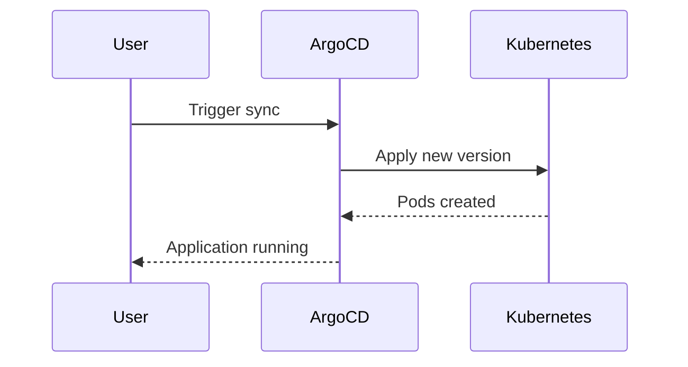

## Introduction to ArgoCD

ArgoCD is a declarative, GitOps continuous delivery tool for Kubernetes. It provides a robust way to manage and automate the deployment of applications in a Kubernetes cluster. Unlike traditional CI/CD tools such as Jenkins, which operate outside the Kubernetes cluster, ArgoCD is designed to be tightly integrated within the Kubernetes environment. This integration offers several advantages, including enhanced visibility and real-time monitoring capabilities.

### What is GitOps?

GitOps is a methodology for managing infrastructure and applications using Git as the single source of truth. In a GitOps workflow, the desired state of the system is stored in a Git repository, and any changes to the system are made by updating the Git repository. This approach ensures that the system is always in sync with the desired state, and it provides a clear audit trail of all changes.

### Why Use ArgoCD?

ArgoCD leverages the Kubernetes API and integrates with the Kubernetes cluster to provide real-time visibility and monitoring. This is a significant advantage over tools like Jenkins, which typically run outside the cluster and may not have the same level of visibility into the cluster's state.

#### Key Benefits of ArgoCD

1. **Real-Time Monitoring**: ArgoCD can monitor the state of the cluster in real-time, providing immediate feedback on the status of deployments and configurations.
2. **Declarative Management**: By using Git as the source of truth, ArgoCD ensures that the desired state of the cluster is always up-to-date and consistent.
3. **Automated Rollbacks**: If a deployment fails, ArgoCD can automatically roll back to a previous stable state, ensuring minimal downtime.
4. **Integration with Kubernetes**: ArgoCD is built on top of Kubernetes, making it easier to integrate with other Kubernetes tools and services.

### How Does ArgoCD Work?

ArgoCD operates by continuously comparing the desired state of the cluster (stored in a Git repository) with the actual state of the cluster. This comparison is done using Kubernetes controllers, which monitor the cluster and ensure that the actual state matches the desired state.

#### Components of ArgoCD

1. **Application Controller**: Manages the synchronization between the desired state and the actual state.
2. **Sync Operation**: Compares the desired state with the actual state and applies any necessary changes.
3. **UI**: Provides a user interface for monitoring and managing deployments.

### Example Setup

Let's walk through an example setup of ArgoCD in a Kubernetes cluster.

#### Step 1: Install ArgoCD

First, install ArgoCD in your Kubernetes cluster. You can use the following Helm chart to install ArgoCD:

```yaml
# argocd-install.yaml
apiVersion: v2
type: application
name: argocd
description: Install ArgoCD
dependencies:
- name: argocd
  version: 1.7.12
  repository: https://argoproj.github.io/argo-helm
```

Apply the Helm chart using `kubectl`:

```sh
helm upgrade --install argocd argocd/argocd -n argocd --create-namespace -f argocd-install.yaml
```

#### Step 2: Configure Git Repository

Next, configure a Git repository to store the desired state of your cluster. For example, you might have a repository with the following structure:

```
my-cluster/
├── app1/
│   └── kustomization.yaml
├── app2/
│   └── kustomization.yaml
└── kustomization.yaml
```

Each directory contains Kubernetes manifests that define the desired state of the corresponding application.

#### Step 3: Sync with ArgoCD

Use ArgoCD to sync the Git repository with the Kubernetes cluster. You can do this via the ArgoCD CLI or the UI.

```sh
argocd app create my-app --repo https://github.com/myorg/my-cluster.git --path app1 --dest-server https://kubernetes.default.svc --dest-namespace default
```

This command creates an ArgoCD application that syncs the `app1` directory in the Git repository with the `default` namespace in the Kubernetes cluster.

### Real-Time Monitoring

One of the key benefits of ArgoCD is its ability to provide real-time monitoring of the cluster state. When you deploy a new application version, ArgoCD can immediately show you the status of the deployment.

#### Example Deployment

Suppose you have a new version of an application that you want to deploy. You update the Git repository with the new version and trigger a sync operation in ArgoCD.

```sh
git commit -am "Update app1 to version 2.0"
git push origin master
```

In the ArgoCD UI, you can see the real-time status of the deployment:



### Visibility and Monitoring

ArgoCD provides detailed visibility into the cluster state, allowing you to monitor the status of deployments and configurations in real-time. This is particularly useful for detecting issues and performing rollbacks.

#### Example Monitoring

When you deploy a new version of an application, ArgoCD can show you the status of the deployment in real-time. For example, you might see the following output in the ArgoCD UI:

```sh
Application 'my-app' is in 'Synced' state.
Pods:
- app1-pod-1: Running
- app1-pod-2: Running
```

If the deployment fails, ArgoCD can automatically roll back to a previous stable state.

### Comparison with Jenkins

While Jenkins can also be deployed in a Kubernetes cluster, it does not have the same level of visibility and monitoring capabilities as ArgoCD. Jenkins typically runs outside the cluster and relies on external tools for monitoring and managing the cluster state.

#### Example Jenkins Deployment

To deploy Jenkins in a Kubernetes cluster, you would typically use a Helm chart:

```yaml
# jenkins-install.yaml
apiVersion: v2
type: application
name: jenkins
description: Install Jenkins
dependencies:
- name: jenkins
  version: 3.5.1
  repository: https://charts.helm.sh/stable
```

Apply the Helm chart using `kubectl`:

```sh
helm upgrade --install jenkins jenkins/jenkins -n jenkins --create-namespace -f jenkins-install.yaml
```

However, Jenkins does not provide the same level of real-time monitoring and visibility as ArgoCD.

### Real-World Examples

#### Recent CVEs and Breaches

Recent vulnerabilities and breaches have highlighted the importance of robust monitoring and management tools like ArgoCD. For example, the Log4j vulnerability (CVE-2021-44228) affected many organizations, and having a tool like ArgoCD could have helped in quickly identifying and mitigating the issue.

#### Example Vulnerability

Suppose an organization uses ArgoCD to manage their Kubernetes cluster. They discover a vulnerability in one of their applications and need to quickly deploy a patch. With ArgoCD, they can:

1. Update the Git repository with the patched application.
2. Trigger a sync operation in ArgoCD.
3. Monitor the deployment in real-time to ensure it is successful.

Without ArgoCD, the organization might have to manually deploy the patch and monitor the cluster using external tools, which could introduce delays and increase the risk of errors.

### How to Prevent / Defend

#### Detection

To detect issues in your ArgoCD-managed cluster, you can use the following strategies:

1. **Monitoring**: Use ArgoCD's built-in monitoring capabilities to track the status of deployments and configurations.
2. **Alerting**: Set up alerts in ArgoCD to notify you of any issues or failures.
3. **Logging**: Enable logging in ArgoCD to capture detailed information about deployments and operations.

#### Prevention

To prevent issues in your ArgoCD-managed cluster, you can:

1. **Secure Git Repository**: Ensure that your Git repository is secure and only accessible to authorized users.
2. **Automated Testing**: Implement automated testing in your CI/CD pipeline to catch issues before they are deployed.
3. **Regular Audits**: Regularly audit your ArgoCD configuration and Git repository to ensure they are up-to-date and secure.

#### Secure Coding Fixes

Here is an example of a vulnerable configuration and a secure configuration:

**Vulnerable Configuration**

```yaml
# insecure-kustomization.yaml
resources:
- deployment.yaml
patchesStrategicMerge:
- patch.yaml
```

**Secure Configuration**

```yaml
# secure-kustomization.yaml
resources:
- deployment.yaml
patchesStrategicMerge:
- patch.yaml
configMapGenerator:
- name: secure-config
  literals:
  - secretKey=secureValue
```

In the secure configuration, we add a `configMapGenerator` to securely store sensitive information.

### Conclusion

ArgoCD is a powerful tool for managing and automating the deployment of applications in a Kubernetes cluster. Its tight integration with Kubernetes provides real-time visibility and monitoring capabilities, making it an excellent choice for modern DevSecOps workflows. By leveraging ArgoCD, you can ensure that your cluster is always in sync with the desired state and that any issues are quickly identified and resolved.

### Practice Labs

For hands-on practice with ArgoCD, consider the following labs:

- **PortSwigger Web Security Academy**: Offers a variety of labs focused on web application security, including some that involve Kubernetes and CI/CD pipelines.
- **OWASP Juice Shop**: A deliberately insecure web application for practicing web security skills, which can be deployed using ArgoCD.
- **Kubernetes Goat**: A Kubernetes-based security training platform that includes exercises for deploying and managing applications using ArgoCD.

These labs will help you gain practical experience with ArgoCD and its integration with Kubernetes.

---
<!-- nav -->
[[07-Introduction to ArgoCD Part 1|Introduction to ArgoCD Part 1]] | [[DevSecOps/DevSecOps Bootcamp/07-CI CD Security Pipeline/01-App Release Pipeline with ArgoCD/ArgoCD explained Part 2 Benefits and Configuration/00-Overview|Overview]] | [[09-Introduction to GitOps and ArgoCD Part 1|Introduction to GitOps and ArgoCD Part 1]]
