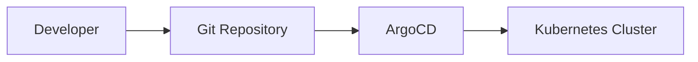
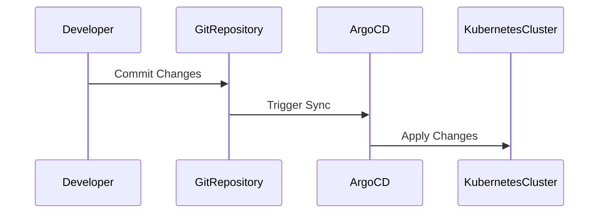

## Introduction to GitOps and ArgoCD

### What is GitOps?

GitOps is a methodology for managing infrastructure and applications using Git repositories as the single source of truth. This approach leverages the power of version control systems to manage the state of your infrastructure and applications, ensuring that all changes are tracked, reviewed, and deployed in a consistent and reliable manner.

#### Why GitOps?

The primary benefits of GitOps include:

1. **Version Control**: All changes to your infrastructure and applications are stored in a Git repository, allowing you to track the history of changes, revert to previous states, and collaborate effectively.
2. **Auditability**: Every change is recorded, making it easy to audit who made what changes and when.
3. **Consistency**: By defining your infrastructure as code, you ensure that the same configurations are applied consistently across different environments.
4. **Automation**: GitOps enables automated deployment pipelines, reducing the risk of human error and speeding up the release process.

### What is ArgoCD?

ArgoCD is an open-source declarative continuous delivery tool for Kubernetes. It is designed to simplify the deployment and management of applications in a GitOps workflow. ArgoCD allows you to define your desired state in a Git repository and automatically syncs that state with your Kubernetes clusters.

#### Key Features of ArgoCD

- **Declarative Deployment**: Define your application's desired state in a Git repository, and ArgoCD will ensure that the actual state matches the desired state.
- **Multi-Cluster Management**: Manage multiple Kubernetes clusters from a single dashboard.
- **Syncing Mechanism**: Automatically syncs the desired state with the actual state of the cluster.
- **Rollback and Rollout**: Easily roll back to previous versions or roll out new changes.
- **Web UI and CLI**: Provides both a web-based user interface and a command-line interface for managing deployments.

### Benefits of Using GitOps with ArgoCD

#### Centralized Configuration Management

One of the key benefits of using GitOps with ArgoCD is centralized configuration management. Instead of having engineers manually execute scripts or run `kubectl apply` or `helm install` commands, all changes are made through the Git repository. This ensures that everyone uses the same interface to make changes, reducing the risk of inconsistencies and errors.



#### Secure Access Management

Another significant benefit is the ability to enforce secure access management. In many projects, engineers have direct access to the Kubernetes cluster and can make changes without proper authorization. This can lead to unauthorized modifications and potential security risks. By using GitOps with ArgoCD, you can configure secure access management to ensure that only authorized personnel can make changes to the cluster.



### Real-World Example: Recent Breaches and CVEs

Recent breaches and CVEs highlight the importance of secure access management and centralized configuration management. For example, the SolarWinds breach (CVE-2020-1014) involved unauthorized access to the company's update servers, leading to widespread compromise of customer networks. By using GitOps with ArgoCD, organizations can mitigate such risks by ensuring that all changes are tracked and authorized through a centralized Git repository.

### Detailed Configuration and Setup

To illustrate the setup and configuration of ArgoCD, let's walk through a detailed example. We'll start by setting up a Git repository, then configure ArgoCD to sync with the repository and apply changes to a Kubernetes cluster.

#### Step 1: Set Up a Git Repository

First, create a Git repository to store your Kubernetes manifests. You can use any Git hosting service like GitHub, GitLab, or Bitbucket.

```bash
git init my-k8s-config
cd my-k8s-config
touch README.md
git add .
git commit -m "Initial commit"
```

#### Step 2: Create Kubernetes Manifests

Next, create Kubernetes manifests for your application. For example, let's create a simple deployment and service manifest.

```yaml
# deployment.yaml
apiVersion: apps/v1
kind: Deployment
metadata:
  name: my-app
spec:
  replicas: 3
  selector:
    matchLabels:
      app: my-app
  template:
    metadata:
      labels:
        app: my-app
    spec:
      containers:
      - name: my-app
        image: my-app:v1
        ports:
        - containerPort: 80

# service.yaml
apiVersion: v1
kind: Service
metadata:
  name: my-app-service
spec:
  selector:
    app: my-app
  ports:
    - protocol: TCP
      port: 80
      targetPort: 80
  type: LoadBalancer
```

Commit these files to your Git repository.

```bash
git add deployment.yaml service.yaml
git commit -m "Add Kubernetes manifests"
```

#### Step 3: Install ArgoCD

Install ArgoCD in your Kubernetes cluster. You can use the official Helm chart for this purpose.

```bash
helm repo add argo https://argoproj.github.io/argo-helm
helm repo update
helm install argocd argo/argo-cd --namespace argocd --create-namespace
```

#### Step 4: Configure ArgoCD

Once ArgoCD is installed, configure it to sync with your Git repository. First, log in to the ArgoCD server.

```bash
kubectl port-forward svc/argocd-server -n argocd 8080:443
```

Open your browser and navigate to `https://localhost:8080`. Follow the prompts to set up your initial password.

Next, create an ArgoCD application that points to your Git repository.

```bash
argocd app create my-app \
  --repo https://github.com/yourusername/my-k8s-config.git \
  --path . \
  --dest-server https://kubernetes.default.svc \
  --dest-namespace default
```

#### Step 5: Sync and Deploy

ArgoCD will automatically sync the desired state from your Git repository with the actual state of your Kubernetes cluster. You can monitor the status of the sync process using the ArgoCD dashboard or CLI.

```bash
argocd app get my-app
```

### Pitfalls and Common Mistakes

While GitOps with ArgoCD offers numerous benefits, there are several pitfalls and common mistakes to avoid:

1. **Inconsistent Configurations**: Ensure that all configurations are consistent across different environments. Use environment-specific variables and templates to manage differences.
2. **Manual Overrides**: Avoid manual overrides of the desired state. Any changes should be made through the Git repository to maintain consistency.
3. **Security Risks**: Ensure that secure access management is properly configured. Limit access to the Git repository and Kubernetes cluster to only authorized personnel.
4. **Complexity**: Managing a large number of applications and environments can become complex. Use tools like ArgoCD to simplify the management process.

### How to Prevent / Defend

#### Detection

To detect unauthorized changes, you can use tools like ArgoCD's built-in monitoring and alerting features. Additionally, you can set up Git hooks to trigger notifications or automated checks whenever changes are pushed to the repository.

#### Prevention

To prevent unauthorized changes, configure secure access management for both the Git repository and the Kubernetes cluster. Use role-based access control (RBAC) to limit permissions and ensure that only authorized personnel can make changes.

#### Secure Coding Fixes

Here's an example of how to implement secure coding practices with ArgoCD:

**Vulnerable Code**

```yaml
# deployment.yaml
apiVersion: apps/v1
kind: Deployment
metadata:
  name: my-app
spec:
  replicas: 3
  selector:
    matchLabels:
      app: my-app
  template:
    metadata:
      labels:
        app: my-app
    spec:
      containers:
      - name: my-app
        image: my-app:v1
        ports:
        - containerPort: 80
```

**Secure Code**

```yaml
# deployment.yaml
apiVersion: apps/v1
kind: Deployment
metadata:
  name: my-app
spec:
  replicas: 3
  selector:
    matchLabels:
      app: my-app
  template:
    metadata:
      labels:
        app: my-app
    spec:
      containers:
      - name: my-app
        image: my-app:v1
        ports:
        - containerPort: 80
        securityContext:
          runAsUser: 1000
          runAsGroup: 3000
          readOnlyRootFilesystem: true
```

#### Configuration Hardening

To harden your ArgoCD configuration, follow these best practices:

1. **Enable TLS**: Ensure that all communication between ArgoCD and the Git repository is encrypted using TLS.
2. **Use RBAC**: Configure role-based access control to limit permissions and ensure that only authorized personnel can make changes.
3. **Regular Audits**: Regularly audit your Git repository and Kubernetes cluster to detect and prevent unauthorized changes.

### Conclusion

Using GitOps with ArgoCD provides numerous benefits, including centralized configuration management, secure access management, and automation. By following best practices and implementing secure coding practices, you can ensure that your infrastructure and applications are managed securely and consistently.

### Practice Labs

For hands-on practice with GitOps and ArgoCD, consider the following labs:

- **PortSwigger Web Security Academy**: Offers a variety of labs focused on web application security.
- **OWASP Juice Shop**: A deliberately insecure web application for practicing web security skills.
- **DVWA (Damn Vulnerable Web Application)**: A PHP/MySQL web application that contains numerous security vulnerabilities.
- **CloudGoat**: A series of labs focused on cloud security, including GitOps and ArgoCD.
- **flaws.cloud**: A cloud-native security training platform that includes labs on GitOps and ArgoCD.

By completing these labs, you can gain practical experience with GitOps and ArgoCD, reinforcing the concepts learned in this chapter.

---
<!-- nav -->
[[09-Introduction to GitOps and ArgoCD Part 1|Introduction to GitOps and ArgoCD Part 1]] | [[DevSecOps/DevSecOps Bootcamp/07-CI CD Security Pipeline/01-App Release Pipeline with ArgoCD/ArgoCD explained Part 2 Benefits and Configuration/00-Overview|Overview]] | [[11-Multiple Cluster Environments|Multiple Cluster Environments]]
