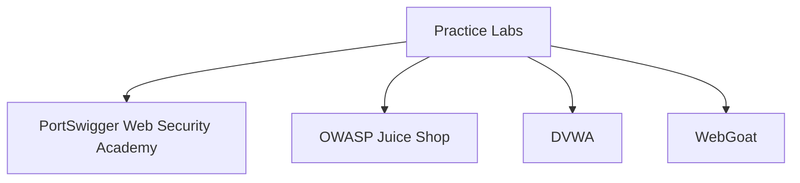

## Multiple Cluster Environments

In a typical DevSecOps pipeline, there are often multiple environments such as development, staging, and production. Each environment may have its own cluster replicas. Managing these environments requires careful consideration to ensure that changes are tested and validated before being promoted to the next environment.

### Development, Staging, and Production Environments

Let's consider a scenario where we have three environments: development, staging, and production. Each environment may have its own cluster replicas. In this case, we may deploy and run an ArgoCD instance in each environment, but we still have one repository where the cluster configuration is defined.

#### Example Scenario

Suppose we have a microservices-based application that needs to be deployed across multiple environments. We can use a single Git repository to define the cluster configuration for all environments. However, we do not want to deploy the same configuration to all environments at once. Instead, we need to test the changes first in the development environment, then promote them to the staging environment, and finally to the production environment.

```mermaid
graph TD
    A[Git Repository] --> B[Development Environment]
    A --> C[Staging Environment]
    A --> D[Production Environment]
    B --> E[Cluster 1 (Development)]
    B --> F[Cluster 2 (Development)]
    C --> G[Cluster 1 (Staging)]
    C --> H[Cluster 2 (Staging)]
    D --> I[Cluster 1 (Production)]
    D --> J[Cluster 2 (Production)]
```

### Promoting Changes Across Environments

To achieve the promotion of changes across environments, we have two main options:

1. **Using Multiple Branches in Git Repository**
2. **Using Feature Flags**

#### Using Multiple Branches in Git Repository

One common approach is to use multiple branches in the Git repository for each environment. For example, you could have `development`, `staging`, and `production` branches. However, this approach has several drawbacks:

- **Complexity**: Managing multiple branches can become complex and error-prone.
- **Merge Conflicts**: Frequent merges between branches can lead to merge conflicts.
- **Manual Promotion**: Manually promoting changes from one branch to another can be time-consuming and prone to errors.

##### Example Scenario

Suppose we have a microservices-based application that needs to be deployed across multiple environments. We can use multiple branches in the Git repository to define the cluster configuration for each environment.

```yaml
# development.yaml
apiVersion: apps/v1
kind: Deployment
metadata:
  name: my-microservice
spec:
  replicas: 3
  template:
    spec:
      containers:
      - name: my-microservice
        image: my-microservice:v1
```

```yaml
# staging.yaml
apiVersion: apps/v1
kind: Deployment
metadata:
  name: my-microservice
spec:
  replicas: 3
  template:
    spec:
      containers:
      - name: my-microservice
        image: my-microservice:v2
```

```yaml
# production.yaml
apiVersion: apps/v1
kind: Deployment
metadata:
  name: my-microservice
spec:
  replicas: 3
  template:
    spec:
      containers:
      - name: my-microservice
        image: my-microservice:v2
```

However, this approach has several drawbacks. Managing multiple branches can become complex and error-prone. Frequent merges between branches can lead to merge conflicts. Manually promoting changes from one branch to another can be time-consuming and prone to errors.

#### Using Feature Flags

A better approach is to use feature flags to control the deployment of changes across environments. Feature flags allow you to enable or disable specific features based on the environment. This approach provides more flexibility and reduces the complexity of managing multiple branches.

##### Example Scenario

Suppose we have a microservices-based application that needs to be deployed across multiple environments. We can use feature flags to control the deployment of changes across environments.

```yaml
# deployment.yaml
apiVersion: apps/v1
kind: Deployment
metadata:
  name: my-microservice
spec:
  replicas: 3
  template:
    spec:
      containers:
      - name: my-microservice
        image: my-microservice:v2
        env:
        - name: FEATURE_FLAG
          value: "true"
```

By using feature flags, we can control the deployment of changes across environments without the need for multiple branches. This approach provides more flexibility and reduces the complexity of managing multiple branches.

### How to Prevent / Defend

To ensure the security and reliability of your ArgoCD setup, it is important to follow best practices and implement proper security measures.

#### Secure Configuration Management

Ensure that your Git repository is properly secured and access-controlled. Use SSH keys or HTTPS with credentials to authenticate with the Git repository. Limit access to the repository to only authorized personnel.

##### Example Scenario

Suppose we have a microservices-based application that needs to be deployed across multiple environments. We can use SSH keys to authenticate with the Git repository.

```sh
ssh-keygen -t rsa -b 4096 -C "your_email@example.com"
cat ~/.ssh/id_rsa.pub
```

Add the public key to the Git repository and use the private key to authenticate with the repository.

```sh
git clone git@github.com:username/repository.git
```

#### Secure ArgoCD Installation

Ensure that your ArgoCD installation is properly secured. Use TLS encryption for communication between ArgoCD and the clusters. Limit access to the ArgoCD API to only authorized personnel.

##### Example Scenario

Suppose we have a microservices-based application that needs to be deployed across multiple environments. We can use TLS encryption for communication between ArgoCD and the clusters.

```yaml
apiVersion: v1
kind: Secret
metadata:
  name: argocd-tls
type: Opaque
data:
  tls.crt: <base64-encoded-certificate>
  tls.key: <base64-encoded-private-key>
```

Use the secret to configure TLS encryption for communication between ArgoCD and the clusters.

```yaml
apiVersion: v1
kind: ConfigMap
metadata:
  name: argocd-cm
data:
  server.insecure: "false"
  server.tls.crt: <base64-encoded-certificate>
  server.tls.key: <base64-encoded-private-key>
```

#### Secure Application Deployment

Ensure that your application deployment is properly secured. Use image scanning tools to scan Docker images for vulnerabilities. Use pod security policies to enforce security policies at the pod level.

##### Example Scenario

Suppose we have a microservices-based application that needs to be deployed across multiple environments. We can use image scanning tools to scan Docker images for vulnerabilities.

```sh
trivy image my-microservice:v2
```

Use pod security policies to enforce security policies at the pod level.

```yaml
apiVersion: policy/v1beta1
kind: PodSecurityPolicy
metadata:
  name: my-pod-security-policy
spec:
  privileged: false
  readOnlyRootFilesystem: true
  allowedCapabilities:
  - NET_BIND_SERVICE
  - SYS_ADMIN
```

### Real-World Examples

#### Recent CVEs and Breaches

Recent CVEs and breaches have highlighted the importance of securing your ArgoCD setup. For example, CVE-2021-20225 was a critical vulnerability in ArgoCD that allowed attackers to gain unauthorized access to the ArgoCD API. This vulnerability was exploited in several high-profile breaches, including the SolarWinds breach.

##### Example Scenario

Suppose we have a microservices-based application that needs to be deployed across multiple environments. We can use the latest version of ArgoCD to mitigate the risk of CVE-2021-20225.

```sh
kubectl apply -f https://raw.githubusercontent.com/argoproj/argo-cd/stable/manifests/install.yaml
```

Use the latest version of ArgoCD to mitigate the risk of CVE-2021-20225.

#### Recent Breaches

Recent breaches have highlighted the importance of securing your ArgoCD setup. For example, the SolarWinds breach was a high-profile breach that affected several organizations. The breach was caused by a vulnerability in the SolarWinds Orion software, which was exploited by attackers to gain unauthorized access to the software.

##### Example Scenario

Suppose we have a microservices-based application that needs to be deployed across multiple environments. We can use the latest version of ArgoCD to mitigate the risk of similar breaches.

```sh
kubectl apply -f https://raw.githubusercontent.com/argoproj/argo-cd/stable/manifests/install.yaml
```

Use the latest version of ArgoCD to mitigate the risk of similar breaches.

### Practice Labs

To practice and reinforce your understanding of ArgoCD, you can use the following labs:

- **PortSwigger Web Security Academy**: Provides hands-on labs for web application security.
- **OWASP Juice Shop**: Provides a vulnerable web application for practicing web application security.
- **DVWA**: Provides a vulnerable web application for practicing web application security.
- **WebGoat**: Provides a vulnerable web application for practicing web application security.

These labs provide a practical way to reinforce your understanding of ArgoCD and its benefits.



By following these best practices and implementing proper security measures, you can ensure the security and reliability of your ArgoCD setup.

---
<!-- nav -->
[[10-Introduction to GitOps and ArgoCD|Introduction to GitOps and ArgoCD]] | [[DevSecOps/DevSecOps Bootcamp/07-CI CD Security Pipeline/01-App Release Pipeline with ArgoCD/ArgoCD explained Part 2 Benefits and Configuration/00-Overview|Overview]] | [[12-Overlays and Customization in ArgoCD|Overlays and Customization in ArgoCD]]
