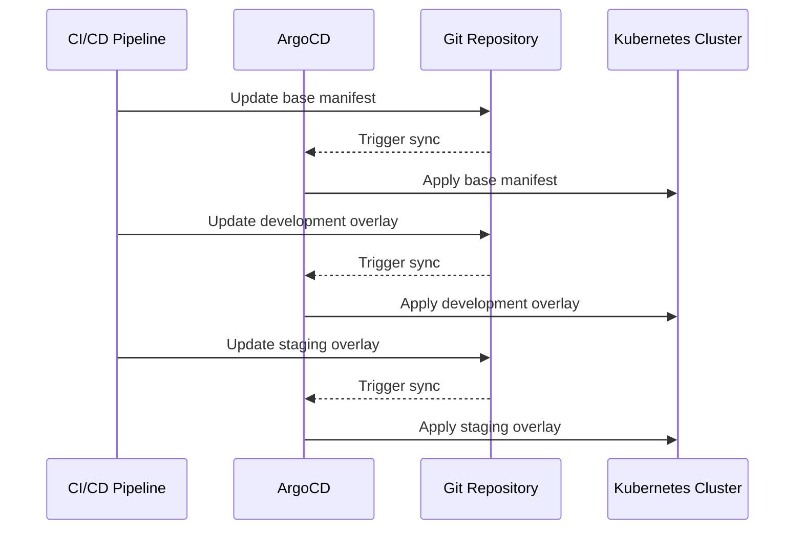

## Overlays and Customization in ArgoCD

### What Are Overlays?

Overlays are a powerful feature in ArgoCD that allow you to customize your Kubernetes manifests for different environments without duplicating code. Essentially, an overlay is a set of modifications applied to a base manifest. This approach enables you to maintain a single source of truth for your application's configuration while allowing for environment-specific customizations.

#### Why Use Overlays?

Using overlays offers several key benefits:

1. **Code Reusability**: You can reuse the same base YAML files across multiple environments, reducing redundancy and making maintenance easier.
2. **Environment-Specific Customizations**: You can tailor configurations for specific environments (development, staging, production) without altering the base files.
3. **Automation and Streamlining**: Overlays facilitate automation by enabling CI/CD pipelines to update templates in their respective overlays, ensuring consistency and reducing manual errors.

#### How Do Overlays Work?

Overlays work by applying a set of rules or patches to the base YAML files. These rules can modify various aspects of the configuration, such as environment variables, resource limits, or even entire sections of the manifest.

For example, consider a simple `Deployment` manifest:

```yaml
apiVersion: apps/v1
kind: Deployment
metadata:
  name: my-app
spec:
  replicas: 3
  selector:
    matchLabels:
      app: my-app
  template:
    metadata:
      labels:
        app: my-app
    spec:
      containers:
      - name: my-app
        image: my-app:v1
        ports:
        - containerPort: 8080
```

To create an overlay for the development environment, you might modify the number of replicas and the image tag:

```yaml
apiVersion: apps/v1
kind: Deployment
metadata:
  name: my-app
spec:
  replicas: 1
  template:
    spec:
      containers:
      - name: my-app
        image: my-app:dev
```

In this case, the overlay reduces the number of replicas to 1 and updates the image tag to `my-app:dev`.

### Automating and Streamlining Changes with Overlays

By using overlays, you can automate the process of updating your application's configuration across different environments. For instance, the development CI pipeline can update the template in the development overlay, while the staging CI pipeline can update the template in the staging overlay.

Here’s a step-by-step example of how this might work:

1. **Base Manifest**: Store the base manifest in a Git repository.
2. **Development Overlay**: Create an overlay for the development environment.
3. **Staging Overlay**: Create an overlay for the staging environment.
4. **CI/CD Integration**: Configure your CI/CD pipeline to apply the appropriate overlay based on the environment.

For example, a GitLab CI/CD pipeline might look like this:

```yaml
stages:
  - deploy

deploy_to_dev:
  stage: deploy
  script:
    - argocd app set my-app --env dev --overlay ./overlays/dev
    - argocd app sync my-app

deploy_to_staging:
  stage: deploy
  script:
    - argocd app set my-app --env staging --overlay ./overlays/staging
    - argocd app sync my
```

This pipeline sets up ArgoCD to apply the appropriate overlay for each environment and then synchronizes the application.

### Benefits of GitOps Workflow and ArgoCD

GitOps is a methodology that uses Git as a single source of truth for infrastructure and application deployments. ArgoCD is a popular tool that implements GitOps principles for Kubernetes applications.

#### Key Benefits of GitOps and ArgoCD

1. **Version Control**: All changes to the infrastructure and applications are tracked in Git, providing a complete history and audit trail.
2. **Declarative Infrastructure**: Infrastructure is defined declaratively, making it easier to manage and understand.
3. **Automated Syncing**: ArgoCD automatically reconciles the desired state (defined in Git) with the actual state of the cluster.
4. **Rollback Mechanism**: In case of issues, you can easily roll back to a previous version by reverting the Git commit.

### Does ArgoCD Replace Jenkins or GitLab CI/CD?

While ArgoCD is a powerful tool for managing Kubernetes applications, it does not replace Jenkins or GitLab CI/CD. Instead, it complements these tools by focusing on the deployment and management of applications in a GitOps manner.

#### Role of CI/CD Pipelines

CI/CD pipelines are still necessary for building, testing, and deploying application code. Tools like Jenkins and GitLab CI/CD handle tasks such as:

- Building Docker images
- Running unit tests
- Performing static code analysis
- Deploying artifacts to a registry

ArgoCD, on the other hand, focuses on deploying and managing these artifacts in a Kubernetes cluster according to the GitOps principles.

#### Example Workflow

Here’s an example of how a typical workflow might look:

1. **Build and Test**: A CI/CD pipeline builds the Docker image and runs tests.
2. **Push to Registry**: The built image is pushed to a container registry.
3. **Update Git Repository**: The CI/CD pipeline updates the Git repository with the new image tag.
4. **Sync with ArgoCD**: ArgoCD detects the change in the Git repository and applies the updated configuration to the Kubernetes cluster.

### Alternatives to ArgoCD

While ArgoCD is a popular choice for GitOps in Kubernetes, there are several alternatives available. One of the most popular alternatives is Flux CD.

#### Flux CD

Flux CD is another open-source tool that implements GitOps principles for Kubernetes. Like ArgoCD, Flux CD allows you to manage your Kubernetes cluster using Git as the single source of truth.

#### Comparison with ArgoCD

Both ArgoCD and Flux CD offer similar features, but they have some differences:

- **Architecture**: Flux CD uses a Git repository as the source of truth and a controller to reconcile the desired state with the actual state. ArgoCD uses a similar approach but has additional features like support for Helm charts and custom resources.
- **Ease of Use**: Both tools are relatively easy to use, but ArgoCD might have a slight edge due to its user-friendly UI and extensive documentation.

### GitOps Tooling Beyond ArgoCD

While ArgoCD is a popular choice for GitOps in Kubernetes, it is important to note that GitOps is not limited to Kubernetes. Other platforms and tools also implement GitOps principles.

#### Example: Terraform and GitOps

Terraform is a popular tool for infrastructure as code (IaC). While it is not a GitOps tool per se, it can be used in conjunction with GitOps principles. For example, you can use Terraform to define your infrastructure in Git and use a tool like ArgoCD to manage the deployment of this infrastructure.

### Real-World Examples and Breaches

While ArgoCD itself has not been the subject of major breaches, there have been instances where misconfigurations or vulnerabilities in Git repositories have led to security issues. For example, a misconfigured `.gitignore` file might accidentally expose sensitive information.

#### Example: Exposed Secrets in Git

In 2021, a breach occurred where a developer accidentally committed a file containing API keys and secrets to a public Git repository. This exposed sensitive information to anyone who could access the repository.

#### How to Prevent / Defend

To prevent such issues, you should follow these best practices:

1. **Use Secure Environments**: Ensure that sensitive information is stored securely and is not included in your Git repository.
2. **Regular Audits**: Regularly audit your Git repositories to ensure that no sensitive information is exposed.
3. **Secure Configurations**: Use tools like `git-secrets` to scan your Git repository for sensitive information and prevent accidental commits.

### Complete Example with Code and Diagrams

Let’s walk through a complete example of setting up ArgoCD with overlays and automating the deployment process.

#### Base Manifest

First, let’s define a base manifest for our application:

```yaml
# base/deployment.yaml
apiVersion: apps/v1
kind: Deployment
metadata:
  name: my-app
spec:
  replicas: 3
  selector:
    matchLabels:
      app: my-app
  template:
    metadata:
      labels:
        app: my-app
    spec:
      containers:
      - name: my-app
        image: my-app:v1
        ports:
        - containerPort: 8080
```

#### Development Overlay

Next, let’s create an overlay for the development environment:

```yaml
# overlays/dev/deployment.yaml
apiVersion: apps/v1
kind: Deployment
metadata:
  name: my-app
spec:
  replicas: 1
  template:
    spec:
      containers:
      - name: my-app
        image: my-app:dev
```

#### Staging Overlay

Similarly, let’s create an overlay for the staging environment:

```yaml
# overlays/staging/deployment.yaml
apiVersion: apps/v1
kind: Deployment
metadata:
  name: my-app
spec:
  replicas: 
  template:
    spec:
      containers:
      - name: my-app
        image: my-app:staging
```

#### CI/CD Pipeline

Now, let’s set up a CI/CD pipeline to automate the deployment process:

```yaml
# .gitlab-ci.yml
stages:
  - deploy

deploy_to_dev:
  stage: deploy
  script:
    - argocd app set my-app --env dev --overlay ./overlays/dev
    - argocd app sync my-app

deploy_to_staging:
  stage: deploy
  script:
    - argocd app set my-app --env staging --overlay ./overlays/staging
    - argocd app sync my-app
```

#### Mermaid Diagram

Here’s a mermaid diagram illustrating the workflow:



### Common Pitfalls and Best Practices

When working with ArgoCD and overlays, there are several common pitfalls to avoid:

1. **Misconfiguration**: Ensure that your overlays are correctly configured and do not override critical settings.
2. **Security**: Avoid committing sensitive information to your Git repository.
3. **Testing**: Thoroughly test your overlays in a non-production environment before deploying them to production.

### Conclusion

ArgoCD is a powerful tool for implementing GitOps principles in Kubernetes. By using overlays, you can automate and streamline the deployment process across different environments. However, it is important to remember that ArgoCD complements, rather than replaces, traditional CI/CD tools. Additionally, there are several alternatives to ArgoCD, such as Flux CD, that also implement GitOps principles.

### Practice Labs

To gain hands-on experience with ArgoCD and GitOps, consider the following practice labs:

- **PortSwigger Web Security Academy**: Focuses on web application security but includes modules on CI/CD pipelines and GitOps.
- **OWASP Juice Shop**: A deliberately insecure web application for practicing web security skills, including CI/CD and GitOps.
- **Kubernetes Goat**: A hands-on lab for learning Kubernetes security, including GitOps and ArgoCD.

These labs provide practical experience in setting up and managing GitOps workflows with ArgoCD and other tools.

---
<!-- nav -->
[[11-Multiple Cluster Environments|Multiple Cluster Environments]] | [[DevSecOps/DevSecOps Bootcamp/07-CI CD Security Pipeline/01-App Release Pipeline with ArgoCD/ArgoCD explained Part 2 Benefits and Configuration/00-Overview|Overview]] | [[DevSecOps/DevSecOps Bootcamp/07-CI CD Security Pipeline/01-App Release Pipeline with ArgoCD/ArgoCD explained Part 2 Benefits and Configuration/13-Practice Questions & Answers|Practice Questions & Answers]]
