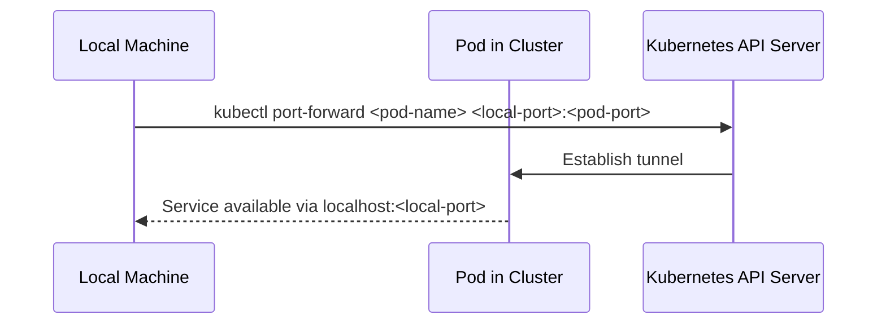

## Introduction to ArgoCD Deployment

ArgoCD is a declarative, GitOps continuous delivery tool for Kubernetes. It enables you to manage your applications in a consistent and repeatable manner by leveraging Git repositories as the single source of truth for your application configurations. This chapter will delve into configuring ArgoCD within Infrastructure as Code (IaC) and deploying it in a Kubernetes cluster. We'll cover the default internal service deployment, the importance of keeping it internal, and how to enable temporary access for troubleshooting purposes.

### Default Internal Service Deployment

By default, ArgoCD is deployed as an internal service within the Kubernetes cluster. This means it is not exposed externally through a load balancer or any other external mechanism. This default configuration is suitable for many use cases where exposing the ArgoCD application via a public URL is not desired. Only individuals with direct access to the cluster can interact with ArgoCD directly.

#### Why Keep ArgoCD Internal?

Keeping ArgoCD internal provides several benefits:

1. **Security**: Exposing ArgoCD externally increases the attack surface. By keeping it internal, you reduce the risk of unauthorized access.
2. **Control**: Internal access ensures that only authorized personnel can interact with ArgoCD, maintaining strict control over who can manage and deploy applications.
3. **Simplicity**: An internal deployment simplifies the setup and management of ArgoCD, as it does not require additional networking configurations for external exposure.

### Temporary Access for Troubleshooting

While the default internal deployment is secure, there may be times when a Kubernetes administrator needs to access the ArgoCD UI temporarily from their local environment. This could be for troubleshooting purposes or to verify that the connection with the repository has been established correctly.

To achieve this, we need to grant the necessary permissions to the Kubernetes admin. Specifically, we need to allow the `cluster-admin` role to perform port forwarding, which creates a temporary proxy from the local machine to the internal service within the cluster.

#### How Port Forwarding Works

Port forwarding allows you to create a tunnel between your local machine and a pod within the Kubernetes cluster. This is achieved using the `kubectl port-forward` command. Here’s a detailed breakdown of how it works:

1. **Command Execution**: The `kubectl port-forward` command is executed on the local machine.
2. **Tunnel Creation**: A tunnel is created between the local machine and the specified pod within the cluster.
3. **Temporary Proxy**: The internal service becomes accessible via `localhost` on the local machine for the duration of the port forwarding session.



### Granting Permissions for Port Forwarding

To enable port forwarding, we need to explicitly add the necessary permissions to the `cluster-admin` role. This involves modifying the role definition to include the `create` action for the `portforward` resource.

#### Role Definition

Here’s an example of how to modify the `cluster-admin` role to include the `portforward` resource:

```yaml
apiVersion: rbac.authorization.k8s.io/v1
kind: ClusterRole
metadata:
  name: cluster-admin
rules:
- apiGroups: [""]
  resources: ["nodes", "nodes/proxy", "secrets", "configmaps", "serviceaccounts"]
  verbs: ["get", "list", "watch", "create", "update", "patch", "delete"]
- apiGroups: ["*"]
  resources: ["*"]
  verbs: ["get", "list", "watch", "create", "update", "patch", "delete"]
- apiGroups: [""]
  resources: ["pods/log", "pods/exec", "pods/attach", "pods/portforward"]
  verbs: ["create"]
```

In this example, the `pods/portforward` resource is added with the `create` verb, allowing the `cluster-admin` role to perform port forwarding.

### Full Example of Port Forwarding

Let’s walk through a complete example of setting up port forwarding for ArgoCD.

#### Step 1: Apply the Modified Role

First, apply the modified `ClusterRole` to the cluster:

```sh
kubectl apply -f cluster-role.yaml
```

#### Step 2: Execute Port Forwarding Command

Next, execute the `kubectl port-forward` command to create the tunnel:

```sh
kubectl port-forward svc/argocd-server 8080:80
```

This command forwards traffic from `localhost:8080` on the local machine to port `80` of the `argocd-server` service within the cluster.

#### Step 3: Access ArgoCD UI

Once the port forwarding is set up, you can access the ArgoCD UI via `http://localhost:8080`.

### Complete Example of Full Deployment

Here’s a complete example of deploying ArgoCD using Helm and ensuring the necessary permissions are in place:

#### Step 1: Install ArgoCD

Install ArgoCD using Helm:

```sh
helm repo add argo https://argoproj.github.io/argo-helm
helm repo update
helm install argocd argo/argo-cd --namespace argocd --create-namespace
```

#### Step 2: Modify ClusterRole

Apply the modified `ClusterRole` to the cluster:

```sh
kubectl apply -f cluster-role.yaml
```

#### Step 3: Verify Deployment

Verify that ArgoCD is deployed correctly:

```sh
kubectl get pods -n argocd
```

#### Step 4: Set Up Port Forwarding

Set up port forwarding to access the ArgoCD UI:

```sh
kubectl port-forward svc/argocd-server 8080:80
```

### Common Pitfalls and Best Practices

#### Pitfall: Incorrect Permissions

One common pitfall is not granting the correct permissions to the `cluster-admin` role. Without the necessary permissions, port forwarding will fail, leading to frustration during troubleshooting.

#### Best Practice: Secure Access

Ensure that only authorized personnel have access to the `cluster-admin` role. Regularly review and audit role assignments to maintain strict control over who can perform sensitive actions.

### Real-World Examples and CVEs

#### Example: CVE-2021-20225

CVE-2021-20225 is a critical vulnerability in Kubernetes that allows an attacker to escalate privileges by manipulating the `portforward` resource. This highlights the importance of carefully managing permissions and ensuring that only trusted users have access to sensitive resources.

### How to Prevent / Defend

#### Detection

Regularly monitor and audit role assignments and permissions within the cluster. Use tools like `kubectl auth can-i` to check if a user has the necessary permissions.

#### Prevention

1. **Secure Role Assignments**: Ensure that only trusted users have access to roles with elevated permissions.
2. **Least Privilege Principle**: Follow the principle of least privilege by granting only the minimum necessary permissions required for a user to perform their tasks.
3. **Regular Audits**: Conduct regular audits of role assignments and permissions to identify and mitigate potential risks.

#### Secure Coding Fixes

Compare the insecure and secure versions of the `ClusterRole` definition:

**Insecure Version:**

```yaml
apiVersion: rbac.authorization.k8s.io/v1
kind: ClusterRole
metadata:
  name: cluster-admin
rules:
- apiGroups: [""]
  resources: ["nodes", "nodes/proxy", "secrets", "configmaps", "serviceaccounts"]
  verbs: ["get", "list", "watch", "create", "update", "patch", "delete"]
- apiGroups: ["*"]
  resources: ["*"]
  verbs: ["get", "list", "watch", "create", "update", "patch", "delete"]
```

**Secure Version:**

```yaml
apiVersion: rbac.authorization.k8s.io/v
```

---
<!-- nav -->
[[DevSecOps/DevSecOps Bootcamp/07-CI CD Security Pipeline/01-App Release Pipeline with ArgoCD/Configure ArgoCD in IaC Deploy Argo Part 1/00-Overview|Overview]] | [[DevSecOps/DevSecOps Bootcamp/07-CI CD Security Pipeline/01-App Release Pipeline with ArgoCD/Configure ArgoCD in IaC Deploy Argo Part 1/02-Introduction to ArgoCD and Application Release Pipelines|Introduction to ArgoCD and Application Release Pipelines]]
