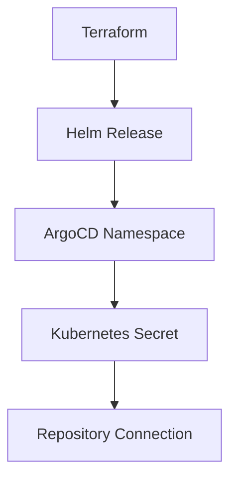

## Introduction to ArgoCD and GitOps

ArgoCD is an open-source declarative continuous delivery tool for Kubernetes applications. It is designed to manage and automate the deployment of applications using GitOps principles. GitOps is a set of practices that uses Git as a single source of truth for infrastructure and application deployments. This approach ensures that all changes to the system are tracked, reviewed, and audited through Git, providing a robust and reliable way to manage complex systems.

### Why Use ArgoCD?

ArgoCD simplifies the process of deploying and managing applications in a Kubernetes environment. By leveraging GitOps principles, it ensures that the desired state of the system is always reflected in the Git repository. This provides several benefits:

- **Version Control**: All changes to the system are tracked in Git, allowing for easy rollbacks and audits.
- **Automated Deployment**: Changes pushed to the Git repository trigger automated deployments, reducing manual intervention.
- **Consistency**: Ensures that the live state of the system matches the desired state defined in Git.
- **Security**: Provides a clear audit trail and allows for strict control over who can make changes to the system.

### Key Concepts

Before diving into the configuration details, let's cover some key concepts:

- **Terraform**: An infrastructure as code (IaC) tool that allows you to define and provision your infrastructure using declarative configuration files.
- **Kubernetes**: An open-source platform for automating deployment, scaling, and management of containerized applications.
- **Helm**: A package manager for Kubernetes that allows you to define, install, and upgrade even the most complex Kubernetes applications.
- **GitOps**: A set of practices that uses Git as a single source of truth for infrastructure and application deployments.

### Setting Up ArgoCD

To configure ArgoCD using Terraform, we need to define the necessary resources and dependencies. Let's break down the configuration step-by-step.

#### Step 1: Define the Terraform Resource

The first step is to define the Terraform resource that represents the GitOps repository secret. In the given example, the resource is named `ArcCity GitOps repo as a secret`.

```hcl
resource "kubernetes_secret" "gitops_repo" {
  metadata {
    name      = var.gitops_repo_name
    namespace = var.argocity_namespace
    labels = {
      argocd.argoproj.io/secret-type = "repository"
    }
  }

  data = {
    username = base64encode(var.gitops_repo_username)
    password = base64encode(var.gitops_repo_password)
  }
}
```

Here, we define a Kubernetes secret resource named `gitops_repo`. The `metadata` block specifies the name and namespace of the secret. The `labels` field includes a label that identifies this secret as a repository secret for ArgoCD. The `data` block contains the encoded username and password for the Git repository.

#### Step 2: Name the Kubernetes Component

Next, we need to name the Kubernetes component itself. In the example, the secret is named `GitOps Kubernetes repo`.

```hcl
variable "gitops_repo_name" {
  description = "Name of the GitOps repository secret"
  default     = "gitops-kubernetes-repo"
}
```

This variable defines the name of the secret within the Kubernetes cluster. You can customize this name based on your requirements.

#### Step 3: Define the Namespace

The secret is deployed in the `argocity` namespace, which is the same namespace where ArgoCD will run.

```hcl
variable "argocity_namespace" {
  description = "Namespace for ArgoCD"
  default     = "argocity"
}
```

This variable specifies the namespace where the secret will be deployed. The namespace should already exist or be created as part of the deployment process.

#### Step 4: Create Dependencies

Since the Helm chart deployment creates the namespace, we need to ensure that the namespace exists before creating the secret. This is achieved by defining a dependency in Terraform.

```hcl
resource "helm_release" "argocity" {
  name       = "argocity"
  repository = "https://argoproj.github.io/argo-helm"
  chart      = "argo-cd"
  namespace  = var.argocity_namespace
}

resource "kubernetes_secret" "gitops_repo" {
  metadata {
    name      = var.gitops_repo_name
    namespace = var.argocity_namespace
    labels = {
      argocd.argoproj.io/secret-type = "repository"
    }
  }

  data = {
    username = base64encode(var.gitops_repo_username)
    password = base64encode(var.gitops_repo_password)
  }

  depends_on = [helm_release.argocity]
}
```

In this configuration, the `depends_on` attribute ensures that the `argocity` Helm release is created before the `gitops_repo` secret. This prevents issues where the namespace does not exist when the secret is being created.

### Understanding the Annotation

The annotation `argocd.argoproj.io/secret-type` is crucial for ArgoCD to identify the secret as a repository secret. This annotation tells ArgoCD how to use the secret to connect to the Git repository.

```yaml
apiVersion: v1
kind: Secret
metadata:
  name: gitops-kubernetes-repo
  namespace: argocity
  labels:
    argocd.argoproj.io/secret-type: repository
type: Opaque
data:
  username: <base64_encoded_username>
  password: <base64_encoded_password>
```

This YAML snippet shows the structure of the secret. The `labels` field includes the annotation that identifies the secret as a repository secret.

### Passing Repository Information

Finally, we need to pass the repository information to ArgoCD. This is typically done through the Helm chart configuration.

```hcl
resource "helm_release" "argocity" {
  name       = "argocity"
  repository = "https://argoproj.github.io/argo-helm"
  chart      = "argo-cd"
  namespace  = var.argocity_namespace
  set {
    name  = "server.insecure"
    value = true
  }
  set {
    name  = "repo.url"
    value = var.gitops_repo_url
  }
  set {
    name  = "repo.username"
    value = var.gitops_repo_username
  }
  set {
    name  = "repo.password"
    value = var.gitops_repo_password
  }
}
```

In this configuration, the `set` blocks pass the repository URL, username, and password to ArgoCD. These values are used to connect to the Git repository.

### Diagramming the Configuration

Let's visualize the configuration using a Mermaid diagram.



This diagram shows the flow of the configuration:

- Terraform manages the Helm release.
- The Helm release creates the ArgoCD namespace.
- The Kubernetes secret is created within the namespace.
- The secret is used to establish a connection to the Git repository.

### Common Pitfalls and How to Avoid Them

#### Pitfall 1: Missing Dependencies

If the namespace does not exist when the secret is being created, the deployment will fail. Ensure that the namespace is created before the secret is deployed.

**How to Prevent / Defend:**

- Use the `depends_on` attribute in Terraform to enforce the correct order of resource creation.
- Verify that the namespace exists before deploying the secret.

#### Pitfall 2: Incorrect Annotations

If the annotation `argocd.argoproj.io/secret-type` is missing or incorrect, ArgoCD will not recognize the secret as a repository secret.

**How to Prevent / Defend:**

- Double-check the annotation in the secret definition.
- Ensure that the annotation is correctly applied to the secret.

#### Pitfall 3: Incorrect Repository Information

If the repository URL, username, or password is incorrect, ArgoCD will not be able to connect to the Git repository.

**How to Prevent / Defend:**

- Verify the repository URL, username, and password before deploying the Helm chart.
- Use environment variables or secrets to securely store sensitive information.

### Real-World Examples

#### Example 1: CVE-2021-20225

CVE-2021-20225 is a vulnerability in ArgoCD that allows an attacker to bypass authentication and gain unauthorized access to the system. This vulnerability highlights the importance of securing the repository connection and ensuring that sensitive information is properly protected.

**How to Prevent / Defend:**

- Use strong, unique passwords for the Git repository.
- Enable two-factor authentication (2FA) for the Git repository.
- Regularly review and update the repository credentials.

#### Example 2: Breach at GitHub

In 2021, GitHub experienced a breach where an attacker gained access to private repositories. This breach underscores the importance of securing the Git repository and ensuring that sensitive information is not exposed.

**How to Prevent / Defend:**

- Use HTTPS for all connections to the Git repository.
- Enable repository encryption to protect sensitive data.
- Regularly review and monitor access logs for the Git repository.

### Secure Coding Practices

#### Vulnerable Code

```hcl
resource "kubernetes_secret" "gitops_repo" {
  metadata {
    name      = "gitops-kubernetes-repo"
    namespace = "argocity"
    labels = {
      argocd.argoproj.io/secret-type = "repository"
    }
  }

  data = {
    username = "admin"
    password = "password123"
  }
}
```

#### Secure Code

```hcl
resource "kubernetes_secret" "gitops_repo" {
  metadata {
    name      = "gitops-kubernetes-repo"
    namespace = "argocity"
    labels = {
      argocd.argoproj.io/secret-type = "repository"
    }
  }

  data = {
    username = base64encode(var.gitops_repo_username)
    password = base64encode(var.gitops_repo_password)
  }
}
```

In the secure code example, the username and password are stored as base64-encoded strings, which helps to protect sensitive information.

### Hands-On Labs

For hands-on practice with configuring ArgoCD using Terraform, consider the following labs:

- **PortSwigger Web Security Academy**: Offers a series of labs focused on web application security, including GitOps and ArgoCD.
- **OWASP Juice Shop**: A deliberately insecure web application for security training purposes.
- **DVWA (Damn Vulnerable Web Application)**: Another popular web application for security training.

These labs provide a practical way to apply the concepts learned in this chapter.

### Conclusion

Configuring ArgoCD using Terraform is a powerful way to automate and manage the deployment of applications in a Kubernetes environment. By following the steps outlined in this chapter, you can ensure that your GitOps repository is properly configured and secured. Remember to double-check dependencies, annotations, and repository information to avoid common pitfalls. With the right practices and tools, you can build a robust and secure deployment pipeline using ArgoCD and GitOps principles.

---
<!-- nav -->
[[DevSecOps/DevSecOps Bootcamp/07-CI CD Security Pipeline/01-App Release Pipeline with ArgoCD/Configure ArgoCD in IaC Deploy Argo Part 1/02-Introduction to ArgoCD and Application Release Pipelines|Introduction to ArgoCD and Application Release Pipelines]] | [[DevSecOps/DevSecOps Bootcamp/07-CI CD Security Pipeline/01-App Release Pipeline with ArgoCD/Configure ArgoCD in IaC Deploy Argo Part 1/00-Overview|Overview]] | [[DevSecOps/DevSecOps Bootcamp/07-CI CD Security Pipeline/01-App Release Pipeline with ArgoCD/Configure ArgoCD in IaC Deploy Argo Part 1/04-Introduction to ArgoCD and IaC|Introduction to ArgoCD and IaC]]
