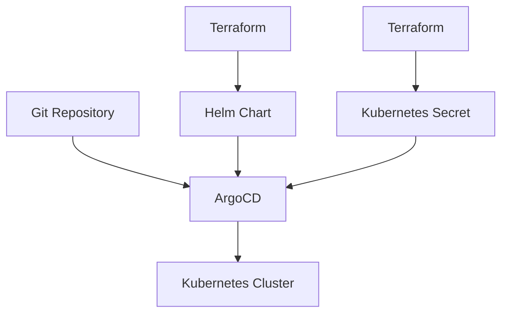

## Introduction to ArgoCD and IaC

ArgoCD is an open-source declarative continuous delivery tool for Kubernetes that enables automated application lifecycle management using GitOps principles. In this section, we will delve into configuring ArgoCD using Infrastructure as Code (IaC) tools such as Terraform. We will cover the necessary steps to set up ArgoCD, including defining providers, creating secrets, and deploying the Helm chart.

### Background Theory

#### What is ArgoCD?

ArgoCD is a tool that helps manage the deployment and synchronization of applications in Kubernetes clusters. It uses GitOps principles, which means that the desired state of the cluster is stored in a Git repository. This allows for version control, collaboration, and auditability of changes made to the cluster.

#### What is Infrastructure as Code (IaC)?

Infrastructure as Code (IaC) is the practice of managing and provisioning infrastructure through machine-readable definition files, rather than physical hardware configuration or interactive configuration tools. Tools like Terraform allow you to define your infrastructure in code, making it easier to manage, version control, and automate.

### Setting Up ArgoCD with Terraform

To set up ArgoCD using Terraform, we need to define several components:

1. **Provider Configuration**: Define the provider that Terraform will use to interact with the Kubernetes cluster.
2. **Helm Chart Deployment**: Use the Helm provider to deploy the ArgoCD Helm chart.
3. **Kubernetes Secrets**: Create Kubernetes secrets to store the credentials needed to access the Git repository.

#### Provider Configuration

The provider configuration is essential because it tells Terraform how to communicate with the Kubernetes cluster. In this case, we are using the `kubernetes` provider and the `helm` provider.

```hcl
provider "kubernetes" {
  host     = var.kubernetes_host
  token    = var.kubernetes_token
  cluster_ca_certificate = base64decode(var.cluster_ca_certificate)
}

provider "helm" {
  kubernetes {
    host     = var.kubernetes_host
    token    = var.kubernetes_token
    cluster_ca_certificate = base64decode(var.cluster_ca_certificate)
  }
}
```

Here, we define the `kubernetes` provider and the `helm` provider. Both require the same authentication details (`host`, `token`, and `cluster_ca_certificate`). These details are typically provided via environment variables or input variables.

#### Deploying the ArgoCD Helm Chart

Once the provider is configured, we can proceed to deploy the ArgoCD Helm chart. This is done using the `helm_release` resource in Terraform.

```hcl
resource "helm_release" "argocd" {
  name       = "argocd"
  repository = "https://argoproj.github.io/argo-helm"
  chart      = "argo-cd"
  version    = "latest"

  set {
    name  = "server.insecure"
    value = true
  }

  set {
    name  = "controller.repoServer"
    value = "https://github.com/myorg/myrepo.git"
  }

  set {
    name  = "controller.repoPath"
    value = "k8s"
  }
}
```

In this example, we are deploying the `argo-cd` chart from the `argoproj` repository. We are setting some initial configurations, such as the insecure server flag and the Git repository path.

### Creating Kubernetes Secrets

ArgoCD needs to authenticate with the Git repository to fetch the Kubernetes manifests. To achieve this, we create a Kubernetes secret that contains the necessary credentials.

#### Why Use Kubernetes Secrets?

Kubernetes secrets are used to store sensitive information such as passwords, tokens, and keys. They are designed to be securely managed within the cluster and can be mounted as files or environment variables in pods.

#### Creating the Secret

We can create the secret using the `kubernetes_secret` resource in Terraform.

```hcl
resource "kubernetes_secret" "argocd_git_creds" {
  metadata {
    name = "argocd-git-creds"
  }

  data = {
    username = base64encode(var.git_username)
    password = base64encode(var.git_password)
  }
}
```

In this example, we are creating a secret named `argocd-git-creds` that contains the base64-encoded username and password for the Git repository.

### Full Example

Let's put everything together in a complete Terraform configuration.

```hcl
provider "kubernetes" {
  host     = var.kubernetes_host
  token    = var.kubernetes_token
  cluster_ca_certificate = base64decode(var.cluster_ca_certificate)
}

provider "helm" {
  kubernetes {
    host     = var.kubernetes_host
    token    = var.kubernetes_token
    cluster_ca_certificate = base64decode(var.cluster_ca_certificate)
  }
}

resource "helm_release" "argocd" {
  name       = "argocd"
  repository = "https://argoproj.github.io/argo-helm"
  chart      = "argo-cd"
  version    = "latest"

  set {
    name  = "server.insecure"
    value = true
  }

  set {
    name  = "controller.repoServer"
    value = "https://github.com/myorg/myrepo.git"
  }

  set {
    name  = "controller.repoPath"
    value = "k8s"
  }
}

resource "kubernetes_secret" "argocd_git_creds" {
  metadata {
    name = "argocd-git-creds"
  }

  data = {
    username = base64encode(var.git_username)
    password = base64encode(var.git_password)
  }
}
```

### Diagrams

Let's visualize the setup using Mermaid diagrams.



This diagram shows the flow of information from the Git repository to ArgoCD, which then deploys the applications to the Kubernetes cluster. Terraform is used to deploy the Helm chart and create the Kubernetes secret.

### Real-World Examples

#### Recent Breaches and CVEs

One notable breach involving Kubernetes and GitOps was the compromise of a Kubernetes cluster due to misconfigured secrets. In this case, the credentials for accessing the Git repository were exposed, leading to unauthorized access to the cluster.

**CVE-2021-20225**: This CVE highlights the importance of securing secrets and ensuring that they are not exposed in the cluster. It emphasizes the need for proper secret management and access controls.

### Pitfalls and Best Practices

#### Common Mistakes

1. **Exposing Secrets**: One common mistake is exposing secrets in the cluster. This can happen if the secrets are not properly encoded or if they are stored in plain text.
2. **Incorrect Permissions**: Another pitfall is granting incorrect permissions to the ArgoCD service account. This can lead to unauthorized access to the Git repository and the Kubernetes cluster.

#### How to Prevent / Defend

1. **Secure Secrets**: Ensure that secrets are properly encoded and stored securely. Use base64 encoding or encryption to protect sensitive information.
2. **Access Controls**: Implement strict access controls for the ArgoCD service account. Limit the permissions to only what is necessary for the service to function.
3. **Audit Logs**: Enable audit logs to track any unauthorized access attempts. Regularly review the logs to identify and respond to potential security incidents.

### Detection and Prevention

#### Detection

1. **Audit Logs**: Monitor audit logs for any unauthorized access attempts. Look for patterns that indicate suspicious activity.
2. **Network Monitoring**: Use network monitoring tools to detect any unusual traffic patterns or connections to the Git repository.

#### Prevention

1. **Secure Coding Practices**: Follow secure coding practices when defining secrets and deploying applications. Use tools like `tfsec` to scan Terraform code for security issues.
2. **Regular Audits**: Conduct regular audits of the cluster and the Git repository to ensure that all secrets are properly secured and that access controls are enforced.

### Secure-Coding Fixes

#### Vulnerable Code

```hcl
resource "kubernetes_secret" "argocd_git_creds" {
  metadata {
    name = "argocd-git-creds"
  }

  data = {
    username = var.git_username
    password = var.git_password
  }
}
```

#### Fixed Code

```hcl
resource "kubernetes_secret" "argocd_git_creds" {
  metadata {
    name = "argocd-git-creds"
  }

  data = {
    username = base64encode(var.git_username)
    password = base64encode(var.git_password)
  }
}
```

### Hands-On Labs

For hands-on practice, consider the following labs:

- **PortSwigger Web Security Academy**: While focused on web security, this platform offers valuable lessons on secure coding practices that can be applied to IaC.
- **OWASP Juice Shop**: This is a deliberately vulnerable web application that can be used to practice secure coding and IaC practices.
- **CloudGoat**: This is a cloud security training platform that includes exercises on deploying and securing applications using IaC tools like Terraform.

By following these steps and best practices, you can effectively set up and secure ArgoCD using Terraform and IaC principles.

---
<!-- nav -->
[[DevSecOps/DevSecOps Bootcamp/07-CI CD Security Pipeline/01-App Release Pipeline with ArgoCD/Configure ArgoCD in IaC Deploy Argo Part 1/03-Introduction to ArgoCD and GitOps|Introduction to ArgoCD and GitOps]] | [[DevSecOps/DevSecOps Bootcamp/07-CI CD Security Pipeline/01-App Release Pipeline with ArgoCD/Configure ArgoCD in IaC Deploy Argo Part 1/00-Overview|Overview]] | [[DevSecOps/DevSecOps Bootcamp/07-CI CD Security Pipeline/01-App Release Pipeline with ArgoCD/Configure ArgoCD in IaC Deploy Argo Part 1/05-Introduction to ArgoCD and Infrastructure as Code (IaC)|Introduction to ArgoCD and Infrastructure as Code (IaC)]]
