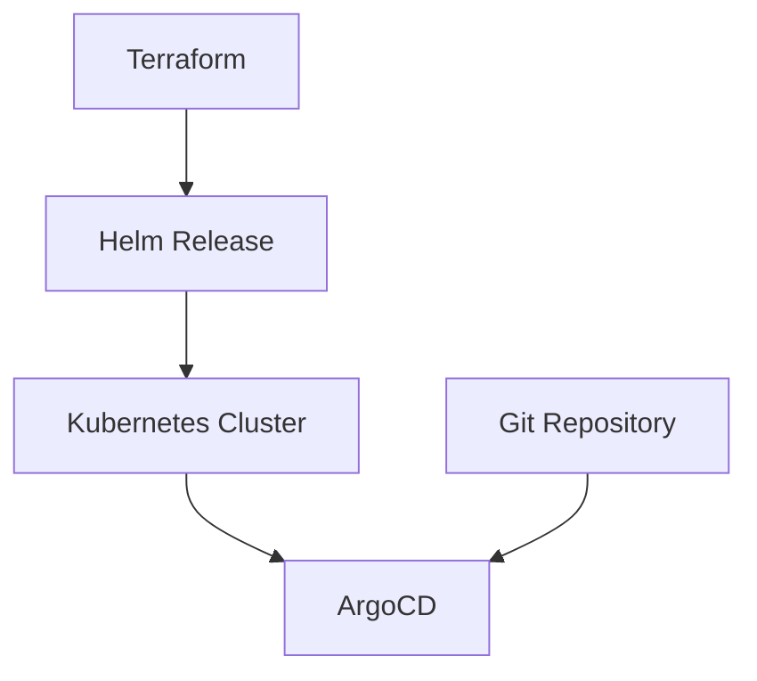

## Introduction to ArgoCD and Its Deployment Using Terraform

ArgoCD is an open-source declarative continuous delivery tool for Kubernetes. It enables you to manage your applications in a GitOps way, meaning that your application's desired state is stored in a Git repository. This allows for a consistent and repeatable deployment process, which is crucial for maintaining the integrity and reliability of your applications.

### What is ArgoCD?

ArgoCD is a tool that helps you manage the deployment of your applications to Kubernetes clusters. It does this by comparing the desired state of your applications (which is stored in a Git repository) with the actual state of your applications in the Kubernetes cluster. If there is a difference, ArgoCD will automatically apply the necessary changes to bring the actual state in line with the desired state.

#### Why Use ArgoCD?

- **Declarative Continuous Delivery**: ArgoCD ensures that your applications are always in the desired state, which is defined in your Git repository. This makes it easier to manage and maintain your applications.
- **GitOps Workflow**: By storing the desired state of your applications in a Git repository, you can take advantage of the benefits of Git, such as version control, collaboration, and auditability.
- **Automated Syncing**: ArgoCD can automatically sync the desired state with the actual state, ensuring that your applications are always up-to-date.

### Deploying ArgoCD Using Terraform

Terraform is an infrastructure as code (IaC) tool that allows you to define and provision your infrastructure using declarative configuration files. In this section, we will explore how to deploy ArgoCD using Terraform and the Helm release resource.

#### What is Terraform?

Terraform is an open-source tool that allows you to define your infrastructure as code. This means that you can write configuration files that describe the resources you want to create, and then use Terraform to provision those resources. Terraform supports a wide range of cloud providers, including AWS, Azure, Google Cloud, and more.

#### What is Helm?

Helm is a package manager for Kubernetes. It allows you to define, install, and upgrade even the most complex Kubernetes applications. Helm charts are collections of pre-configured Kubernetes resources that can be easily installed and managed.

### Configuring ArgoCD Using Terraform and Helm

To deploy ArgoCD using Terraform and Helm, we will use the `helm_release` resource provided by the `terraform-provider-helm` plugin. This resource allows us to deploy Helm charts and manage their lifecycle.

#### Step-by-Step Guide

1. **Define the Helm Provider**:
   Before we can use the `helm_release` resource, we need to define the Helm provider. This provider is responsible for interacting with the Kubernetes cluster and deploying the Helm charts.

   ```hcl
   provider "helm" {
     kubernetes {
       host = var.kubernetes_host
       token = var.kubernetes_token
       ca_data = var.kubernetes_ca_data
     }
   }
   ```

   Here, we define the `helm` provider and specify the Kubernetes cluster details. The `host`, `token`, and `ca_data` variables should be set to the appropriate values for your Kubernetes cluster.

2. **Create the Helm Release Resource**:
   Now that we have defined the Helm provider, we can create the `helm_release` resource to deploy ArgoCD.

   ```hcl
   resource "helm_release" "argocd" {
     name       = "argocd"
     chart      = "argo/argo-cd"
     version    = "v2.4.1"
     namespace  = "argocd"

     set {
       name  = "server.insecure"
       value = "true"
     }

     set {
       name  = "controller.metrics.enabled"
       value = "true"
     }
   }
   ```

   In this example, we define a `helm_release` resource named `argocd`. We specify the chart name (`argo/argo-cd`) and the version (`v2.4.1`). We also create a new namespace called `argocd` where ArgoCD will be deployed.

   Additionally, we set some values for the chart using the `set` block. These values configure specific settings for ArgoCD, such as enabling insecure server mode and metrics collection.

3. **Deploy the Configuration**:
   Once you have defined the `helm_release` resource, you can deploy the configuration using Terraform.

   ```sh
   terraform init
   terraform plan
   terraform apply
   ```

   The `terraform init` command initializes the Terraform working directory, downloading any required plugins. The `terraform plan` command shows you the changes that will be made, and the `terraform apply` command applies those changes.

### Detailed Explanation of the Configuration

Let's break down the configuration in more detail:

- **Provider Definition**:
  The `provider` block defines the Helm provider, which is responsible for interacting with the Kubernetes cluster. The `kubernetes` block specifies the connection details for the Kubernetes cluster, including the `host`, `token`, and `ca_data`.

- **Helm Release Resource**:
  The `helm_release` resource is used to deploy the ArgoCD Helm chart. The `name` attribute specifies the name of the release, which is `argocd` in this case. The `chart` attribute specifies the Helm chart to be deployed, which is `argo/argo-cd`. The `version` attribute specifies the version of the chart to be deployed, which is `v2.4.1`.

  The `namespace` attribute specifies the namespace where ArgoCD will be deployed. In this case, we create a new namespace called `argocd`.

  The `set` blocks are used to set specific values for the chart. These values configure various settings for ArgoCD, such as enabling insecure server mode and metrics collection.

### Diagrams and Topologies

To better understand the deployment process, let's visualize the architecture using a mermaid diagram.



In this diagram:
- **Terraform** is used to define and deploy the infrastructure.
- **Helm Release** is the resource used to deploy the ArgoCD Helm chart.
- **Kubernetes Cluster** is the target environment where ArgoCD is deployed.
- **ArgoCD** is the application that is deployed using the Helm chart.
- **Git Repository** is the source of truth for the desired state of the applications.

### Real-World Examples and Recent CVEs

While ArgoCD itself has not been the subject of many public CVEs, it is important to consider the broader ecosystem in which it operates. For example, vulnerabilities in Kubernetes or Helm could indirectly affect ArgoCD deployments.

One notable example is the Kubernetes API Server vulnerability (CVE-2021-25741), which allowed attackers to bypass authentication and authorization mechanisms. This could potentially allow unauthorized access to ArgoCD if it is not properly secured.

### How to Prevent / Defend

To ensure the security of your ArgoCD deployment, follow these best practices:

1. **Secure Access to the Kubernetes Cluster**:
   Ensure that access to the Kubernetes cluster is properly secured. Use RBAC (Role-Based Access Control) to restrict permissions and avoid using insecure modes.

   ```yaml
   apiVersion: rbac.authorization.k8s.io/v1
   kind: Role
   metadata:
     namespace: argocd
     name: argocd-role
   rules:
     - apiGroups: [""]
       resources: ["pods", "services"]
       verbs: ["get", "list", "watch"]
   ---
   apiVersion: rbac.authorization.k8s.io/v1
   kind: RoleBinding
   metadata:
     namespace: argocd
     name: argocd-binding
   subjects:
     - kind: ServiceAccount
       name: argocd-sa
       namespace: argocd
   roleRef:
     kind: Role
     name: argocd-role
     apiGroup: rbac.authorization.k8s.io
   ```

2. **Use Secure Helm Charts**:
   Ensure that the Helm charts you use are from trusted sources and are regularly updated. Avoid using insecure configurations, such as setting `server.insecure` to `true`.

   ```hcl
   resource "helm_release" "argocd" {
     name       = "argocd"
     chart      = "argo/argo-cd"
     version    = "v2.4.1"
     namespace  = "argocd"

     set {
       name  = "server.insecure"
       value = "false"
     }

     set {
       name  = "controller.metrics.enabled"
       value = "true"
     }
   }
   ```

3. **Monitor and Audit**:
   Regularly monitor and audit your ArgoCD deployment to detect any unauthorized changes or suspicious activity. Use tools like Prometheus and Grafana to monitor metrics and logs.

   ```yaml
   apiVersion: monitoring.coreos.com/v1
   kind: ServiceMonitor
   metadata:
     name: argocd-server
     labels:
       app: argocd-server
   spec:
     selector:
       matchLabels:
         app: argocd-server
     endpoints:
     - port: metrics
       interval: 30s
   ```

### Complete Example

Here is a complete example of the Terraform configuration to deploy ArgoCD using the Helm release resource:

```hcl
provider "helm" {
  kubernetes {
    host = var.kubernetes_host
    token = var.kubernetes_token
    ca_data = var.kubernetes_ca_data
  }
}

resource "helm_release" "argocd" {
  name       = "argocd"
  chart      = "argo/argo-cd"
  version    = "v2.4.1"
  namespace  = "argocd"

  set {
    name  = "server.insecure"
    value = "false"
  }

  set {
    name  = "controller.metrics.enabled"
    value = "true"
  }
}
```

### Hands-On Labs

To practice deploying ArgoCD using Terraform and Helm, you can use the following labs:

- **PortSwigger Web Security Academy**: While primarily focused on web security, this platform offers a variety of labs that can help you understand the broader DevSecOps landscape.
- **OWASP Juice Shop**: Another web security-focused platform that can help you understand the importance of securing your applications.
- **CloudGoat**: A cloud security-focused platform that includes labs for deploying and securing applications in Kubernetes clusters.

By following these steps and best practices, you can ensure that your ArgoCD deployment is secure and reliable.

---
<!-- nav -->
[[DevSecOps/DevSecOps Bootcamp/07-CI CD Security Pipeline/01-App Release Pipeline with ArgoCD/Configure ArgoCD in IaC Deploy Argo Part 1/05-Introduction to ArgoCD and Infrastructure as Code (IaC)|Introduction to ArgoCD and Infrastructure as Code (IaC)]] | [[DevSecOps/DevSecOps Bootcamp/07-CI CD Security Pipeline/01-App Release Pipeline with ArgoCD/Configure ArgoCD in IaC Deploy Argo Part 1/00-Overview|Overview]] | [[DevSecOps/DevSecOps Bootcamp/07-CI CD Security Pipeline/01-App Release Pipeline with ArgoCD/Configure ArgoCD in IaC Deploy Argo Part 1/07-Introduction to ArgoCD and Its Role in DevSecOps|Introduction to ArgoCD and Its Role in DevSecOps]]
