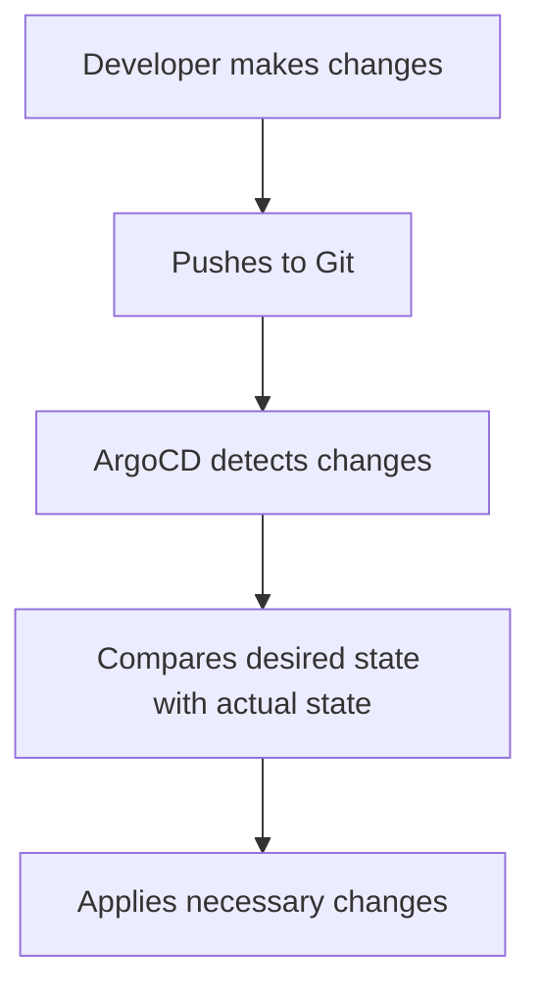

## Introduction to ArgoCD and Its Role in DevSecOps

### What is ArgoCD?

ArgoCD is an open-source declarative continuous delivery tool for Kubernetes. It is designed to automate the deployment and management of applications in a Kubernetes cluster. ArgoCD operates based on the principle of **GitOps**, which means that the desired state of the system is defined in Git repositories. This approach ensures that the entire infrastructure and application configurations are version-controlled and auditable.

### Why Use ArgoCD?

The primary benefits of using ArgoCD include:

- **Automated Deployment**: ArgoCD automates the deployment process by continuously comparing the desired state (defined in Git) with the actual state (in the Kubernetes cluster) and applying any necessary changes.
- **Version Control**: By storing all configurations in Git, ArgoCD enables teams to track changes, revert to previous states, and collaborate effectively.
- **Security**: ArgoCD enforces strict controls over manual changes to the cluster, ensuring that only approved changes can be applied.

### How Does ArgoCD Work?

ArggoCD operates by periodically syncing the desired state (from Git) with the actual state (in the Kubernetes cluster). This process involves the following steps:

1. **Syncing**: ArgoCD compares the desired state (defined in Git) with the actual state (in the Kubernetes cluster).
2. **Applying Changes**: If discrepancies are found, ArgoCD applies the necessary changes to bring the actual state in line with the desired state.
3. **Rollback**: In case of issues, ArgoCD can roll back to a previous state, ensuring that the system remains stable.

### Example of ArgoCD in Action

Consider a scenario where a team is developing a microservices-based application. The application consists of several services, each defined in a separate Kubernetes manifest file stored in a Git repository. When a developer makes a change to one of these manifests and pushes it to the Git repository, ArgoCD detects the change and updates the corresponding service in the Kubernetes cluster.



### Real-World Examples and Recent Breaches

One notable example of the importance of GitOps and tools like ArgoCD is the **SolarWinds breach** (CVE-2020-1014). In this incident, attackers compromised the SolarWinds software supply chain, leading to unauthorized access to numerous organizations' networks. Had these organizations implemented strict GitOps practices with tools like ArgoCD, they could have detected and mitigated such unauthorized changes more effectively.

### Key Concepts and Terminology

#### Desired State vs. Actual State

- **Desired State**: The state of the system as defined in the Git repository.
- **Actual State**: The current state of the system in the Kubernetes cluster.

#### Syncing Process

- **Sync**: The process of comparing the desired state with the actual state and applying any necessary changes.
- **Drift**: The difference between the desired state and the actual state.

#### Namespace Management

- **Namespace**: A logical grouping of resources within a Kubernetes cluster.
- **Create Namespace**: An option in ArgoCD that allows the creation of namespaces if they do not already exist.

### Configuring ArgoCD in Infrastructure as Code (IaC)

To configure ArgoCD in IaC, you typically use tools like Terraform, Helm, or Kustomize. Here, we'll focus on using Helm, a popular package manager for Kubernetes.

#### Step-by-Step Configuration

1. **Install Helm**: Ensure Helm is installed on your machine.
2. **Add ArgoCD Helm Repository**: Add the ArgoCD Helm repository to your local Helm setup.
3. **Deploy ArgoCD**: Use Helm to deploy ArgoCD to your Kubernetes cluster.

```bash
# Install Helm
curl https://raw.githubusercontent.com/helm/helm/master/scripts/get-helm-3 | bash

# Add ArgoCD Helm repository
helm repo add argo https://argoproj.github.io/argo-helm

# Update Helm repositories
helm repo update

# Deploy ArArgoCD
helm install argocd argo/argo-cd --namespace argocd --create-namespace
```

### Full Raw HTTP Messages and Responses

When deploying ArgoCD using Helm, the process involves sending HTTP requests to the Kubernetes API server. Below is an example of the HTTP request and response for deploying ArgoCD.

#### HTTP Request

```http
POST /apis/helm.sh/v1/namespaces/argocd/charts HTTP/1.1
Host: kubernetes-api-server.example.com
Content-Type: application/json

{
  "chart": "argo/argo-cd",
  "version": "latest",
  "values": {
    "server": {
      "serviceType": "LoadBalancer"
    }
  },
  "namespace": "argocd"
}
```

#### HTTP Response

```http
HTTP/1.1 200 OK
Content-Type: application/json

{
  "status": "deployed",
  "namespace": "argocd",
  "releaseName": "argocd",
  "chart": "argo/argo-cd",
  "version": "latest",
  "values": {
    "server": {
      "serviceType": "LoadBalancer"
    }
  }
}
```

### Sync Options and Namespace Management

ArgoCD provides several sync options to control how it manages the desired state. One important option is `syncOptions`, which includes `createNamespace=true`.

#### Example Configuration

Below is an example of an ArgoCD application configuration that includes the `syncOptions` setting.

```yaml
apiVersion: argoproj.io/v1alpha1
kind: Application
metadata:
  name: my-app
spec:
  project: default
  source:
    repoURL: https://github.com/myorg/myrepo.git
    targetRevision: HEAD
    path: k8s
  destination:
    server: https://kubernetes.default.svc
    namespace: my-app-ns
  syncPolicy:
    automated:
      prune: true
      selfHeal: true
    syncOptions:
      - createNamespace=true
```

### How to Prevent / Defend

#### Detection

To detect unauthorized changes, you can set up monitoring and alerting mechanisms. Tools like Prometheus and Grafana can be used to monitor the state of your ArgoCD applications and alert you to any discrepancies.

#### Prevention

To prevent unauthorized changes, ensure that your Git repository and Kubernetes cluster are properly secured:

1. **Access Controls**: Implement strict access controls to ensure that only authorized users can make changes to the Git repository and Kubernetes cluster.
2. **Audit Logs**: Enable audit logs to track all changes made to the system.
3. **Automated Testing**: Implement automated testing to validate changes before they are deployed.

#### Secure Coding Fixes

Here is an example of a vulnerable configuration and its secure counterpart:

##### Vulnerable Configuration

```yaml
apiVersion: argoproj.io/v1alpha1
kind: Application
metadata:
  name: my-app
spec:
  project: default
  source:
    repoURL: https://github.com/myorg/myrepo.git
    targetRevision: HEAD
    path: k8s
  destination:
    server: https://kubernetes.default.svc
    namespace: my-app-ns
  syncPolicy:
    automated:
      prune: false
      selfHeal: false
```

##### Secure Configuration

```yaml
apiVersion: argoproj.io/v1alpha1
kind: Application
metadata:
  name: my-app
spec:
  project: default
  source:
    repoURL: https://github.com/myorg/myrepo.git
    targetRevision: HEAD
    path: k8s
  destination:
    server: https://kubernetes.default.svc
    namespace: my-app-ns
  syncPolicy:
    automated:
      prune: true
      selfHeal: true
    syncOptions:
      - createNamespace=true
```

### Common Pitfalls and Best Practices

#### Common Pitfalls

- **Manual Changes**: Avoid making manual changes to the Kubernetes cluster. All changes should go through the Git workflow.
- **Inconsistent States**: Ensure that the desired state in Git is consistent with the actual state in the cluster.

#### Best Practices

- **Regular Audits**: Regularly audit the state of your ArgoCD applications to ensure they are in sync with the desired state.
- **Automated Testing**: Implement automated testing to validate changes before they are deployed.
- **Access Controls**: Implement strict access controls to ensure that only authorized users can make changes to the Git repository and Kubernetes cluster.

### Hands-On Labs

For hands-on practice with ArgoCD, consider the following labs:

- **PortSwigger Web Security Academy**: Focuses on web application security but can provide valuable context for integrating security practices into your DevSecOps pipeline.
- **OWASP Juice Shop**: A deliberately insecure web application for security training.
- **Kubernetes Goat**: A hands-on lab for learning Kubernetes security.

These labs provide practical experience in configuring and managing ArgoCD in a secure manner.

### Conclusion

ArgoCD is a powerful tool for automating the deployment and management of applications in a Kubernetes cluster. By leveraging GitOps principles, ArgoCD ensures that the desired state of the system is always in sync with the actual state. Proper configuration and security practices are essential to maximize the benefits of ArgoCD and minimize the risks of unauthorized changes.

---
<!-- nav -->
[[DevSecOps/DevSecOps Bootcamp/07-CI CD Security Pipeline/01-App Release Pipeline with ArgoCD/Configure ArgoCD in IaC Deploy Argo Part 1/06-Introduction to ArgoCD and Its Deployment Using Terraform|Introduction to ArgoCD and Its Deployment Using Terraform]] | [[DevSecOps/DevSecOps Bootcamp/07-CI CD Security Pipeline/01-App Release Pipeline with ArgoCD/Configure ArgoCD in IaC Deploy Argo Part 1/00-Overview|Overview]] | [[DevSecOps/DevSecOps Bootcamp/07-CI CD Security Pipeline/01-App Release Pipeline with ArgoCD/Configure ArgoCD in IaC Deploy Argo Part 1/08-Introduction to ArgoCD in CICD Pipelines|Introduction to ArgoCD in CICD Pipelines]]
