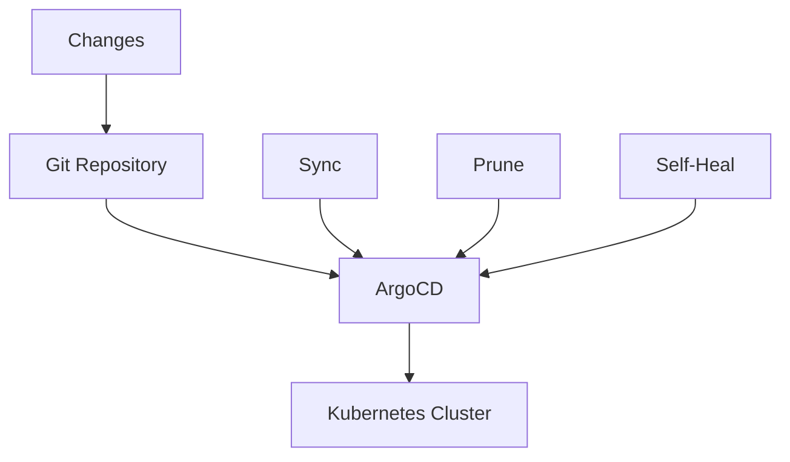
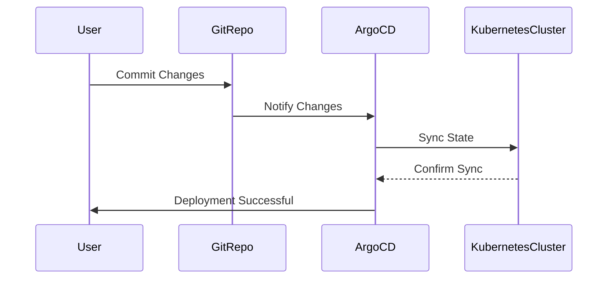

## Introduction to ArgoCD in CI/CD Pipelines

ArgoCD is a popular open-source tool that enables continuous delivery (CD) for Kubernetes applications. It is designed to manage and automate the deployment of applications in a declarative manner, ensuring that the desired state of your application matches the actual state in the Kubernetes cluster. This chapter will delve into configuring ArgoCD using Infrastructure as Code (IaC) principles, focusing on setting up an automated CD pipeline.

### Key Concepts

- **Continuous Delivery (CD)**: A practice where code changes are automatically built, tested, and deployed to production.
- **Infrastructure as Code (IaC)**: Managing and provisioning infrastructure through machine-readable definition files, rather than physical hardware configuration or interactive configuration tools.
- **Kubernetes**: An open-source system for automating deployment, scaling, and management of containerized applications.

### Why Use ArgoCD?

ArgoCD provides several benefits:

- **Declarative Configuration**: You define the desired state of your application in manifests, and ArgoCD ensures that the actual state matches this desired state.
- **Automated Deployment**: Once configured, ArgoCD can automatically deploy changes from your Git repository to your Kubernetes cluster.
- **Self-Healing**: ArgoCD can detect and correct discrepancies between the desired state and the actual state, ensuring that your application remains in the intended state.

### Setting Up ArgoCD

To set up ArgoCD, you need to configure it using IaC tools such as Terraform, Helm, or Kustomize. This chapter will focus on using Terraform for configuration.

#### Step-by-Step Setup

1. **Install ArgoCD**:
   - Use Helm to install ArgoCD in your Kubernetes cluster.
   - Example Helm chart installation:
     ```sh
     helm repo add argo https://argoproj.github.io/argo-helm
     helm repo update
     helm install argocd argo/argo-cd --namespace argocd --create-namespace
     ```

2. **Configure ArgoCD**:
   - Define the desired state of ArgoCD using Terraform.
   - Example Terraform configuration:
     ```hcl
     provider "kubernetes" {
       config_path = "~/.kube/config"
     }

     resource "kubernetes_namespace" "argocd" {
       metadata {
         name = "argocd"
       }
     }

     resource "helm_release" "argocd" {
       name       = "argocd"
       namespace  = kubernetes_namespace.argocd.metadata[0].name
       repository = "https://argoproj.github.io/argo-helm"
       chart      = "argo-cd"
       version    = "3.29.0"

       set {
         name  = "server.adminPassword"
         value = "your-strong-password"
       }

       set {
         name  = "server.insecure"
         value = "true"
       }
     }
     ```

### Automated CD Pipeline

In a production environment, you want your ArgoCD setup to be fully automated. This means that as soon as you make a change and commit it to your Git repository, the changes should be applied to the Kubernetes cluster.

#### Key Settings

- **Auto-Sync**: Ensures that the desired state is continuously synchronized with the actual state.
- **Prune**: Deletes resources that are no longer defined in the manifests.
- **Self-Heal**: Automatically corrects discrepancies between the desired state and the actual state.

#### Auto-Sync

Auto-sync ensures that your cluster is always in sync with the desired state defined in your Git repository. This is crucial for maintaining consistency and reliability in your application.

```yaml
apiVersion: argoproj.io/v1alpha1
kind: Application
metadata:
  name: my-app
spec:
  project: default
  source:
    repoURL: https://github.com/myorg/myrepo.git
    targetRevision: HEAD
    path: k8s
  destination:
    server: https://kubernetes.default.svc
    namespace: my-app-ns
  syncPolicy:
    automated:
      prune: true
      selfHeal: true
```

### Prune

The `prune` setting ensures that any resources that are no longer defined in your manifests are removed from the cluster. This is particularly useful for cleaning up old resources and maintaining a clean state.

#### Example Scenario

Suppose you have a Kubernetes manifest with a deployment and a service. If you delete the service from the manifest, ArgoCD will apply this change by removing the service from the cluster.

```yaml
# Before
apiVersion: apps/v1
kind: Deployment
metadata:
  name: my-deployment
spec:
  replicas: 3
  template:
    spec:
      containers:
      - name: my-container
        image: my-image:latest

---
apiVersion: v1
kind: Service
metadata:
  name: my-service
spec:
  ports:
  - port: 80
    targetPort: 8080
  selector:
    app: my-app

# After (Service removed)
apiVersion: apps/v1
kind: Deployment
metadata:
  name: my-deployment
spec:
  replicas: 3
  template:
    spec:
      containers:
      - name: my-container
        image: my-image:latest
```

### Self-Heal

The `self-heal` feature ensures that any manual changes made to the cluster (such as deleting pods or updating configurations) are reverted to the desired state defined in the manifests.

#### Example Scenario

If an administrator manually deletes a pod or updates a deployment directly in the cluster without committing these changes to the Git repository, ArgoCD will detect this discrepancy and revert the changes to match the desired state.

### Pitfalls and Best Practices

#### Common Mistakes

- **Disabling Prune Too Early**: Disabling prune too early can lead to orphaned resources in your cluster.
- **Manual Changes Without Committing**: Making manual changes to the cluster without committing them to the Git repository can cause discrepancies and conflicts.

#### Best Practices

- **Enable Prune in Production**: Ensure that prune is enabled in your production environment to maintain a clean state.
- **Commit All Changes**: Always commit all changes to the Git repository to ensure consistency.
- **Use Feature Branches**: Use feature branches for development and merge them into the main branch only after thorough testing.

### Real-World Examples

#### Recent Breaches and CVEs

- **CVE-2021-20225**: A vulnerability in ArgoCD allowed unauthorized access to the API server. This highlights the importance of keeping your ArgoCD installation up-to-date and securing the API server.
- **Breaches Due to Misconfigured Prune**: Several organizations have experienced unintended deletions due to misconfigured prune settings. This underscores the importance of carefully managing prune settings.

### How to Prevent / Defend

#### Detection

- **Monitoring**: Use monitoring tools to detect discrepancies between the desired state and the actual state.
- **Logging**: Enable detailed logging to track changes and identify unauthorized modifications.

#### Prevention

- **Secure Access**: Ensure that only authorized users have access to the ArgoCD API server.
- **Regular Audits**: Regularly audit your ArgoCD configuration and Git repositories to ensure consistency.

#### Secure Coding Fixes

##### Vulnerable Pattern

```yaml
apiVersion: argoproj.io/v1alpha1
kind: Application
metadata:
  name: my-app
spec:
  project: default
  source:
    repoURL: https://github.com/myorg/myrepo.git
    targetRevision: HEAD
    path: k8s
  destination:
    server: https://kubernetes.default.svc
    namespace: my-app-ns
  syncPolicy:
    automated:
      prune: false
      selfHeal: false
```

##### Secure Pattern

```yaml
apiVersion: argoproj.io/v1alpha1
kind: Application
metadata:
  name: my-app
spec:
  project: default
  source:
    repoURL: https://github.com/myorg/myrepo.git
    targetRevision: HEAD
    path: k8s
  destination:
    server: https://kubernetes.default.svc
    namespace: my-app-ns
  syncPolicy:
    automated:
      prune: true
      selfHeal: true
```

### Complete Example

#### Full HTTP Request and Response

```http
POST /api/v1/namespaces/argocd/deployments HTTP/1.1
Host: kubernetes.default.svc
Content-Type: application/json

{
  "apiVersion": "apps/v1",
  "kind": "Deployment",
  "metadata": {
    "name": "my-deployment"
  },
  "spec": {
    "replicas": 3,
    "template": {
      "spec": {
        "containers": [
          {
            "name": "my-container",
            "image": "my-image:latest"
          }
        ]
      }
    }
  }
}

HTTP/1.1 201 Created
Date: Mon, 20 Mar 2023 12:00:00 GMT
Content-Type: application/json

{
  "kind": "Status",
  "apiVersion": "v1",
  "metadata": {},
  "status": "Success",
  "message": "Deployment created successfully",
  "code": 201
}
```

#### Full Policy/Config File

```yaml
apiVersion: argoproj.io/v1alpha1
kind: Application
metadata:
  name: my-app
spec:
  project: default
  source:
    repoURL: https://github.com/myorg/myrepo.git
    targetRevision: HEAD
    path: k8s
  destination:
    server: https://kubernetes.default.svc
    namespace: my-app-ns
  syncPolicy:
    automated:
      prune: true
      selfHeal: true
```

#### Expected Result/Output

- **Successful Deployment**: The deployment is created and synced with the desired state.
- **Logs**: Detailed logs showing the sync process and any discrepancies detected.

### Mermaid Diagrams

#### Architecture Diagram



#### Sequence Diagram



### Hands-On Labs

For hands-on experience with ArgoCD, consider the following labs:

- **PortSwigger Web Security Academy**: Focuses on web application security but can provide context for integrating security practices into your CI/CD pipeline.
- **OWASP Juice Shop**: A deliberately insecure web application for security training.
- **CloudGoat**: Provides scenarios for learning cloud security practices, including CI/CD pipelines.
- **Pacu**: A cloud security automation framework that can help you understand and test cloud security configurations.

These labs will help you gain practical experience in setting up and managing ArgoCD in a CI/CD pipeline.

### Conclusion

This chapter has provided a comprehensive guide to configuring ArgoCD using IaC principles, focusing on setting up an automated CD pipeline. By understanding the key concepts, settings, and best practices, you can ensure that your application remains in the desired state and is securely managed.

---
<!-- nav -->
[[DevSecOps/DevSecOps Bootcamp/07-CI CD Security Pipeline/01-App Release Pipeline with ArgoCD/Configure ArgoCD in IaC Deploy Argo Part 1/07-Introduction to ArgoCD and Its Role in DevSecOps|Introduction to ArgoCD and Its Role in DevSecOps]] | [[DevSecOps/DevSecOps Bootcamp/07-CI CD Security Pipeline/01-App Release Pipeline with ArgoCD/Configure ArgoCD in IaC Deploy Argo Part 1/00-Overview|Overview]] | [[09-Introduction to ArgoCD in DevSecOps Part 1|Introduction to ArgoCD in DevSecOps Part 1]]
