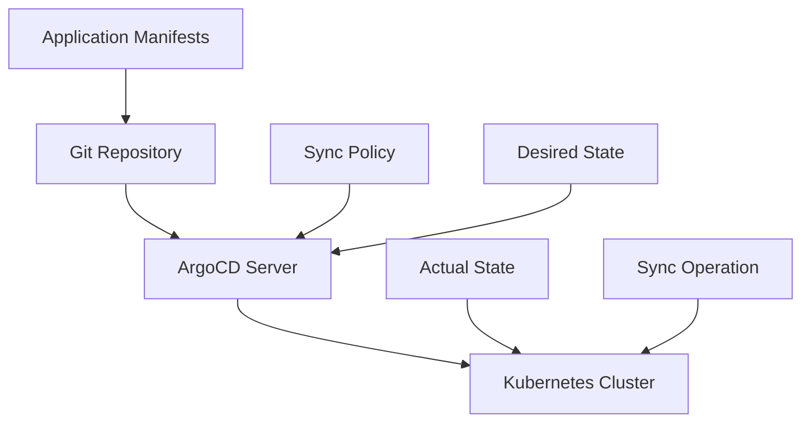

## Introduction to ArgoCD in DevSecOps

ArgoCD is a declarative, GitOps continuous delivery tool for Kubernetes. It enables you to manage your applications using Git repositories, ensuring that your cluster state is always in sync with your desired state. This chapter will cover how to configure ArgoCD using Infrastructure as Code (IaC) and deploy it in a secure manner.

### What is ArgoCD?

ArgoCD is an open-source tool that allows you to manage your Kubernetes applications using Git repositories. It provides a way to declaratively define the desired state of your applications and ensures that the actual state of your cluster matches this desired state. This approach is often referred to as GitOps.

#### Why Use ArgoCD?

- **Declarative Configuration**: Define your application state in Git, making it easy to track changes and collaborate.
- **Automated Syncing**: Automatically sync your cluster state with the desired state in Git.
- **Rollback Mechanism**: Easily roll back to previous versions if something goes wrong.
- **Multi-Cluster Management**: Manage multiple clusters from a single Git repository.

### Prerequisites

Before diving into the configuration, ensure you have the following:

- A Kubernetes cluster up and running.
- Access to a Git repository where your application manifests will be stored.
- Basic knowledge of Kubernetes and Git.

### Setting Up ArgoCD

To set up ArgoCD, you need to configure it using Infrastructure as Code (IaC). This can be done using tools like Helm, Kustomize, or directly with Kubernetes manifests.

#### Step 1: Install ArgoCD

First, you need to install ArgoCD in your Kubernetes cluster. You can use Helm to install it:

```yaml
# argocd-install.yaml
apiVersion: v2
name: argocd
description: Argo CD is a declarative, GitOps continuous delivery tool for Kubernetes.
type: application

dependencies:
  - name: argocd
    version: 1.7.11
    repository: https://argoproj.github.io/argo-helm

install:
  crds: true
```

Apply this Helm chart to install ArgoCD:

```bash
helm upgrade --install argocd ./argocd-install.yaml
```

#### Step 2: Configure ArgoCD

Once ArgoCD is installed, you need to configure it to connect to your Git repository. This involves creating a secret that contains the credentials needed to access the repository.

##### Creating a Secret

Create a Kubernetes secret that contains the necessary credentials:

```yaml
apiVersion: v1
kind: Secret
metadata:
  name: git-credentials
  namespace: argocd
type: Opaque
data:
  username: <base64-encoded-username>
  password: <base64-encoded-password>
```

Apply this secret to your cluster:

```bash
kubectl apply -f git-credentials.yaml
```

### Configuring ArgoCD Application

Now that ArgoCD is installed and configured with the necessary credentials, you can create an ArgoCD application that points to your Git repository.

#### Step 3: Create an ArgoCD Application

Create an ArgoCD application manifest that specifies the Git repository and the path to the application manifests:

```yaml
apiVersion: argoproj.io/v1alpha1
kind: Application
metadata:
  name: my-app
  namespace: argocd
spec:
  project: default
  source:
    repoURL: https://github.com/myorg/myrepo.git
    targetRevision: HEAD
    path: k8s
  destination:
    server: https://kubernetes.default.svc
    namespace: my-app-namespace
  syncPolicy:
    automated:
      prune: true
      selfHeal: true
    syncOptions:
      - CreateNamespace=true
```

Apply this application manifest to your cluster:

```bash
kubectl apply -f my-app.yaml
```

### How ArgoCD Works

ArgoCD works by continuously comparing the desired state of your applications (defined in Git) with the actual state of your cluster. If there are any discrepancies, ArgoCD will automatically sync the cluster to match the desired state.

#### Mermaid Diagram: ArgoCD Workflow



### Security Considerations

When configuring ArgoCD, it is crucial to consider security aspects to prevent unauthorized access and ensure the integrity of your application deployments.

#### Vulnerabilities and Real-World Examples

One common vulnerability is the exposure of sensitive information through misconfigured secrets. For example, CVE-2021-20225 highlights the importance of securing secrets in Kubernetes.

#### How to Prevent / Defend

1. **Secure Secrets**:
   - Ensure that secrets are encrypted and stored securely.
   - Use Kubernetes secrets management tools like HashiCorp Vault or AWS Secrets Manager.

2. **Role-Based Access Control (RBAC)**:
   - Implement RBAC to restrict access to ArgoCD resources.
   - Limit permissions to only what is necessary for each user or service account.

3. **Audit Logs**:
   - Enable audit logs to track changes made to ArgoCD configurations.
   - Regularly review logs to detect any suspicious activity.

4. **Network Policies**:
   - Use network policies to restrict access to the ArgoCD server.
   - Ensure that only authorized services can communicate with the ArgoCD server.

### Complete Example

Here is a complete example of setting up ArgoCD with a Git repository and securing it:

#### Full Example: Git Repository and ArgoCD Configuration

1. **Git Repository Structure**:

   ```
   myrepo/
   ├── k8s/
   │   ├── deployment.yaml
   │   └── service.yaml
   └── .gitignore
   ```

2. **Kubernetes Manifests**:

   ```yaml
   # deployment.yaml
   apiVersion: apps/v1
   kind: Deployment
   metadata:
     name: my-deployment
   spec:
     replicas: 3
     selector:
       matchLabels:
         app: my-app
     template:
       metadata:
         labels:
           app: my-app
       spec:
         containers:
         - name: my-container
           image: myregistry/myimage:latest
           ports:
           - containerPort: 80
   ```

   ```yaml
   # service.yaml
   apiVersion: v1
   kind: Service
   metadata:
     name: my-service
   spec:
     selector:
       app: my-app
     ports:
     - protocol: TCP
       port: 80
       targetPort: 80
   ```

3. **ArgoCD Application Manifest**:

   ```yaml
   apiVersion: argoproj.io/v1alpha1
   kind: Application
   metadata:
     name: my-app
     namespace: argocd
   spec:
     project: default
     source:
       repoURL: https://github.com/myorg/myrepo.git
       targetRevision: HEAD
       path: k8s
     destination:
       server: https://kubernetes.default.svc
       namespace: my-app-namespace
     syncPolicy:
       automated:
         prune: true
         selfHeal: true
       syncOptions:
         - CreateNamespace=true
   ```

4. **Secret for Git Credentials**:

   ```yaml
   apiVersion: v1
   kind: Secret
   metadata:
     name: git-credentials
     namespace: argocd
   type: Opaque
   data:
     username: <base64-encoded-username>
     password: <base64-encoded-password>
   ```

5. **Full HTTP Request and Response**:

   ```http
   POST /apis/argoproj.io/v1alpha1/namespaces/argocd/applications HTTP/1.1
   Host: kubernetes.default.svc
   Content-Type: application/json

   {
     "apiVersion": "argoproj.io/v1alpha1",
     "kind": "Application",
     "metadata": {
       "name": "my-app",
       "namespace": "argocd"
     },
     "spec": {
       "project": "default",
       "source": {
         "repoURL": "https://github.com/myorg/myrepo.git",
         "targetRevision": "HEAD",
         "path": "k8s"
       },
       "destination": {
         "server": "https://kubernetes.default.svc",
         "namespace": "my-app-namespace"
       },
       "syncPolicy": {
         "automated": {
           "prune": true,
           "selfHeal": true
         },
         "syncOptions": [
           "CreateNamespace=true"
         ]
       }
     }
   }

   HTTP/1.1 201 Created
   Content-Type: application/json

   {
     "kind": "Application",
     "apiVersion": "argoproj.io/v1alpha1",
     "metadata": {
       "name": "my-app",
       "namespace": "  ...
   ```

### Common Pitfalls and Detection

#### Common Pitfalls

- **Incorrect Sync Policy**: Misconfiguring the sync policy can lead to unintended behavior.
- **Insufficient RBAC**: Not properly restricting access can expose your cluster to unauthorized access.
- **Sensitive Information Exposure**: Exposing sensitive information in plain text can lead to security breaches.

#### Detection

- **Audit Logs**: Regularly review audit logs to detect any unauthorized access or changes.
- **Security Scanners**: Use tools like Trivy or tfsec to scan your Git repository for security vulnerabilities.
- **Continuous Monitoring**: Set up continuous monitoring to detect any discrepancies between the desired and actual state of your cluster.

### Hands-On Labs

For hands-on practice, you can use the following labs:

- **PortSwigger Web Security Academy**: Focuses on web application security but can provide valuable context for understanding the broader security landscape.
- **OWASP Juice Shop**: A deliberately insecure web application for security training.
- **CloudGoat**: A cloud security training platform that includes scenarios for managing Kubernetes clusters and GitOps workflows.

By following these steps and best practices, you can effectively configure and secure ArgoCD in your DevSecOps pipeline.

---
<!-- nav -->
[[09-Introduction to ArgoCD in DevSecOps Part 1|Introduction to ArgoCD in DevSecOps Part 1]] | [[DevSecOps/DevSecOps Bootcamp/07-CI CD Security Pipeline/01-App Release Pipeline with ArgoCD/Configure ArgoCD in IaC Deploy Argo Part 1/00-Overview|Overview]] | [[11-Introduction to ArgoCD in DevSecOps|Introduction to ArgoCD in DevSecOps]]
