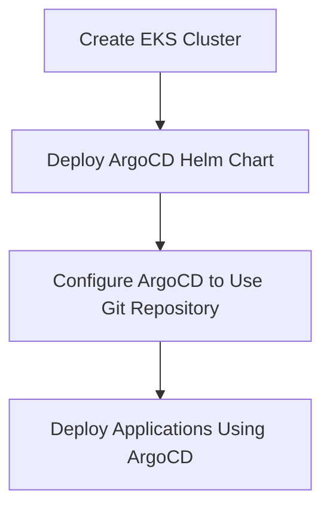

## Introduction to ArgoCD in DevSecOps

ArgoCD is an open-source declarative continuous delivery tool for Kubernetes applications. It allows you to manage your application deployments using GitOps principles, ensuring that your application's desired state is stored in a Git repository. This approach provides a single source of truth for your infrastructure and applications, making it easier to manage and audit changes.

### Git Repository Configuration

In the context of ArgoCD, the Git repository serves as the central store for your application manifests and configurations. The URL of the Git repository is the address where the repository is hosted. For example:

```plaintext
https://gitlab.com/myorg/myrepo.git
```

#### Authentication Methods

When interacting with a private Git repository, you typically use one of two methods for authentication:

1. **SSH Keys**: SSH keys provide a secure way to authenticate without needing to enter a password each time. However, SSH keys are not suitable for automated pipelines because they require manual intervention to unlock the key.

2. **HTTP Credentials**: Using a username and password to authenticate via HTTP is another method. However, storing your personal GitLab account credentials in the pipeline is insecure and should be avoided.

To securely authenticate with the Git repository in an automated pipeline, you should use a **deploy token**. A deploy token is a special type of token that has limited permissions and is specifically designed for use in CI/CD pipelines.

### Deploy Tokens

Deploy tokens are generated within the settings of your Git repository. They consist of a username and a token, which acts as the password. Here’s how you can create a deploy token in GitLab:

1. Navigate to your project in GitLab.
2. Go to `Settings` > `Repository`.
3. Scroll down to the `Deploy Tokens` section.
4. Click on `Add deploy token`.
5. Enter a name for the token and specify the scope (read-only or read-write).
6. Click `Create`.

Once created, you will receive a username and token. These credentials should be used to authenticate with the Git repository in your pipeline.

#### Parameterization and Secure Storage

The deploy token credentials should be parameterized and stored securely. This ensures that sensitive information is not hardcoded in your pipeline scripts. You can use tools like HashiCorp Vault, AWS Secrets Manager, or environment variables managed by your CI/CD platform to store and retrieve these credentials securely.

Here’s an example of how you might configure these parameters in a Terraform script:

```hcl
variable "git_username" {
  description = "Username for the Git repository"
}

variable "git_token" {
  description = "Token for the Git repository"
  sensitive = true
}
```

### Kubernetes Secret for ArgoCD

In ArgoCD, the credentials to access the Git repository are stored in a Kubernetes Secret. This secret is used by ArgoCD to authenticate with the Git repository when deploying applications.

Here’s an example of how you might define this secret in a Kubernetes manifest:

```yaml
apiVersion: v1
kind: Secret
metadata:
  name: argocd-repo-creds-myrepo
  namespace: argocd
type: Opaque
data:
  username: <base64-encoded-username>
  password: <base64-encoded-token>
```

To create this secret, you would base64 encode the deploy token credentials:

```sh
echo -n 'mydeploytokenusername' | base64
echo -n 'mydeploytokenpassword' | base64
```

Then, you can apply the secret using `kubectl`:

```sh
kubectl apply -f argocd-repo-creds-myrepo.yaml
```

### Dependency Management in Terraform

When deploying ArgoCD, it is important to ensure that the Helm chart for ArgoCD is deployed only after the EKS cluster has been created and provisioned. This can be achieved by defining dependencies in your Terraform script.

Here’s an example of how you might define these dependencies:

```hcl
resource "aws_eks_cluster" "example" {
  name     = "example-cluster"
  role_arn = aws_iam_role.example.arn
  vpc_config {
    subnet_ids = [aws_subnet.example.id]
  }
}

resource "helm_release" "argocd" {
  name       = "argocd"
  repository = "https://argoproj.github.io/argo-helm"
  chart      = "argo-cd"
  depends_on = [aws_eks_cluster.example]
}
```

In this example, the `depends_on` attribute ensures that the `helm_release.argocd` resource is only created after the `aws_eks_cluster.example` resource has been successfully created.

### Mermaid Diagrams

Let’s visualize the dependency management using a mermaid diagram:



### Real-World Examples and Security Implications

#### Recent Breaches and CVEs

One notable breach involving Git repositories occurred in 2021 when a developer accidentally pushed their SSH private key to a public GitHub repository. This exposed their credentials to anyone who could access the repository. This incident highlights the importance of securing your credentials and ensuring they are not accidentally committed to a public repository.

#### Secure Coding Practices

To prevent such incidents, you should follow these secure coding practices:

1. **Use Deploy Tokens**: Always use deploy tokens for automated pipelines instead of personal credentials.
2. **Secure Storage**: Store sensitive information securely using tools like HashiCorp Vault or AWS Secrets Manager.
3. **Automated Scanning**: Implement automated scanning tools to detect and prevent the accidental commit of sensitive information.

Here’s an example of how you might implement these practices in a Terraform script:

```hcl
# Define sensitive variables
variable "git_username" {
  description = "Username for the Git repository"
}

variable "git_token" {
  description = "Token for the Git repository"
  sensitive = true
}

# Retrieve secrets from a secure storage
data "aws_secretsmanager_secret_version" "git_creds" {
  secret_id = var.secret_id
}

locals {
  git_username = data.aws_secretsmanager_secret_version.git_creds.secret_string
  git_token = data.aws_secretsmanager_secret_version.git_creds.secret_string
}

# Create Kubernetes Secret
resource "kubernetes_secret" "argocd_repo_creds" {
  metadata {
    name = "argocd-repo-creds-myrepo"
    namespace = "argocd"
  }
  data = {
    username = base64encode(local.git_username)
    password = base64encode(local.git_token)
  }
  type = "Opaque"
}
```

### How to Prevent / Defend

#### Detection

To detect unauthorized access to your Git repository, you can enable audit logs and monitor them for suspicious activity. Tools like GitLab’s Audit Events or GitHub’s Security Alerts can help you identify potential breaches.

#### Prevention

1. **Limit Permissions**: Ensure that deploy tokens have the minimum necessary permissions.
2. **Regular Audits**: Regularly review access logs and permissions to detect and prevent unauthorized access.
3. **Two-Factor Authentication**: Enable two-factor authentication for all users with access to the Git repository.

#### Secure-Coding Fixes

Here’s an example of how you might correct a vulnerable configuration:

**Vulnerable Configuration:**

```hcl
resource "kubernetes_secret" "argocd_repo_creds" {
  metadata {
    name = "argocd-repo-creds-myrepo"
    namespace = "argocd"
  }
  data = {
    username = "mydeploytokenusername"
    password = "mydeploytokenpassword"
  }
  type = "Opaque"
}
```

**Secure Configuration:**

```hcl
resource "kubernetes_secret" "argocd_repo_creds" {
  metadata {
    name = "argocd-repo-creds-myrepo"
    namespace = "argocd"
  }
  data = {
    username = base64encode(data.aws_secretsmanager_secret_version.git_creds.secret_string)
    password = base64encode(data.aws_se_cretsmanager_secret_version.git_creds.secret_string)
  }
  type = "Opaque"
}
```

### Complete Example

Here’s a complete example of how you might configure ArgoCD in your IaC pipeline:

#### Terraform Script

```hcl
provider "aws" {
  region = "us-west-2"
}

variable "secret_id" {
  description = "ID of the secret in AWS Secrets Manager"
}

data "aws_secretsmanager_secret_version" "git_creds" {
  secret_id = var.secret_id
}

locals {
  git_username = data.aws_secretsmanager_secret_version.git_creds.secret_string
  git_token = data.aws_secretsmanager_secret_version.git_creds.secret_string
}

resource "aws_eks_cluster" "example" {
  name     = "example-cluster"
  role_arn = aws_iam_role.example.arn
  vpc_config {
    subnet_ids = [aws_subnet.example.id]
  }
}

resource "helm_release" "argocd" {
  name       = "argocd"
  repository = "https://argoproj.github.io/argo-helm"
  chart      = "argo-cd"
  depends_on = [aws_eks_cluster.example]
}

resource "kubernetes_secret" "argocd_repo_creds" {
  metadata {
    name = "argocd-repo-creds-myrepo"
    namespace = "argocd"
  }
  data = {
    username = base64encode(local.git_username)
    password = base64encode(local.git_token)
  }
  type = "Opaque"
}
```

#### Full HTTP Request and Response

Here’s an example of a full HTTP request and response for creating a deploy token in GitLab:

**Request:**

```http
POST /api/v4/projects/:id/deploy_tokens HTTP/1.1
Host: gitlab.com
Authorization: Bearer <your_access_token>
Content-Type: application/json

{
  "name": "ci-deploy-token",
  "username": "ci-deploy-user",
  "scope": "read_repository"
}
```

**Response:**

```http
HTTP/1.1 201 Created
Content-Type: application/json

{
  "id": 123,
  "title": "ci-deploy-token",
  "username": "ci-deploy-user",
  "token": "abc123def456ghi789",
  "expires_at": null,
  "created_at": "2023-01-01T00:00:00Z",
  "scopes": ["read_repository"]
}
```

### Practice Labs

For hands-on practice with ArgoCD and GitOps, consider the following labs:

- **PortSwigger Web Security Academy**: Focuses on web application security but includes modules on GitOps and CI/CD pipelines.
- **OWASP Juice Shop**: A deliberately insecure web application for practicing security testing.
- **Kubernetes Goat**: A Kubernetes-based security training platform that includes exercises on GitOps and CI/CD pipelines.

These labs will help you gain practical experience in configuring and securing ArgoCD in your DevSecOps pipeline.

By following these detailed steps and best practices, you can effectively configure and secure ArgoCD in your IaC pipeline, ensuring that your application deployments are both efficient and secure.

---
<!-- nav -->
[[10-Introduction to ArgoCD in DevSecOps Part 2|Introduction to ArgoCD in DevSecOps Part 2]] | [[DevSecOps/DevSecOps Bootcamp/07-CI CD Security Pipeline/01-App Release Pipeline with ArgoCD/Configure ArgoCD in IaC Deploy Argo Part 1/00-Overview|Overview]] | [[12-Configuring ArgoCD in Infrastructure as Code (IaC)|Configuring ArgoCD in Infrastructure as Code (IaC)]]
