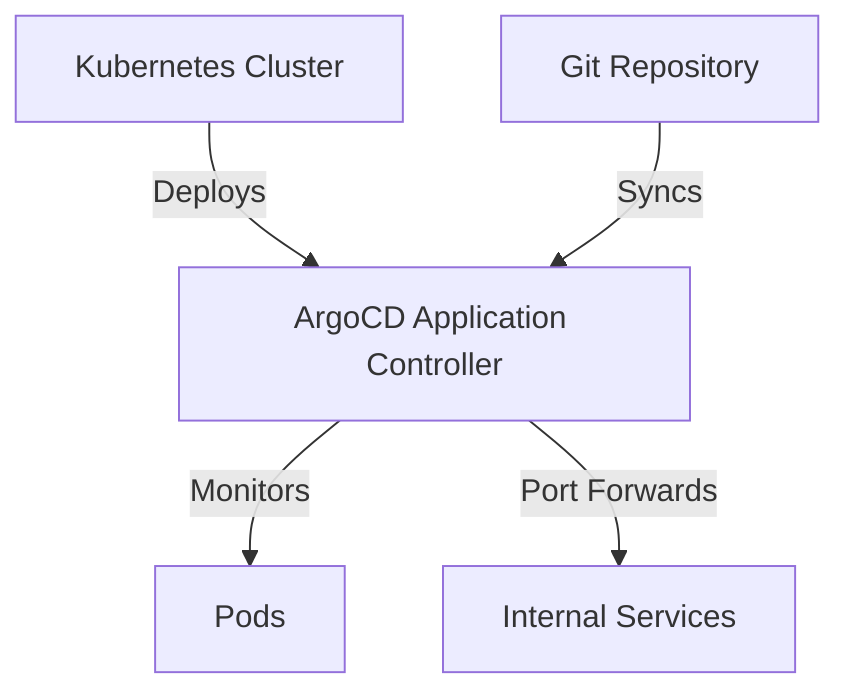
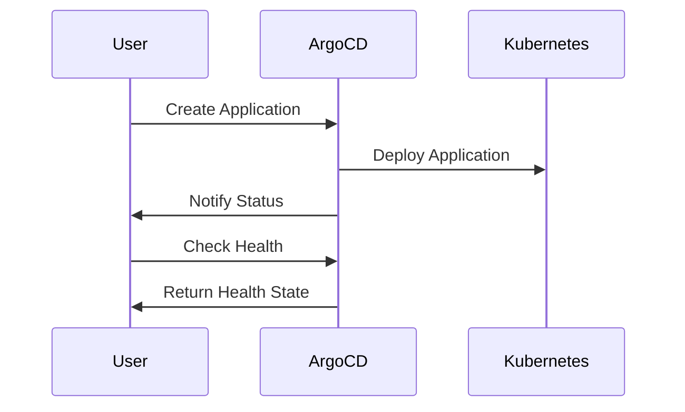

## Configuring ArgoCD in Infrastructure as Code (IaC)

### Introduction to ArgoCD and IaC

ArgoCD is a declarative, GitOps continuous delivery tool for Kubernetes. It enables you to manage your applications using Git repositories, ensuring that your cluster state matches the desired state defined in your Git repository. This approach aligns with the principles of Infrastructure as Code (IaC), where infrastructure is managed through version-controlled code.

### Minimum Required Permissions

When configuring ArgoCD, it is crucial to follow security best practices. One such practice is to define the minimum required permissions for roles and users. This principle, often referred to as the Principle of Least Privilege (PoLP), ensures that entities have only the permissions necessary to perform their tasks. This reduces the attack surface and minimizes the potential damage in case of a breach.

#### Example: Defining Minimum Permissions

Let's consider a scenario where we need to configure ArgoCD in a Kubernetes cluster. We start by defining the minimum required permissions for the ArgoCD application controller.

```yaml
apiVersion: rbac.authorization.k8s.io/v1
kind: ClusterRole
metadata:
  name: argocd-minimum-permissions
rules:
- apiGroups: [""]
  resources: ["pods"]
  verbs: ["get", "list", "watch"]
```

This `ClusterRole` grants the minimum permissions required to interact with pods. The `verbs` field specifies the actions allowed (`get`, `list`, `watch`). These permissions are essential for monitoring and managing the state of the pods.

### Incremental Permission Addition

If the role or user requires additional permissions, they should be added incrementally rather than granting all permissions upfront. This approach ensures that permissions are granted only as needed, maintaining the principle of least privilege.

#### Example: Adding Additional Permissions

Suppose we need to enable port forwarding for the ArgoCD application controller. We can add the `create` permission for `portforward`.

```yaml
apiVersion: rbac.authorization.k8s.io/v
kind: ClusterRole
metadata:
  name: argocd-minimum-permissions
rules:
- apiGroups: [""]
  resources: ["pods"]
  verbs: ["get", "list", "watch", "create"]
- apiGroups: [""]
  resources: ["pods/portforward"]
  verbs: ["create"]
```

This `ClusterRole` now includes the `create` permission for `portforward`, allowing the ArgoCD application controller to port forward internal services from the cluster.

### Creating the ArgoCD Application

To deploy an application using ArgoCD, we need to create an ArgoCD application. This application acts as an interface to monitor the deployment status, health state, and synchronization with the Git repository.

#### Example: Creating an ArgoCD Application

Let's create an ArgoCD application that deploys an application from a Git repository.

```yaml
apiVersion: argoproj.io/v1alpha1
kind: Application
metadata:
  name: my-app
spec:
  project: default
  source:
    repoURL: https://github.com/myorg/myapp.git
    targetRevision: HEAD
    path: kubernetes
  destination:
    server: https://kubernetes.default.svc
    namespace: my-app-namespace
  syncPolicy:
    automated:
      prune: true
      selfHeal: true
```

This `Application` resource defines the details of the application to be deployed. The `source` section specifies the Git repository URL and the branch to be used. The `destination` section specifies the Kubernetes cluster and namespace where the application will be deployed.

### Monitoring and Health State

The ArgoCD application provides insights into the health state of the application, including whether it is synced with the Git repository and which version it is running.

#### Example: Monitoring Application Health

To monitor the health state of the application, you can use the ArgoCD CLI:

```sh
argocd app get my-app
```

This command retrieves the current status of the `my-app` application, including its health state and synchronization status.

### Real-World Examples and CVEs

Recent breaches and CVEs highlight the importance of following security best practices when configuring ArgoCD. For instance, CVE-2021-20225 affected ArgoCD versions prior to 1.7.12, allowing unauthorized access to the ArgoCD API server. Ensuring that you follow the principle of least privilege and regularly update your ArgoCD installation can help mitigate such vulnerabilities.

### How to Prevent / Defend

#### Detection

To detect potential issues with ArgoCD configurations, you can use tools like `kube-bench` and `trivy`. These tools can scan your Kubernetes cluster and ArgoCD configurations for misconfigurations and vulnerabilities.

```sh
kube-bench run --check=rbac
trivy kubernetes
```

#### Prevention

To prevent security issues, ensure that you:

1. **Follow the Principle of Least Privilege**: Define minimal permissions and incrementally add permissions as needed.
2. **Regularly Update ArgoCD**: Keep your ArgoCD installation up-to-date with the latest security patches.
3. **Use Secure Configurations**: Ensure that your ArgoCD configurations follow best practices and are regularly audited.

#### Secure Coding Fixes

Here is an example of a vulnerable configuration and its secure counterpart:

**Vulnerable Configuration:**

```yaml
apiVersion: rbac.authorization.k8s.io/v1
kind: ClusterRole
metadata:
  name: argocd-vulnerable
rules:
- apiGroups: [""]
  resources: ["*"]
  verbs: ["*"]
```

**Secure Configuration:**

```yaml
apiVersion: rbac.authorization.k8s.io/v1
kind: ClusterRole
metadata:
  name: argocd-secure
rules:
- apiGroups: [""]
  resources: ["pods"]
  verbs: ["get", "list", "watch", "create"]
- apiGroups: [""]
  resources: ["pods/portforward"]
  verbs: ["create"]
```

### Mermaid Diagrams

#### Kubernetes Cluster Topology



#### ArgoCD Application Flow



### Practice Labs

For hands-on experience with configuring ArgoCD in IaC, consider the following labs:

- **PortSwigger Web Security Academy**: Offers exercises on securing Kubernetes clusters and deploying applications using ArgoCD.
- **OWASP Juice Shop**: Provides a vulnerable web application that can be deployed using ArgoCD, allowing you to practice securing the deployment process.
- **CloudGoat**: Focuses on cloud security and offers scenarios for deploying and securing applications using ArgoCD in a Kubernetes cluster.

By following these detailed steps and best practices, you can effectively configure ArgoCD in your IaC pipeline while maintaining robust security measures.

---
<!-- nav -->
[[11-Introduction to ArgoCD in DevSecOps|Introduction to ArgoCD in DevSecOps]] | [[DevSecOps/DevSecOps Bootcamp/07-CI CD Security Pipeline/01-App Release Pipeline with ArgoCD/Configure ArgoCD in IaC Deploy Argo Part 1/00-Overview|Overview]] | [[DevSecOps/DevSecOps Bootcamp/07-CI CD Security Pipeline/01-App Release Pipeline with ArgoCD/Configure ArgoCD in IaC Deploy Argo Part 1/13-Practice Questions & Answers|Practice Questions & Answers]]
