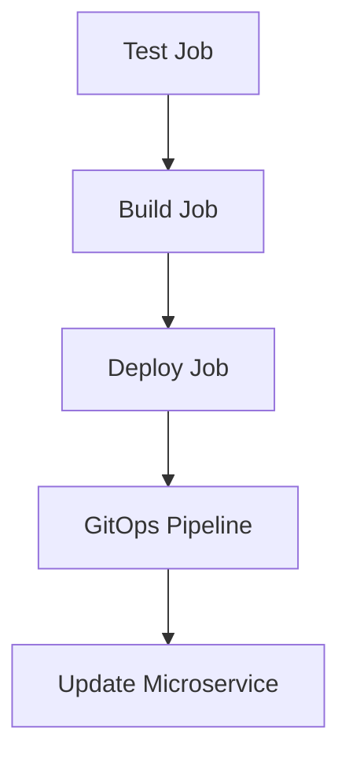

## Introduction to App Release Pipeline with ArgoCD

In the realm of DevSecOps, the integration of Continuous Integration (CI) and Continuous Delivery (CD) pipelines is crucial for ensuring that applications are built, tested, and deployed efficiently and securely. One of the key tools used in this process is ArgoCD, an open-source declarative continuous delivery tool for Kubernetes. This chapter will delve into creating a CI pipeline that triggers a GitOps pipeline using ArgoCD, focusing on the specifics of testing, building, and deploying microservices.

### Background Theory

Before diving into the practical aspects, let's understand the theoretical underpinnings of CI/CD and GitOps.

#### Continuous Integration (CI)

Continuous Integration is a practice where developers frequently merge their code changes into a central repository, after which automated builds and tests are run. The primary goal is to detect and address integration issues early, reducing the chances of bugs making it into production.

#### Continuous Delivery (CD)

Continuous Delivery extends CI by ensuring that the software can be released to production at any time. This involves automating the deployment process so that it can be executed reliably and repeatedly.

#### GitOps

GitOps is an operational framework that uses Git as a single source of truth for infrastructure and application deployments. It leverages Git's version control capabilities to manage the state of the system, enabling declarative updates and rollbacks.

### Microservices Lifecycle

Microservices are designed to have independent lifecycles, meaning they can be developed, tested, and deployed independently of other services. This approach allows for more agile development and faster releases.

### Setting Up the CI Pipeline

To create a CI pipeline that triggers a GitOps pipeline using ArgoCD, we need to follow several steps:

1. **Define the CI Pipeline**: This involves setting up a pipeline that runs tests, builds new images, and triggers the GitOps pipeline.
2. **Configure Environment Variables**: These variables will be passed to the GitOps pipeline to specify the microservice and the new image tag.
3. **Trigger the GitOps Pipeline**: Once the CI pipeline completes successfully, it should trigger the GitOps pipeline to update the microservice in the Kubernetes cluster.

### Detailed Steps

#### Step 1: Define the CI Pipeline

Let's start by defining the CI pipeline. We'll use GitLab CI as our CI tool, but the principles apply to other CI tools like Jenkins or GitHub Actions.

```yaml
stages:
  - test
  - build
  - deploy

test_job:
  stage: test
  script:
    - echo "Running security scans and unit tests"
    - ./run_tests.sh

build_job:
  stage: build
  script:
    - echo "Building new Docker image"
    - ./build_image.sh
  artifacts:
    paths:
      - docker-image.tar

deploy_job:
  stage: deploy
  script:
    - echo "Triggering GitOps pipeline"
    - ./trigger_gitops_pipeline.sh
  dependencies:
    - build_job
```

This pipeline defines three stages: `test`, `build`, and `deploy`. Each stage corresponds to a job that performs a specific task.

- **Test Job**: Runs security scans and unit tests.
- **Build Job**: Builds a new Docker image.
- **Deploy Job**: Triggers the GitOps pipeline to update the microservice.

#### Step 2: Configure Environment Variables

Environment variables are crucial for passing information between the CI pipeline and the GitOps pipeline. In our case, we need to pass the name of the microservice and the new image tag.

```yaml
variables:
  MICROSERVICE_NAME: "ad-service"
  NEW_IMAGE_TAG: "latest"
```

These variables will be automatically set for the pipeline that this job triggers.

#### Step 3: Trigger the GitOps Pipeline

The final step is to trigger the GitOps pipeline. This involves updating the ArgoCD application configuration to reflect the new image tag.

```bash
#!/bin/bash

# Trigger the GitOps pipeline
argocd app sync $MICROSERVICE_NAME --prune --health-history-size 10
```

This script uses `argocd` to synchronize the specified microservice with the latest image tag.

### Example: Full CI Pipeline Configuration

Here is a complete example of a CI pipeline configuration that includes all the necessary steps:

```yaml
stages:
  - test
  - build
  - deploy

variables:
  MICROSERVICE_NAME: "ad-service"
  NEW_IMAGE_TAG: "latest"

test_job:
  stage: test
  script:
    - echo "Running security scans and unit tests"
    - ./run_tests.sh

build_job:
  stage: build
  script:
    - echo "Building new Docker image"
    - ./build_image.sh
  artifacts:
    paths:
      - docker-image.tar

deploy_job:
  stage: deploy
  script:
    - echo "Triggering GitOps pipeline"
    - argocd app sync $MICROSERVICE_NAME --prune --health-history-size 1
  dependencies:
    - build_job
```

### Mermaid Diagrams

Let's visualize the pipeline flow using a mermaid diagram:



### Real-World Examples

#### Recent CVEs and Breaches

One recent example of a breach related to CI/CD pipelines is the SolarWinds supply chain attack. In this case, attackers compromised the SolarWinds build server, injecting malicious code into the software updates. This highlights the importance of securing the entire CI/CD pipeline, including the build and deployment processes.

### Pitfalls and Common Mistakes

#### Misconfigured Environment Variables

One common mistake is misconfiguring environment variables, leading to incorrect behavior in the pipeline. For example, if the `NEW_IMAGE_TAG` variable is not correctly set, the GitOps pipeline may fail to update the microservice with the correct image.

#### Insecure Build Processes

Another pitfall is insecure build processes. If the build process does not properly validate inputs or use secure coding practices, it can introduce vulnerabilities into the final image.

### How to Prevent / Defend

#### Detection

To detect issues in the CI/CD pipeline, you can use tools like:

- **Static Code Analysis**: Tools like SonarQube can analyze the codebase for potential security vulnerabilities.
- **Container Scanning**: Tools like Clair can scan Docker images for known vulnerabilities.

#### Prevention

To prevent issues, follow these best practices:

- **Secure Build Processes**: Ensure that the build process uses secure coding practices and validates all inputs.
- **Automated Testing**: Implement comprehensive automated testing, including security scans and unit tests.
- **Immutable Infrastructure**: Use immutable infrastructure to ensure that once a container is built, it cannot be modified.

#### Secure Coding Fixes

Here is an example of a vulnerable and secure version of a build script:

**Vulnerable Version**

```bash
#!/bin/bash

# Vulnerable build script
docker build -t my-image:$IMAGE_TAG .
```

**Secure Version**

```bash
#!/bin/bash

# Secure build script
docker build --build-arg IMAGE_TAG=$IMAGE_TAG -t my-image:$IMAGE_TAG .
```

### Complete Example: Full HTTP Request and Response

Here is a complete example of a full HTTP request and response for triggering the GitOps pipeline:

#### HTTP Request

```http
POST /api/v1/namespaces/default/pods HTTP/1.1
Host: kubernetes.default.svc.cluster.local
Authorization: Bearer <token>
Content-Type: application/json

{
  "apiVersion": "v1",
  "kind": "Pod",
  "metadata": {
    "name": "gitops-pipeline-trigger"
  },
  "spec": {
    "containers": [
      {
        "name": "gitops-pipeline",
        "image": "my-image:latest",
        "command": ["sh", "-c", "argocd app sync $MICROSERVICE_NAME --prune --health-history-size 1"]
      }
    ]
  }
}
```

#### HTTP Response

```http
HTTP/1.1 201 Created
Date: Mon, 01 Jan 2024 00:00:00 GMT
Content-Type: application/json

{
  "kind": "Pod",
  "apiVersion": "v1",
  "metadata": {
    "name": "gitops-pipeline-trigger",
    "namespace": "default",
    "selfLink": "/api/v1/namespaces/default/pods/gitops-pipeline-trigger",
    "uid": "abcd1234-abcd-1234-abcd-1234abcd1234",
    "resourceVersion": "123456789",
    "creationTimestamp": "2024-01-01T00:00:00Z"
  },
  "spec": {
    "containers": [
      {
        "name": "gitops-pipeline",
        "image": "my-image:latest",
        "command": ["sh", "-c", "argocd app sync $MICROSERVICE_NAME --prune --health-history-size 1"]
      }
    ]
  },
  "status": {
    "phase": "Pending",
    "conditions": [
      {
        "type": "Initialized",
        "status": "True",
        "lastProbeTime": null,
        "lastTransitionTime": "2024-01-01T00:00:00Z"
      }
    ],
    "containerStatuses": [
      {
        "name": "gitops-pipeline",
        "state": {
          "waiting": {
            "reason": "ContainerCreating"
          }
        },
        "lastState": {},
        "ready": false,
        "restartCount": 0,
        "image": "my-image:latest",
        "imageID": "",
        "containerID": ""
      }
    ],
    "qosClass": "Guaranteed"
  }
}
```

### Hands-On Labs

For hands-on practice, consider the following labs:

- **PortSwigger Web Security Academy**: Offers a variety of labs focused on web application security.
- **OWASP Juice Shop**: A deliberately insecure web application for practicing web security skills.
- **DVWA (Damn Vulnerable Web Application)**: Another popular web application for learning web security.
- **WebGoat**: An interactive training application for learning about web application security.

### Conclusion

In conclusion, creating a CI pipeline that triggers a GitOps pipeline using ArgoCD involves several steps, including defining the pipeline, configuring environment variables, and triggering the GitOps pipeline. By following best practices and using secure coding techniques, you can ensure that your CI/CD pipeline is both efficient and secure.

---
<!-- nav -->
[[DevSecOps/DevSecOps Bootcamp/07-CI CD Security Pipeline/01-App Release Pipeline with ArgoCD/Create CI Pipeline that triggers GitOps Pipeline/00-Overview|Overview]] | [[DevSecOps/DevSecOps Bootcamp/07-CI CD Security Pipeline/01-App Release Pipeline with ArgoCD/Create CI Pipeline that triggers GitOps Pipeline/02-Introduction to CICD Pipelines and GitOps Part 1|Introduction to CICD Pipelines and GitOps Part 1]]
