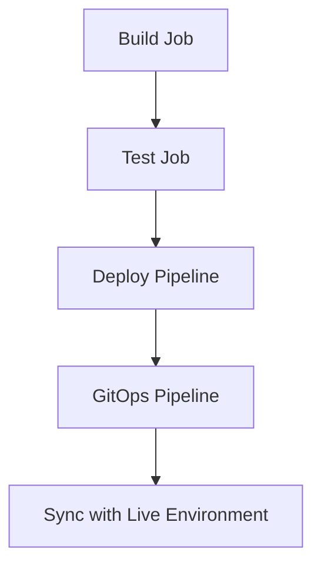

## Introduction to CI/CD Pipelines and GitOps

In the realm of DevSecOps, continuous integration (CI) and continuous delivery (CD) pipelines play a crucial role in automating the software development lifecycle. These pipelines ensure that code changes are automatically tested, built, and deployed to production environments in a reliable and consistent manner. One of the key principles in modern CI/CD practices is GitOps, which leverages Git as a single source of truth for infrastructure and application deployments.

### What is GitOps?

GitOps is an operational framework that uses Git as the single source of truth for declarative infrastructure and application configurations. This approach allows teams to manage their infrastructure and applications using Git workflows, enabling version control, collaboration, and automated deployment processes. By treating infrastructure as code, GitOps ensures that all changes go through a review process, reducing the risk of human error and improving traceability.

### Why GitOps Matters

GitOps offers several benefits:

- **Version Control**: All changes to infrastructure and applications are tracked in Git, providing a history of modifications.
- **Collaboration**: Teams can collaborate on infrastructure and application changes using familiar Git workflows.
- **Automated Deployment**: Changes pushed to Git can automatically trigger deployment pipelines, ensuring consistency and reliability.
- **Auditability**: Every change is recorded, making it easier to audit and track who made what changes and when.

### How GitOps Works

The GitOps workflow typically involves the following steps:

1. **Define Infrastructure as Code**: Write declarative definitions for your infrastructure and applications using tools like Kubernetes manifests, Helm charts, or Ansible playbooks.
2. **Commit to Git**: Commit these definitions to a Git repository.
3. **Trigger CI/CD Pipeline**: When changes are committed, a CI/CD pipeline is triggered to build, test, and deploy the changes.
4. **Sync with Live Environment**: A GitOps tool like Argo CD continuously monitors the Git repository and syncs the live environment with the desired state defined in Git.

### Example: GitOps with Argo CD

Argo CD is a popular open-source tool for implementing GitOps in Kubernetes environments. It provides a declarative way to manage and deploy applications, ensuring that the live environment matches the desired state defined in Git.

#### Setting Up Argo CD

To set up Argo CD, you need to install it in your Kubernetes cluster and configure it to watch a Git repository. Here’s a basic setup:

```bash
# Install Argo CD using kubectl
kubectl create namespace argocd
kubectl apply -n argocd -f https://raw.githubusercontent.com/argoproj/argo-cd/stable/manifests/install.yaml

# Initialize Argo CD
argocd server start --admin.password=admin123
```

Once installed, you can configure Argo CD to watch a Git repository containing your Kubernetes manifests.

### Creating a CI Pipeline that Triggers a GitOps Pipeline

In this section, we will create a CI pipeline that triggers a GitOps pipeline using GitLab CI and Argo CD. The goal is to simulate the stages and steps of the pipeline and ensure that the final job triggers the deployment of a new image in the Kubernetes cluster.

#### Simulating Stages and Steps

Let’s assume we have three jobs in our CI pipeline:

1. **Build Job**: Compiles the application code and builds a Docker image.
2. **Test Job**: Runs unit tests and integration tests.
3. **Deploy Job**: Triggers the GitOps pipeline to update the Kubernetes manifest file with the new image.

Here’s how you can define these jobs in a `.gitlab-ci.yml` file:

```yaml
stages:
  - build
  - test
  - deploy

build_job:
  stage: build
  script:
    - echo "Building the application..."
    - docker build -t myapp:latest .

test_job:
  stage: test
  script:
    - echo "Running tests..."
    - pytest

deploy_pipeline:
  stage: deploy
  script:
    - echo "Triggering the GitOps pipeline..."
    - argocd app sync myapp
```

### Triggering the GitOps Pipeline

The `deploy_pipeline` job is responsible for triggering the GitOps pipeline. This job will execute the `argocd app sync` command to sync the live environment with the desired state defined in Git.

#### Using the Trigger Attribute

To ensure that the `deploy_pipeline` job waits for the GitOps pipeline to complete, we can use the `trigger` attribute in GitLab CI. This attribute allows us to specify another pipeline to trigger and wait for its completion.

Here’s how you can modify the `deploy_pipeline` job to use the `trigger` attribute:

```yaml
deploy_pipeline:
  stage: deploy
  trigger:
    project: myorg/myproject
    branch: main
    strategy: depend
```

This configuration tells GitLab CI to trigger the pipeline in the `myorg/myproject` repository on the `main` branch and wait for its completion before marking the `deploy_pipeline` job as successful.

### Understanding the `depend` Strategy

The `depend` strategy ensures that the `deploy_pipeline` job waits for the triggered pipeline to complete. If the triggered pipeline fails, the `deploy_pipeline` job will also fail, preventing further stages from executing.

#### Example of a Complete Pipeline

Here’s a complete example of a `.gitlab-ci.yml` file that includes the `deploy_pipeline` job with the `trigger` attribute:

```yaml
stages:
  - build
  - test
  - deploy

build_job:
  stage: build
  script:
    - echo "Building the application..."
    - docker build -t myapp:latest .

test_job:
  stage: test
  script:
    - echo "Running tests..."
    - pytest

deploy_pipeline:
  stage: deploy
  trigger:
    project: myorg/myproject
    branch: main
    strategy: depend
```

### Mermaid Diagram of the Pipeline

A visual representation of the pipeline can help understand the flow better. Here’s a mermaid diagram illustrating the pipeline stages and the `deploy_pipeline` job:



### Common Pitfalls and Best Practices

When setting up a CI pipeline that triggers a GitOps pipeline, there are several common pitfalls to avoid:

1. **Incorrect Configuration**: Ensure that the `trigger` attribute is correctly configured with the correct project and branch.
2. **Timeouts**: Set appropriate timeouts for the `deploy_pipeline` job to avoid waiting indefinitely if the GitOps pipeline takes too long.
3. **Error Handling**: Implement proper error handling to ensure that the pipeline fails gracefully if any step fails.

### How to Prevent / Defend

To prevent issues and ensure the security and reliability of your CI/CD pipeline, follow these best practices:

1. **Secure Access**: Ensure that only authorized users can push changes to the Git repository and trigger the pipeline.
2. **Regular Audits**: Regularly audit the pipeline configurations and Git repositories to identify and mitigate potential security risks.
3. **Automated Testing**: Implement comprehensive automated testing to catch bugs and vulnerabilities early in the development cycle.

#### Secure Coding Fixes

Here’s an example of a vulnerable `.gitlab-ci.yml` file and its secure counterpart:

**Vulnerable Version:**

```yaml
deploy_pipeline:
  stage: deploy
  script:
    - argocd app sync myapp
```

**Secure Version:**

```yaml
deploy_pipeline:
  stage: deploy
  trigger:
    project: myorg/myproject
    branch: main
    strategy: depend
```

### Real-World Examples

Recent real-world examples of GitOps and CI/CD pipeline issues include:

- **CVE-2021-20225**: A vulnerability in GitLab CI allowed unauthorized access to pipeline secrets.
- **GitHub Actions Breach**: In 2021, a breach in GitHub Actions exposed sensitive information due to misconfigured pipelines.

These examples highlight the importance of securing your CI/CD pipelines and implementing best practices to prevent such issues.

### Conclusion

Creating a CI pipeline that triggers a GitOps pipeline is a powerful way to automate the deployment of applications in a Kubernetes environment. By leveraging Git as the single source of truth and using tools like Argo CD, you can ensure that your infrastructure and applications are managed consistently and reliably. Following best practices and implementing secure coding techniques can help prevent common pitfalls and ensure the security of your pipeline.

### Practice Labs

For hands-on practice with GitOps and CI/CD pipelines, consider the following labs:

- **PortSwigger Web Security Academy**: Offers exercises on securing web applications and pipelines.
- **OWASP Juice Shop**: Provides a vulnerable web application for practicing security testing and CI/CD integration.
- **CloudGoat**: Focuses on cloud security and can be used to practice securing CI/CD pipelines in cloud environments.

By combining theoretical knowledge with practical experience, you can master the art of creating robust and secure CI/CD pipelines using GitOps principles.

---
<!-- nav -->
[[DevSecOps/DevSecOps Bootcamp/07-CI CD Security Pipeline/01-App Release Pipeline with ArgoCD/Create CI Pipeline that triggers GitOps Pipeline/01-Introduction to App Release Pipeline with ArgoCD|Introduction to App Release Pipeline with ArgoCD]] | [[DevSecOps/DevSecOps Bootcamp/07-CI CD Security Pipeline/01-App Release Pipeline with ArgoCD/Create CI Pipeline that triggers GitOps Pipeline/00-Overview|Overview]] | [[03-Introduction to CICD Pipelines and GitOps Part 2|Introduction to CICD Pipelines and GitOps Part 2]]
