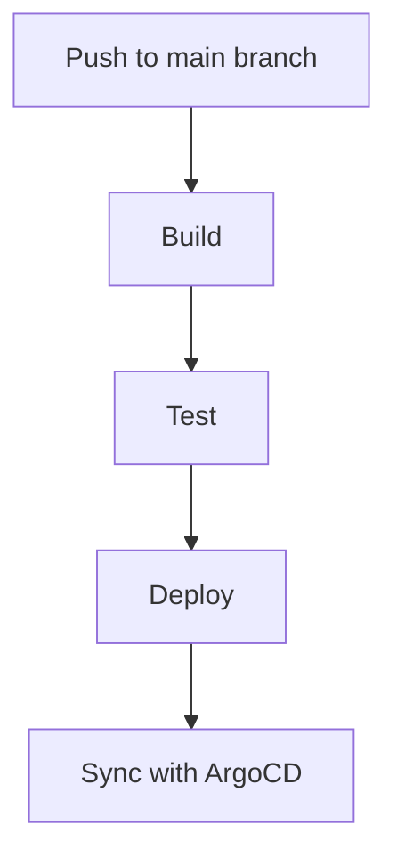

## Introduction to CI/CD Pipelines and GitOps

In the realm of DevSecOps, continuous integration (CI) and continuous deployment (CD) pipelines are essential tools for automating the software development lifecycle. These pipelines ensure that code changes are automatically tested, built, and deployed to production environments. GitOps is a set of practices that uses Git as a single source of truth for infrastructure and application deployments. This approach leverages version control systems to manage and automate the deployment process, ensuring consistency and traceability.

### Background Theory

Continuous Integration (CI) is the practice of merging all developers' working copies to a shared mainline several times a day. Each merge should be verified by an automated build and test process. Continuous Deployment (CD) extends CI by deploying all code changes to a staging environment, and optionally, to production, after the build stage.

GitOps is a methodology that uses Git as the single source of truth for infrastructure and application deployments. It involves using Git repositories to store the desired state of the system, and automated tools to reconcile the actual state with the desired state. This ensures that the system is always in a known, consistent state.

### Real-World Examples

Recent breaches and vulnerabilities have highlighted the importance of robust CI/CD and GitOps practices. For instance, the SolarWinds supply chain attack (CVE-2020-1014) demonstrated the risks of untrusted dependencies and the need for comprehensive testing and validation in CI/CD pipelines. Another example is the Log4j vulnerability (CVE-2021-44228), which underscored the importance of keeping dependencies up-to-date and monitoring for known vulnerabilities.

### Setting Up the CI Pipeline

To create a CI pipeline that triggers a GitOps pipeline, we will use ArgoCD, a popular open-source tool for GitOps-based deployments. We will start by cloning the `online-boutique` repository and setting up a CI pipeline in Visual Studio Code.

#### Cloning the Repository

First, we need to clone the `online-boutique` repository locally:

```bash
git clone https://github.com/argoproj/online-boutique.git
cd online-boutique
```

Next, we open the repository in Visual Studio Code:

```bash
code .
```

### Creating the CI Pipeline

We will create a CI pipeline using a YAML file. The pipeline will consist of three stages: `build`, `test`, and `deploy`. Each stage will have specific jobs that perform various tasks.

#### Stage 1: Build

The `build` stage will compile the code and build Docker images. Since the `online-boutique` application is open source and its images are already available publicly, we can skip the build step and directly pull the images from a registry.

```yaml
stages:
  - name: build
    jobs:
      - name: build-images
        steps:
          - run: echo "Skipping build step as images are already available."
```

#### Stage 2: Test

The `test` stage will run unit tests and automated scans to ensure the code quality and security.

```yaml
  - name: test
    jobs:
      - name: run-tests
        steps:
          - run: echo "Running unit tests..."
          - run: echo "Running automated scans..."
```

#### Stage 3: Deploy

The `deploy` stage will use ArgoCD to deploy the application to a Kubernetes cluster.

```yaml
  - name: deploy
    jobs:
      - name: deploy-to-kubernetes
        steps:
          - run: argocd app sync online-boutique --prune
```

### Full CI Pipeline Configuration

Here is the complete CI pipeline configuration:

```yaml
stages:
  - name: build
    jobs:
      - name: build-images
        steps:
          - run: echo "Skipping build step as images are already available."

  - name: test
    jobs:
      - name: run-tests
        steps:
          - run: echo "Running unit tests..."
          - run: echo "Running automated scans..."

  - name: deploy
    jobs:
      - name: deploy-to-kubernetes
        steps:
          - run: argocd app sync online-boutique --prune
```

### Automating the Pipeline

To automate the pipeline, we need to integrate it with a CI/CD platform like Jenkins, GitLab CI, or GitHub Actions. Here is an example using GitHub Actions:

```yaml
name: CI/CD Pipeline

on:
  push:
    branches:
      - main

jobs:
  build:
    runs-on: ubuntu-latest
    steps:
      - name: Checkout code
        uses: actions/checkout@v2

      - name: Skip build step
        run: echo "Skipping build step as images are already available."

  test:
    runs-on: ubuntu-latest
    steps:
      - name: Checkout code
        uses: actions/checkout@v2

      - name: Run unit tests
        run: echo "Running unit tests..."

      - name: Run automated scans
        run: echo "Running automated scans..."

  deploy:
    runs-on: ubuntu-latest
    steps:
      - name: Checkout code
        uses: actions/checkout@v2

      - name: Deploy to Kubernetes
        run: argocd app sync online-boutique --prune
```

### Mermaid Diagrams

Let's visualize the pipeline using a mermaid diagram:



### Pitfalls and Best Practices

#### Common Pitfalls

1. **Manual Steps**: Avoid manual steps in the pipeline. Everything should be automated.
2. **Dependency Management**: Ensure that all dependencies are managed and kept up-to-date.
3. **Security Scans**: Include security scans in the pipeline to catch vulnerabilities early.
4. **Environment Consistency**: Ensure that the development, testing, and production environments are consistent.

#### Best Practices

1. **Version Control**: Use version control for all configurations and code.
2. **Automated Testing**: Implement automated testing to catch bugs early.
3. **Continuous Monitoring**: Monitor the pipeline and applications for issues.
4. **Secure Coding**: Follow secure coding practices to prevent vulnerabilities.

### How to Prevent / Defend

#### Detection

1. **Logging and Monitoring**: Use logging and monitoring tools to detect issues in real-time.
2. **Security Scans**: Regularly run security scans to identify vulnerabilities.

#### Prevention

1. **Secure Dependencies**: Keep dependencies up-to-date and use tools like Snyk to monitor for known vulnerabilities.
2. **Code Reviews**: Conduct regular code reviews to catch security issues early.
3. **Access Controls**: Implement strict access controls to prevent unauthorized access.

#### Secure-Coding Fixes

Here is an example of a vulnerable code snippet and its secure version:

**Vulnerable Code**

```python
import os
import subprocess

def execute_command(command):
    subprocess.run(command, shell=True)
```

**Secure Code**

```python
import subprocess

def execute_command(command):
    subprocess.run(command.split(), check=True)
```

### Complete Example

Here is a complete example of a CI/CD pipeline configuration with ArgoCD:

```yaml
name: CI/CD Pipeline

on:
  push:
    branches:
      - main

jobs:
  build:
    runs-on: ubuntu-latest
    steps:
      - name: Checkout code
        uses: actions/checkout@v2

      - name: Skip build step
        run: echo "Skipping build step as images are already available."

  test:
    runs-on: ubuntu-latest
    steps:
      - name: Checkout code
        uses: actions/checkout@v2

      - name: Run unit tests
        run: echo "Running unit tests..."

      - name: Run automated scans
        run: echo "Running automated scans..."

  deploy:
    runs-on: ubuntu-latest
    steps:
      - name: Checkout code
        uses: actions/checkout@v2

      - name: Deploy to Kubernetes
        run: argocd app sync online-boutique --prune
```

### Hands-On Labs

For hands-on practice, consider the following labs:

- **PortSwigger Web Security Academy**: Focuses on web application security.
- **OWASP Juice Shop**: An intentionally insecure web application for learning.
- **DVWA (Damn Vulnerable Web Application)**: A PHP/MySQL web application that demonstrates web application vulnerabilities.
- **WebGoat**: An interactive, gamified training application for learning about web application security.

These labs provide practical experience in setting up and securing CI/CD pipelines and GitOps-based deployments.

### Conclusion

Creating a CI/CD pipeline that triggers a GitOps pipeline is a crucial step in automating the software development lifecycle. By using tools like ArgoCD and integrating with CI/CD platforms, we can ensure that our applications are consistently and securely deployed. Following best practices and implementing robust security measures will help prevent vulnerabilities and ensure the reliability of our systems.

---
<!-- nav -->
[[03-Introduction to CICD Pipelines and GitOps Part 2|Introduction to CICD Pipelines and GitOps Part 2]] | [[DevSecOps/DevSecOps Bootcamp/07-CI CD Security Pipeline/01-App Release Pipeline with ArgoCD/Create CI Pipeline that triggers GitOps Pipeline/00-Overview|Overview]] | [[05-Creating a CI Pipeline that Triggers a GitOps Pipeline Using ArgoCD|Creating a CI Pipeline that Triggers a GitOps Pipeline Using ArgoCD]]
