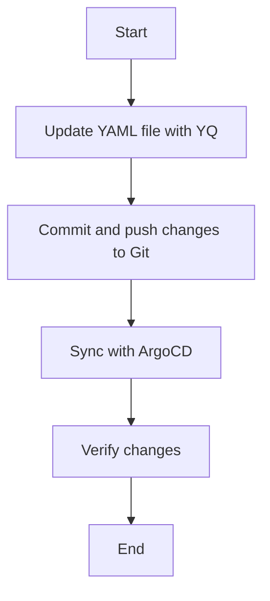
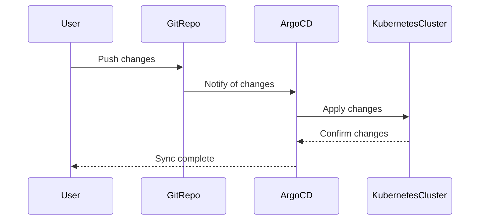

## Detailed Explanation of Concepts

### What is YQ?

YQ is a command-line tool for processing YAML files. It is similar to JQ, which is used for processing JSON files. YQ provides a powerful and flexible way to query and manipulate YAML files.

#### Syntax

The basic syntax of YQ is as follows:

```sh
yq [command] [file]
```

For example, to update a value in a YAML file:

```sh
yq e '.data.value = "updated-value"' example-configmap.yaml
```

#### Benefits

- **Ease of Use**: YQ provides a simple and intuitive syntax for querying and manipulating YAML files.
- **Flexibility**: YQ supports a wide range of operations, including filtering, sorting, and transforming data.

### What is Git?

Git is a distributed version control system that allows teams to collaborate on codebases. Git provides a robust set of features for tracking changes, resolving conflicts, and managing branches.

#### Benefits

- **Version Control**: Git allows teams to track changes to their codebase over time.
- **Collaboration**: Git enables multiple team members to work on the same codebase simultaneously.
- **Branching and Merging**: Git provides powerful branching and merging capabilities, allowing teams to work on different features and merge them seamlessly.

### What is a Kustomization File?

A Kustomization file is a manifest file that defines a set of resources to be applied to a Kubernetes cluster. It allows teams to customize and extend existing resources without modifying the original manifests.

#### Benefits

- **Modularity**: Kustomization files allow teams to define customizations for specific environments or use cases.
- **Reusability**: Kustomization files can be reused across different environments and projects.

### How Does ArgoCD Work?

ArgoCD works by continuously syncing the desired state defined in Git with the actual state of the Kubernetes cluster. It uses a declarative approach to manage applications, ensuring that the cluster remains in the desired state.

#### Key Components

- **Application Controller**: The application controller is responsible for syncing the desired state with the actual state.
- **Sync Operation**: The sync operation compares the desired state with the actual state and applies the necessary changes.
- **Health Check**: The health check ensures that the application is running correctly and meets the desired state.

### Real-World Examples

#### Recent CVEs and Breaches

One recent example of a breach involving GitOps is the SolarWinds supply chain attack. In this attack, attackers compromised the SolarWinds software supply chain, leading to widespread breaches across various organizations. While GitOps itself was not directly involved in the attack, it highlights the importance of securing the entire software supply chain.

#### Secure Coding Practices

To prevent similar attacks, teams should follow secure coding practices, such as:

- **Code Reviews**: Regularly review code changes to ensure they meet security standards.
- **Dependency Scanning**: Use tools like Trivy to scan dependencies for known vulnerabilities.
- **Least Privilege Principle**: Grant the minimum necessary permissions to users and services.

### How to Prevent / Defend

#### Detection

To detect potential issues, teams can use the following strategies:

- **Monitoring**: Monitor the Git repository and Kubernetes cluster for suspicious activity.
- **Logging**: Enable logging for all GitOps-related activities to track changes and identify potential issues.

#### Prevention

To prevent issues, teams can implement the following measures:

- **Access Controls**: Implement strict access controls to ensure that only authorized users can make changes to the Git repository and Kubernetes cluster.
- **Automated Testing**: Use automated testing to verify that changes meet the desired state and do not introduce security vulnerabilities.

#### Secure-Coding Fixes

Here is an example of a vulnerable and secure version of the pipeline job:

**Vulnerable Version**

```sh
#!/bin/sh

# Update the hardcoded value in the YAML file
yq e '.data.value = "updated-value"' manifests/example-configmap.yaml > manifests/example-configmap.yaml.tmp
mv manifests/example-configmap.yaml.tmp manifests/example-configmap.yaml

# Commit and push the changes to the repository
git add .
git commit -m "Update hardcoded value"
git push origin main
```

**Secure Version**

```sh
#!/bin/sh

# Update the hardcoded value in the YAML file
yq e '.data.value = "updated-value"' manifests/example-configmap.yaml > manifests/example-configmap.yaml.tmp
mv manifests/example-configmap.yaml.tmp manifests/example-configmap.yaml

# Commit and push the changes to the repository
git add .
git commit -m "Update hardcoded value"
git push origin main

# Run automated tests
make test
```

### Complete Example

Here is a complete example of the GitOps pipeline:

#### Dockerfile

```dockerfile
FROM gitlab/git-runner:alpine

RUN apk add --no-cache yq
```

#### GitOps Pipeline Job

```sh
#!/bin/sh

# Update the hardcoded value in the YAML file
yq e '.data.value = "updated-value"' manifests/example-configmap.yaml > manifests/example-configmap.yaml.tmp
mv manifests/example-configmap.yaml.tmp manifests/example-configmap.yaml

# Commit and push the changes to the repository
git add .
git commit -m "Update hardcoded value"
git push origin main

# Run automated tests
make test
```

#### .gitlab-ci.yml

```yaml
stages:
  - deploy

deploy_dev:
  stage: deploy
  script:
    - docker run --rm -v $(pwd):/workspace -w /workspace my-gitops-pipeline
```

### Mermaid Diagrams

#### GitOps Pipeline Flow



#### ArgoCD Sync Operation



### Common Pitfalls

- **Manual Changes**: Avoid making manual changes to the Kubernetes cluster outside of the GitOps pipeline.
- **Inconsistent State**: Ensure that the desired state defined in Git is consistent with the actual state of the Kubernetes cluster.
- **Security Vulnerabilities**: Regularly scan dependencies for known vulnerabilities and apply security patches.

### Practice Labs

For hands-on practice with GitOps and ArgoCD, consider the following labs:

- **PortSwigger Web Security Academy**: Focuses on web application security.
- **OWASP Juice Shop**: A deliberately insecure web application for practicing security skills.
- **DVWA (Damn Vulnerable Web Application)**: A PHP/MySQL web application that demonstrates insecure coding practices.
- **WebGoat**: An interactive web application that teaches web security lessons.
- **CloudGoat**: A collection of cloud misconfigurations and vulnerabilities for practicing cloud security.
- **flaws.cloud**: A cloud-native security training platform.
- **flaws2.cloud**: Another cloud-native security training platform.
- **AWS Official Workshops**: Provides hands-on labs for learning AWS services.
- **Pacu**: A penetration testing framework for AWS.
- **Kubernetes Goat**: A deliberately insecure Kubernetes cluster for practicing security skills.
- **OWASP WrongSecrets**: A series of challenges for practicing secure coding practices.
- **kube-hunter**: A tool for discovering and exploiting misconfigurations in Kubernetes clusters.

By following this comprehensive guide, you will gain a deep understanding of creating a GitOps pipeline to update a Kustomization file using ArgoCD.

---
<!-- nav -->
[[DevSecOps/DevSecOps Bootcamp/07-CI CD Security Pipeline/01-App Release Pipeline with ArgoCD/Create GitOps Pipeline to update Kustomization File/01-ArgoCD Overview|ArgoCD Overview]] | [[DevSecOps/DevSecOps Bootcamp/07-CI CD Security Pipeline/01-App Release Pipeline with ArgoCD/Create GitOps Pipeline to update Kustomization File/00-Overview|Overview]] | [[03-Introduction to GitOps and ArgoCD Part 1|Introduction to GitOps and ArgoCD Part 1]]
