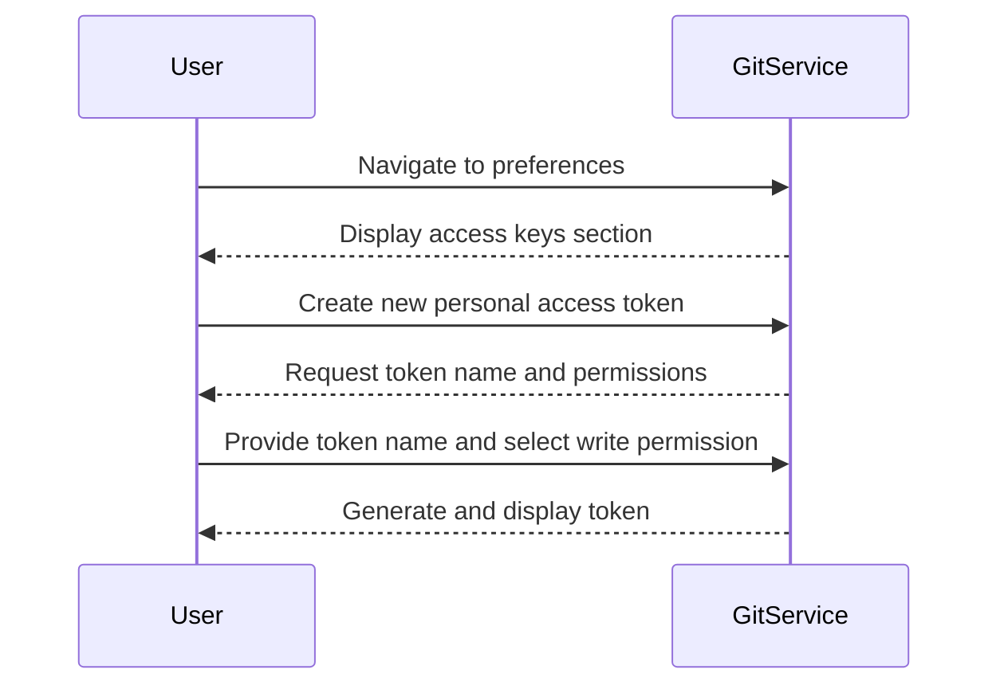

## Introduction to GitOps and ArgoCD

GitOps is an operational framework that uses Git as a single source of truth for declarative infrastructure and application configurations. By treating infrastructure as code, GitOps enables continuous deployment, automated rollbacks, and streamlined collaboration among teams. One of the key tools used in GitOps is ArgoCD, which provides a declarative, extensible, and easy-to-use continuous delivery tool for Kubernetes applications.

### What is GitOps?

GitOps is a methodology that combines the principles of Git and DevOps to manage infrastructure and applications. The core idea is to store all infrastructure and application configurations in a Git repository. This allows teams to leverage the benefits of version control, such as branching, merging, and pull requests, to manage changes to their systems.

#### Why GitOps Matters

- **Version Control**: GitOps leverages Git's powerful version control capabilities to track changes to infrastructure and applications.
- **Collaboration**: Teams can collaborate on changes through pull requests, ensuring that all modifications are reviewed and approved.
- **Auditability**: Every change is recorded in Git, providing a clear audit trail of who made what changes and when.
- **Automation**: GitOps enables automated deployments and rollbacks, reducing the risk of human error and speeding up the release process.

### What is ArgoCD?

ArgoCD is a declarative, extensible, and easy-to-use continuous delivery tool for Kubernetes applications. It is designed to work seamlessly with GitOps principles, allowing teams to manage their Kubernetes clusters using Git repositories.

#### Key Features of ArgoCD

- **Declarative Configuration**: ArgoCD uses declarative configuration files to define the desired state of the cluster.
- **Automated Syncing**: ArgoCD automatically syncs the actual state of the cluster with the desired state defined in the Git repository.
- **Rollback Mechanism**: In case of issues, ArgoCD can automatically roll back to a previous state.
- **Multi-Cluster Management**: ArgoCD supports managing multiple Kubernetes clusters from a single Git repository.

### Setting Up Access Token for Git Repository

To securely manage access to your Git repository, you can create a personal access token. This token acts as a secure alternative to using your username and password directly in your pipeline code.

#### Creating a Personal Access Token

1. **Navigate to Preferences**: Log in to your Git hosting service (e.g., GitHub, GitLab) and navigate to your account settings.
2. **Access Keys**: Look for the section related to access keys or personal access tokens.
3. **Create New Token**: Click on the option to create a new personal access token.
4. **Name the Token**: Give the token a descriptive name, such as `pipeline-push`.
5. **Set Permissions**: Choose the necessary permissions for the token. For updating a Kustomization file, you typically need write access to the repository.
6. **Generate Token**: Once you've set the permissions, generate the token. Make sure to copy and save the token immediately, as you won't be able to retrieve it later.



### Using the Personal Access Token in Your Pipeline

Once you have generated the personal access token, you need to configure your pipeline to use it securely.

#### Environment Variables

Instead of hardcoding the token directly into your pipeline code, it is best practice to use environment variables. This ensures that sensitive information is not exposed in your codebase.

```yaml
# Example Jenkinsfile
pipeline {
    agent any
    environment {
        GIT_TOKEN = credentials('git-token')
    }
    stages {
        stage('Checkout') {
            steps {
                git branch: 'main',
                    credentialsId: 'git-token',
                    url: 'https://github.com/your-repo.git'
            }
        }
        stage('Update Kustomization') {
            steps {
                script {
                    sh """
                        kustomize edit set image your-image=your-repo:latest
                        git config user.name "Your Name"
                        git config user.email "you@example.com"
                        git add .
                        git commit -m "Update Kustomization file"
                        git push https://${GIT_TOKEN}@github.com/your-repo.git HEAD:main
                    """
                }
            }
        }
    }
}
```

### Parameterizing the Repository URL

While it might be tempting to hardcode the repository URL directly into your pipeline, it is generally better to parameterize it. This allows for greater flexibility and easier maintenance.

```yaml
# Example Jenkinsfile with parameterized repository URL
pipeline {
    agent any
    parameters {
        string(name: 'REPO_URL', defaultValue: 'https://github.com/your-repo.git', description: 'Repository URL')
    }
    environment {
        GIT_TOKEN = credentials('git-token')
    }
    stages {
        stage('Checkout') {
            steps {
                git branch: 'main',
                    credentialsId: 'git-token',
                    url: "${params.REPO_URL}"
            }
        }
        stage('Update Kustomization') {
            steps {
                script {
                    sh """
                        kustomize edit set image your-image=your-repo:latest
                        git config user.name "Your Name"
                        git config user.email "you@example.com"
                        git add .
                        git commit -m "Update Kustomization file"
                        git push https://${GIT_TOKEN}@${params.REPO_URL} HEAD:main
                    """
                }
            }
        }
    }
}
```

### Real-World Examples and Security Implications

Recent breaches and vulnerabilities have highlighted the importance of securing access to Git repositories. For instance, the SolarWinds breach involved attackers gaining access to the company's source code repositories, which were stored in Git.

#### CVE Example: CVE-2021-21300

CVE-2021-21300 was a critical vulnerability in GitLab that allowed attackers to bypass authentication and gain unauthorized access to repositories. This underscores the importance of using secure practices like personal access tokens and environment variables.

### How to Prevent / Defend

#### Detection

- **Monitor Access Logs**: Regularly review access logs to detect any unauthorized access attempts.
- **Use Security Tools**: Utilize security tools like GitGuardian or Codecov to monitor for sensitive data leaks.

#### Prevention

- **Use Personal Access Tokens**: Always use personal access tokens instead of hardcoding credentials.
- **Limit Permissions**: Ensure that personal access tokens have the minimum necessary permissions.
- **Environment Variables**: Store sensitive information like tokens in environment variables rather than hardcoding them.

#### Secure Coding Fixes

**Vulnerable Code**

```yaml
# Vulnerable Jenkinsfile
pipeline {
    agent any
    stages {
        stage('Checkout') {
            steps {
                git branch: 'main',
                    credentialsId: 'hardcoded-token',
                    url: 'https://github.com/your-repo.git'
            }
        }
    }
}
```

**Secure Code**

```yaml
# Secure Jenkinsfile
pipeline {
    agent any
    environment {
        GIT_TOKEN = credentials('git-token')
    }
    stages {
        stage('Checkout') {
            steps {
                git branch: 'main',
                    credentialsId: 'git-token',
                    url: 'https://github.com/your-repo.git'
            }
        }
    }
}
```

### Conclusion

By following best practices for creating and using personal access tokens, parameterizing repository URLs, and securing your pipeline code, you can ensure that your GitOps pipeline is both efficient and secure. GitOps and ArgoCD provide powerful tools for managing Kubernetes applications, but it is crucial to implement these tools correctly to avoid security risks.

### Practice Labs

For hands-on experience with GitOps and ArgoCD, consider the following labs:

- **PortSwigger Web Security Academy**: Offers a variety of labs focused on web application security, including GitOps principles.
- **OWASP Juice Shop**: A deliberately insecure web application for practicing security skills, including GitOps.
- **Kubernetes Goat**: A vulnerable Kubernetes cluster for learning and testing security practices.
- **CloudGoat**: A series of labs focused on cloud security, including GitOps and ArgoCD.

These labs provide practical, real-world scenarios to help you master GitOps and ArgoCD.

---
<!-- nav -->
[[10-Introduction to GitOps and ArgoCD Part 7|Introduction to GitOps and ArgoCD Part 7]] | [[DevSecOps/DevSecOps Bootcamp/07-CI CD Security Pipeline/01-App Release Pipeline with ArgoCD/Create GitOps Pipeline to update Kustomization File/00-Overview|Overview]] | [[12-Introduction to GitOps and ArgoCD Part 9|Introduction to GitOps and ArgoCD Part 9]]
