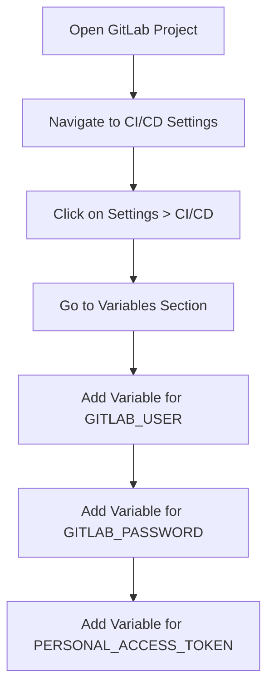

## Introduction to GitOps and ArgoCD

### What is GitOps?

GitOps is an operational framework that uses Git as a single source of truth for declarative infrastructure and applications. It combines the benefits of version control, continuous integration, and continuous delivery (CI/CD) to manage infrastructure and applications in a consistent and reliable manner. By treating infrastructure as code and using Git as the central repository, GitOps enables teams to apply the same principles used in software development to their operations.

### Why GitOps?

The primary benefits of GitOps include:

- **Version Control**: All changes to the infrastructure and applications are tracked in Git, providing a complete history of changes.
- **Collaboration**: Multiple team members can collaborate on the same infrastructure and application definitions.
- **Auditability**: Every change is auditable through Git commit history.
- **Automated Rollbacks**: In case of issues, rollbacks can be easily performed by reverting to a previous commit.
- **Consistency**: Infrastructure and applications are defined in a consistent manner across different environments.

### How GitOps Works

In a typical GitOps workflow, the following steps are involved:

1. **Define Infrastructure and Applications**: Infrastructure and applications are defined using declarative configuration files (e.g., Kubernetes manifests, Helm charts).
2. **Store Configuration in Git**: These configuration files are stored in a Git repository.
3. **Continuous Integration**: Changes to the configuration files are tested and validated through a CI pipeline.
4. **Continuous Delivery**: Approved changes are automatically deployed to the target environment.
5. **Monitoring and Syncing**: A GitOps operator (like ArgoCD) continuously monitors the live state of the infrastructure and applications and ensures it matches the desired state defined in Git.

### Example: GitOps with ArgoCD

ArgoCD is a popular open-source tool that implements the GitOps model for Kubernetes. It allows you to declaratively manage your Kubernetes clusters by syncing the desired state from a Git repository.

#### Real-World Example: GitLab and ArgoCD

Consider a scenario where you are using GitLab as your Git repository and ArgoCD as your GitOps operator. You have a GitLab repository containing Kubernetes manifests and other configuration files. The goal is to automate the deployment process using a CI/CD pipeline.

### Setting Up the Environment Variables

To securely manage credentials and sensitive information, environment variables are often used in CI/CD pipelines. Let's walk through the process of setting up these environment variables in GitLab.

#### Step-by-Step Guide

1. **Navigate to GitLab Repository**:
    - Open your GitLab project and navigate to the CI/CD settings.
    - Click on `Settings` > `CI/CD`.

2. **Create Environment Variables**:
    - Under the `Variables` section, click on `Add variable`.
    - Enter the variable name and value. For example:
        - Variable Name: `GITLAB_USER`
        - Variable Value: Your GitLab username
        - Protected: Check this box if you want the variable to be accessible only in protected branches (e.g., `main`).

3. **Repeat for Other Variables**:
    - Repeat the above steps for other required variables such as `GITLAB_PASSWORD`, `PERSONAL_ACCESS_TOKEN`, etc.



### Configuring the CI/CD Pipeline

Now that the environment variables are set up, we need to configure the CI/CD pipeline to run the necessary jobs.

#### Sample `.gitlab-ci.yml` Configuration

Below is a sample `.gitlab-ci.yml` file that defines the CI/CD pipeline:

```yaml
stages:
  - build
  - test
  - deploy

build_job:
  stage: build
  script:
    - echo "Building the application..."
    - docker build -t myapp .

test_job:
  stage: test
  script:
    - echo "Running tests..."
    - docker run myapp pytest

deploy_job:
  stage: deploy
  script:
    - echo "Deploying the application..."
    - argocd app sync myapp --prune
  only:
    - main
```

### Defining Pipeline Rules

It's crucial to define when the pipeline should run. In this case, we want the pipeline to run only if triggered by another pipeline.

#### Sample `.gitlab-ci.yml` with Rules

Here’s how you can define the rules in the `.gitlab-ci.yml` file:

```yaml
stages:
  - build
  - test
  - deploy

build_job:
  stage: build
  script:
    - echo "Building the application..."
    - docker build -t myapp .
  rules:
    - if: '$CI_PIPELINE_SOURCE == "pipeline"'
      when: always

test_job:
  stage: test
  script:
    - echo "Running tests..."
    - docker run myapp pytest
  rules:
    - if: '$CI_PIPELINE_SOURCE == "pipeline"'
      when: always

deploy_job:
  stage: deploy
  script:
    - echo "Deploying the application..."
    - argocd app sync myapp --prune
  rules:
    - if: '$CI_PIPELINE_SOURCE == "pipeline"'
      when: always
  only:
    - main
```

### Handling Kustomization Files

Kustomization is a powerful tool for customizing Kubernetes manifests. In a GitOps pipeline, Kustomization files are often used to manage different environments.

#### Example Kustomization File

Here’s an example of a Kustomization file (`kustomization.yaml`):

```yaml
resources:
  - deployment.yaml
patchesStrategicMerge:
  - patch.yaml
images:
  - name: myapp
    newName: myregistry/myapp
    newTag: latest
```

### Full Example: Updating Kustomization File

Let’s walk through a complete example of updating a Kustomization file and deploying it using ArgoCD.

#### Step 1: Update Kustomization File

Update the `newTag` in the `kustomization.yaml` file to reflect the new image tag.

```yaml
images:
  - name: myapp
    newName: myregistry/myapp
    newTag: v1.2.3
```

#### Step 2: Commit and Push Changes

Commit the changes and push them to the GitLab repository.

```bash
git add kustomization.yaml
git commit -m "Update image tag to v1.2.3"
git push origin main
```

#### Step 3: Trigger the CI/CD Pipeline

The CI/CD pipeline will automatically run due to the changes pushed to the `main` branch.

### Real-World Example: Recent Breach

A recent breach involving GitOps and CI/CD pipelines occurred when an attacker gained access to the Git repository and modified the CI/CD configuration files. This allowed the attacker to execute arbitrary commands on the production servers.

#### CVE Example: CVE-2021-22205

CVE-2021-22205 is a critical vulnerability in GitLab that allowed attackers to bypass authentication and gain unauthorized access to repositories. This could lead to modifications in the CI/CD pipeline configuration, potentially compromising the entire system.

### How to Prevent / Defend

#### Detection

- **Monitor Access Logs**: Regularly review access logs to detect any unauthorized access attempts.
- **Use Security Tools**: Utilize tools like GitGuardian, SonarQube, and Aqua Security to monitor and detect suspicious activities in the Git repository.

#### Prevention

- **Secure Credentials**: Ensure that all credentials and sensitive information are stored securely using environment variables.
- **Limit Access**: Restrict access to the Git repository and CI/CD pipeline to only authorized personnel.
- **Regular Audits**: Perform regular audits of the Git repository and CI/CD pipeline configurations to identify and mitigate potential vulnerabilities.

#### Secure Coding Fixes

##### Vulnerable Code

```yaml
deploy_job:
  stage: deploy
  script:
    - echo "Deploying the application..."
    - argocd app sync myapp --prune
  only:
    - main
```

##### Fixed Code

```yaml
deploy_job:
  stage: deploy
  script:
    - echo "Deploying the application..."
    - argocd app sync myapp --prune
  rules:
    - if: '$CI_PIPELINE_SOURCE == "pipeline"'
      when: always
  only:
    - main
```

### Complete Example: Full HTTP Request and Response

#### HTTP Request

```http
POST /api/v4/projects/12345/repository/commits HTTP/1.1
Host: gitlab.com
Authorization: Bearer <personal_access_token>
Content-Type: application/json

{
  "branch": "main",
  "commit_message": "Update image tag to v1.2.3",
  "actions": [
    {
      "action": "update",
      "file_path": "kustomization.yaml",
      "content": "images:\n  - name: myapp\n    newName: myregistry/myapp\n    newTag: v1.2.3"
    }
  ]
}
```

#### HTTP Response

```http
HTTP/1.1 201 Created
Date: Mon, 01 Jan 2024 00:00:00 GMT
Content-Type: application/json

{
  "id": "abc123",
  "short_id": "abc123",
  "title": "Update image tag to v1.2.3",
  "author_name": "John Doe",
  "created_at": "2024-01-01T00:00:00Z",
  "web_url": "https://gitlab.com/user/project/-/commit/abc123"
}
```

### Practice Labs

For hands-on practice with GitOps and ArgoCD, consider the following labs:

- **PortSwigger Web Security Academy**: Offers a variety of labs related to web application security, including GitOps and CI/CD pipelines.
- **OWASP Juice Shop**: A deliberately insecure web application for security training purposes.
- **DVWA (Damn Vulnerable Web Application)**: Another popular web application for learning web security.
- **WebGoat**: An interactive web security training application.

These labs provide practical experience in setting up and securing GitOps pipelines using tools like ArgoCD.

### Conclusion

By following the steps outlined in this chapter, you can effectively set up and manage a GitOps pipeline using ArgoCD. Understanding the principles of GitOps, configuring environment variables, defining pipeline rules, and handling Kustomization files are crucial for maintaining a secure and efficient CI/CD pipeline. Regular monitoring and auditing are essential to detect and prevent potential security threats.

---
<!-- nav -->
[[11-Introduction to GitOps and ArgoCD Part 8|Introduction to GitOps and ArgoCD Part 8]] | [[DevSecOps/DevSecOps Bootcamp/07-CI CD Security Pipeline/01-App Release Pipeline with ArgoCD/Create GitOps Pipeline to update Kustomization File/00-Overview|Overview]] | [[13-Introduction to GitOps and ArgoCD|Introduction to GitOps and ArgoCD]]
