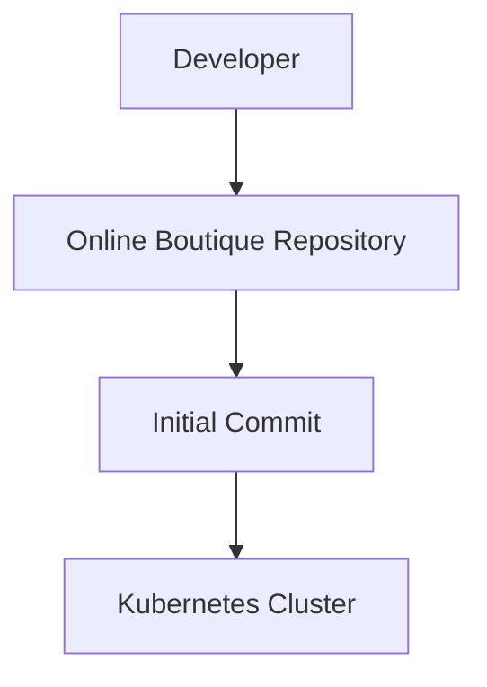
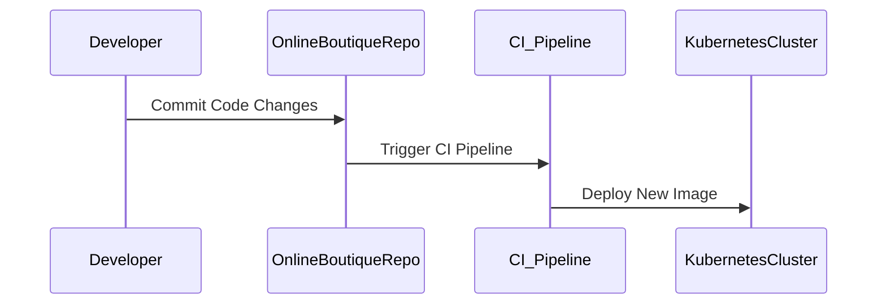

## Introduction to GitOps and ArgoCD

GitOps is a modern approach to managing infrastructure and applications using Git as the single source of truth. This method leverages the power of version control systems to manage and deploy infrastructure and applications in a consistent and reliable manner. ArgoCD is a popular open-source tool that implements GitOps principles to automate the deployment and management of Kubernetes applications.

### What is GitOps?

GitOps is a set of practices that uses Git as the single source of truth for declarative infrastructure and application configurations. By treating infrastructure as code, GitOps enables teams to apply the same rigor and automation used in software development to their infrastructure and application deployments. This includes version control, pull requests, and continuous integration/continuous delivery (CI/CD) pipelines.

#### Why GitOps Matters

- **Version Control**: All changes to infrastructure and applications are tracked in Git, providing a complete history of changes and enabling rollbacks.
- **Collaboration**: Pull requests allow for code reviews and approvals, ensuring that changes are thoroughly vetted before being applied.
- **Automation**: CI/CD pipelines can automatically detect changes in the Git repository and trigger deployments, reducing the risk of human error.
- **Consistency**: By defining infrastructure and applications in code, GitOps ensures that environments are consistently configured across different stages (development, testing, production).

### What is ArgoCD?

ArgoCD is a declarative, extensible, and easy-to-use continuous delivery tool for Kubernetes. It implements GitOps principles by using Git as the source of truth for Kubernetes manifests. ArgoCD automates the process of deploying and updating applications in a Kubernetes cluster based on the contents of a Git repository.

#### Key Features of ArgoCD

- **Syncing**: ArgoCD continuously syncs the desired state defined in Git with the actual state of the Kubernetes cluster.
- **Rollback**: In case of issues, ArgoCD allows easy rollback to previous versions by reverting the Git repository.
- **Multi-cluster Management**: ArgoCD supports managing multiple clusters from a single Git repository.
- **Custom Resources**: ArgoCD can handle custom resources and complex application deployments.

### Initial Setup and Manual Commit

In the context of our lecture, the first commit to the repository was done manually. This initial commit sets up the baseline for the GitOps pipeline. The repository contains the necessary Kubernetes manifests and configurations required to deploy the application.

### Application Release Pipeline Overview

From this point forward, the application release pipeline will follow a familiar workflow. A developer makes changes to the application code, commits these changes, and pushes them to the repository. This triggers a CI pipeline that tests the changes, builds a new Docker image, and deploys it to the Kubernetes cluster.

---
<!-- nav -->
[[12-Introduction to GitOps and ArgoCD Part 9|Introduction to GitOps and ArgoCD Part 9]] | [[DevSecOps/DevSecOps Bootcamp/07-CI CD Security Pipeline/01-App Release Pipeline with ArgoCD/Create GitOps Pipeline to update Kustomization File/00-Overview|Overview]] | [[14-Common Pitfalls and Best Practices|Common Pitfalls and Best Practices]]
