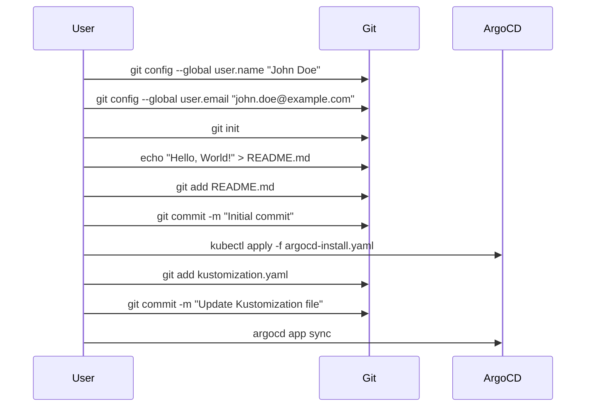

## Configuring ArgoCD for GitOps Pipeline

ArgoCD is a popular open-source tool for implementing GitOps workflows in Kubernetes environments. GitOps is a methodology that uses Git as a single source of truth for infrastructure and application configurations. This approach allows for version control, collaboration, and automated deployment of changes.

### What is ArgoCD?

ArgoCD is a declarative, extensible, and easy-to-use continuous delivery tool for Kubernetes. It enables you to manage your cluster state through Git repositories, ensuring that your applications and infrastructure are always in sync with the desired state.

### Why Use ArgoCD?

Using ArgoCD provides several benefits:

1. **Version Control**: All changes to your cluster are tracked in Git, allowing you to review and revert changes easily.
2. **Automated Deployment**: ArgoCD automatically applies changes from your Git repository to your Kubernetes cluster.
3. **Consistency**: Ensures that your cluster state matches the desired state defined in your Git repository.
4. **Security**: Allows you to enforce policies and controls over who can make changes to your cluster.

### Setting Up ArgoCD

To set up ArgoCD, you first need to install it in your Kubernetes cluster. You can use the following Helm chart to install ArgoCD:

```yaml
# argocd-install.yaml
apiVersion: v2
kind: HelmRelease
metadata:
  name: argocd
spec:
  chart:
    repository: https://argoproj.github.io/argo-helm
    name: argocd
    version: 4.2.1
  values:
    server:
      serviceType: LoadBalancer
```

Apply this configuration using `kubectl`:

```bash
kubectl apply -f argocd-install.yaml
```

Once installed, you can access the ArgoCD dashboard using the URL provided by the `LoadBalancer` service.

### Configuring Kustomization Files

Kustomization files allow you to customize and extend your Kubernetes manifests. ArgoCD can use these files to manage the deployment of your applications.

Here is an example of a Kustomization file:

```yaml
# kustomization.yaml
resources:
  - deployment.yaml
  - service.yaml
patchesStrategicMerge:
  - patch-deployment.yaml
```

This file specifies the resources to be deployed and any patches to be applied.

### Committing Changes to the Repository

To commit changes to your Git repository, you can use the following steps:

1. Make changes to your Kustomization file.
2. Add the changes to the staging area.
3. Commit the changes with a descriptive message.

Here is an example:

```bash
# Make changes to kustomization.yaml
nano kustomization.yaml

# Add changes to staging area
git add kustomization.yaml

# Commit changes
git commit -m "Update Kustomization file"
```

### Triggering the Pipeline

In your GitOps pipeline, you can define rules to control when the pipeline should be triggered. For example, you can specify that the pipeline should only be triggered by another pipeline.

Here is an example of a pipeline configuration:

```yaml
# pipeline.yaml
trigger:
  branches:
    except:
      - master
jobs:
  - job: deploy
    steps:
      - template: templates/deploy.yml
```

This configuration specifies that the `deploy` job should only be triggered by another pipeline and not by direct commits to the `master` branch.

### Real-World Example

Consider a scenario where a company uses ArgoCD to manage their Kubernetes clusters. They have a GitOps pipeline that updates the Kustomization files whenever changes are made. However, they want to ensure that the pipeline is only triggered by other pipelines and not by direct commits.

By configuring the pipeline as shown above, they can achieve this. This ensures that changes are only applied through the defined pipeline, reducing the risk of accidental changes.

### How to Prevent / Defend

#### Detection

To ensure that your pipeline is configured correctly, you can review the pipeline configuration files and verify that the rules are set as intended. You can also use tools like `argocd app sync` to manually trigger sync operations and verify that they behave as expected.

#### Prevention

Always review and test your pipeline configurations before deploying them. Ensure that the rules are set to prevent unintended triggers. Additionally, you can use access controls and permissions to restrict who can make changes to the pipeline configuration.

### Complete Example

Here is a complete example of setting up ArgoCD and configuring a GitOps pipeline:

```yaml
# argocd-install.yaml
apiVersion: v2
kind: HelmRelease
metadata:
  name: argocd
spec:
  chart:
    repository: https://argoproj.github.io/argo-helm
    name: argocd
    version: 4.2.1
  values:
    server:
      serviceType: LoadBalancer

# kustomization.yaml
resources:
  - deployment.yaml
  - service.yaml
patchesStrategicMerge:
  - patch-deployment.yaml

# pipeline.yaml
trigger:
  branches:
    except:
      - master
jobs:
  - job: deploy
    steps:
      - template: templates/deploy.yml
```

### Mermaid Diagram

A mermaid diagram can help visualize the process of setting up ArgoCD and configuring a GitOps pipeline:



---
<!-- nav -->
[[14-Common Pitfalls and Best Practices|Common Pitfalls and Best Practices]] | [[DevSecOps/DevSecOps Bootcamp/07-CI CD Security Pipeline/01-App Release Pipeline with ArgoCD/Create GitOps Pipeline to update Kustomization File/00-Overview|Overview]] | [[16-Creating a GitOps Pipeline with ArgoCD Part 1|Creating a GitOps Pipeline with ArgoCD Part 1]]
