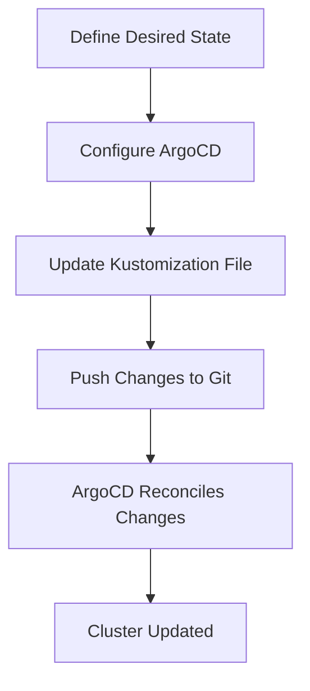

## Creating a GitOps Pipeline with ArgoCD

To create a GitOps pipeline with ArgoCD, you need to define the desired state of your Kubernetes resources in Git repositories and configure ArgoCD to watch these repositories. In this section, we will walk through the steps to create a GitOps pipeline that updates a Kustomization file.

### Prerequisites

Before proceeding, ensure that you have the following:

- A Kubernetes cluster.
- ArgoCD installed and configured in the cluster.
- A Git repository containing the Kubernetes manifests and Kustomization files.

### Step-by-Step Guide

#### 1. Define the Desired State in Git

The desired state of your Kubernetes resources should be defined in a Git repository. This repository should contain the Kubernetes manifests and Kustomization files.

```yaml
# Example Kustomization file (overlays/dev/kustomization.yaml)
resources:
- ../../base/deployment.yaml
- ../../base/service.yaml

patchesStrategicMerge:
- patch.yaml

images:
- name: checkout-service
  newName: myregistry.com/checkout-service
  newTag: v1.0.0
```

#### 2. Configure ArgoCD to Watch the Git Repository

Once the desired state is defined in Git, you need to configure ArgoCD to watch this repository. This involves creating an ArgoCD application that points to the Git repository.

```yaml
# Example ArgoCD Application (argocd-application.yaml)
apiVersion: argoproj.io/v1alpha1
kind: Application
metadata:
  name: my-app
spec:
  project: default
  source:
    repoURL: https://github.com/myorg/myrepo.git
    targetRevision: HEAD
    path: overlays/dev
  destination:
    server: https://kubernetes.default.svc
    namespace: my-namespace
```

#### 3. Update the Kustomization File Using Environment Variables

To update the Kustomization file dynamically, you can use environment variables. These variables can be passed from the CI/CD pipeline or from the application itself.

```yaml
# Example CI/CD Pipeline Configuration
steps:
- name: Update Kustomization File
  script:
    - echo "Updating Kustomization file"
    - kustomize edit set image checkout-service=${MICROSERVICE_NAME}:${NEW_TAG}
```

Here, `MICROSERVICE_NAME` and `NEW_TAG` are environment variables that are passed to the pipeline. The `kustomize edit set image` command updates the Kustomization file with the new image tag.

### Detailed Explanation

Let's break down the process step-by-step:

1. **Environment Variables**:
   - `MICROSERVICE_NAME`: The name of the microservice that needs to be updated.
   - `NEW_TAG`: The new tag for the microservice image.

2. **Kustomization File**:
   - The Kustomization file defines the resources and patches to be applied. It also specifies the images to be used.
   - The `images` section lists the images and their corresponding tags.

3. **Update Command**:
   - The `kustomize edit set image` command updates the Kustomization file with the new image tag.
   - This command takes the form `kustomize edit set image <image-name>=<new-image>:<new-tag>`.

### Full Example

Here is a complete example of updating a Kustomization file using environment variables:

```yaml
# overlays/dev/kustomization.yaml
resources:
- ../../base/deployment.yaml
- ../../base/service.yaml

patchesStrategicMerge:
- patch.yaml

images:
- name: checkout-service
  newName: myregistry.com/checkout-service
  newTag: v1.0.0
```

```yaml
# Example CI/CD Pipeline Configuration
steps:
- name: Update Kustomization File
  script:
    - echo "Updating Kustomization file"
    - kustomize edit set image checkout-service=${MICROSERVICE_NAME}:${NEW_TAG}
```

### Mermaid Diagram



### Common Pitfalls

- **Incorrect Environment Variable Names**: Ensure that the environment variable names match exactly with those used in the Kustomization file.
- **Missing Permissions**: Ensure that the user or service account running the pipeline has the necessary permissions to update the Git repository and apply changes to the cluster.
- **Conflicting Changes**: If multiple pipelines are updating the same Kustomization file simultaneously, conflicts may arise. Use proper locking mechanisms to avoid this.

### How to Prevent / Defend

#### Detection

- **Audit Logs**: Enable audit logs in both Git and ArgoCD to track all changes made to the Kustomization file and the cluster.
- **Monitoring**: Set up monitoring to detect any unauthorized changes or anomalies in the pipeline.

#### Prevention

- **Access Controls**: Implement strict access controls to ensure that only authorized users or services can make changes to the Git repository and the cluster.
- **Validation**: Validate the Kustomization file before applying changes to ensure that it does not contain any malicious or unintended modifications.

#### Secure Coding Fixes

##### Vulnerable Code

```yaml
# overlays/dev/kustomization.yaml
resources:
- ../../base/deployment.yaml
- ../../base/service.yaml

patchesStrategicMerge:
- patch.yaml

images:
- name: checkout-service
  newName: myregistry.com/checkout-service
  newTag: ${NEW_TAG}
```

##### Fixed Code

```yaml
# overlays/dev/kustomization.yaml
resources:
- ../../base/deployment.yaml
- ../../base/service.yaml

patchesStrategicMerge:
- patch.yaml

images:
- name: checkout-service
  newName: myregistry.com/checkout-service
  newTag: v1.0.0
```

### Complete Example

Here is a complete example of a GitOps pipeline using ArgoCD:

#### Git Repository Structure

```
myrepo/
├── base/
│   ├── deployment.yaml
│   └── service.yaml
└── overlays/
    └── dev/
        ├── kustomization.yaml
        └── patch.yaml
```

#### Kustomization File

```yaml
# overlays/dev/kustomization.yaml
resources:
- ../../base/deployment.yaml
- ../../base/service.yaml

patchesStrategicMerge:
- patch.yaml

images:
- name: checkout-service
  newName: myregistry.com/checkout-service
  newTag: v1.0.0
```

#### CI/CD Pipeline Configuration

```yaml
# Example CI/CD Pipeline Configuration
steps:
- name: Update Kustomization File
  script:
    - echo "Updating Kustomization file"
    - kustomize edit set image checkout-service=${MICROSERVICE_NAME}:${NEW_TAG}
- name: Push Changes to Git
  script:
    - git add .
    - git commit -m "Update Kustomization file"
    - git push origin HEAD
```

#### ArgoCD Application

```yaml
# argocd-application.yaml
apiVersion: argoproj.io/v1alpha1
kind: Application
metadata:
  name: my-app
spec:
  project: default
  source:
    repoURL: https://github.com/myorg/myrepo.git
    targetRevision: HEAD
    path: overlays/dev
  destination:
    server: https://kubernetes.default.svc
    namespace: my-namespace
```

### Real-World Examples

#### Recent CVEs/Breaches

- **CVE-2021-20225**: A vulnerability in ArgoCD allowed attackers to bypass authentication and gain unauthorized access to the cluster. This highlights the importance of keeping ArgoCD and related tools up-to-date and properly configured.
- **Breaches at Cloudflare**: In 2021, a misconfiguration in a Git repository led to a breach at Cloudflare. This underscores the need for robust access controls and monitoring in GitOps workflows.

### Hands-On Labs

For hands-on practice with GitOps and ArgoCD, consider the following labs:

- **PortSwigger Web Security Academy**: Offers a comprehensive course on web security, including GitOps practices.
- **OWASP Juice Shop**: A deliberately insecure web application for practicing web security skills.
- **Kubernetes Goat**: A vulnerable Kubernetes cluster for practicing security and compliance checks.

These labs provide practical experience in setting up and managing GitOps pipelines with ArgoCD.

### Conclusion

Creating a GitOps pipeline with ArgoCD involves defining the desired state in Git, configuring ArgoCD to watch the repository, and updating the Kustomization file using environment variables. By following best practices and implementing robust security measures, you can ensure that your GitOps pipeline is reliable and secure.

---
<!-- nav -->
[[15-Configuring ArgoCD for GitOps Pipeline|Configuring ArgoCD for GitOps Pipeline]] | [[DevSecOps/DevSecOps Bootcamp/07-CI CD Security Pipeline/01-App Release Pipeline with ArgoCD/Create GitOps Pipeline to update Kustomization File/00-Overview|Overview]] | [[17-Creating a GitOps Pipeline with ArgoCD Part 2|Creating a GitOps Pipeline with ArgoCD Part 2]]
