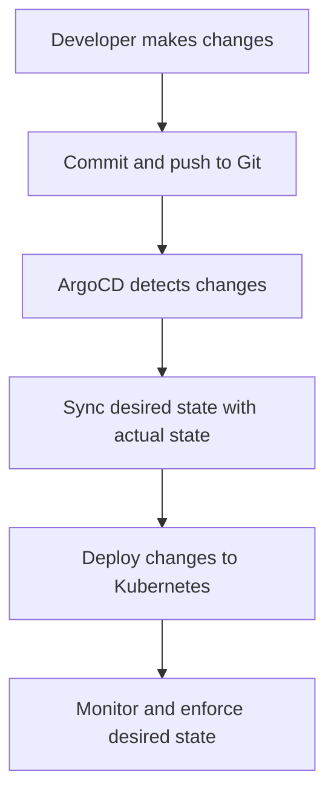

## Creating a GitOps Pipeline with ArgoCD

### Setting Up the Environment

To create a GitOps pipeline with ArgoCD, you need to set up the following components:

- **Kubernetes Cluster**: A running Kubernetes cluster where your applications will be deployed.
- **Git Repository**: A Git repository containing the desired state of your applications.
- **ArgoCD Installation**: Install ArgoCD on your Kubernetes cluster.

#### Step-by-Step Setup

1. **Install Kubernetes**: Set up a Kubernetes cluster using tools like `minikube`, `kubeadm`, or managed services like EKS, GKE, or AKS.
2. **Initialize Git Repository**: Create a Git repository to store your application configurations. You can use platforms like GitHub, GitLab, or Bitbucket.
3. **Install ArgoCD**: Deploy ArgoCD on your Kubernetes cluster using the official Helm chart.

```bash
# Install ArgoCD using Helm
helm repo add argo https://argoproj.github.io/argo-helm
helm install argocd argo/argo-cd --namespace argocd --create-namespace
```

### Configuring the Pipeline

Once the environment is set up, you can configure the pipeline to automatically deploy changes from the Git repository to the Kubernetes cluster.

#### Step 1: Define Application Configuration

Create a `kustomization.yaml` file in your Git repository to define the desired state of your application.

```yaml
# kustomization.yaml
resources:
  - deployment.yaml
  - service.yaml
patchesStrategicMerge:
  - patch.yaml
```

#### Step 2: Commit and Push Changes

When you make changes to the application configuration, you need to commit and push those changes to the Git repository.

```bash
# Add changes to the staging area
git add .

# Commit the changes
git commit -m "Update microservice to version 1.2.3"

# Push the changes to the remote repository
git push origin main
```

### Handling Authentication

Even though you are executing the pipeline in the same repository to which you are pushing, you still need to handle authentication properly. This ensures that only authorized users can make changes to the repository.

#### Step 3: Configure Access Credentials

To authenticate and push changes to the repository, you need to provide access credentials. This can be done using SSH keys, personal access tokens, or other authentication mechanisms supported by your Git provider.

```bash
# Generate SSH key pair
ssh-keygen -t rsa -b 4096 -C "your_email@example.com"

# Add SSH key to your Git provider
# Follow the instructions provided by your Git provider to add the public key
```

### Preventing Infinite Loops

One common pitfall in GitOps pipelines is the possibility of infinite loops, where a change triggers a pipeline, which in turn triggers another change, and so on. To prevent this, you can use parameters to skip the next pipeline execution.

#### Step 4: Skip Next Pipeline Execution

Add a parameter to the pipeline to skip the next execution if the change was made by the pipeline itself.

```yaml
# pipeline.yaml
parameters:
  - name: ci_skip
    value: false
```

### Real-World Example: Recent CVEs

Another recent example is the CVE-2021-39142, which affected the Kubernetes API server. This vulnerability allowed attackers to bypass authentication and execute arbitrary commands. A GitOps pipeline with proper access controls and regular audits could have helped mitigate this risk.

### Mermaid Diagrams

#### GitOps Workflow Diagram



### Complete Example

#### Full HTTP Request and Response

Here is a complete example of a Git push request and its response:

```http
POST /repos/user/repo/git/commits HTTP/1.1
Host: api.github.com
Authorization: token <your_access_token>
Content-Type: application/json

{
  "message": "Update microservice to version 1.2.3",
  "branch": "main",
  "author": {
    "name": "Your Name",
    "email": "your_email@example.com"
  },
  "committer": {
    "name": "Your Name",
    "email": "your_email@example.com"
  },
  "tree": {
    "sha": "<commit_sha>"
  }
}

HTTP/1.1 201 Created
Date: Tue, 14 Mar 2023 12:00:00 GMT
Content-Type: application/json
Content-Length: 243

{
  "commit": {
    "url": "https://api.github.com/repos/user/repo/commits/<commit_sha>",
    "html_url": "https://github.com/user/repo/commit/<commit_sha>",
    "author": {
      "name": "Your Name",
      "email": "your_email@example.com",
      "date": "2023-03-14T12:00:00Z"
    },
    "committer": {
      "name": "Your Name",
      "email": "your_email@example.com",
      "date": "2023-03-14T12:00:00Z"
    },
    "message": "Update microservice to version 1.2.3",
    "tree": {
      "url": "https://api.github.com/repos/user/repo/git/trees/<commit_sha>",
      "sha": "<commit_sha>"
    },
    "parents": [
      {
        "url": "https://api.github.com/repos/user/repo/commits/<parent_sha>",
        "html_url": "https://github.com/user/repo/commit/<parent_sha>",
        "sha": "<parent_sha>"
      }
    ]
  }
}
```

### How to Prevent / Defend

#### Detection

Regularly audit your Git repository and Kubernetes cluster to ensure that only authorized changes are being made. Use tools like `kubectl` and `git diff` to compare the current state with the desired state.

#### Prevention

- **Strict Access Controls**: Ensure that only authorized users have access to the Git repository and the Kubernetes cluster.
- **Automated Validation**: Use automated validation tools to check the integrity of the changes before they are applied.
- **Secure Coding Practices**: Follow secure coding practices to prevent common vulnerabilities like injection attacks and privilege escalation.

#### Secure Code Fix

Here is an example of a vulnerable and secure version of the `pipeline.yaml` file:

**Vulnerable Version**

```yaml
# pipeline.yaml
parameters:
  - name: ci_skip
    value: false
```

**Secure Version**

```yaml
# pipeline.yaml
parameters:
  - name: ci_skip
    value: true
```

### Practice Labs

For hands-on practice with GitOps and ArgoCD, consider the following labs:

- **PortSwigger Web Security Academy**: Offers a variety of labs focused on web application security.
- **OWASP Juice Shop**: A deliberately insecure web application for practicing web security skills.
- **Kubernetes Goat**: A vulnerable Kubernetes cluster for practicing Kubernetes security.
- **CloudGoat**: A vulnerable AWS environment for practicing cloud security.

These labs provide a safe and controlled environment to practice and learn GitOps and ArgoCD concepts.

### Conclusion

By following the steps outlined in this chapter, you can set up a robust GitOps pipeline using ArgoCD. This will help you manage your Kubernetes applications more effectively, ensuring that your systems remain in sync with the desired state and are protected against unauthorized changes. Regular audits and strict access controls are essential to maintaining the security and integrity of your GitOps pipeline.

---
<!-- nav -->
[[16-Creating a GitOps Pipeline with ArgoCD Part 1|Creating a GitOps Pipeline with ArgoCD Part 1]] | [[DevSecOps/DevSecOps Bootcamp/07-CI CD Security Pipeline/01-App Release Pipeline with ArgoCD/Create GitOps Pipeline to update Kustomization File/00-Overview|Overview]] | [[18-Creating a GitOps Pipeline with ArgoCD Part 3|Creating a GitOps Pipeline with ArgoCD Part 3]]
