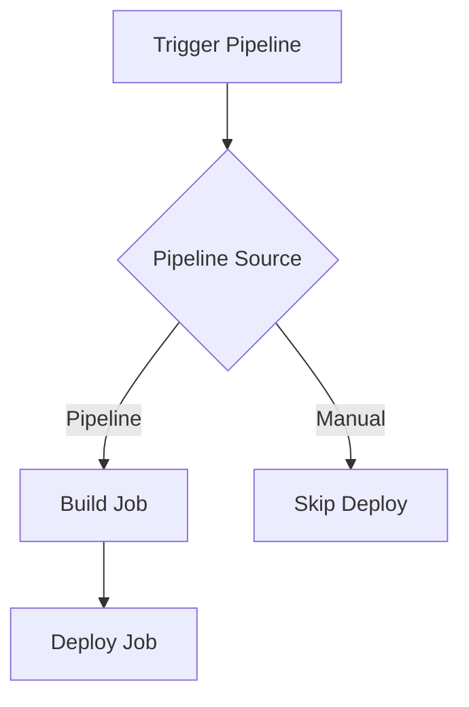

## Creating a GitOps Pipeline with ArgoCD

To create a GitOps pipeline with ArgoCD, you need to configure the pipeline to only run if triggered by another pipeline. This ensures that the pipeline is only executed when necessary and reduces the risk of unintended deployments.

### Configuration Steps

1. **Define Environment Variables**: Use GitLab environment variables to control the pipeline execution.
2. **Conditional Execution**: Configure the pipeline to only run if triggered by another pipeline.
3. **Prepare for Push**: Set up the necessary Git credentials to push changes to the repository.

### Detailed Configuration

#### Step 1: Define Environment Variables

GitLab provides several predefined environment variables that can be used to control the pipeline execution. One such variable is `CI_PIPELINE_SOURCE`, which indicates the source of the pipeline execution.

```yaml
variables:
  PIPELINE_SOURCE: $CI_PIPELINE_SOURCE
```

#### Step 2: Conditional Execution

To ensure that the pipeline only runs if triggered by another pipeline, you can use conditional statements in the pipeline configuration.

```yaml
stages:
  - build
  - deploy

build_job:
  stage: build
  script:
    - echo "Building the application..."
  only:
    - pipelines

deploy_job:
  stage: deploy
  script:
    - echo "Deploying the application..."
  when: manual
  only:
    - pipelines
```

In this example, the `deploy_job` will only run if the pipeline is triggered by another pipeline (`only: pipelines`). The `when: manual` ensures that the job requires manual approval before execution.

#### Step 3: Prepare for Push

Before pushing changes to the repository, you need to set the Git username and email. This is necessary to ensure that GitLab allows the push operation.

```yaml
before_script:
  - git config --global user.name "Your Name"
  - git config --global user.email "your.email@example.com"
```

### Complete Pipeline Configuration

Here is a complete example of a GitOps pipeline configuration:

```yaml
stages:
  - build
  - deploy

variables:
  PIPELINE_SOURCE: $CI_PIPELINE_SOURCE

build_job:
  stage: build
  script:
    - echo "Building the application..."
  only:
    - pipelines

deploy_job:
  stage: deploy
  script:
    - echo "Deploying the application..."
  when: manual
  only:
    - pipelines

before_script:
  - git config --global user.name "Your Name"
  - git config --global user.email "your.email@example.com"
```

### Mermaid Diagram

A visual representation of the pipeline flow can help understand the process better.



### Common Pitfalls

- **Incorrect Environment Variables**: Ensure that the correct environment variables are used to control the pipeline execution.
- **Manual Approval**: Always require manual approval for critical jobs to avoid unintended deployments.
- **Git Credentials**: Ensure that the necessary Git credentials are set up correctly to allow push operations.

### How to Prevent / Defend

#### Detection

- **Audit Logs**: Regularly review audit logs to detect unauthorized pipeline executions.
- **Monitoring**: Use monitoring tools to track pipeline activity and detect anomalies.

#### Prevention

- **Access Controls**: Implement strict access controls to limit who can trigger pipeline executions.
- **Secure Configurations**: Ensure that all pipeline configurations are secure and follow best practices.

#### Secure Coding Fixes

**Vulnerable Code**

```yaml
deploy_job:
  stage: deploy
  script:
    - echo "Deploying the application..."
  when: always
```

**Fixed Code**

```yaml
deploy_job:
  stage: deploy
  script:
    - echo "Deploying the application..."
  when: manual
  only:
    - pipelines
```

### Real-World Examples

#### Recent Breaches

- **CVE-2021-21287**: A vulnerability in GitLab allowed unauthorized users to trigger pipeline executions. This highlights the importance of implementing strict access controls and monitoring pipeline activity.

#### Secure Configurations

- **Use of Environment Variables**: Always use environment variables to control pipeline execution.
- **Manual Approval**: Require manual approval for critical jobs to avoid unintended deployments.

### Practice Labs

For hands-on practice with GitOps and ArgoCD, consider the following labs:

- **PortSwigger Web Security Academy**: Offers a comprehensive course on web security, including GitOps principles.
- **OWASP Juice Shop**: A vulnerable web application for practicing security testing and GitOps principles.
- **Kubernetes Goat**: A hands-on lab for practicing Kubernetes security and GitOps principles.

By following these steps and best practices, you can effectively implement a GitOps pipeline with ArgoCD and ensure the security and reliability of your Kubernetes cluster.

---
<!-- nav -->
[[17-Creating a GitOps Pipeline with ArgoCD Part 2|Creating a GitOps Pipeline with ArgoCD Part 2]] | [[DevSecOps/DevSecOps Bootcamp/07-CI CD Security Pipeline/01-App Release Pipeline with ArgoCD/Create GitOps Pipeline to update Kustomization File/00-Overview|Overview]] | [[19-Creating a GitOps Pipeline with ArgoCD|Creating a GitOps Pipeline with ArgoCD]]
