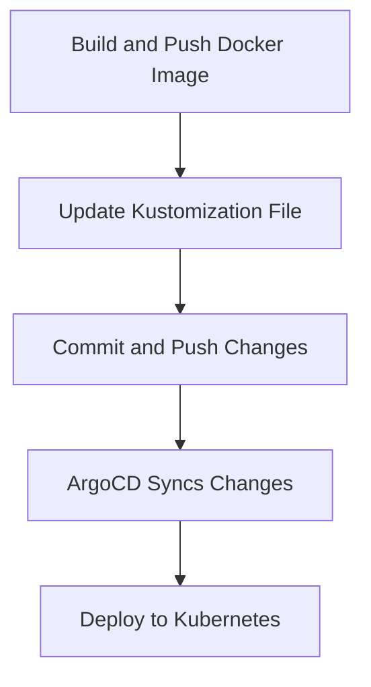

## Creating a GitOps Pipeline with ArgoCD

### Setting Up the Environment

Before creating the GitOps pipeline, ensure you have the following setup:

- A Kubernetes cluster.
- ArgoCD installed on the cluster.
- A Git repository containing the desired state of the application.

### Step-by-Step Guide to Create the Pipeline

#### Step 1: Define the Desired State in Git

Create a Git repository that contains the desired state of your application. This repository should include Kubernetes manifests and any other configuration files needed to deploy the application.

```yaml
# Example Kubernetes manifest (deployment.yaml)
apiVersion: apps/v1
kind: Deployment
metadata:
  name: my-app
spec:
  replicas: 3
  selector:
    matchLabels:
      app: my-app
  template:
    metadata:
      labels:
        app: my-app
    spec:
      containers:
      - name: my-app
        image: myregistry/myapp:v1
```

#### Step 2: Configure ArgoCD

Install ArgoCD on your Kubernetes cluster and configure it to watch the Git repository.

```sh
kubectl create namespace argocd
kubectl apply -n argocd -f https://raw.githubusercontent.com/argoproj/argo-cd/stable/manifests/install.yaml
```

Once ArgoCD is installed, log in to the ArgoCD dashboard and configure it to watch the Git repository.

```sh
argocd login localhost:8080 --username admin --password $(kubectl -n argocd get secret argocd-initial-admin-secret -o jsonpath="{.data.password}" | base64 -d)
argocd repo add <git-repo-url>
```

#### Step 3: Create the Application in ArgoCD

Create an application in ArgoCD that points to the Git repository and specifies the path to the Kubernetes manifests.

```sh
argocd app create my-app --repo <git-repo-url> --path k8s-manifests --dest-server https://kubernetes.default.svc --dest-namespace default
```

### Automating the Pipeline

To automate the pipeline, you can use a CI/CD tool like Jenkins, GitLab CI, or GitHub Actions. The pipeline will perform the following steps:

1. Build and push the new Docker image to the registry.
2. Update the `Kustomization` file in the Git repository.
3. Push the changes to the Git repository.
4. Trigger ArgoCD to sync the changes to the Kubernetes cluster.

#### Step 1: Build and Push the New Docker Image

Use a CI/CD tool to build and push the new Docker image to the registry.

```sh
docker build -t myregistry/myapp:v2 .
docker push myregistry/myapp:v2
```

#### Step 2: Update the `Kustomization` File

Update the `Kustomization` file in the Git repository to reflect the new image tag.

```sh
yq e '.images[0].newTag = "v2"' kustomization.yaml > temp.yaml && mv temp.yaml kustomization.yaml
```

#### Step 3: Push the Changes to the Git Repository

Push the updated `Kustomization` file to the Git repository.

```sh
git add kustomization.yaml
git commit -m "Update image tag to v2"
git push origin main
```

#### Step 4: Trigger ArgoCD to Sync the Changes

ArgoCD will automatically detect the changes in the Git repository and sync them to the Kubernetes cluster.

### Full Example Pipeline

Here is a complete example of a pipeline that performs the above steps:

```yaml
# Example pipeline in GitHub Actions
name: Deploy to Kubernetes

on:
  push:
    branches:
      - main

jobs:
  build-and-deploy:
    runs-on: ubuntu-latest

    steps:
    - name: Checkout code
      uses: actions/checkout@v2

    - name: Set up Docker Buildx
      uses: docker/setup-buildx-action@v1

    - name: Login to Docker Hub
      uses: docker/login-action@v1
      with:
        username: ${{ secrets.DOCKER_USERNAME }}
        password: ${{ secrets.DOCKER_PASSWORD }}

    - name: Build and push Docker image
      run: |
        docker build -t myregistry/myapp:v2 .
        docker push myregistry/myapp:v2

    - name: Update Kustomization file
      run: |
        yq e '.images[0].newTag = "v2"' kustomization.yaml > temp.yaml && mv temp.yaml kustomization.yaml

    - name: Commit and push changes
      run: |
        git config user.name "GitHub Actions"
        git config user.email "actions@github.com"
        git add kustomization.yaml
        git commit -m "Update image tag to v2"
        git push origin main
```

### Mermaid Diagrams

Here is a mermaid diagram illustrating the pipeline flow:



### Common Pitfalls and How to Avoid Them

#### Pitfall 1: Incorrect Image Tagging

Ensure that the image tagging is consistent across all stages of the pipeline. Incorrect tagging can lead to deployment failures.

**How to Prevent:**

- Use a consistent naming convention for image tags.
- Validate the image tag before pushing it to the registry.

#### Pitfall 2: Manual Intervention Required

Avoid manual intervention in the pipeline. Ensure that all steps are automated.

**How to Prevent:**

- Use CI/CD tools to automate the entire pipeline.
- Test the pipeline thoroughly before deploying it to production.

### Real-World Examples

#### Example 1: CVE-2021-25741

CVE-2021-25741 is a vulnerability in Kubernetes that allows attackers to bypass RBAC (Role-Based Access Control) restrictions. This vulnerability highlights the importance of securing the GitOps pipeline to prevent unauthorized access.

**How to Prevent:**

- Implement strict RBAC policies in Kubernetes.
- Use a secure Git repository with proper access controls.

#### Example 2: GitHub Actions Security Incident

In 2021, a security incident occurred where malicious actors exploited a vulnerability in GitHub Actions to steal secrets from repositories. This incident underscores the importance of securing the CI/CD pipeline.

**How to Prevent:**

- Use secure secrets management practices.
- Regularly audit and review the pipeline configurations.

### Secure Coding Practices

#### Vulnerable Code Example

```yaml
# Vulnerable Kustomization file
apiVersion: kustomize.config.k8s.io/v1beta1
kind: Kustomization
resources:
- deployment.yaml
images:
- name: myregistry/myapp
  newTag: v1
```

#### Secure Code Example

```yaml
# Secure Kustomization file
apiVersion: kustomize.config.k8s.io/v1beta1
kind: Kustomization
resources:
- deployment.yaml
images:
- name: myregistry/myapp
  newTag: v2
```

### Detection and Prevention

#### Detection

Regularly audit the Git repository and the Kubernetes cluster to detect any unauthorized changes.

#### Prevention

- Implement strict access controls in the Git repository.
- Use a secure CI/CD pipeline with proper validation and testing.

### Conclusion

By following the steps outlined in this chapter, you can create a robust GitOps pipeline using ArgoCD. This pipeline will ensure that your application is deployed consistently and reliably, while also providing the necessary security measures to protect against vulnerabilities.

### Practice Labs

For hands-on practice, consider the following labs:

- **PortSwigger Web Security Academy**: Focuses on web application security but can provide valuable context for securing the pipeline.
- **OWASP Juice Shop**: Provides a vulnerable web application for learning security concepts.
- **Kubernetes Goat**: A vulnerable Kubernetes cluster for learning Kubernetes security.

These labs will help you gain practical experience in setting up and securing a GitOps pipeline.

---
<!-- nav -->
[[18-Creating a GitOps Pipeline with ArgoCD Part 3|Creating a GitOps Pipeline with ArgoCD Part 3]] | [[DevSecOps/DevSecOps Bootcamp/07-CI CD Security Pipeline/01-App Release Pipeline with ArgoCD/Create GitOps Pipeline to update Kustomization File/00-Overview|Overview]] | [[20-Creating the GitOps Pipeline|Creating the GitOps Pipeline]]
