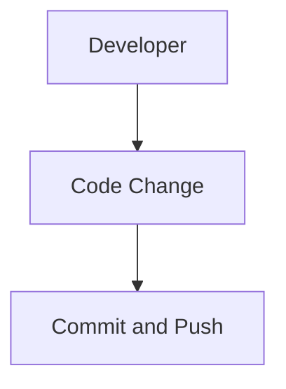
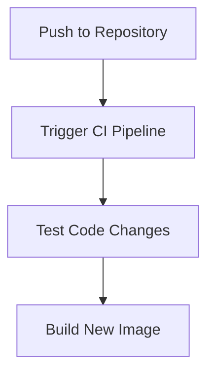
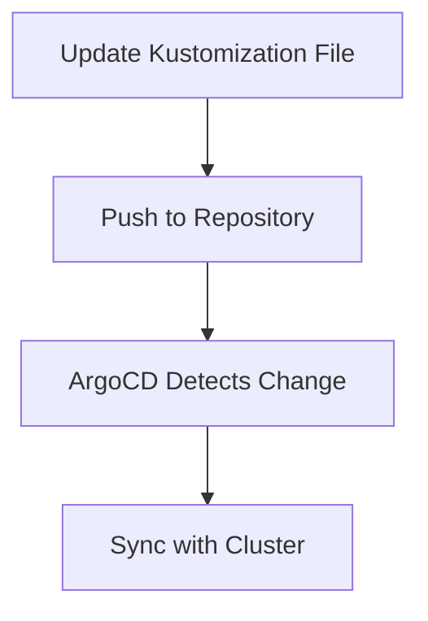
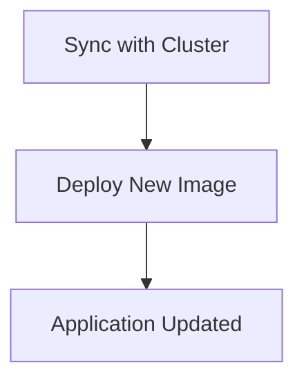

## Detailed Workflow of the Application Release Pipeline

### Step 1: Developer Makes Code Changes

The developer modifies the code of one of the microservices in the online boutique application. This could involve fixing bugs, adding new features, or optimizing performance.



### Step 2: Commit and Push Code Changes

The developer commits the changes to the local repository and then pushes them to the remote repository. This action triggers the CI pipeline.

```bash
# Developer's terminal
git add .
git commit -m "Fix bug in user service"
git push origin main
```

### Step 3: CI Pipeline Triggers

The CI pipeline is configured to monitor the repository for changes. Upon detecting a new commit, it starts the pipeline to test and build the new code.



### Step 4: Test Code Changes

The CI pipeline runs a series of tests to ensure that the code changes do not break existing functionality. These tests include unit tests, integration tests, and security checks.

```bash
# Example CI pipeline script
#!/bin/bash

# Run unit tests
pytest --cov=app

# Run integration tests
docker-compose run app pytest tests/integration/

# Run security checks
trivy image myregistry/myimage:latest
```

### Step 5: Build New Image

If the tests pass, the CI pipeline builds a new Docker image with the updated code. This image is tagged with a unique identifier, such as a timestamp or a commit hash.

```bash
# Build new Docker image
docker build -t myregistry/myimage:latest .

# Tag the image with a unique identifier
docker tag myregistry/myimage:latest myregistry/myimage:<commit-hash>
```

### Step 6: Push New Image to Registry

The newly built image is pushed to a container registry, such as Docker Hub or a private registry.

```bash
# Push new image to registry
docker push myregistry/myimage:<commit-hash>
```

### Step 7: Update Kustomization File

Once the new image is available in the registry, the Kustomization file needs to be updated to reflect the new image tag. This ensures that the correct image is deployed to the Kubernetes cluster.

```yaml
# Example Kustomization file
apiVersion: kustomize.config.k8s.io/v1beta1
kind: Kustomization
resources:
  - deployment.yaml
images:
  - name: myregistry/myimage
    newName: myregistry/myimage
    newTag: <commit-hash>
```

### Step 8: Sync with ArgoCD

ArgoCD continuously monitors the Git repository for changes. When it detects an update to the Kustomization file, it applies the changes to the Kubernetes cluster.



### Step 9: Deployment to Kubernetes Cluster

ArgoCD deploys the new image to the Kubernetes cluster, ensuring that the application is updated with the latest changes.



---
<!-- nav -->
[[20-Creating the GitOps Pipeline|Creating the GitOps Pipeline]] | [[DevSecOps/DevSecOps Bootcamp/07-CI CD Security Pipeline/01-App Release Pipeline with ArgoCD/Create GitOps Pipeline to update Kustomization File/00-Overview|Overview]] | [[22-Hands-On Labs|Hands-On Labs]]
