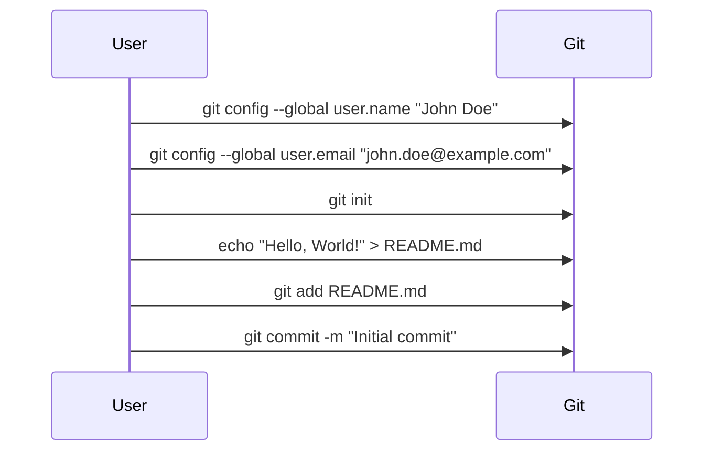

## Setting Up Git Configuration for Commit Messages

When working with Git repositories, it is crucial to configure your identity correctly. This includes setting your name and email address. These details are used to identify the author of commits, which is essential for maintaining a clear history of changes within the repository.

### Why Configure Your Identity?

Configuring your identity ensures that every commit you make is attributed to you. This is important for several reasons:

1. **Accountability**: Knowing who made specific changes helps in tracking down issues and understanding the context of changes.
2. **Collaboration**: In team environments, having clear attribution helps in communication and coordination among team members.
3. **Auditability**: For compliance and auditing purposes, it is often necessary to trace changes back to specific individuals.

### How to Set Your Identity

To set your name and email address in Git, you can use the following commands:

```bash
git config --global user.name "Your Name"
git config --global user.email "your.email@example.com"
```

These commands set the global configuration for your Git user name and email. If you want to set these for a specific repository, you can omit the `--global` flag and run the commands inside the repository directory.

### What Happens Without Proper Configuration?

If you do not set your identity, Git will attempt to guess your name and email based on system settings. This can lead to unexpected results, such as:

- **Incorrect Attribution**: Commits might be attributed to a generic or incorrect user.
- **Confusion**: Team members might struggle to understand who made specific changes.

For example, if you do not set your identity and commit changes, Git might use a default username like `unknown` and a generic email like `unknown@example.com`. This would make it difficult to track changes effectively.

### Real-World Example

Consider a scenario where a developer forgets to set their Git identity and makes several critical changes to a production environment. Due to the lack of proper attribution, it becomes challenging to trace the changes and hold the responsible party accountable. This could lead to delays in fixing issues and potential security vulnerabilities remaining unaddressed.

### How to Prevent / Defend

#### Detection

To ensure that your Git identity is properly set, you can check your current configuration using the following commands:

```bash
git config user.name
git config user.email
```

These commands will display your current Git user name and email. If they are not set correctly, you can update them using the commands mentioned earlier.

#### Prevention

Always set your Git identity before making any commits. This can be done by running the configuration commands at the beginning of your workflow. Additionally, you can include checks in your CI/CD pipeline to ensure that commits are made with proper attribution.

### Complete Example

Here is a complete example of setting up your Git identity and committing changes:

```bash
# Set Git user name and email
git config --global user.name "John Doe"
git config --global user.email "john.doe@example.com"

# Initialize a new Git repository
mkdir my-repo
cd my-repo
git init

# Add a file and commit changes
echo "Hello, World!" > README.md
git add README.md
git commit -m "Initial commit"
```

### Mermaid Diagram

A mermaid diagram can help visualize the process of setting up Git identity and committing changes:



---
<!-- nav -->
[[23-Real-World Examples and Recent CVEs|Real-World Examples and Recent CVEs]] | [[DevSecOps/DevSecOps Bootcamp/07-CI CD Security Pipeline/01-App Release Pipeline with ArgoCD/Create GitOps Pipeline to update Kustomization File/00-Overview|Overview]] | [[25-Setting Up a GitOps Pipeline with ArgoCD|Setting Up a GitOps Pipeline with ArgoCD]]
