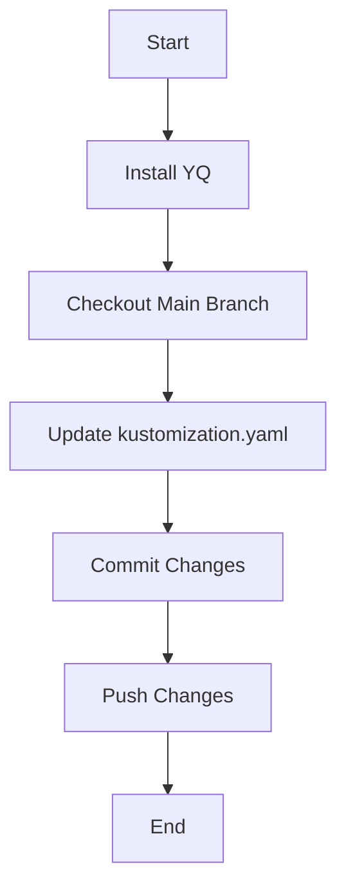

## Setting Up the GitOps Pipeline

To create a GitOps pipeline using ArgoCD, we need to set up the necessary tools and scripts. One of the key components is the `YQ` tool, which allows us to manipulate YAML files programmatically.

### Installing YQ

The `YQ` tool is used to parse and modify YAML files. We will install it in the job execution environment using a simple `wget` command.

```bash
#!/bin/bash

# Install YQ
wget https://github.com/mikefarah/yq/releases/latest/download/yq_linux_amd64 -O yq
chmod +x yq
```

This script does the following:

1. Downloads the latest release of `yq` from the GitHub releases page.
2. Makes the downloaded file executable.

### Using Git Commands

We assume that the default image used by GitLab shared runners already includes the `git` command. Therefore, we do not need to install `git` separately.

### Main Logic of the Script

The main task of the job is to find the microservice, take the new image tag received in the pipeline, and update the corresponding value in the `kustomization.yaml` file. Then, we commit and push the changes to the Git repository.

Here is the complete script:

```bash
#!/bin/bash

# Install YQ
wget https://github.com/mikefarah/yq/releases/latest/download/yq_linux_amd64 -O yq
chmod +x yq

# Check out the main branch
git checkout main

# Update the kustomization.yaml file
./yq write kustomization.yaml images[0].newTag $NEW_TAG

# Commit and push the changes
git add kustomization.yaml
git commit -m "Update image tag to $NEW_TAG"
git push origin main
```

### Explanation of Each Step

1. **Install YQ**:
    - Downloads the latest release of `yq`.
    - Makes the downloaded file executable.

2. **Check Out the Main Branch**:
    - Ensures that we are working on the correct branch.

3. **Update the `kustomization.yaml` File**:
    - Uses `yq` to update the `newTag` field in the `kustomization.yaml` file with the new image tag.

4. **Commit and Push the Changes**:
    - Adds the updated `kustomization.yaml` file to the staging area.
    - Commits the changes with a descriptive message.
    - Pushes the changes to the remote repository.

### Mermaid Diagram: Pipeline Flow



### Common Pitfalls and How to Avoid Them

1. **Incorrect Image Tag**:
    - Ensure that the new image tag is correctly passed to the script.
    - Validate the tag format before updating the `kustomization.yaml` file.

2. **Git Authentication Issues**:
    - Make sure that the job has the necessary credentials to push changes to the remote repository.
    - Use SSH keys or personal access tokens for authentication.

3. **File Not Found Errors**:
    - Verify that the `kustomization.yaml` file exists in the correct path.
    - Handle errors gracefully by checking if the file exists before attempting to modify it.

### How to Prevent / Defend

#### Detection

- **Logging and Monitoring**: Set up logging and monitoring to track changes to the `kustomization.yaml` file.
- **Audit Logs**: Enable audit logs in Git to track who made changes and when.

#### Prevention

- **Access Control**: Restrict access to the repository to only authorized personnel.
- **Code Reviews**: Implement a code review process for changes to the `kustomization.yaml` file.

#### Secure Coding Fixes

##### Vulnerable Code

```yaml
images:
  - name: my-microservice
    newTag: old-version
```

##### Fixed Code

```yaml
images:
  - name: my-microservice
    newTag: new-version
```

### Complete Example: Full HTTP Request and Response

#### HTTP Request

```http
POST /api/v1/jobs HTTP/1.1
Host: gitlab.example.com
Authorization: Bearer <token>
Content-Type: application/json

{
  "script": "#!/bin/bash\n\n# Install YQ\nwget https://github.com/mikefarah/yq/releases/latest/download/yq_linux_amd64 -O yq\nchmod +x yq\n\n# Check out the main branch\ngit checkout main\n\n# Update the kustomization.yaml file\n./yq write kustomization.yaml images[0].newTag $NEW_TAG\n\n# Commit and push the changes\ngit add kustomization.yaml\ngit commit -m \"Update image tag to $NEW_TAG\"\ngit push origin main"
}
```

#### HTTP Response

```http
HTTP/1.1 201 Created
Date: Tue, 14 Mar 2023 12:00:00 GMT
Content-Type: application/json

{
  "id": 12345,
  "status": "running",
  "script": "#!/bin/bash\n\n# Install YQ\nwget https://github.com/mikefarah/yq/releases/latest/download/yq_linux_amd64 -O yq\nchmod +x yq\n\n# Check out the main branch\ngit checkout main\n\n# Update the kustomization.yaml file\n./yq write kustomization.yaml images[0].newTag $NEW_TAG\n\n# Commit and push the changes\ngit add kustomization.yaml\ngit commit -
```

### Hands-On Labs

For hands-on practice, consider the following labs:

- **PortSwigger Web Security Academy**: Focuses on web application security but can provide insights into securing pipelines.
- **OWASP Juice Shop**: Provides a vulnerable web application for learning security concepts.
- **Kubernetes Goat**: A vulnerable Kubernetes cluster for learning Kubernetes security.

These labs will help you understand and apply the concepts learned in this chapter.

By following these steps and best practices, you can effectively set up a GitOps pipeline using ArgoCD, ensuring that your application deployments are consistent, reliable, and secure.

---
<!-- nav -->
[[26-Setting Up the Environment|Setting Up the Environment]] | [[DevSecOps/DevSecOps Bootcamp/07-CI CD Security Pipeline/01-App Release Pipeline with ArgoCD/Create GitOps Pipeline to update Kustomization File/00-Overview|Overview]] | [[28-Conclusion Part 1|Conclusion Part 1]]
