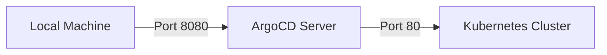

## Introduction to ArgoCD and Deployment Pipelines

ArgoCD is an open-source continuous delivery tool for Kubernetes that enables declarative application lifecycle management. It allows you to manage your applications in a GitOps way, meaning that your desired state is stored in a Git repository, and ArgoCD ensures that your live clusters match this desired state. This chapter will cover the process of deploying an application through a pipeline and accessing the ArgoCD UI, including detailed steps, potential pitfalls, and defensive measures.

### Background Theory

Before diving into the practical steps, it's essential to understand the underlying concepts:

#### What is ArgoCD?

ArgoCD is a declarative, extensible, and easy-to-use continuous delivery tool for Kubernetes. It provides a GitOps-based approach to managing applications, ensuring that the desired state of your applications is always reflected in your live clusters.

#### Why Use ArgoCD?

- **Declarative Application Management**: Define your application's desired state in a Git repository.
- **Automated Syncing**: Automatically sync your live clusters with the desired state.
- **Rollback Mechanism**: Easily roll back to previous versions if something goes wrong.
- **Multi-Cluster Support**: Manage multiple clusters from a single interface.

### Setting Up the Environment

To follow along with this chapter, ensure you have the following tools installed:

- **Kubernetes Cluster**: A running Kubernetes cluster.
- **kubectl**: The Kubernetes command-line tool.
- **Helm**: Package manager for Kubernetes.
- **ArgoCD**: Installed on your Kubernetes cluster.

### Step-by-Step Guide to Deployment Through Pipeline and Accessing ArgoCD UI

#### Step 1: Retrieve the Password for Logging In

The first step is to retrieve the password for logging into the ArgoCD UI. This password is typically stored as a Kubernetes secret.

```bash
kubectl get secret argocd-initial-admin-secret -n argocd -o jsonpath="{.data.password}" | base64 --decode
```

This command retrieves the password from the `argocd-initial-admin-secret` secret and decodes it from Base64.

##### Explanation

- **kubectl get secret**: Retrieves the specified secret.
- **-n argocd**: Specifies the namespace where the secret is located.
- **-o jsonpath**: Outputs the data in JSONPath format.
- **{.data.password}**: Extracts the `password` field from the secret.
- **base64 --decode**: Decodes the Base64-encoded string.

##### Potential Pitfalls

- **Incorrect Namespace**: Ensure you specify the correct namespace (`argocd` in this case).
- **Missing Secret**: Verify that the secret exists in the specified namespace.

##### How to Prevent / Defend

- **Namespace Verification**: Always double-check the namespace.
- **Secret Existence Check**: Use `kubectl get secrets -n argocd` to list all secrets in the namespace and verify the presence of `argocd-initial-admin-secret`.

#### Step 2: Port Forwarding to Access the ArgoCD UI

Next, you need to port forward to access the ArgoCD UI. The ArgoCD server listens on port 8080 by default.

```bash
kubectl port-forward svc/argocd-server -n argocd 8080:80
```

This command forwards traffic from your local machine's port 8080 to the ArgoCD server's port 80 within the `argocd` namespace.

##### Explanation

- **kubectl port-forward**: Sets up port forwarding.
- **svc/argocd-server**: Specifies the service to forward traffic to.
- **-n argocd**: Specifies the namespace.
- **8080:80**: Maps local port 8080 to remote port 80.

##### Potential Pitfalls

- **Incorrect Service Name**: Ensure you specify the correct service name (`argocd-server` in this case).
- **Port Conflict**: Ensure that port 8080 is not already in use on your local machine.

##### How to Prevent / Defend

- **Service Name Verification**: Double-check the service name.
- **Port Availability Check**: Use `netstat -an | grep 8080` to check if port  8080 is available.

#### Step 3: Accessing the ArgoCD UI

Once the port forwarding is set up, you can access the ArgoCD UI by navigating to `https://localhost:8080`.

##### Explanation

- **HTTPS Connection**: The connection is secured with an SSL/TLS certificate generated by ArgoCD.
- **Localhost**: The ArgoCD server is exposed locally via port forwarding.

##### Potential Pitfalls

- **Certificate Issues**: If you encounter certificate errors, ensure that your browser trusts the certificate generated by ArgoCD.
- **Network Configuration**: Ensure that your network configuration allows traffic on port 8080.

##### How to Prevent / Defend

- **Trust Certificate**: Add the ArgoCD-generated certificate to your browser's trusted certificates.
- **Network Configuration Check**: Verify that your network settings allow traffic on port 8080.

### Real-World Examples and Recent Breaches

#### Example: CVE-2021-20225

In 2021, a critical vulnerability (CVE-2021-20225) was discovered in ArgoCD, allowing attackers to bypass authentication and gain unauthorized access to the ArgoCD UI. This vulnerability highlights the importance of keeping your ArgoCD installation up to date and securing your deployment pipeline.

##### Explanation

- **Vulnerability Description**: An attacker could exploit this vulnerability to bypass authentication and gain unauthorized access to the ArgoCD UI.
- **Impact**: Unauthorized access to the ArgoCD UI could lead to unauthorized changes in the application's desired state.

##### How to Prevent / Defend

- **Regular Updates**: Keep your ArgoCD installation up to date with the latest security patches.
- **Access Control**: Implement strict access control policies to limit who can access the ArgoCD UI.

### Complete Code Examples and Diagrams

#### Retrieving the Password

```bash
kubectl get secret argocd-initial-admin-secret -n argocd -o jsonpath="{.data.password}" | base64 --decode
```

#### Port Forwarding Command

```bash
kubectl port-forward svc/argocd-server -n argocd 8080:80
```

#### Mermaid Diagram: Port Forwarding Setup



### Hands-On Labs

For hands-on practice, consider the following labs:

- **PortSwigger Web Security Academy**: Offers a variety of labs related to Kubernetes and ArgoCD.
- **OWASP Juice Shop**: Provides a vulnerable web application that can be deployed using ArgoCD.
- **CloudGoat**: Focuses on cloud security and includes scenarios related to ArgoCD and Kubernetes.

### Conclusion

Deploying an application through a pipeline and accessing the ArgoCD UI involves several steps, including retrieving the login password, setting up port forwarding, and securely accessing the UI. By following the steps outlined in this chapter and implementing the recommended defensive measures, you can ensure a secure and efficient deployment process.

---
<!-- nav -->
[[DevSecOps/DevSecOps Bootcamp/07-CI CD Security Pipeline/01-App Release Pipeline with ArgoCD/Deployment through Pipeline and Access Argo UI Deploy Argo Part 3/01-Introduction to App Release Pipeline with ArgoCD|Introduction to App Release Pipeline with ArgoCD]] | [[DevSecOps/DevSecOps Bootcamp/07-CI CD Security Pipeline/01-App Release Pipeline with ArgoCD/Deployment through Pipeline and Access Argo UI Deploy Argo Part 3/00-Overview|Overview]] | [[DevSecOps/DevSecOps Bootcamp/07-CI CD Security Pipeline/01-App Release Pipeline with ArgoCD/Deployment through Pipeline and Access Argo UI Deploy Argo Part 3/03-Introduction to ArgoCD and GitOps|Introduction to ArgoCD and GitOps]]
